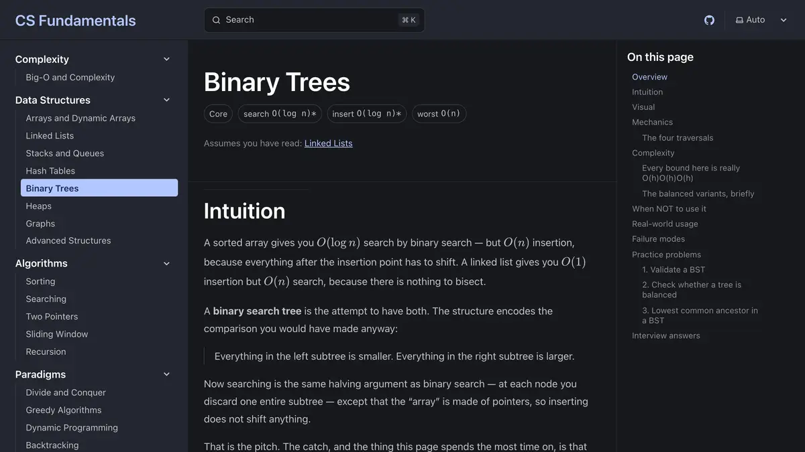
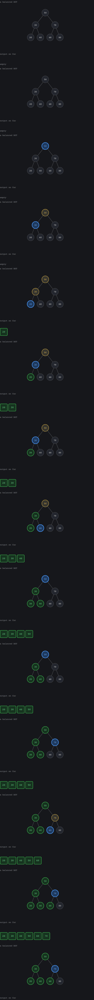

# CS Fundamentals

**A visual introduction to computer science where every bound is derived, every
structure is shown working, and every failure mode is named.**

[](https://github.com/danielsousaoliveira/cs-fundamentals/actions/workflows/ci.yml)
[](LICENSE)
[](LICENSE-CONTENT.md)

**[Read it live → danielsousaoliveira.github.io/cs-fundamentals](https://danielsousaoliveira.github.io/cs-fundamentals/)**

[](https://danielsousaoliveira.github.io/cs-fundamentals/2-data-structures/binary-trees/)

Most explanations of a data structure give you a definition, a library demo, three
practice problems, and the sentence "insertion is O(log n)". You finish knowing
what the thing is called and nothing about when it will hurt you. This site is an
attempt at the opposite: every bound derived on the page, every structure shown
running, and — the two parts usually skipped — an explicit *when NOT to use it*
and a list of *failure modes* on every page. A lint rule fails CI if a finished
page is missing either.

## Every visualisation is checked against the algorithm it draws




A widget is a pure trace generator plus a renderer: the algorithm runs once,
ahead of time, producing immutable snapshots you step through. So the output you
watch build up on screen is the same array a test asserts on, and the counters
are checked against an independently derived bound — a visualisation that
disagreed with its algorithm would fail the build. There are more than 20 of
these, from hash probing to query plans to the agent loop.

## What's inside

14 sections, 130+ finished pages, one `.mdx` file each. The whole set:

| Section | What it covers |
|---|---|
| [1 · Complexity](https://danielsousaoliveira.github.io/cs-fundamentals/1-complexity/) | Reasoning about cost — deriving bounds rather than memorising them, and when the constant factor beats the exponent. |
| [2 · Data Structures](https://danielsousaoliveira.github.io/cs-fundamentals/2-data-structures/) | The shapes data takes in memory, what each one buys you, and what each one costs you. |
| [3 · Algorithms](https://danielsousaoliveira.github.io/cs-fundamentals/3-algorithms/) | Sorting, searching, and traversal — with the comparison counter running. |
| [4 · Paradigms](https://danielsousaoliveira.github.io/cs-fundamentals/4-paradigms/) | Divide and conquer, greedy, dynamic programming, backtracking — and telling which one a problem is asking for. |
| [5 · Systems](https://danielsousaoliveira.github.io/cs-fundamentals/5-systems/) | What happens once the code leaves your laptop — event loops, brokers, databases, caching, APIs, testing. |
| [6 · Languages & Design](https://danielsousaoliveira.github.io/cs-fundamentals/6-languages/) | TypeScript's type system, the Node runtime, and the design vocabulary — SOLID, patterns, and their caveats. |
| [7 · Data Engineering](https://danielsousaoliveira.github.io/cs-fundamentals/7-data-engineering/) | Getting data from where it is to where it is useful — SQL, modelling, pipelines, quality checks. |
| [8 · Databases & Storage](https://danielsousaoliveira.github.io/cs-fundamentals/8-databases-storage/) | Relational, document, and vector stores — what each indexes, what it charges for, and the query plan that proves which you got. |
| [9 · Cloud & Infrastructure](https://danielsousaoliveira.github.io/cs-fundamentals/9-cloud-infra/) | The three clouds, Terraform, containers, CI/CD, and knowing the cost before the invoice. |
| [10 · AI Engineering](https://danielsousaoliveira.github.io/cs-fundamentals/10-ai-engineering/) | Building on probabilistic models — embeddings, retrieval, agents, and the evaluation discipline behind a real system. |
| [11 · Web & Frontend](https://danielsousaoliveira.github.io/cs-fundamentals/11-web-frontend/) | What the browser does with your code — rendering strategies across React, Vue, Svelte, Astro, Next, and their budgets. |
| [12 · Backend & APIs](https://danielsousaoliveira.github.io/cs-fundamentals/12-backend-apis/) | The server side — Node, Nest, Python, REST and GraphQL, auth, background work, and concurrency failure modes. |
| [13 · Architecture](https://danielsousaoliveira.github.io/cs-fundamentals/13-architecture/) | Decisions expensive to reverse — distributed systems, event-driven design, resilience. |
| [14 · Production Engineering](https://danielsousaoliveira.github.io/cs-fundamentals/14-production/) | Operating a system — reading a symptom, running an investigation with evidence, matching failure mode to signature. |

## Contributing

`CONTRIBUTING.md` covers how to propose a page, the bar every claim is held to,
and the checks that run before merge. `SECURITY.md` has the route for reporting
a vulnerability. Participation is under `CODE_OF_CONDUCT.md`.

---

The rest of this file is reference for anyone working on the site.

## The page spine

Every topic page follows the same structure, and `pnpm lint:spine` fails CI if a
page marked `status: complete` is missing any of it:

```
intuition → visual → mechanics → complexity (derived, never asserted)
→ when NOT to use it → real-world usage → failure modes
→ practice problems → interview answers
```

"When NOT to use it" and "Failure modes" are the two usually missing elsewhere.
They are non-negotiable here, which is why a lint rule enforces them rather than
good intentions.

**Sections 7–13 use one substitution:** `## Complexity` becomes `## Cost &
limits`. Asking a Terraform or CosmosDB page for a complexity class produces
either a stretch or a lie; the derivation is still required, it just lands in
RU/s, dollars per TB egressed, or p99 at a given pool size. Everything else —
including both non-negotiable headings, byte for byte — is identical. The
mapping lives in `scripts/lint-spine.ts`, and an unmapped section falls back to
the stricter algorithmic spine so a new directory fails loudly rather than
accepting a page with neither analysis.

## Adding a topic

**One new `.mdx` file.** Copy the right template into the right section
directory under `src/content/docs/`:

| Template | For |
|---|---|
| `src/content/_template.mdx` | sections 1–6 — complexity, data structures, algorithms, paradigms, systems, languages |
| `src/content/_template-engineering.mdx` | sections 7–13 — data, databases, cloud, AI, frontend, backend, architecture |

The sidebar, the section index page, and full-text search all pick it up on the
next build. No registration step anywhere.

A whole new section is one new directory plus a `_section.json`.

### Diagrams

Write a ` ```mermaid ` fence anywhere in a page. `rehype-mermaid` renders it to
inline SVG at build time, so a page with six diagrams still ships zero runtime
JavaScript — the same trade KaTeX makes for the maths.

Two consequences worth knowing before you rely on it. The build needs a browser
(`pnpm exec playwright install chromium`; CI does this in both workflows), and
mermaid derives its shades from literal colours, so the palette cannot be
theme-aware at render time. The build renders the dark palette and
`viz.css` repaints it for light mode — the two halves are a pair, and changing
one without the other gives a diagram nobody can read in one of the themes.

## Layout

```
src/
  content/docs/<n>-<section>/   content, one .mdx per topic
  components/viz/core/          the shared viz primitive library
  components/viz/widgets/       per-concept widgets, composed from core
  components/viz/traces/        pure step generators + their tests
  lib/sections.ts               filesystem → sidebar and index data
  pages/[section]/index.astro   auto-generated section index pages
notebooks/                      the original Jupyter notebooks, still runnable
scripts/                        notebook → MDX conversion, spine linter
```

### Visualisations

A widget is **a pure trace generator plus a renderer**. The algorithm runs once,
ahead of time, producing an array of immutable snapshots; the player moves an
index and the renderer diffs. Scrubbing, stepping backwards, and reduced-motion
support all fall out of that for free — and, more importantly, a trace is a value
you can assert on in a test.

That last part is the rule that matters: **a visualisation that disagrees with the
algorithm it claims to show is worse than no visualisation.** So the tests check
that traces end in valid states and that the on-screen comparison counters match
independently-derived bounds.

`/viz-gallery` (dev only) shows every primitive in every role on one page. If two
of them stop looking like the same design system, fix it there rather than
working around it on a content page.

## Commands

```bash
pnpm install
pnpm dev              # http://localhost:4321/cs-fundamentals/
pnpm build            # static site into dist/
pnpm test             # trace generators + widget behaviour
pnpm check            # types, across .astro/.ts/.tsx and frontmatter
pnpm lint:spine       # every `complete` page carries the full spine
pnpm test:e2e         # Playwright: hydration, base paths, a11y (needs a build)
pnpm nb2mdx --all     # mechanical notebook → MDX conversion (emits stubs)
pnpm og:image         # regenerate public/og.png after changing its design
pnpm readme:media     # regenerate the screenshot and widget capture above
```

### One dev-server caveat

Adding a new `.mdx` to a section that **already has pages** is picked up live —
nav, search and the section index all update with no restart, which is the
behaviour the whole content model is designed around.

The exception: the sidebar's section list is enumerated when
`astro.config.mjs` loads, so a dev server that was started when a section was
still **empty** keeps showing that section as empty even after you add pages to
it. Restart `pnpm dev` and it comes back. It only bites once per new section,
and never affects `pnpm build`, which enumerates from scratch every time.

## Notebooks

The original notebooks live in `notebooks/` and stay runnable — they are for
experimenting; the site is for learning. They need only the standard library:

```bash
python3 -m venv venv && . venv/bin/activate
pip install -r notebooks/requirements.txt
```

## Deployment

Pushing to `main` builds and deploys to GitHub Pages via
`.github/workflows/deploy.yml`. The site is served from `/cs-fundamentals`, so
internal links must go through Astro's `base` — a hand-written `/foo` href works
in dev and 404s in production.

## License

Two licenses, on purpose — prose and code have different reuse expectations:

- **Code** — all software outside `src/content/`: everything under
  `src/components/`, `src/lib/`, `src/pages/`, `scripts/`, `e2e/`, and
  `notebooks/`, plus the root configuration files — is under the **MIT License**
  (`LICENSE`).
- **Written material** — the topic pages and their prose, diagrams, and figures
  under `src/content/` — is under **CC BY 4.0** (`LICENSE-CONTENT.md`).

In an `.mdx` page that embeds a code sample, the prose is CC BY 4.0 and the
sample is MIT.
