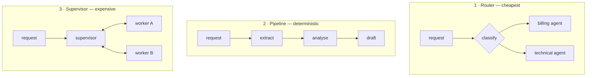

import { Tabs, TabItem } from '@astrojs/starlight/components';
import { Quiz } from '../../../components/mdx/Quiz.tsx';

## Intuition

Multi-agent systems are the most over-applied idea in this section, and the
reason is that the analogy is seductive: a team of specialists outperforms a
generalist, so a team of agents should outperform one agent.

The analogy fails on one point, and it is decisive. **Human specialists share
context cheaply.** They were in the meeting; they read the same thread; they can
ask a two-second question. Agents cannot. Every handoff between agents is a
lossy serialisation of everything one agent knew into a message the next one
reads cold.

That gives the honest framing:

> **Splitting into multiple agents trades context fidelity for focus.** It is
> worth it only when focus is the binding constraint.

Usually it is not. Usually the binding constraint is that the tools return too
much, or the task is underspecified, or the sequence was knowable all along —
and a second agent adds coordination cost to an unsolved problem.

### What actually degrades with one agent

Before splitting, be specific about what is wrong. Only two things genuinely
improve with separation:

- **Tool count.** Past roughly fifteen tools, selection accuracy falls and the
  fixed token cost per request is large. Splitting by tool domain is a real fix.
- **Conflicting instructions.** A prompt that must simultaneously be a careful
  editor and a bold brainstormer does neither well. These are genuinely
  different jobs.

Everything else — long context, wandering, cost, wrong answers — is usually
better fixed inside one agent.

## Mechanics

### The patterns, in increasing order of cost



**Router.** One cheap classification call, then a single specialised agent
handles everything. No handoff, no shared state, no coordination. This is the
pattern that earns its keep most often, and it is barely "multi-agent" at all —
which is rather the point.

**Pipeline.** Fixed stages, each with its own prompt and tools, output feeding
input. Deterministic, testable, debuggable. **Most "multi-agent systems" should
be this**, and calling it a pipeline rather than a crew keeps you honest about
the fact that you chose the sequence.

**Supervisor.** An agent that delegates to sub-agents and integrates results.
Genuinely useful for parallel research over independent subtasks. Expensive, and
the failure modes below are mostly about this.

### Parallelism is the one real win

Where a supervisor earns its cost is **independent subtasks running
concurrently**:

<Tabs syncKey="lang">
<TabItem label="Python">

```python
async def research(question: str) -> str:
    # One planning call decides the subtasks. This is the part worth a model.
    subtasks = await plan(question)          # ["market size", "competitors", …]

    # Independent, so concurrent. Wall-clock is the slowest subtask rather than
    # the sum — the only structural advantage multi-agent has over one agent.
    findings = await asyncio.gather(*[
        run_agent(task, limits=Limits(max_steps=4)) for task in subtasks
    ])

    # One synthesis call sees all findings. Note it reads SUMMARIES, not the
    # sub-agents' full traces — which is exactly the context loss to be honest
    # about, and why the summary format matters more than the sub-agent prompt.
    return await synthesise(question, findings)
```

</TabItem>
<TabItem label="TypeScript">

```typescript
async function research(question: string): Promise<string> {
  const subtasks = await plan(question);

  const findings = await Promise.all(
    subtasks.map((task) => runAgent(task, { maxSteps: 4 })),
  );

  return synthesise(question, findings);
}
```

</TabItem>
</Tabs>

Six independent research threads at 20 seconds each is 20 seconds, not 120. That
is a structural advantage a single agent cannot have, because a single agent's
steps are sequential by construction.

**The precondition is genuine independence.** If subtask B needs what subtask A
found, you have a pipeline with extra steps and no parallelism.

### Handoffs are the expensive part

```python
# Bad: the whole transcript. Expensive, and the receiving agent has to work out
# what matters — usually badly.
handoff = {"messages": agent_a.messages}

# Bad: too little. "The customer has an issue" discards the diagnosis, and the
# next agent redoes the work that was just done.
handoff = {"summary": "customer has a billing issue"}

# Good: a structured contract. Explicit fields, so what crosses the boundary is
# designed rather than whatever happened to be in the transcript.
handoff = {
    "goal": "issue a refund for order ord_9912",
    "established_facts": {
        "customer_id": "cus_8f21",
        "order_id": "ord_9912",
        "issue": "delivered damaged, photo confirmed",
        "eligible": True,
    },
    "already_tried": ["checked warranty status — expired, not applicable"],
    "open_questions": ["refund to card or store credit?"],
}
```

The `already_tried` field is the one that gets omitted and matters most: without
it, the receiving agent frequently repeats work the previous one just did, and
you pay twice for the same tool calls.

**Design the handoff schema first.** It is the interface between your agents, and
like any interface it deserves more thought than the implementations on either
side.

## Cost & limits

### Multi-agent multiplies everything

Each agent has its own base prompt and its own quadratic-ish growth. For a
supervisor with three workers, each running 4 steps:

| | Tokens |
|---|---|
| Supervisor planning | ~3,000 |
| Worker × 3, 4 steps each | ~3 × 18,000 = 54,000 |
| Handoffs in and out | ~6,000 |
| Supervisor synthesis | ~12,000 |
| **Total** | **~75,000** |

A single agent doing the same work in 8 steps costs around 40,000. **The
multi-agent version is roughly 1.9× the cost**, and it bought parallelism
— wall-clock time, not quality.

That is the trade in one line: **you are usually buying latency with money.**
Which is a fine trade when latency is the problem and a bad one when it is not.

### Coordination overhead nobody budgets

- **Planning calls** — one extra model call before any work starts.
- **Synthesis calls** — one extra after, reading all the findings.
- **Handoff serialisation** — tokens in and out at every boundary.
- **Retries** — a failed sub-agent may need re-running, and the supervisor may
  not notice it failed.

On short tasks, the overhead exceeds the work. Below about three steps per
sub-agent, a single agent is almost always cheaper and better.

<aside class="dated-figure">

**Not verified from here.** The token figures above follow from the agent cost
model on the [agents](/cs-fundamentals/10-ai-engineering/agents/) page and stated
assumptions about base prompt and result sizes. Real numbers depend on your
tools; measure rather than adopt these.

</aside>

### Debugging cost is the hidden one

A single agent produces one trace. A supervisor with three workers produces
five, interleaved, with the causal links between them implicit. **Answering "why
did it do that" goes from reading a list to reconstructing a distributed
system.**

This is a real, recurring, under-budgeted cost. If you build a supervisor, build
correlated tracing at the same time — a shared run id threaded through every
sub-agent — or you will not be able to debug the first production incident.

## When NOT to use it

**When one agent has not been tried.** By far the most common mistake. Splitting
adds coordination to an unsolved problem, and the underlying issue — oversized
tool results, a vague goal, missing tools — is still there afterwards, now
distributed across two systems.

**When the subtasks are dependent.** If B needs A's output, there is no
parallelism to win, and you have added handoff loss to a sequence you could have
run in one context.

**When the "agents" are a pipeline.** If the stages are fixed, call it a
pipeline and write it as one. You get determinism and testability, and you stop
paying a supervisor to rediscover an order you already know.

**When latency is not the constraint.** Parallelism is the main structural
benefit. If the task is already fast enough, you are paying roughly 2× for
nothing.

**When you cannot trace across agents.** Without correlated traces, a multi-agent
failure is undebuggable. Build the tracing first.

## Real-world usage

- **Deep research** — the strongest genuine case. Independent subtopics
  researched concurrently, then synthesised. Latency is the binding constraint
  and the subtasks really are independent.
- **Support routing** — a cheap classifier picks a specialised agent. The
  cheapest pattern and the one that most reliably pays for itself.
- **Document pipelines** — extract, then validate, then summarise. A pipeline,
  correctly named.
- **Code review** — separate passes for security, style and correctness, run in
  parallel over the same diff. Independence is genuine; each pass reads the same
  input and produces its own findings.
- **Generate-then-critique** — one agent produces, another reviews with a
  different prompt. Works because the second agent's *fresh* context is the
  feature: it is not anchored by having written the thing.
- **Tool-domain separation** — a database agent and an infrastructure agent, when
  a single agent's tool list has grown past what it can select from reliably.

## Failure modes

### Context lost at the handoff

**Symptom:** the second agent asks for information the first already had, or
repeats its work.

**Cause:** the handoff carried a summary that dropped the operative details.

**Fix:** an explicit handoff schema with `established_facts` and `already_tried`.
Design the contract; do not serialise whatever happened to be in the transcript.

### The supervisor that does the work

**Symptom:** the supervisor's context grows enormous and the workers barely
contribute.

**Cause:** workers return raw output rather than conclusions, so the supervisor
ends up reading everything — which is the single-agent design with extra steps
and extra cost.

**Fix:** workers return structured findings, not transcripts. If the supervisor
needs the detail, the split was wrong.

### Cascading failure

**Symptom:** one sub-agent fails and the whole run produces confident nonsense.

**Cause:** the supervisor synthesised from partial results without noticing one
was missing or errored.

**Fix:** explicit success/failure status per sub-agent, and a supervisor that
reports incompleteness rather than papering over it. Partial results are fine;
partial results presented as complete are not.

### Undebuggable interleaving

**Symptom:** a bad output and no way to determine which agent caused it.

**Cause:** independent traces with no correlation.

**Fix:** a shared run id threaded through every call, and a trace viewer that
reconstructs the tree. Build it before you need it.

### Duplicated work

**Symptom:** cost is far above the single-agent baseline for the same task.

**Cause:** sub-agents independently perform the same lookups, because none of
them knows what the others did.

**Fix:** a shared cache keyed on `(tool, args)` across the run. Cheap, and it
frequently pays for the whole orchestration overhead.

### Loops between agents

**Symptom:** two agents hand back and forth without progress.

**Cause:** loop detection was implemented per agent, and the loop is at the
orchestration layer.

**Fix:** a global step budget for the whole run, not per agent. Every control on
the [agents](/cs-fundamentals/10-ai-engineering/agents/) page needs an
orchestration-level equivalent.

## Practice problems

**1. The split that made it worse.**

A support agent with 22 tools was inaccurate, so a team split it into billing,
technical and account agents with a router. Accuracy improved slightly. Cost
tripled and p95 latency doubled. Was it the right call?

<details>
<summary>Solution</summary>

Partly right diagnosis, wrong implementation.

**Right:** 22 tools is genuinely past the point where selection degrades, and
splitting by domain is one of the two problems that separation actually fixes.

**Wrong:** the cost and latency say they built a supervisor where a router was
called for. A router is one cheap classification call, then one specialised
agent handles everything — no handoffs, no coordination, no shared state. Cost
should have gone *down* per request, because each agent now sends 7 tool
definitions rather than 22.

Tripled cost and doubled latency mean requests are traversing multiple agents:
either the router hands off mid-conversation, or agents call each other.

**What to build instead:**

```python
domain = await classify(request)        # one cheap call, small model
agent  = AGENTS[domain]                 # 7 tools, not 22
return await agent.run(request)         # one agent, start to finish
```

**And measure the alternative before shipping either.** Consolidating 22 tools
into 8 — `find_users(by=...)` rather than six lookup variants — might have fixed
the accuracy problem inside a single agent, with no routing, no coordination and
lower cost than the original. That experiment is an afternoon and it is the one
nobody runs.

**The trap:** treating "22 tools" as automatically meaning "needs multiple
agents". Tool *consolidation* and agent *separation* both address tool count, and
consolidation is much cheaper.

</details>

**2. Design the handoff.**

A triage agent diagnoses a ticket and hands to a resolution agent that can act.
Design the contract, and say what you deliberately exclude.

<details>
<summary>Solution</summary>

```python
@dataclass
class Handoff:
    run_id: str                  # correlates traces across both agents
    goal: str                    # ONE sentence, imperative
    established_facts: dict      # verified, with provenance
    already_tried: list[str]     # what NOT to redo
    constraints: list[str]       # policy limits the next agent must respect
    open_questions: list[str]    # explicitly unresolved
    confidence: Literal["high", "low"]
```

**Included, and why each earns its place:**

- `already_tried` — without it the resolution agent repeats the diagnosis and you
  pay twice for the same tool calls. The most commonly omitted field and the
  most valuable.
- `constraints` — "refunds over £50 need approval". Policy must survive the
  boundary or it is not policy.
- `confidence: low` — lets the resolution agent verify rather than act. A handoff
  that cannot express uncertainty forces false confidence.
- `run_id` — correlated tracing, which is the difference between debuggable and
  not.

**Deliberately excluded:**

- **The full transcript.** Expensive, and it makes the receiving agent work out
  what matters — usually badly. The point of a contract is that someone already
  decided.
- **Raw tool outputs.** Conclusions with provenance, not payloads.
- **The triage agent's reasoning prose.** Its conclusions are facts; its
  reasoning is not evidence, and carrying it in anchors the next agent to the
  first one's framing.

**The design principle:** the handoff is an interface between two systems, and it
deserves more thought than either implementation. Whatever is not in the schema
does not cross — which is a feature, because it forces the decision to be
explicit.

</details>

**3. One agent or several?**

Classify each and justify.

- (a) Summarise a 200-page report by section, then produce an executive summary.
- (b) Answer "should we enter the German market?" — needs market size,
  competitors, regulation and cost analysis.
- (c) Fix a failing test: read it, read the source, edit, re-run.

<details>
<summary>Solution</summary>

**(a) Neither — map-reduce.** Not an agent problem at all. Summarise each section
independently (parallel, no coordination, no tools), then one call over the
summaries. Deterministic, trivially parallel, testable. Calling this
"multi-agent" would be dressing up a `map` and a `reduce`.

**(b) Supervisor with parallel workers — the genuine case.** Four subtasks that
really are independent: market size does not depend on regulation. Each is a
research agent with search tools; run them concurrently and synthesise.

The win is latency: four × 30 seconds is 30 seconds rather than two minutes.
Cost is roughly double a single agent, and that is the honest trade —
**buying latency with money**, which is right here because a two-minute wait for
an interactive research question is a product failure.

Requirement: per-worker status, so a failed subtask is reported rather than
silently omitted from the synthesis.

**(c) One agent, definitively.** Every step depends on the last: what you edit
depends on the source, which you read because of the test failure, and whether
you edit again depends on the re-run. Zero independence, so zero parallelism to
win, and splitting would only lose context across handoffs.

This is also the case where a single context is a *positive advantage* — the
agent remembers what it already tried, which is exactly what handoffs lose.

**The classifier:** is there genuine independence between subtasks? (b) yes,
(c) no, (a) yes but it needs no agents at all.

</details>

<Quiz
  client:visible
  id="orch-when"
  kind="concept"
  question="What is the main structural advantage a multi-agent system has over a single agent?"
  options={[
    { label: 'Parallelism — independent subtasks run concurrently, so wall-clock time is the slowest subtask rather than the sum', correct: true },
    { label: 'Better reasoning, since each agent specialises in one kind of thinking' },
    { label: 'Lower cost, since each agent sends fewer tool definitions' },
    { label: 'Larger effective context, since each agent has its own window' },
  ]}
>
  <Fragment slot="explanation">
    <p>
      A single agent's steps are sequential by construction — step 3 conditions on
      step 2 — so it cannot parallelise. Independent subtasks run concurrently
      across agents, and six 20-second threads finish in 20 seconds rather than
      120. That is the one advantage that is structural rather than
      circumstantial.
    </p>
    <p>
      Cost almost always goes <em>up</em>, roughly 2× for a supervisor with
      workers, because of planning calls, synthesis calls and handoff
      serialisation. Fewer tool definitions per agent is a real saving and it is
      swamped by the coordination overhead.
    </p>
    <p>
      "Larger effective context" is the most tempting distractor, and it inverts
      what happens. Each agent has its own window, but nothing crosses between
      them except an explicit handoff — so information is <em>lost</em> at every
      boundary, not gained. Splitting trades context fidelity for focus.
    </p>
  </Fragment>
</Quiz>

<Quiz
  client:visible
  id="orch-handoff"
  kind="concept"
  question="A second agent keeps redoing lookups the first agent already performed. What is missing from the handoff?"
  options={[
    { label: 'An `already_tried` field recording what the first agent did and concluded', correct: true },
    { label: 'The first agent\'s full message transcript' },
    { label: 'A higher step limit on the second agent so it can finish its own investigation' },
    { label: 'Shared memory between the agents, so state persists automatically' },
  ]}
>
  <Fragment slot="explanation">
    <p>
      The receiving agent has no way to know what has been tried unless the
      handoff says so. Without it, the rational move for an agent given a goal
      and some facts is to verify them — which means repeating the tool calls
      that produced them, and paying for the work twice.
    </p>
    <p>
      Passing the full transcript technically contains the information and is the
      wrong fix: it is expensive, and it makes the receiving agent infer what
      matters from raw material rather than reading a decision someone already
      made. Handoffs should be contracts, not dumps.
    </p>
    <p>
      "Shared memory" sounds like the clean answer and is where the human-team
      analogy misleads. There is no shared context between agents; anything
      crossing the boundary is something you explicitly serialised. That is the
      whole cost of splitting, and the reason the handoff schema deserves more
      design attention than either agent.
    </p>
  </Fragment>
</Quiz>

## Interview answers

**"When do you use multiple agents?"**

> Rarely, and mostly for parallelism. The one structural advantage is that
> independent subtasks can run concurrently, where a single agent's steps are
> sequential by construction. Deep research over four independent subtopics is
> the honest case.
>
> What I would push back on is the team-of-specialists analogy, because it breaks
> on one point: human specialists share context cheaply, and agents do not. Every
> handoff is a lossy serialisation of what one agent knew into a message the next
> reads cold. So splitting trades context fidelity for focus, and it is worth it
> only when focus is genuinely the binding constraint.

**"A single agent is performing badly. Should you split it?"**

> First I would find out what "badly" means, because only two problems actually
> improve with separation. Too many tools — past about fifteen, selection
> degrades — and genuinely conflicting instructions in one prompt.
>
> Everything else is usually better fixed in place. Oversized tool results,
> vague goals, missing tools, wandering. Splitting those adds coordination to an
> unsolved problem, and afterwards it is still unsolved and now distributed.
>
> Even for the tool-count case I would try consolidation first: six lookup
> variants become one tool with an enum. That is an afternoon, it fixes the same
> problem, and it costs less than the original rather than double.

**"How do you design a handoff between agents?"**

> As an interface, with a schema — goal, established facts with provenance,
> already-tried, constraints, open questions, and a run id for correlated
> tracing.
>
> The field people leave out is already-tried, and it is the one that matters
> most: without it the receiving agent re-verifies the facts it was given, so you
> pay twice for the same tool calls.
>
> What I deliberately exclude is the full transcript. It is expensive and it
> makes the second agent work out what matters, which is the job the contract
> exists to have already done.

**The caveats worth voicing:**

- Most "multi-agent systems" are pipelines; naming them that keeps you honest
  about having chosen the sequence.
- Loop detection has to be global. Two agents can loop between each other while
  each stays within its own budget.
- A shared `(tool, args)` cache across the run often pays for the entire
  orchestration overhead.
- Sub-agents must report success or failure explicitly, or the supervisor
  synthesises confidently from partial results.
- Build correlated tracing before the second agent, not after the first
  incident.
