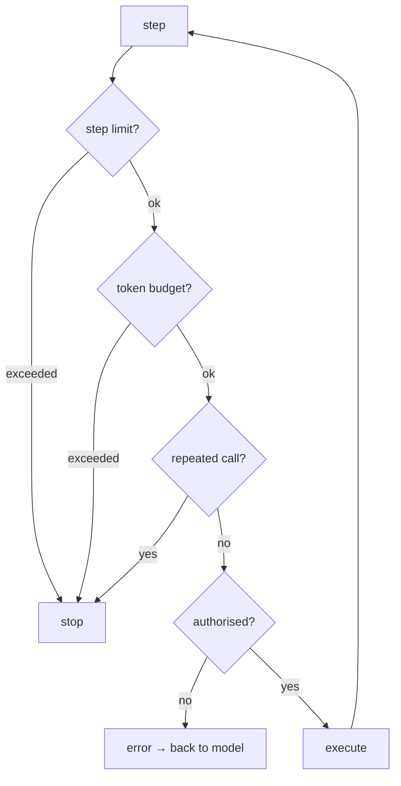

import { Tabs, TabItem } from '@astrojs/starlight/components';
import { Quiz } from '../../../components/mdx/Quiz.tsx';
import { AgentLoopStepper } from '../../../components/viz/widgets/AgentLoopStepper.tsx';

## Intuition

An agent is a `while` loop around a model call, where the model decides what to
do next instead of you deciding in advance.

That is genuinely all it is, and the deflation is useful. The interesting part
is not the loop — you could write it in twenty lines — but the fact that **you
have given up the ability to know what happens next**. Everything difficult
follows from that: how many steps it takes, what it costs, whether it
terminates, whether it does something you did not want.

So the engineering is not in the loop body. It is in the controls around it: the
step limit, the token budget, the loop detector, the authorisation on every tool
call, and the trace that lets you find out afterwards what happened.

### The question to ask before building one

**Is the sequence of steps genuinely unknown?**

If you always look up the customer, then their orders, then format a reply, that
is a workflow. Writing it as a function gives you determinism, testability, lower
latency, and a tenth of the cost. An agent deciding a fixed sequence is paying a
model to rediscover something you already know.

Most "agent" projects are workflows in disguise. The genuine cases have a
distinctive shape: **the next step depends on what the last one returned**, and
the branching is too wide to enumerate. Debugging an incident is a real agent
task — what you check second depends entirely on what the first check said.

## Mechanics

### Step through it

<AgentLoopStepper client:visible />

Four scenarios: one that works and three that fail. Worth doing in order:

1. **The happy path.** Notice the `context` counter growing at every step. An
   agent is not n independent calls — it is one conversation that gets longer.
2. **"Loops".** Step through it and the repetition is obvious to you within two
   steps. Nothing inside the loop notices. Now untick **detect repeated calls**
   and watch it burn through the step limit instead.
3. **"Drowns".** One tool returns 41,000 tokens and the run is over on step one.
   The fix is in the tool, not the model.
4. **"Wanders".** Every step is individually reasonable. The sequence goes
   nowhere. This is why a step limit is a *correctness* control, not just a cost
   one — nothing in the loop can distinguish "making progress" from "still
   going".

Also watch **billed so far** against **context**. Billing grows faster than step
count, because the whole context is re-sent each step.

### The loop

<Tabs syncKey="lang">
<TabItem label="Python">

```python
def run(goal: str, limits: Limits) -> Result:
    messages = [{"role": "user", "content": goal}]
    seen: Counter[str] = Counter()

    for step in range(limits.max_steps):
        response = model.create(messages=messages, tools=TOOLS)
        messages.append({"role": "assistant", "content": response.content})

        if response.stop_reason != "tool_use":
            return Result.answered(text_of(response), steps=step + 1)

        results = []
        for call in tool_calls(response):
            # Loop detection on (tool, args), NOT on tool name alone. A
            # legitimate agent calls the same tool repeatedly with different
            # arguments; detecting on the name breaks every real workflow.
            key = f"{call.name}:{canonical_json(call.input)}"
            seen[key] += 1
            if seen[key] >= limits.repeat_limit:
                return Result.looped(key, steps=step + 1)

            results.append(execute(call, actor=current_user))

        messages.append({"role": "user", "content": results})

        # Budget check after appending, so the run stops before the NEXT
        # expensive call rather than after it.
        if count_tokens(messages) > limits.max_tokens:
            return Result.over_budget(steps=step + 1)

    return Result.step_limit(steps=limits.max_steps)
```

</TabItem>
<TabItem label="TypeScript">

```typescript
async function run(goal: string, limits: Limits): Promise<Result> {
  const messages: Message[] = [{ role: 'user', content: goal }];
  const seen = new Map<string, number>();

  for (let step = 0; step < limits.maxSteps; step++) {
    const response = await model.create({ messages, tools });
    messages.push({ role: 'assistant', content: response.content });

    if (response.stop_reason !== 'tool_use') {
      return { kind: 'answered', text: textOf(response), steps: step + 1 };
    }

    const results = [];
    for (const call of toolCalls(response)) {
      const key = `${call.name}:${canonicalJson(call.input)}`;
      const count = (seen.get(key) ?? 0) + 1;
      seen.set(key, count);
      if (count >= limits.repeatLimit) return { kind: 'looped', key, steps: step + 1 };

      results.push(await execute(call, user));
    }

    messages.push({ role: 'user', content: results });
    if (countTokens(messages) > limits.maxTokens) {
      return { kind: 'over-budget', steps: step + 1 };
    }
  }

  return { kind: 'step-limit', steps: limits.maxSteps };
}
```

</TabItem>
</Tabs>

Note the detection key. Detecting on the **tool name alone** would flag every
legitimate agent that queries one tool repeatedly with different arguments —
which is most of them. The `(tool, args)` pair is what distinguishes a loop from
a sequence.

### Four controls, all mandatory



| Control | Stops | Without it |
|---|---|---|
| Step limit | wandering | runs until the context window ends |
| Token budget | oversized results | one bad tool call ends the run anyway, later and more expensively |
| Repeat detection | retry loops | the most common failure, and it bills for every step |
| Per-call authorisation | confused deputy | a data leak with no exception |

None of these is optional, and none of them involves the model. **The controls
are the product.**

### Make the trace a first-class artefact

An agent that fails and leaves no trace cannot be debugged, because the run is
not reproducible — the model may decide differently next time.

Log, per step: the thought, the tool and arguments, the result *size*, the
running token count, and the stop reason. That trace is your only forensic
evidence, and it is also your evaluation set: replaying real traces is how you
find out whether a change helped.

## Cost & limits

### The bill grows quadratically-ish

The full context is re-sent every step, so cost is the sum of prefix sizes.
Working it through for a base prompt of 2,000 tokens (system plus tool
definitions) and tool results averaging 800 tokens:

| Steps | Final context | Total tokens billed |
|---|---|---|
| 1 | 2,800 | 2,000 |
| 3 | 4,400 | 9,200 |
| 6 | 6,800 | 27,200 |
| 10 | 10,000 | 65,000 |

**Ten steps costs 24× a one-step call, not 10×.** This is the single most
important cost fact about agents, and it is why a step limit is a budget control.

The two levers that actually work:

- **Fewer, smaller tool results.** They compound — a 5,000-token result at step 2
  is paid again at every subsequent step.
- **A lower step limit.** Six is a reasonable default for most tasks; the tail of
  runs that would have succeeded at step 9 is smaller than people expect, and
  those runs are expensive.

### Latency is additive and sequential

Each step is a full model call. Six steps at 2 seconds is 12 seconds, plus tool
time, and none of it parallelises — step 3 depends on step 2.

That number governs the product design. **Agents are not for synchronous
request/response paths.** They belong behind a job queue with progress streamed
to the user, and building one into a 2-second HTTP handler is a decision to fail
under load.

Parallel tool calls within a step are the one available win: three 200ms tools
concurrently is 200ms rather than 600ms.

<aside class="dated-figure">

**Not verified from here.** Per-token prices and model latencies are
provider-specific and change. The token arithmetic above follows from the stated
assumptions and is asserted in `traces/agentLoop.test.ts`; the latency figures
are directional.

</aside>

## When NOT to use it

**When the sequence is known.** Write the workflow. Determinism, tests, one-tenth
the cost, one-tenth the latency. This rules out most candidate projects and it
should.

**On a synchronous request path.** Ten-plus seconds of unbounded latency does not
belong in an HTTP handler. Queue it.

**When actions are destructive and unattended.** An agent that can delete, send,
or pay needs either confirmation or restriction to reversible operations. "It
will probably be fine" is not a control, and the failure is unbounded.

**When you cannot afford the variance.** The same input can produce a different
sequence. If the process must be identical every time — compliance, financial
reporting, anything audited — that variance is disqualifying regardless of
quality.

**Before you have tool-level observability.** Debugging an agent without a trace
is guessing. Build the trace before the agent, not after the first incident.

## Real-world usage

- **Incident diagnosis** — the genuine case: what you check second depends on what
  the first check returned. Metrics, logs, deploys and config as tools.
- **Coding agents** — read, edit, run tests, read the failure, edit again. The
  test suite is an unusually good verifier, which is why this domain works better
  than most.
- **Deep research** — search, read, follow a lead, synthesise. Long-running,
  queued, with the trace shown to the user as it goes.
- **Customer support with actions** — look up, diagnose, and act, with writes
  behind confirmation.
- **Data exploration** — query, look, refine. Works because a wrong query is
  cheap and visible.
- **Migration and refactoring** — bounded, verifiable, reversible via version
  control, which is what makes autonomy tolerable.

## Failure modes

### The retry loop

**Symptom:** the same tool call repeats until the step limit. The bill is the
full run.

**Cause:** a tool returns an error, the model retries identically, and nothing in
the loop compares this call to the last one.

**Fix:** detect repeated `(tool, args)` pairs. On detection, stop with a message
saying what repeated — not a generic failure, because the repeated call is the
diagnosis.

### Context exhaustion from one tool

**Symptom:** the agent works for two steps and then degrades or errors.

**Cause:** a tool returned a raw payload of thousands of rows.

**Fix:** cap tool output, summarise, offer detail as a separate tool, and mark
truncation visibly. This is a tool bug, and it is the most common one.

### Confident wandering

**Symptom:** the agent takes ten plausible steps and produces nothing useful.

**Cause:** the task was underspecified, or the tools cannot actually answer it.
The model has no way to recognise that it is not converging.

**Fix:** a step limit, and treat hitting it as a signal to investigate rather
than a number to raise. If runs routinely hit the limit, the tools are missing
something.

### The confused deputy

**Symptom:** cross-user data access with no exception.

**Cause:** tools authorised with the agent's privileges rather than the end
user's.

**Fix:** authorise every call against the end user in the dispatch layer. See
[tool use](/cs-fundamentals/10-ai-engineering/tool-use/).

### Irreversible action from a misreading

**Symptom:** something deleted, sent, or paid that should not have been.

**Cause:** an autonomous write tool plus one bad step. The agent was not
malfunctioning; it made an ordinary mistake with an unbounded consequence.

**Fix:** confirmation for destructive writes, or restrict tools to reversible
operations. Make autonomy an explicit decision per tool rather than a default.

### Prompt injection through tool results

**Symptom:** an agent that reads external content starts behaving oddly.

**Cause:** a fetched web page or document contained instructions, and tool
results enter the context on equal footing with your system prompt.

**Fix:** delimit tool results structurally, and — more importantly — never rely on
that alone. Constrain what the tools can do, since that is the actual boundary.
See [guardrails](/cs-fundamentals/10-ai-engineering/guardrails/).

## Practice problems

**1. The agent that costs 40× the estimate.**

An agent averages 8 steps. Estimated at 8 × 3,000 = 24,000 tokens per run. Actual
usage is over 100,000. No tool returns anything unusually large.

<details>
<summary>Solution</summary>

The estimate treated the run as eight independent calls. It is one conversation
re-sent eight times.

With a 2,000-token base and ~1,000-token results:

```
step 1: send 2,000                        =   2,000
step 2: send 2,000 + 1,000                =   3,000
step 3: send 2,000 + 2,000                =   4,000
…
step 8: send 2,000 + 7,000                =   9,000
                                    total ≈  44,000
```

Still short of 100,000 — so the remaining gap is the **base prompt**, and that is
the actionable finding. If tool definitions are 6,000 rather than 2,000 tokens,
the base is paid eight times: 48,000 tokens of pure overhead before any results.

**Fixes, in order of effect:**

1. **Trim tool definitions.** They are re-sent every step, so a 3,000-token
   saving is a 24,000-token saving per run.
2. **Lower the step limit** from 8 to 6. Costs are super-linear, so the last two
   steps are the most expensive ones.
3. **Shrink tool results.** A result at step 2 is paid seven more times.
4. **Prompt caching** on the stable prefix — system plus tools — which is exactly
   the part being re-sent unchanged.

**The generalisable rule:** agent cost is the sum of prefix sizes, not
steps × average. Estimate it as roughly `steps × base + (steps² / 2) × result`.

</details>

**2. Design the controls.**

An agent triages support tickets with tools: `search_kb`, `get_customer`,
`get_order`, `create_ticket`, `send_email`, `issue_refund`. Specify the controls.

<details>
<summary>Solution</summary>

The tools split into two classes and must be treated differently.

**Read tools** (`search_kb`, `get_customer`, `get_order`) — autonomous, with
per-user authorisation. `get_customer` and `get_order` must be scoped to the
requesting customer in dispatch, or this is a data-leak surface.

**Write tools** — three different risk levels, three different treatments:

- `create_ticket` — autonomous. Reversible, low blast radius, and a wrong ticket
  is noise rather than damage.
- `send_email` — **draft only.** The agent produces the text; a human sends it.
  Sending is irreversible and externally visible, which is the worst combination.
- `issue_refund` — **never autonomous.** Moves money. Propose an action with an
  amount and a reason; a human approves it. If volume demands automation, cap it
  hard: under £20, one per customer per day, and only against an order the
  customer owns.

**Loop controls:**

```python
Limits(max_steps=6, max_tokens=15_000, repeat_limit=2)
```

`repeat_limit=2` rather than 3, because the read tools here are lookups by id —
a legitimate second identical lookup is already suspicious.

**Plus, and this is the part usually missed:**

- **Full trace per run**, including proposed-but-unapproved actions. When a
  refund is disputed you need what the agent proposed and why.
- **A kill switch** — a flag that disables write tools without a deploy.
- **Alert on step-limit rate.** Rising rate means the tools stopped answering
  something, and it is the earliest signal you get.

**The principle: autonomy is a per-tool decision, not a per-agent one.** The
common mistake is one autonomy setting for the whole agent, which forces the
safest tool to be as restricted as the most dangerous — or, more often, the
reverse.

</details>

**3. Agent or workflow?**

Classify each and justify.

- (a) Every night, summarise yesterday's tickets by category and email the team.
- (b) A user asks "why was my order late?" — the answer may involve shipping,
  inventory, payments or weather.
- (c) Convert 200 markdown files to a new frontmatter format.

<details>
<summary>Solution</summary>

**(a) Workflow.** The steps are known: query tickets, group, summarise each
group, render, send. Write it as a function with one model call per category.
Deterministic, testable, cheap, and it can run unattended — which an agent
sending email cannot.

**(b) Agent, genuinely.** This is the real shape: the second step depends
entirely on what the first returns. If shipping shows a delay, you follow
shipping; if inventory shows a backorder, that is a different path. Enumerating
the branches is impractical because the combinations are the point.

Constraints: read-only tools, step limit 6, queued rather than synchronous, and
the trace shown to the support agent so they can verify the reasoning.

**(c) Neither — a script with a model call inside.** The iteration is a `for`
loop. The per-file transformation may need a model if the format is irregular,
but nothing is being *decided*. Deterministic loop, one call per file, schema
validation on each result, and a diff to review.

**The classifier:** ask whether the *next step* depends on what the last one
returned. In (a) and (c) it does not. In (b) it entirely does. That single
question resolves most of these, and it resolves them toward "not an agent" far
more often than teams expect.

</details>

<Quiz
  client:visible
  id="agent-cost"
  kind="complexity"
  question="An agent runs 10 steps with a 2,000-token base prompt and 800-token tool results. Roughly how many tokens are billed?"
  options={[
    { label: '~56,000 — the whole context is re-sent each step, so cost is the sum of prefix sizes', correct: true },
    { label: '~10,000 — the final context size, sent once at the end' },
    { label: '~28,000 — ten steps at the average context size' },
    { label: '~8,000 — only the new tokens each step are billed, since the rest is cached' },
  ]}
>
  <Fragment slot="explanation">
    <p>
      Each step re-sends everything accumulated so far. Step 1 sends 2,000; step
      2 sends 2,000 + 800; step 10 sends 2,000 + 7,200. Summing gives roughly
      2,000×10 plus 800×(0+1+…+9) = 20,000 + 36,000 ≈ 56,000.
    </p>
    <p>
      The shape matters more than the number: cost grows with the{' '}
      <strong>square</strong> of the step count, not linearly. Ten steps is
      roughly 24× a single call, not 10×. That is why a step limit is a budget
      control rather than just a safety net, and why a large tool result early in
      a run is so expensive — it is paid again at every subsequent step.
    </p>
    <p>
      Prompt caching genuinely helps here, which makes the last option the most
      interesting distractor: it applies only to the stable{' '}
      <em>prefix</em> — system prompt and tool definitions — not to the growing
      tail of tool results, and only if nothing varies near the front.
    </p>
  </Fragment>
</Quiz>

<Quiz
  client:visible
  id="agent-loop-detect"
  kind="concept"
  question="You add loop detection to an agent. What should the detection key be?"
  options={[
    { label: 'The (tool name, arguments) pair — the same tool with different arguments is normal progress', correct: true },
    { label: 'The tool name, so any repeated use of one tool is caught early' },
    { label: 'The model\'s stated reasoning text, since a looping agent repeats its thoughts' },
    { label: 'The number of steps taken, since loops are what step limits exist to catch' },
  ]}
>
  <Fragment slot="explanation">
    <p>
      Calling one tool repeatedly with different arguments is what a working
      agent does — three lookups by different ids, or a query refined across
      steps. Detecting on the tool name alone would flag all of them, so the
      detector would either be disabled or made useless by a high threshold.
    </p>
    <p>
      The identical <em>pair</em> is what distinguishes a loop from a sequence:
      the same call with the same arguments cannot return new information, so
      making it twice is definitionally not progress.
    </p>
    <p>
      Reasoning text is unreliable because a looping model usually rephrases its
      thought each time — "let me check the schedule", "I will retrieve the
      schedule" — while making the identical call. And a step limit does catch
      loops eventually, at full cost and with a stop reason that tells you
      nothing; the point of detection is stopping early and naming the repeated
      call, which <em>is</em> the diagnosis.
    </p>
  </Fragment>
</Quiz>

## Interview answers

**"What is an agent?"**

> A loop around a model call where the model decides the next step instead of
> you. Think, act, observe, repeat until it can answer.
>
> The deflation is useful, because the loop itself is twenty lines. What is
> actually hard is that you have given up knowing what happens next — so all the
> engineering is in the controls around it: step limit, token budget, loop
> detection, per-call authorisation, and a trace you can read afterwards. The
> controls are the product.

**"When would you not build one?"**

> When the sequence is known, which covers most candidate projects. If it is
> always look up the customer, then their orders, then format — that is a
> workflow, and writing it as a function gives you determinism, tests, a tenth of
> the latency and a tenth of the cost.
>
> The test I use is whether the *next* step depends on what the last one
> returned. Incident diagnosis genuinely does: what you check second depends on
> what the first check said. A nightly summary job does not.
>
> I would also keep them off synchronous request paths. Six steps at two seconds
> each is twelve seconds of unbounded latency, and that belongs behind a queue.

**"How do agents fail, and what do you do about it?"**

> Four ways, and they map to four controls. Retry loops, where a tool errors and
> the model reissues the identical call — caught by detecting repeated
> tool-plus-arguments pairs, not tool names, because calling one tool repeatedly
> with different arguments is normal.
>
> Context exhaustion from one oversized tool result, which is a tool bug: cap
> and summarise what tools return. Wandering, where every step is reasonable and
> nothing converges — that is what the step limit is for, and hitting it
> routinely means the tools are missing something rather than the limit being
> too low.
>
> And the confused deputy: tools running with the agent's privileges rather than
> the user's. That one is a data leak with no exception thrown, so it is the one
> I would check first in a review.

**The caveats worth voicing:**

- Agent cost is the sum of prefix sizes — ten steps is roughly 24× one call.
- Autonomy is a per-tool decision, not a per-agent one.
- Build the trace before the agent; a failed run is not reproducible.
- Tool results enter the context on equal footing with your system prompt, so
  anything an agent reads is an injection surface.
- A rising step-limit rate is your earliest signal that the tools stopped
  answering something.
