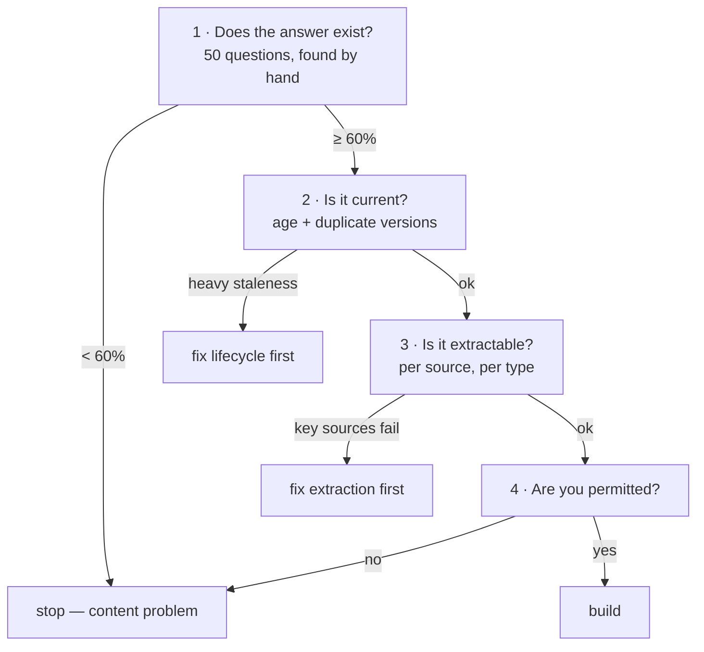

import { Tabs, TabItem } from '@astrojs/starlight/components';
import { Quiz } from '../../../components/mdx/Quiz.tsx';

## Intuition

Most failed AI projects were not failures of modelling. They were **projects that
should not have started**, and the evidence was available in week one.

"AI data readiness" is the audit that surfaces that evidence. It is unglamorous
and it is the highest-leverage week available, because the alternative is
discovering the same facts in month four with a team, a budget and expectations
attached.

The framing that makes it concrete:

> **An AI feature can only be as good as the answer that exists in your data.
> The audit measures whether that answer is there, current, findable, and
> permitted.**

Four properties, and a project needs all four:

| Property | The question | Fatal if |
|---|---|---|
| **Existence** | Is the answer written down anywhere? | it lives in people's heads |
| **Currency** | Is it current, and is stale content removed? | outdated versions remain indexed |
| **Findability** | Is it extractable and chunkable? | scanned PDFs with no text layer |
| **Permission** | Are you allowed to use it this way? | consent or contract says no |

**Existence is the one that kills projects**, and it is the one nobody checks.
"Answer support questions from our documentation" assumes the documentation
answers them. Frequently it does not — the real answers live in Slack threads and
senior engineers' heads, and the wiki describes an older version of the product.

## Mechanics

### The audit, in order

Run these in sequence and stop at the first fatal finding.

**1. Does the answer exist?**

Take 50 real user questions from support tickets or search logs — real ones, not
imagined. For each, **find the answer in the corpus by hand.**

This is a day of work and it is the whole audit in miniature. Record for each:
found / not found / found but outdated / found but contradicted.

If fewer than 60% are cleanly findable by a human with unlimited time and search,
**no retrieval system will do better.** That is not a tuning problem; it is a
content problem, and it is the finding that should stop the project — or redirect
it to writing documentation, which is a legitimate and much cheaper outcome.

**2. Is it current?**

<Tabs syncKey="lang">
<TabItem label="SQL">

```sql
-- Age distribution, and the count of documents nobody has touched in a year.
-- The second number is usually the alarming one.
SELECT
  date_trunc('month', updated_at) AS month,
  count(*)                        AS documents,
  count(*) FILTER (WHERE updated_at < now() - interval '1 year') AS stale
FROM documents
GROUP BY 1
ORDER BY 1 DESC;

-- Superseded content still present. This is what produces confidently wrong
-- answers about last year's policy, and it is invisible until a user reports it.
SELECT title, count(*) AS versions
FROM documents
GROUP BY title
HAVING count(*) > 1
ORDER BY 2 DESC;
```

</TabItem>
</Tabs>

The second query matters more than the first. **Stale content that was never
removed is worse than missing content**, because the system answers confidently
from it.

**3. Is it extractable?**

<Tabs syncKey="lang">
<TabItem label="Python">

```python
def extraction_report(documents) -> dict:
    """What fraction of the corpus can actually become text?"""
    stats = Counter()
    for doc in documents:
        text = extract(doc)
        words = len(text.split())

        if words == 0:
            # Almost always a scanned image with no text layer. These are
            # invisible in a file count and represent 100% loss.
            stats["empty"] += 1
        elif words < 50:
            stats["near_empty"] += 1
        elif has_broken_tables(text):
            # A table flattened into prose is worse than an empty page: it
            # produces plausible text with the numbers scrambled.
            stats["broken_tables"] += 1
        else:
            stats["ok"] += 1
    return dict(stats)
```

</TabItem>
</Tabs>

Report this **per source and per file type**. "92% extractable overall" can hide
"0% of the scanned contracts", which may be the corpus that mattered.

**4. Are you permitted?**

Not a formality, and it is the finding that arrives latest and hurts most:

- Does your customer contract permit sending this data to a third-party model?
- Is there PII, and does the lawful basis cover this use?
- If a user requests deletion, can you delete their data from the **vector
  index** as well as the source? Vectors carry the classification of their source
  text; they are not anonymised.
- Are there per-jurisdiction residency requirements the provider's region does
  not satisfy?

### The scorecard



Each gate has a cheaper remedy than "build the AI feature and hope". Writing
twenty missing documentation pages is a smaller project than a RAG system that
cannot answer.

### Structure beats volume

A common and expensive misconception is that more data is better. For retrieval,
**structure and hygiene matter far more than volume**:

- 500 well-maintained, current, well-structured articles will outperform 50,000
  documents of mixed vintage with no lifecycle.
- Boilerplate repeated across every page makes chunks look alike and destroys
  ranking. Stripping it is often the single highest-impact fix.
- Consistent headings give you structural chunking for free, which removes the
  entire class of split-answer failures. See
  [chunking](/cs-fundamentals/10-ai-engineering/chunking-and-retrieval/).

## Cost & limits

### What the audit costs

| Step | Effort | Catches |
|---|---|---|
| 50-question manual check | 1 day | the fatal content gap |
| Freshness and duplicate queries | 2 hours | confidently wrong answers |
| Extraction report | 1 day | silent whole-source loss |
| Permission review | days-weeks, legal | the project |

**Two to three days of engineering, plus a legal conversation started early.**
Against the cost of a three-month build that cannot work, this is the highest
return on effort available in an AI project — and the reason it gets skipped is
that it produces no demo.

### The remediation is usually the real project

Audits typically conclude that the AI feature is downstream of unglamorous work:

- Documenting what is currently tribal knowledge.
- Deleting or archiving superseded content.
- Fixing extraction for one important source.
- Adding structure — headings, metadata, ownership — to existing documents.

**This is a feature, not a disappointment.** That work has standalone value: a
searchable, current, well-structured corpus improves human search, onboarding and
support before any model is involved. Framing it that way is often what gets it
funded.

<aside class="dated-figure">

**Not verified from here.** The 60% threshold is a working heuristic, not a
measured constant — the right cut depends on how much of the question volume the
feature must handle. The point is to set a threshold in advance and hold to it,
rather than to adopt this number.

</aside>

### Ongoing cost

Readiness is not a one-off. Corpora decay: documents age, ownership lapses,
formats change. Budget for:

- **Index freshness monitoring** — max age of an unindexed published document.
- **Extraction failure rate per source** — a format change shows up here first.
- **Periodic re-audit** — re-run the 50 questions quarterly. It is a day, and it
  catches decay before users do.

## When NOT to use it

**Do not run a heavyweight audit for a prototype.** If the goal is to learn
whether the idea is interesting, spend two hours on the 50-question check and
build. The full audit is for committing a team.

**Do not audit data you do not yet need.** Scope it to the corpus the first
feature will use. Auditing the whole data estate is a way to spend a quarter
producing a document.

**Do not let the audit become the deliverable.** Its purpose is a go/no-go
decision and a remediation list. A 40-page report that nobody acts on is worse
than the day's work it replaced.

**Do not audit before the use case is specific.** "AI for our documents" cannot
be assessed. "Answer tier-1 support questions from the help centre" can.

## Real-world usage

- **Pre-project gate** before funding an AI initiative — the two-day version,
  with a written go/no-go.
- **Vendor evaluation** — the same audit tells you whether *any* vendor can
  succeed on your corpus, which reframes procurement conversations usefully.
- **Data-contract definition** — the audit surfaces which sources need ownership,
  freshness SLAs and schema stability.
- **Migration planning** — assessing whether a legacy document store can support
  retrieval before committing to move it.
- **Compliance review** — establishing the lawful basis and deletion path before
  vectors exist, rather than after.
- **Quarterly re-audit** as corpus decay monitoring.

## Failure modes

### The corpus does not contain the answers

**Symptom:** retrieval works, answers are unhelpful, and users say "that is not
where it is written down".

**Cause:** the knowledge is tribal. The wiki documents an older product.

**Fix:** the 50-question check, before the project. The remedy is writing
documentation, and it is cheaper than the system that cannot answer without it.

### Superseded documents still indexed

**Symptom:** confidently wrong answers about old policies.

**Cause:** no content lifecycle. Nothing is ever deleted.

**Fix:** `status` and `effective_to` metadata, filtered at query time. And
delete rather than archive-in-place where you can — a filter is a control that a
code path can forget.

### One source silently contributes nothing

**Symptom:** a whole category of question never gets answered.

**Cause:** scanned PDFs with no text layer extracted to empty strings, and the
pipeline logged success.

**Fix:** extraction reporting per source, with an alert on empty-output rate.
This is invisible in a document count.

### Permission discovered late

**Symptom:** the project is blocked at launch review.

**Cause:** legal review scheduled after the build.

**Fix:** start it in week one. It is the longest-lead item and the only one that
can invalidate everything.

### Deletion that does not reach the vectors

**Symptom:** a data-subject deletion request cannot be fully honoured.

**Cause:** the deletion path covers the source database and not the index.

**Fix:** design the deletion path before indexing. Every vector needs a
traceable link to its source row.

### Passing the audit and failing anyway

**Symptom:** the audit was green; the feature underperforms.

**Cause:** the audit measured the corpus and not the *questions*. Content
existed, and it was written for a different audience — internal engineering notes
answering customer questions.

**Fix:** the 50 questions must be real user questions, from tickets or search
logs. Imagined questions test the corpus against itself.

## Practice problems

**1. Read the audit.**

A 50-question check on a 12,000-document corpus returns: 18 found cleanly, 9
found but outdated, 14 found across multiple documents that partly contradict,
9 not found. Go or no-go?

<details>
<summary>Solution</summary>

**No-go as scoped**, and the numbers point at a specific alternative.

Only 36% are cleanly answerable, which is well below any sensible threshold. But
the breakdown matters more than the headline:

- **9 outdated** — a *lifecycle* problem. The content exists; superseded versions
  were never removed. Cheap to fix and the fix has standalone value.
- **14 contradicted** — the most dangerous category. Retrieval will return
  conflicting documents and the model will confidently pick one. This is worse
  than not answering.
- **9 not found** — a genuine content gap requiring someone to write things down.

**What I would propose instead of building:**

1. **Six weeks of content work**, sized directly by the audit: retire the 9
   outdated, reconcile the 14 contradictions, write the 9 missing. That is a
   defined, finite backlog — which is exactly what audits are for.
2. **Add a lifecycle** — owner, `effective_to`, review date — so it does not
   decay back.
3. **Re-run the 50 questions.** If clean findability exceeds 80%, build.

**Reframe it for the funding conversation:** this work makes human search,
onboarding and support better immediately, regardless of whether the AI feature
ever ships. That framing usually gets it funded where "the AI project is blocked"
does not.

**The alternative worth considering:** ship a **search-only** feature now —
retrieval with citations and no generation. It is honest about the corpus's
state, it is useful, and its usage logs tell you which gaps matter most.

</details>

**2. Design the extraction check.**

A corpus of 40,000 documents: 60% HTML from a CMS, 25% PDF, 10% Word, 5% scanned
images. What do you measure and what would you expect?

<details>
<summary>Solution</summary>

**Measure per type, never in aggregate** — the aggregate is what hides the
failure.

Per source and file type, report: empty-output rate, median word count, table
detection rate, and a manual spot-check of 20 documents each.

**Expectations, and the actions each implies:**

- **HTML (60%)** — should extract near-perfectly. The risk is not loss but
  **boilerplate**: navigation, headers, footers and cookie banners on every page.
  Check whether the first 200 characters are identical across documents. If so,
  strip them — repeated boilerplate makes every chunk look alike and ranking
  becomes arbitrary. Often the single highest-impact fix in a corpus like this.
- **PDF (25%)** — the variable one. Text-layer PDFs extract well; multi-column
  layouts interleave into nonsense; tables flatten into unusable prose. Expect
  the report to split PDFs into two very different populations.
- **Word (10%)** — usually clean, but check tracked changes and comments, which
  can be extracted as if they were body text and inject deleted content into your
  index.
- **Scanned images (5%)** — **expect 100% loss**, extracting to empty strings.
  Two thousand documents contributing nothing, and invisible in a file count.

**The decision that follows:** is that 5% important? If it is the contracts, OCR
is a project. If it is old marketing scans, exclude them and record the decision.
**The audit's job is to make that a choice rather than an accident.**

**What to build regardless:** empty-output rate per source as a monitored metric.
A CMS template change or a new export format shows up here first, weeks before
anyone notices missing answers.

</details>

**3. Design the deletion path.**

A RAG system over customer support tickets. A customer exercises their right to
erasure. What must happen, and what breaks if you did not plan for it?

<details>
<summary>Solution</summary>

Erasure has to reach every derived copy, and a vector index is a derived copy
that feels like it is not.

**What must happen:**

1. **Source rows** — delete the tickets.
2. **Chunks** — delete every chunk derived from them. Requires a stored
   `chunk → source_document → customer` link. If chunk metadata records only
   `document_id` with no path back to a customer, you cannot find them.
3. **Vectors** — delete alongside the chunks. Same operation if they share
   storage; a separate one if the vector database is external, and that is where
   it gets missed.
4. **Caches** — exact and semantic caches may hold answers containing the data.
   Purge by tenant, or accept a TTL and document the window.
5. **Logs** — this is the one that surprises teams. If you log the assembled
   prompt (which you should), those logs contain the customer's data and are in
   scope.
6. **Evaluation sets** — if a real ticket became a test case, it is a copy.

**What breaks without planning:**

- **No chunk→customer link.** The most common failure. Chunk metadata records the
  document id, and reconstructing the mapping after the source is deleted is
  impossible. **Store `customer_id` on every chunk at index time**, even though
  retrieval does not need it.
- **External vector database with no transactional link.** Source deletion
  succeeds, vector deletion fails silently, and the data remains searchable.
  Deletion needs to be a job with retries and verification, not a fire-and-forget
  call.
- **Prompt logs with unbounded retention.** Set a retention period and a
  tenant-scoped purge before the first request, not after the first request.

**The design rule:** treat the vector index and the prompt logs as holding the
same data classification as the source, because they do. Embeddings are not
anonymised — inversion reconstructs substantial parts of the source text.

**The test worth writing:** delete a synthetic customer, then assert their data
is absent from source, chunks, vectors, caches and logs. Run it in CI. Discovering
the gap during a real request is the wrong time.

</details>

<Quiz
  client:visible
  id="readiness-first-check"
  kind="concept"
  question="What is the single most valuable check before committing to a RAG project?"
  options={[
    { label: 'Take 50 real user questions and find each answer in the corpus by hand', correct: true },
    { label: 'Measure the total document count and storage size of the corpus' },
    { label: 'Benchmark several embedding models on the corpus' },
    { label: 'Estimate the monthly token cost at projected traffic' },
  ]}
>
  <Fragment slot="explanation">
    <p>
      It establishes the ceiling. If a human with unlimited time and full search
      cannot find the answer, no retrieval system will — so this one day of work
      tells you whether the project is possible at all, before anyone builds
      anything.
    </p>
    <p>
      The questions must be <strong>real</strong> — from tickets or search logs.
      Imagined questions test the corpus against itself and pass audits that
      production then fails, because the content existed but was written for a
      different audience.
    </p>
    <p>
      Volume is nearly irrelevant by comparison: 500 current, well-structured
      articles beat 50,000 documents of mixed vintage. Embedding benchmarks and
      cost estimates both assume the answers are there, and they measure how well
      you will do something that may be impossible.
    </p>
  </Fragment>
</Quiz>

<Quiz
  client:visible
  id="readiness-stale"
  kind="concept"
  question="An audit finds many superseded document versions still in the corpus. Why is this worse than missing content?"
  options={[
    { label: 'The system answers confidently from outdated content, where missing content produces a visible refusal', correct: true },
    { label: 'Duplicate versions inflate the index size and slow down retrieval' },
    { label: 'Multiple versions dilute the embedding of each document' },
    { label: 'It makes recall@k harder to measure accurately' },
  ]}
>
  <Fragment slot="explanation">
    <p>
      A missing answer produces a refusal — visible, reportable, and correct
      behaviour. A superseded answer produces a confident, well-cited, wrong
      answer, and nothing in the pipeline can tell the difference: the document
      was retrieved, it was real, and it was cited accurately.
    </p>
    <p>
      That asymmetry is why content lifecycle is a first-class part of readiness
      rather than housekeeping. The fixes are structural: <code>effective_to</code>{' '}
      and <code>status</code> metadata filtered at query time, and deletion rather
      than archive-in-place where possible, since a filter is a control a code
      path can forget.
    </p>
    <p>
      The distractors describe real but minor effects. Index size is cheap;
      embeddings are per-document and do not dilute one another; and recall
      measurement is unaffected — you can still check whether the right chunk was
      returned. The problem is that the <em>wrong</em> chunk was also returned and
      looked identical.
    </p>
  </Fragment>
</Quiz>

## Interview answers

**"How do you assess whether a corpus is ready for RAG?"**

> With four questions in order: does the answer exist, is it current, is it
> extractable, and are we permitted to use it this way. A project needs all four
> and I stop at the first fatal finding.
>
> The one that decides most projects is existence, and the check is a day of
> work: take fifty real user questions from tickets or search logs and find each
> answer in the corpus by hand. If a human with full search cannot find it, no
> retrieval system will. That number is the ceiling.
>
> The reason this gets skipped is that it produces no demo. But against a
> three-month build that cannot work, two days is the highest return on effort in
> the whole project.

**"The audit says only 40% of questions are answerable. What do you do?"**

> Not build the feature yet, and reframe the finding as a scoped backlog rather
> than a blocker.
>
> The breakdown matters more than the headline. Outdated content is a lifecycle
> problem and cheap to fix. Contradictory content is the dangerous category,
> because retrieval returns both and the model confidently picks one. Genuinely
> missing content means someone has to write it down.
>
> That gives a finite, sized piece of work — and it has standalone value: a
> current, well-structured corpus improves human search and onboarding whether or
> not the AI feature ships. That framing usually gets it funded.
>
> Meanwhile I would ship search-only with citations and no generation. It is
> honest about the corpus's state, it is useful, and its logs tell you which gaps
> matter most.

**"What do people miss in these audits?"**

> Three things. Permission, because legal review is the longest-lead item and
> gets scheduled after the build rather than in week one.
>
> Extraction reported in aggregate — "92% extractable" can hide "0% of the
> scanned contracts", and a whole source contributing nothing is invisible in a
> document count.
>
> And the deletion path. A vector index is a derived copy that does not feel like
> one, and so are your prompt logs. If chunks do not carry a link back to the
> customer, an erasure request cannot be honoured, and you find that out at the
> worst possible moment.

**The caveats worth voicing:**

- The fifty questions must be real. Imagined ones test the corpus against itself.
- Superseded content is worse than missing content — it answers confidently.
- Structure and hygiene beat volume; 500 current articles beat 50,000 stale ones.
- Report extraction per source and per file type, never in aggregate.
- Re-audit quarterly. Corpora decay, and it is a day.
