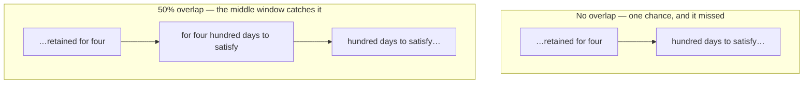

import { Tabs, TabItem } from '@astrojs/starlight/components';
import { Quiz } from '../../../components/mdx/Quiz.tsx';
import { ChunkingLab } from '../../../components/viz/widgets/ChunkingLab.tsx';

## Intuition

Chunking is where most RAG systems are quietly broken, and it is the step teams
spend the least time on. The reason is that it looks like a configuration value —
chunk size 512, overlap 50, move on — when it is actually **the decision that
determines what is retrievable at all.**

The framing that makes it tractable: **a chunk is the unit of retrieval, so it
is the smallest thing your system can find.** If the answer to a question does
not sit whole inside some chunk, no amount of embedding quality, reranking, or
prompt engineering recovers it. The information is in your corpus and out of
reach.

Two failure directions, pulling against each other:

- **Chunks too small** — an answer spanning two sentences gets split, and each
  half scores poorly because neither is a complete thought.
- **Chunks too large** — the answer is present but diluted. Its terms are
  averaged against a page of unrelated text, so the chunk's vector drifts toward
  the document's general topic and away from the specific question.

The usual advice is to find the balance. The more useful finding, below, is that
there is no smooth balance to find.

## Mechanics

### Watch it break

<ChunkingLab client:visible />

The default question is *"how long are audit logs kept?"*, and the document
contains the answer in a single sentence. Drag **chunk size** slowly upward from
22 and watch the verdict flip.

On this document, with no overlap:

| Chunk size | Answer intact? |
|---|---|
| 22 | ✓ |
| 24 | ✗ |
| 26-28 | ✓ |
| 30-32 | ✗ |
| 34-44 | ✓ |
| 46-50 | ✗ |
| 52+ | ✓ |

**That is the finding this page exists for.** Whether retrieval works is not
monotonic in chunk size. Twenty-two words works and twenty-four does not.
Increasing the chunk size — the intuitive fix for a split answer — can break
retrieval that was working.

The reason is simple once stated and almost never stated: **chunk boundaries
fall where the arithmetic puts them, which has nothing to do with where the
meaning is.** Whether a boundary lands inside the answer sentence is a lottery,
re-drawn every time you change the size.

Now set overlap to half the chunk size and drag again. The failures largely
disappear.

### Why overlap works

With no overlap, a sentence must be missed by **one** window to be lost. With
overlap, it must be missed by **every** window covering its region — and each
window is another independent chance to contain it whole.



Overlap does not make chunks better. It makes boundary placement stop mattering.

**The cost is storage and search volume.** Overlap of half the chunk size halves
the stride, so you store roughly twice the vectors and search twice as many.
That is a real bill and it is usually worth paying — a duplicated vector is
cheap, an unretrievable answer is a user who does not come back.

### Chunk on structure, not on length

Fixed-size chunking is the default because it is trivial to implement, and it is
the worst reasonable option. Splitting on structure the document already has
removes the lottery entirely.

<Tabs syncKey="lang">
<TabItem label="Python">

```python
def chunk_by_structure(sections: list[Section], max_words: int) -> list[Chunk]:
    """Pack whole paragraphs up to a limit; never split one.

    A paragraph is a unit of meaning the author already chose. Respecting it
    means a boundary can never land mid-thought — which removes the failure
    class rather than making it less likely.
    """
    chunks, current, count = [], [], 0

    for section in sections:
        for paragraph in section.paragraphs:
            length = len(paragraph.split())

            # A single paragraph over the limit is the one case that must still
            # split. Sentences are the least-bad fallback, and it is worth
            # logging: this is exactly where the strategy degrades.
            if length > max_words:
                if current:
                    chunks.append(make_chunk(current, section))
                    current, count = [], 0
                chunks.extend(split_sentences(paragraph, max_words, section))
                continue

            if count + length > max_words and current:
                chunks.append(make_chunk(current, section))
                current, count = [], 0

            current.append(paragraph)
            count += length

    if current:
        chunks.append(make_chunk(current, section))
    return chunks
```

</TabItem>
<TabItem label="TypeScript">

```typescript
function chunkByStructure(sections: Section[], maxWords: number): Chunk[] {
  const chunks: Chunk[] = [];
  let current: string[] = [];
  let count = 0;

  for (const section of sections) {
    for (const paragraph of section.paragraphs) {
      const length = paragraph.split(/\s+/).length;
      if (count + length > maxWords && current.length) {
        chunks.push(makeChunk(current, section));
        current = [];
        count = 0;
      }
      current.push(paragraph);
      count += length;
    }
  }
  if (current.length) chunks.push(makeChunk(current, sections.at(-1)!));
  return chunks;
}
```

</TabItem>
</Tabs>

In the widget, switching the strategy to **sentence boundaries** makes the answer
survive at every size. That is not a tuning win; it is a structural guarantee.

### Give each chunk its context back

A chunk retrieved in isolation has lost the heading it sat under. Prepend it:

```text
Platform Architecture > Data Retention > Audit logs

Audit logs are retained for four hundred days to satisfy the compliance
requirement, after which they are deleted automatically.
```

Cheap, and it does two things at once. It helps the **model** interpret the
chunk, and it helps **retrieval**, because the heading terms are now in the
chunk's vector — so a query about "retention" matches a chunk whose body never
uses that word.

The trade: it inflates every chunk under a heading with the same terms, slightly
reducing discrimination between them. Worth it almost always, but it is a trade
rather than a free win.

### Chunking reshapes the space, it does not just slice it

A subtlety that explains confusing measurements: IDF is computed over **chunks**,
not documents. Change the chunk size and every term's document frequency
changes, so every chunk's vector changes.

The consequence: **similarity scores from two chunking configurations are not
comparable.** 0.35 under one and 0.26 under another are numbers from different
spaces. Compare configurations on recall@k and MRR, never on raw scores.

## Cost & limits

### What a configuration costs

A 10,000-document corpus averaging 2,000 words — 20 million words:

| Chunk size | Overlap | Chunks | Vectors @1536-dim |
|---|---|---|---|
| 200 words | 0 | 100,000 | 614 MB |
| 200 words | 50 (25%) | 133,000 | 817 MB |
| 200 words | 100 (50%) | 200,000 | 1.23 GB |
| 500 words | 100 (20%) | 50,000 | 307 MB |

Storage is exact: chunks × 1536 × 4 bytes, plus roughly 50% for an HNSW index.

**The binding constraint is usually not storage but the context budget.**
Retrieving k=5 chunks of 500 words is ~2,500 words — around 3,300 tokens — on
every request forever. Smaller chunks let you retrieve more of them for the same
budget, which is usually the better trade: five precise 200-word chunks beat two
500-word chunks containing the same answer plus noise.

### Chunk size is expensive to change late

Embedding 100,000 chunks is a one-off batch job. **Changing the chunk size means
re-embedding everything**, which makes this an unusually costly parameter to
tune after launch.

Two consequences worth acting on:

- **Tune on a sample early.** 500 documents answers the question at 5% of the
  cost, before the full corpus is indexed.
- **Store the chunking config with the index.** When scores move a year later,
  "the chunker changed" is a common answer and an undiscoverable one otherwise.

<aside class="dated-figure">

**Not verified from here.** Embedding prices and the words-per-token ratio are
provider- and language-dependent. The chunk counts and storage above are
arithmetic from stated assumptions; the split/intact table is measured from the
widget's document and asserted in `traces/chunking.test.ts`.

</aside>

## When NOT to use it

**When documents are already the right size.** FAQ entries, product records,
changelog entries, support-ticket summaries. A 150-word FAQ answer *is* a chunk.
Splitting it is pure loss, and merging several destroys the
one-question-one-answer structure that makes retrieval easy.

**When the corpus fits in the context window.** A few dozen pages fits in a
modern window. Chunking, embedding and retrieving adds three failure modes to
buy nothing. Send the document.

**When structure carries the meaning.** Tables, code and legal clauses break
badly under length-based splitting — a table split mid-row is worse than useless
because it still looks valid. Parse the structure and chunk on it, or handle
those types separately.

**When the question spans the whole document.** "Summarise this contract" is not
a retrieval problem, and retrieving five chunks answers a different question.
Map-reduce over sections instead.

## Real-world usage

- **Documentation search** — split on headings, prepend the heading path, 200-400
  words. The heading structure does most of the work.
- **Support knowledge bases** — one article is often one chunk. Resist splitting
  what is already answer-shaped.
- **Legal and contract review** — clause-level, because a clause is the unit a
  lawyer reasons about and its boundaries are explicit in the text.
- **Code search** — function or class level, never fixed-size. A function split
  in half retrieves as neither.
- **Transcripts** — speaker turns, or time windows with overlap, since there is
  no reliable structure to exploit.
- **Long PDFs** — layout-aware extraction first, then structural chunking.
  Chunking badly-extracted text is optimising the wrong stage.

## Failure modes

### The answer is in the corpus and cannot be retrieved

**Symptom:** a user shows you the sentence in the documentation. Retrieval never
returns it, at any k.

**Cause:** a boundary splits it, and each half is an incomplete thought that
scores poorly against the question.

**Fix:** overlap, or structural chunking. And build the diagnostic: for a set of
known question/answer pairs, assert the answer text appears intact in at least
one chunk. That check runs at index time and catches this before users do.

### Bigger chunks made it worse

**Symptom:** a team hits a split answer, increases chunk size, and retrieval
degrades on other questions.

**Cause:** two things at once. Boundary alignment is a lottery, and a new size
re-draws it. And larger chunks dilute the answer's terms against more unrelated
text.

**Fix:** overlap addresses boundaries without the dilution. If chunks must be
large, retrieve fewer of them.

### Retrieval collapsed after a format change

**Symptom:** relevance drops for one source after a migration, silently.

**Cause:** the new format extracts differently — headings lost, tables flattened,
paragraphs merged — so the chunker sees different structure.

**Fix:** monitor the chunk-length distribution per source. A shifted histogram is
the earliest available signal and it is cheap to plot.

### Every chunk looks the same

**Symptom:** many chunks score nearly identically for any query; ranking is
arbitrary.

**Cause:** boilerplate. Headers, footers, navigation and disclaimers repeated on
every page dominate each chunk's vocabulary.

**Fix:** strip boilerplate before chunking. Unglamorous, and frequently the
single highest-impact change available in a mature RAG system.

### Tables arrive as gibberish

**Symptom:** answers involving table numbers are confidently wrong.

**Cause:** a table split mid-row produces syntactically fine, semantically
destroyed text — numbers with no column headers.

**Fix:** detect tables during extraction and keep them whole. Never let a
length-based splitter near one.

### Scores moved and nobody changed the model

**Symptom:** similarity scores shift after a re-index.

**Cause:** IDF is computed over chunks, so a chunking change reweights every
term.

**Fix:** compare on recall@k and MRR. Version the chunking config with the index.

## Practice problems

**1. The unretrievable policy.**

Support insists the refund window is documented. The bot never finds it. The
sentence is: *"Refunds are available within 30 days of purchase, except for
annual plans, which are refundable within 14 days."* Chunk size 50 words, no
overlap. Diagnose and fix.

<details>
<summary>Solution</summary>

Almost certainly split — most likely at the comma before "which", leaving one
chunk ending "…except for annual plans," and the next starting "which are
refundable within 14 days."

Now look at what each half retrieves for *"what is the refund window for annual
plans?"*. The first half contains "refunds", "annual plans", and **the wrong
number**. The second contains the right number and no subject — "which" refers
to something no longer present. The likely retrieval is the half with the wrong
answer, which is worse than retrieving nothing: the system now answers
confidently and incorrectly.

**Fix, in order of value:**

1. **Structural chunking.** This is one sentence in one paragraph; a
   paragraph-aware chunker never splits it. Removes the class, not just the
   instance.
2. **Overlap** at 25-50% as the general safety net for documents whose structure
   you cannot trust.
3. **An index-time assertion.** Known question/answer pairs, verified to appear
   intact in some chunk, run in CI. This is what catches it before support does.

**The trap to avoid:** raising chunk size to 100. It re-draws the lottery — it
fixes this sentence and may split a different one, with no signal that it
happened.

</details>

**2. Budget the trade.**

50,000 documents, average 1,500 words. Compare (a) 300-word chunks, no overlap
and (b) 300-word chunks with 150-word overlap. Storage, retrieval budget at k=5,
and which you ship.

<details>
<summary>Solution</summary>

```
Total: 50,000 × 1,500 = 75,000,000 words

(a) stride 300 → 250,000 chunks
(b) stride 150 → 500,000 chunks

At 1536 × 4 = 6,144 bytes per vector:
(a) ≈ 1.54 GB   (+50% HNSW ≈ 2.3 GB)
(b) ≈ 3.07 GB   (+50% HNSW ≈ 4.6 GB)
```

**Retrieval budget is identical.** k=5 chunks of 300 words is ~2,000 tokens in
both. Overlap costs storage and index size and **nothing per request** — the
part most people get wrong.

**Ship (b).** The extra 2.3 GB is an instance-size decision, not a meaningful
cost, and it buys a large reduction in the one failure that is invisible in
aggregate metrics and infuriating to users who can see the sentence in the
source.

**But spend an hour on (c) first:** structural chunking, no overlap. If the
corpus has usable paragraph structure, that gets (b)'s reliability at (a)'s
storage cost.

**The number to watch:** 500,000 vectors is where a single-node in-memory index
becomes a real capacity decision. Better to know before than after.

</details>

**3. Design the diagnostic.**

You inherit a RAG system with unknown chunking quality and no evaluation. Users
report "it does not find things". What do you build first, and why not something
else?

<details>
<summary>Solution</summary>

The **chunk-integrity check**, before any evaluation harness.

Take 30 real questions with the answer sentence located by hand in the source.
At index time, assert for each: does that text appear intact inside a single
chunk?

Why this first:

- Objective, and needs **no model** — it is a substring search.
- Runs in seconds, reruns on every index build.
- It separates the two failures that look identical from outside: "the chunk
  does not exist" versus "the chunk exists and ranks poorly". Different fixes,
  and no end-to-end metric distinguishes them.

**Then** measure recall@k on the same set for the ranking half.

**Why not start with recall@k:** it conflates the two. A recall@5 of 40% could be
chunking or embedding and you cannot tell.

**Why not an LLM judge:** it measures answer quality, downstream of both. It will
confirm the system is bad and tell you nothing about why.

**The principle:** measure the cheapest, most objective, earliest-stage thing
first. Debugging flows upstream.

</details>

<Quiz
  client:visible
  id="chunk-monotonic"
  kind="concept"
  question="An answer sentence is split by a chunk boundary at size 24. What does increasing the chunk size to 40 do?"
  options={[
    { label: 'It may fix this answer and split a different one — boundary alignment is not monotonic in chunk size', correct: true },
    { label: 'It reliably fixes it, since a larger chunk is more likely to contain any given sentence' },
    { label: 'It has no effect, because boundaries are computed from sentence positions' },
    { label: 'It fixes it, but only if overlap is increased proportionally' },
  ]}
>
  <Fragment slot="explanation">
    <p>
      Fixed-size boundaries fall where the arithmetic puts them, with no
      relationship to where meaning is. Changing the size does not push
      boundaries "outward" — it re-draws all of them. On the widget's document,
      22 words works, 24 splits the answer, 26–28 work, 30–32 split, 34–44 work,
      and 46–50 split again.
    </p>
    <p>
      So the intuitive fix is a lottery ticket: it may resolve the reported case
      and break a different one, with no signal that it happened. That is what
      makes this failure so persistent in production.
    </p>
    <p>
      What helps is removing the dependence on boundary placement — overlap, so a
      sentence must be missed by <em>every</em> window rather than one, or
      structural chunking, so boundaries fall only where the author already put
      them.
    </p>
  </Fragment>
</Quiz>

<Quiz
  client:visible
  id="chunk-overlap-cost"
  kind="concept"
  question="What does 50% overlap cost, relative to no overlap?"
  options={[
    { label: 'Roughly double the stored vectors and index size — but nothing extra per request at the same k', correct: true },
    { label: 'Double the storage and double the tokens sent to the model per request' },
    { label: 'Nothing measurable, since overlapping text is deduplicated at index time' },
    { label: 'Double the embedding cost per query, since each query matches against more text' },
  ]}
>
  <Fragment slot="explanation">
    <p>
      Halving the stride roughly doubles the number of chunks, so you store and
      search about twice the vectors. That is a real index-size and memory cost,
      and it is the whole of the cost.
    </p>
    <p>
      Per request nothing changes: retrieving k=5 chunks of 300 words is the same
      ~2,000 tokens either way. That asymmetry is what makes overlap usually
      worth paying for — a one-off storage cost buying a large reduction in the
      split-answer failure.
    </p>
    <p>
      Deduplication is not possible, because the overlapping windows are
      genuinely different chunks with different vectors — and that difference is
      exactly the mechanism that rescues a sentence one boundary would have cut.
      The query is embedded once regardless of corpus size, so the last option
      inverts how retrieval works.
    </p>
  </Fragment>
</Quiz>

## Interview answers

**"How do you decide chunk size?"**

> I start from the fact that a chunk is the unit of retrieval, so it is the
> smallest thing the system can find. If an answer does not sit whole inside some
> chunk, no embedding quality or reranking recovers it.
>
> So rather than tuning a number I try to remove the dependence on it — chunk on
> structure the document already has, paragraphs or headings or clauses, because
> those boundaries were chosen by a human and never land mid-thought. Fixed-size
> with overlap is the fallback for documents whose structure I cannot trust.
>
> The thing worth conveying is that it is not monotonic. Increasing chunk size to
> fix a split answer re-draws every boundary and can split a different one. It
> gets treated as a smooth tuning knob and it is not.

**"What does overlap buy you?"**

> It makes boundary placement stop mattering. Without it a sentence has to be
> missed by one window to be lost; with it, by every window covering that region,
> and each is an independent chance.
>
> The cost is storage — half the stride is roughly double the vectors and index
> size. What it does not cost is anything per request: five chunks is the same
> token budget either way. That asymmetry is why I default to it.

**"A user can point at the sentence in the docs and the bot never finds it."**

> First I check whether that sentence survives chunking at all — a substring
> search over the chunks, minutes of work. That separates "the chunk does not
> exist" from "the chunk exists and ranks badly", which have completely different
> fixes.
>
> Then I would make it permanent: known question-and-answer pairs with an
> index-time assertion that each answer appears intact in some chunk. Runs in CI,
> needs no model, catches it before users do.
>
> Only after that would I look at ranking. Debugging flows upstream, and
> retrieval failures get blamed on the model constantly.

**The caveats worth voicing:**

- Similarity scores are not comparable across chunking configurations — IDF is
  computed over chunks, so changing the size reshapes the space.
- Chunk size is expensive to change late; tune it on a sample before indexing
  everything.
- Prepend the heading path — it helps the model and the retriever at once.
- Strip boilerplate before chunking; it is often the highest-impact fix in a
  mature system.
- Never let a length-based splitter near a table or a function.
