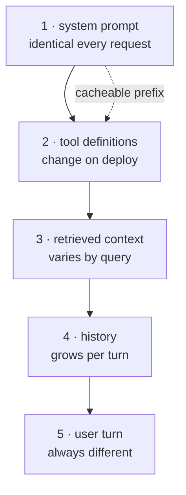

import { Tabs, TabItem } from '@astrojs/starlight/components';
import { Quiz } from '../../../components/mdx/Quiz.tsx';

## Intuition

Prompt engineering is about what you say. **Context engineering is about what is
in the window when you say it** — and on any system beyond a demo, the second
one dominates.

The mental shift is from thinking of the window as a container to thinking of it
as a **budget with competing claimants**. The system prompt, tool definitions,
conversation history, retrieved documents, and the space reserved for the answer
are all drawing on the same number. None of them shrinks to accommodate the
others unless you make it.

Three properties make this real engineering rather than bookkeeping:

- **It is finite and it is shared.** Adding a tool costs every future request.
- **Quality is not uniform across it.** Material in the middle of a long context
  is attended to less reliably than material at the edges.
- **It has a cache with a prefix rule.** Order changes cost, sometimes by an
  order of magnitude, without changing content at all.

Most teams discover all three the same way: a feature that worked in testing
starts degrading in week three of production, when real conversations get long.

## Mechanics

### The budget

Write it down. A system where nobody can say what is in the context is a system
where nobody can debug it.

| Claimant | Typical size | Grows with |
|---|---|---|
| System prompt | 300-1,500 | edits only |
| Tool definitions | 200-500 **each** | number of tools |
| Conversation history | unbounded | every turn |
| Retrieved chunks | 400-1,000 each | `k` |
| Reserved output | 500-4,000 | longest expected answer |

Two lines deserve attention. **Tool definitions are re-sent on every single
request** — twelve verbose tools is a permanent tax on every call for the life of
the system. And **history is the only unbounded one**, which means every system
without an explicit history policy has a latent failure scheduled for whenever
conversations get long enough.

### Order by stability, for the cache

Prompt caching matches on a **prefix** and stops at the first token that differs.
That single mechanic dictates the layout:



A timestamp, a session id, or a request id near the front invalidates everything
after it. This is the most common reason prompt caching is enabled and does
nothing — and it costs nothing to fix.

One non-obvious follow-on: retrieved chunks are usually ordered by relevance,
which varies per query even when the *same* chunks come back. On traffic where a
few documents answer most questions, sorting them by a stable id instead makes
that segment cacheable too. You give up putting the best chunk first, so measure
the trade rather than assuming it.

### Lost in the middle

Retrieval accuracy across a long context is roughly U-shaped: strongest at the
beginning, strongest at the end, weakest in the middle. A fact buried at 50%
depth in a 100,000-token context may be present and functionally invisible.

Two rules follow:

1. **Fewer, better chunks beat more chunks.** Five reranked chunks outperform
   thirty unranked ones, and cost less. This is counter-intuitive enough that
   teams routinely tune `k` upward and make things worse.
2. **Place the best material at the edges.** If you have ten chunks, the two
   strongest go first and last, not first and second.

### Compaction: summarise, do not truncate

When history exceeds budget, the naive move is to drop the oldest messages. The
oldest messages are where the system prompt and the user's actual goal live, so
this is the worst available choice — and it is usually the framework default.

<Tabs syncKey="lang">
<TabItem label="Python">

```python
def fit_to_budget(system, tools, history, retrieved, *, window, reserve):
    """Assemble a context, compacting history rather than dropping it."""
    fixed = count_tokens(system) + count_tokens(tools) + count_tokens(retrieved)
    available = window - fixed - reserve

    if available <= 0:
        # Not a truncation problem — the fixed cost alone does not fit. Fewer
        # chunks or fewer tools is the only honest answer; silently dropping
        # history here would hide a design error.
        raise ValueError(f"fixed context {fixed} exceeds window {window}")

    # Keep recent turns verbatim: they carry the immediate thread of the
    # conversation, where precision matters most.
    recent, older = split_by_tokens(history, budget=available * 0.6)

    if older:
        # One summarisation call, cached by a hash of the turns it covers, so a
        # long conversation does not re-summarise the same prefix every turn.
        recent = [summarise(older)] + recent

    return system, tools, retrieved, recent
```

</TabItem>
<TabItem label="TypeScript">

```typescript
function fitToBudget(parts: Parts, window: number, reserve: number) {
  const fixed =
    countTokens(parts.system) + countTokens(parts.tools) + countTokens(parts.retrieved);
  const available = window - fixed - reserve;

  if (available <= 0) {
    throw new Error(`fixed context ${fixed} exceeds window ${window}`);
  }

  const { recent, older } = splitByTokens(parts.history, available * 0.6);
  return older.length ? [summarise(older), ...recent] : recent;
}
```

</TabItem>
</Tabs>

Three details that matter more than the split ratio:

- **Cache the summary** by a hash of the turns it covers. Otherwise a long
  conversation re-summarises the same prefix on every turn, and you have added a
  second model call to every request.
- **Summarise for the task**, not generically. "Summarise this conversation"
  loses the decisions; "list the constraints and decisions established so far"
  keeps what the next turn needs.
- **Raise, do not truncate, when the fixed cost alone overflows.** If system plus
  tools plus retrieval does not fit, that is a design error, and silently
  dropping history hides it.

### Structure the assembled prompt

The model sees one flat token sequence. Delimiters that survive tokenisation
help it tell your instructions from a retrieved document that happens to contain
instruction-shaped text:

```text
<instructions>
Answer only from the documents. Cite the id of each document you use.
If the documents do not contain the answer, say so.
</instructions>

<documents>
<document id="doc-114">…</document>
<document id="doc-207">…</document>
</documents>

<question>What changed in the deploy?</question>
```

The `id` attributes are doing real work: they make citation checkable. When the
model claims `doc-114`, you can assert that `doc-114` was actually in the
context — which turns "did it hallucinate" from a judgement call into a test.

## Cost & limits

### Compute the budget, do not estimate it

A worked example, 200,000-token window:

| Claimant | Tokens | Note |
|---|---|---|
| System prompt | 800 | fixed |
| Tool definitions (12) | 4,500 | **every request** |
| History (20 turns) | 15,000 | grows |
| Retrieved (10 × 800) | 8,000 | tunable |
| Reserved output | 4,000 | fixed |
| **Total** | **32,300** | 16% of window |

Comfortable now. At turn 100, history alone is ~75,000 tokens, and the shape of
the problem has changed entirely. **Budget for the steady state, not the current
turn** — the failure is always scheduled for later.

### Where the money goes

The cost driver is usually input tokens × request count, because retrieval-heavy
systems send far more than they generate. Two levers, in order of effect:

1. **Prompt caching**, which can cut the cost of a stable prefix substantially —
   and requires only that you order the prompt correctly.
2. **Fewer retrieved chunks**, which cuts cost *and* usually improves accuracy
   because of lost-in-the-middle. This is the rare optimisation with no trade.

Trimming tool definitions belongs on the list too, for the same reason: fewer,
clearer tools are cheaper on every call and easier for the model to choose
between.

<aside class="dated-figure">

**Not verified from here.** Cache discounts, cache TTLs, minimum cacheable prefix
lengths and per-token prices are provider-specific and change. The token
arithmetic above holds regardless; the savings percentages are deliberately not
quoted. Check your provider's docs and record the date.

</aside>

### Latency

Input length affects **time to first token**; output length affects total time.
A large cached prefix is close to free on both, which is the other reason to get
the ordering right — it is a latency optimisation as much as a cost one.

## When NOT to use it

**Do not fill the window because it is there.** More context is not more
capability. Past a point it is measurably worse: the signal you needed is now
competing with thirty chunks of near-miss, sitting in the middle where attention
is weakest. If retrieval quality is the problem, more `k` is not the fix.

**Do not build memory before you have a use for it.** "Remember everything about
this user forever" is a large, expensive subsystem with real privacy obligations.
Most products need the last few turns and a handful of stable facts. Start there.

**Do not summarise when you could retrieve.** If the earlier conversation is
stored, retrieving the two relevant turns beats carrying a lossy summary of all
forty. Summarisation is for what you cannot look up.

**Do not hand-manage the window if the framework does it well and you have
measured that it does.** The failure mode worth avoiding is not "using a
framework", it is not knowing what it does when the budget runs out. Find out,
then decide.

## Real-world usage

- **Chat products** — pinned system prompt, rolling summary of old turns, recent
  turns verbatim, hard cap on history.
- **RAG endpoints** — stable system prompt and tool definitions first for cache
  hits, reranked chunks placed at the edges, question last.
- **Coding agents** — file contents are enormous, so context is assembled per
  step: only the files the current step touches, with the rest summarised as a
  tree.
- **Long-document workflows** — map-reduce rather than one giant context. Process
  sections independently, then combine, which sidesteps lost-in-the-middle
  entirely.
- **Support systems** — a small set of durable user facts pinned, conversation
  history compacted, ticket history retrieved on demand rather than carried.

## Failure modes

### Silent truncation from the front

**Symptom:** the assistant loses its persona and its rules deep in a
conversation, without an error.

**Cause:** history exceeded the window and something dropped the oldest
messages — which is where the system prompt lives.

**Fix:** pin the system prompt so it is never a truncation candidate; compact the
middle. And log token counts per request, because the absence of any signal is
itself the bug.

### The cache that never hits

**Symptom:** prompt caching is on and costs are unchanged.

**Cause:** something varies near the front of the prompt — a timestamp, a request
id, a relevance-ordered list.

**Fix:** order by stability. Move variable material to the end. Sort collections
whose order is not semantically meaningful.

### Context rot in long conversations

**Symptom:** quality degrades gradually over a long session; the model
contradicts itself or re-asks answered questions.

**Cause:** repeated summarisation. Each pass summarises the previous summary,
compounding loss — a lossy codec applied to its own output.

**Fix:** summarise from the **original turns** each time, not from the last
summary. Keep the raw history in storage and re-derive.

### Retrieved documents that give instructions

**Symptom:** the model ignores its system prompt after a particular document is
retrieved.

**Cause:** prompt injection. The instruction/data boundary is a learned
convention, not an enforced one, so a document containing "ignore previous
instructions" is competing on equal footing.

**Fix:** delimit documents structurally, instruct the model that document content
is data, and — most importantly — do not rely on that alone. See
[guardrails](/cs-fundamentals/10-ai-engineering/guardrails/).

### Tool definitions crowding out content

**Symptom:** retrieval quality drops after a release that added tools.

**Cause:** every tool definition is re-sent on every request. Adding six tools at
400 tokens each removed 2,400 tokens from the retrieval budget.

**Fix:** count tool tokens as part of the budget. Trim descriptions. If the tool
count is genuinely large, route — select a relevant subset per request rather
than sending all of them.

## Practice problems

**1. The summariser that loses the plot.**

A long-running assistant summarises history whenever it exceeds 60% of the
window. Users report that after an hour, it forgets decisions made early on —
even though summarisation is supposed to preserve them.

<details>
<summary>Solution</summary>

The summaries are being built from previous summaries. Each pass is a lossy
transform applied to already-lossy input, so detail decays geometrically. A
decision made at turn 5 survives one summarisation with reduced detail, two with
less, and by the fifth it is a phrase or gone.

**Fix:**

1. Keep the raw turns in storage, and **re-summarise from the originals** each
   time. Cost is one call over more input, not a chain of compounding loss.
2. Summarise for the task: "list the constraints, decisions and open questions
   established so far" rather than "summarise the conversation". Generic
   summaries preserve narrative and drop exactly the operative details.
3. Maintain a separate, append-only **decisions list** that is never
   summarised — it is small and it is what the next turn actually needs.

**The trap to avoid:** raising the compaction threshold to 80%. It delays the
problem by a few turns and makes it worse when it arrives, because the summary
now covers more material at once.

</details>

**2. Budget under growth.**

A 128,000-token window. System 900, ten tools at 350, output reserve 3,000,
chunks 750 each at k=12. History currently 4,000 and grows ~600 per turn. At
what turn does this break, and what do you fix first?

<details>
<summary>Solution</summary>

```
128,000  window
   -900  system
 -3,500  tools (10 × 350)
 -3,000  reserved output
 -9,000  retrieval (12 × 750)
────────
111,600  available for history
÷    600 per turn
        ≈ turn 186
```

Nominally fine. **But the real failure comes far earlier and is not an error** —
it is quality. Long before 186 turns, history dominates the context, retrieved
chunks sit in the middle where attention is weakest, and answers get worse with
no signal at all.

**Fix, in order:**

1. **Cap history** at a rolling window — say 8 recent turns plus a summary,
   ~6,000 tokens steady state. Removes the unbounded term entirely.
2. **Drop k from 12 to 5** with reranking. Saves 5,250 tokens per request and
   will very likely improve answers.
3. **Trim tools** from 350 to ~200 tokens each; 3,500 on every request for ten
   tools is verbose.

Steady state lands near 14,000 tokens — 11% of the window, with genuine headroom
and better answers than the "fits comfortably" version.

**The lesson:** the binding constraint is quality, not capacity, and capacity
arithmetic will not show it to you.

</details>

**3. Make the prefix cacheable.**

```python
prompt = f"""Request {uuid4()} at {datetime.now()}
{"".join(chunk.text for chunk in ranked_chunks)}
Tools: {json.dumps(tool_defs)}
{system_prompt}
User: {question}"""
```

Cache hit rate is zero. Rewrite it and say what you gave up.

<details>
<summary>Solution</summary>

Every problem is in the ordering. The UUID at position zero means no two
requests share a single token of prefix.

```python
prompt = f"""{system_prompt}
Tools: {json.dumps(tool_defs, sort_keys=True)}
{"".join(chunk.text for chunk in sorted(ranked_chunks, key=lambda c: c.id))}
User: {question}"""
```

Four changes:

1. **UUID and timestamp gone.** Log them; do not send them. If the model needs
   the date, put it in the user turn at the end.
2. **System prompt first** — the only truly invariant part.
3. **`sort_keys=True` on the tool JSON.** Python dict ordering is stable, but
   anything round-tripped through a service may not be, and one reordered key
   invalidates the whole prefix.
4. **Chunks sorted by id, not relevance.** This is the one with a real cost.

**What you gave up:** the strongest chunk is no longer first, so you lose the
edge-placement advantage. Whether that trade is worth it depends on your traffic
— if a few documents answer most questions, the same chunk set recurs and the
cache win is large. If every query retrieves a different set, sorting buys
nothing and you should keep relevance order.

**Measure it.** This is the one decision on the page that genuinely depends on
your data.

</details>

<Quiz
  client:visible
  id="ctx-cache-prefix"
  kind="concept"
  question="Prompt caching is enabled but the hit rate is near zero. The prompt begins with a request id, then the system prompt, then retrieved documents. What is the fix?"
  options={[
    { label: 'Remove the request id and put the stable system prompt first — the cache matches a prefix and stops at the first differing token', correct: true },
    { label: 'Increase the cache TTL so entries survive between requests' },
    { label: 'Reduce the number of retrieved documents so the prompt fits the cacheable size limit' },
    { label: 'Enable caching on the output as well, since only input is currently cached' },
  ]}
>
  <Fragment slot="explanation">
    <p>
      Prompt caches are <strong>prefix</strong> caches. Reuse extends only as far
      as the first token that differs, so a unique request id at position zero
      means every request is a miss no matter what follows it. Ordering is the
      entire mechanism.
    </p>
    <p>
      The distractors are all real settings that do not apply here. A longer TTL
      cannot help entries that are never matched. A minimum cacheable length
      exists on most providers, but the prompt described is long, not short.
      And output caching is a different feature solving a different problem —
      identical requests returning identical answers.
    </p>
    <p>
      The general rule: <strong>order the prompt by stability</strong>. System
      prompt, then tool definitions, then retrieved context, then history, then
      the user turn. Anything variable belongs at the end, and anything whose
      order is not meaningful should be sorted so it does not vary run to run.
    </p>
  </Fragment>
</Quiz>

<Quiz
  client:visible
  id="ctx-more-is-worse"
  kind="concept"
  question="Retrieval quality is mediocre, so a team raises k from 5 to 25 chunks. Answers get worse. Why?"
  options={[
    { label: 'The extra chunks land in the middle of the context, where attention is least reliable, and dilute the signal from the good ones', correct: true },
    { label: 'The model has a hard limit on how many documents it can cite' },
    { label: 'More chunks exceeded the context window, so the question was truncated' },
    { label: 'Retrieval latency rose, so the model timed out and answered from memory' },
  ]}
>
  <Fragment slot="explanation">
    <p>
      Attention over a long context is roughly U-shaped — strongest at the
      beginning and end, weakest in the middle. Going from 5 to 25 chunks does
      not just add 20 chunks of marginal relevance; it pushes the good ones away
      from the edges and surrounds them with near-misses. The signal is present
      and harder to find.
    </p>
    <p>
      The third option describes a real failure with a different symptom —
      window overflow produces truncation errors or obviously mangled input,
      not gradually worse answers. The fourth invents a fallback that does not
      exist: a model has no "answer from memory" mode to degrade into.
    </p>
    <p>
      The rule worth carrying: <strong>fewer, better, at the edges.</strong> If
      retrieval quality is the problem, the fix is reranking — improving what
      the top 5 contains — not enlarging the set. This is the rare optimisation
      that reduces cost and improves quality at the same time.
    </p>
  </Fragment>
</Quiz>

## Interview answers

**"What is context engineering?"**

> Deciding what is in the window when you make the call, and in what order.
> Prompt engineering is about the wording; context engineering is about the
> budget — the system prompt, tool definitions, history, retrieved documents and
> reserved output all compete for one number, and none of them yields unless you
> make it.
>
> The reason it is a discipline rather than bookkeeping is that two things are
> non-obvious. Quality is not flat across the window — material in the middle
> gets attended to less — and the cache matches on prefix, so ordering changes
> cost without changing content. Both bite in production and neither shows up in
> testing.

**"A long conversation degrades in quality. How do you fix it?"**

> First find out what is actually being sent, because it is usually truncation
> and usually from the front — which drops the system prompt, so the symptom is
> "lost its persona". Pin the system prompt so it is never a candidate.
>
> Then compact rather than truncate: keep recent turns verbatim, summarise older
> ones. The trap is summarising the summary — that compounds loss, and it is
> exactly why quality decays gradually rather than falling off a cliff. Always
> re-summarise from the original turns, and keep a small append-only list of
> decisions that never gets summarised at all.

**"How do you decide how many chunks to retrieve?"**

> By measuring, and the answer is usually lower than people expect. More chunks
> means the good ones get pushed into the middle of the context where attention
> is weakest, so past a point you are paying tokens to make the answer worse.
>
> I would rather spend the effort on reranking — making the top five right — than
> on retrieving thirty and hoping. It costs less and it measures better. And I
> would measure retrieval on its own, with recall@k against known-correct
> chunks, before looking at generated answers at all.

**The caveats worth voicing:**

- Tool definitions are re-sent every request. They are a permanent tax, not a
  one-off.
- Budget for the steady state; history is the only unbounded claimant.
- Summarise from originals, never from the previous summary.
- Sort anything whose order is not semantically meaningful, so it does not
  invalidate the cache.
- "It fits" and "it will be used" are different claims.
