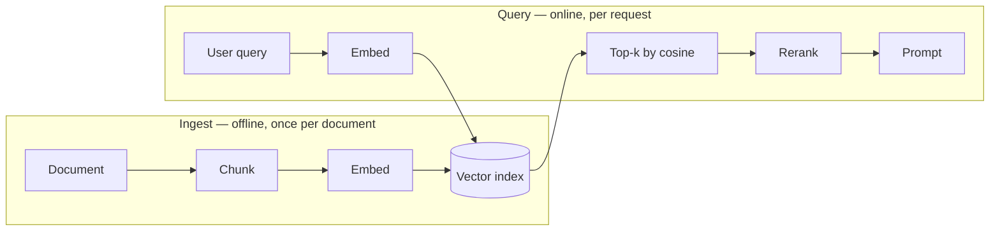

import { Tabs, TabItem } from '@astrojs/starlight/components';
import { Quiz } from '../../../components/mdx/Quiz.tsx';
import { VectorSpace } from '../../../components/viz/widgets/VectorSpace.tsx';

## Intuition

An embedding is a **lossy compression of meaning into a fixed-length list of
numbers**, built so that the geometry of the list means something.

That last clause is the whole trick. Any function can turn text into numbers —
a hash does it, and its output is useless because similar inputs produce
unrelated outputs. An embedding model is trained so the opposite holds: inputs
that a human would call related land near each other, and the arrangement is
stable enough that "near" can be computed with arithmetic instead of
understanding.

Once meaning is a position, three things that were hard become easy:

- **Search without keywords.** "How do I stop my bill going up" can retrieve a
  document titled "Cost optimisation" that shares not one word with the query.
- **Clustering without labels.** Points that sit together are a topic, and
  nobody had to define the topic in advance.
- **Deduplication without exact matching.** Two support tickets describing the
  same bug in different words are two nearby points.

And one thing gets much harder, which is the part most introductions skip: **you
can no longer see why the system did what it did.** A keyword index that returns
a wrong document tells you which word matched. A vector index returns a wrong
document with a similarity of 0.83 and no explanation. Every failure mode in
this page descends from that.

### The one property that matters

Direction carries the meaning. Magnitude carries almost nothing.

A document that makes the same point at three times the length points in roughly
the same direction with roughly three times the magnitude. If your similarity
metric is sensitive to magnitude, it will report that the long document is less
similar — not because it means something different, but because it is longer.
That is why text similarity is an **angle**.

## Mechanics

### Building the space by hand

The widget below is running real arithmetic on the ten sentences it displays —
tokenise, weight, project, compare. Nothing is hand-placed to make the picture
tidy.

<VectorSpace client:visible />

Two experiments worth doing before reading on:

1. Select **"the database index speeds up the query"** and **"adding an index to
   the database makes the query faster but slows down every write to the
   table"**. Cosine says `0.302`; Euclidean distance says `6.34`, further apart
   than the pair right above them at `4.52`. The two metrics disagree because
   the second sentence is long. Cosine is right, and this is why.
2. Select **"the interest rate on the loan went up"** and **"rising rates make
   borrowing more expensive"**. Two ways of saying one thing. The similarity is
   `0.000` — a perfect right angle. Hold onto that; it is the entire reason
   learned embeddings exist, and it comes back under [failure
   modes](#failure-modes).

### What the widget is actually computing

It builds **TF-IDF** vectors: one dimension per vocabulary term, each weighted
by how often it appears in this document and how rare it is across the corpus.

$$
w_{t,d} = \mathrm{tf}(t,d) \cdot \ln\!\left(1 + \frac{N}{\mathrm{df}(t)}\right)
$$

The $\mathrm{tf}$ term says "this document is about this word". The $\ln$ term
says "…and that is only interesting if the word is rare". Without the second
factor, every document in English is maximally similar to every other because
they all contain *the*.

**This is not a neural embedding, and the difference is the point.** TF-IDF is
an honest vector space with a specific, visible weakness — it has no dimension in
which two synonyms overlap — and that weakness is exactly the gap a learned model
fills. Everything the widget demonstrates about *geometry* transfers directly to
a real embedding model: same cosine, same normalisation, same lossy 2-D
projection. Only the way the coordinates are chosen differs.

### Cosine similarity

<Tabs syncKey="lang">
<TabItem label="Python">

```python
import math

def dot(a: list[float], b: list[float]) -> float:
    return sum(x * y for x, y in zip(a, b))

def cosine(a: list[float], b: list[float]) -> float:
    denominator = math.sqrt(dot(a, a)) * math.sqrt(dot(b, b))
    if denominator == 0:
        return 0.0
    # The clamp is not cosmetic. Floating-point error puts cosine(v, v) at
    # 1.0000000000000002 for real vectors, and math.acos of that raises
    # ValueError: math domain error.
    return max(-1.0, min(1.0, dot(a, b) / denominator))
```

</TabItem>
<TabItem label="TypeScript">

```typescript
function dot(a: number[], b: number[]): number {
  return a.reduce((sum, x, i) => sum + x * b[i]!, 0);
}

function cosine(a: number[], b: number[]): number {
  const denominator = Math.sqrt(dot(a, a)) * Math.sqrt(dot(b, b));
  if (denominator === 0) return 0;
  // Same clamp, same reason: Math.acos(1.0000000000000002) is NaN, and the
  // NaN surfaces three layers away from the cause.
  return Math.min(1, Math.max(-1, dot(a, b) / denominator));
}
```

</TabItem>
</Tabs>

That clamp is a real bug this page's own widget hit — the range test caught
`1.0000000000000002` on the very corpus displayed above. Any code path that
converts similarity to an angle will find it eventually.

### Normalise once, then never divide again

If every stored vector already has magnitude 1, then $|a| \cdot |b| = 1$ and
cosine collapses into a plain dot product:

$$
\cos(a,b) = \frac{a \cdot b}{|a|\,|b|} \;\xrightarrow{\;|a|=|b|=1\;}\; a \cdot b
$$

<Tabs syncKey="lang">
<TabItem label="Python">

```python
def normalize(v: list[float]) -> list[float]:
    m = math.sqrt(dot(v, v))
    return v if m == 0 else [x / m for x in v]

# Store normalised. Now similarity is one multiply-accumulate per dimension —
# no square roots at query time, on any vector, ever again.
stored = [normalize(embed(doc)) for doc in documents]
```

</TabItem>
<TabItem label="TypeScript">

```typescript
function normalize(v: number[]): number[] {
  const m = Math.sqrt(dot(v, v));
  return m === 0 ? v : v.map((x) => x / m);
}

const stored = documents.map((doc) => normalize(embed(doc)));
```

</TabItem>
</Tabs>

This is why vector databases ask which metric you want at **index creation
time** rather than query time, and why `cosine` and `inner product` are listed
as separate options that give identical results on normalised data. Picking
`inner product` on un-normalised vectors, however, silently ranks long documents
first — a bug that looks like a relevance problem and is actually a
configuration one.

### Calling a real model

<Tabs syncKey="lang">
<TabItem label="Python">

```python
from openai import OpenAI

client = OpenAI()

response = client.embeddings.create(
    model="text-embedding-3-small",
    input=["the interest rate on the loan went up",
           "rising rates make borrowing more expensive"],
)

a, b = (item.embedding for item in response.data)
print(len(a))          # 1536 dimensions
print(cosine(a, b))    # high — a learned model sees the paraphrase
```

</TabItem>
<TabItem label="TypeScript">

```typescript
import OpenAI from 'openai';

const client = new OpenAI();

const response = await client.embeddings.create({
  model: 'text-embedding-3-small',
  input: [
    'the interest rate on the loan went up',
    'rising rates make borrowing more expensive',
  ],
});

const [a, b] = response.data.map((item) => item.embedding);
console.log(a.length); // 1536
console.log(cosine(a, b));
```

</TabItem>
</Tabs>

Batch the input array. One request with 100 strings costs the same tokens as 100
requests with one string, and saves 99 round trips — on a backfill of a million
documents that is the difference between an afternoon and a week.

### Where embeddings sit in a retrieval system



The asymmetry is the thing to notice. Ingest is a batch job you can retry;
query is in the user's latency budget. **Both arrows into the index must use
the same model** — mixing models puts the query in a different space from the
documents, and the result is not an error, it is quietly random ranking.

## Cost & limits

### Storage is exact arithmetic

A vector of $d$ dimensions at 4 bytes per `float32` is $4d$ bytes. For
`text-embedding-3-small` at $d = 1536$:

$$
1536 \times 4 = 6144 \text{ bytes} \approx 6\text{ KB per vector}
$$

| Vectors | Raw float32 | With HNSW index (~1.5×) |
|---|---|---|
| 10,000 | 61 MB | ~92 MB |
| 100,000 | 614 MB | ~921 MB |
| 1,000,000 | 6.1 GB | ~9.2 GB |
| 10,000,000 | 61 GB | ~92 GB |

The graph-index multiplier is approximate and depends on the `m` parameter; the
raw column is exact. **The practical consequence is a cliff, not a curve**: an
HNSW index must be resident in RAM to hit its advertised latency, so the moment
your vectors exceed the box's memory, p99 does not degrade by 20% — it degrades
by two orders of magnitude as the index starts hitting disk. One million
documents at 1536 dimensions needs a memory-optimised instance, not a default
one.

Two levers, both with a real price:

- **Fewer dimensions.** `text-embedding-3-small` supports shortening to 512 via
  the `dimensions` parameter, which is a 3× storage cut for a measurable but
  usually small retrieval-quality loss. Measure it on your data; the loss is
  corpus-dependent, and anyone quoting a single percentage has measured one
  corpus.
- **Quantisation.** `int8` instead of `float32` is a 4× cut. Most vector stores
  support it and most workloads barely notice, because the ranking only needs
  the *order* to survive, not the exact scores.

### Embedding is cheap; forgetting to cache is not

Embedding is priced per token, and it is one of the cheapest things an AI system
does — roughly two orders of magnitude below generation for the same text. The
cost that actually bites is **re-embedding**: a document that is re-embedded on
every deploy, or a query embedded twice because two services each call the API,
turns a rounding error into a line item.

<aside class="dated-figure">

**Figures I could not verify from here.** Embedding prices are per-vendor and
change; this page derives no dollar totals from them. Check your provider's
current pricing page and record the date beside the number in your own runbook.
The storage arithmetic above needs no vendor to be true.

</aside>

The rule that survives price changes: **embed on write, never on read.** Cache
by a hash of the exact text plus the model name. The model name in the key is
what saves you on the day you upgrade models, because it turns a
silently-corrupted index into a clean cache miss.

### Latency

Query-time work splits in two, and only one half is yours to optimise:

- **The embedding call** — a network round trip, typically tens of
  milliseconds, and it is on the critical path of every single search.
- **The index lookup** — sub-millisecond for an in-memory HNSW index over a
  million vectors, because approximate nearest-neighbour search is
  $O(\log n)$-ish rather than the $O(n)$ of comparing against everything.

That second bound is the entire reason vector databases exist, and it is a
straight application of what
[Big-O](/cs-fundamentals/1-complexity/big-o/) is for. Exact
search over a million 1536-dimensional vectors is 1.5 billion multiply-adds per
query. ANN gives that up — it will sometimes miss a true neighbour — in exchange
for a better complexity class. **Recall is the price, and it is a dial you set,
not a property you discover.**

## When NOT to use it

**When the user is searching for an identifier.** Order numbers, SKUs, error
codes, file paths, function names. A user typing `ERR_CONN_REFUSED` wants that
exact string, and an embedding will happily return documents about other
connection errors — semantically adjacent, operationally useless. Keyword search
is not a legacy technology; it is the correct tool for exact tokens. Use both
and fuse the results.

**When the corpus is small enough to read.** Under a few thousand chunks, a
`WHERE ... LIKE` plus a good ranking function is often better, and is certainly
easier to debug. You get to see why a document matched. Do not take on an
embedding pipeline, a model dependency, an index, and a re-embedding story to
search 400 FAQ entries.

**When the distinctions that matter are ones embeddings compress away.**
Negation is the notorious case: "the patient has a fever" and "the patient does
not have a fever" are near-identical to most embedding models, because they
share almost all their content. Numbers behave similarly — "over 65" and "under
65" embed close together. In a clinical, legal, or financial filter, that is not
a relevance problem, it is a correctness one. Filter structurally, then rank
semantically.

**When you cannot explain a result and the domain requires it.** If a regulator,
an auditor, or an angry customer can ask "why did the system show me this", a
cosine of 0.81 is not an answer.

## Real-world usage

- **Retrieval-augmented generation.** The dominant use: embed the corpus, embed
  the question, retrieve the top-k chunks, put them in the prompt. Retrieval
  quality sets the ceiling on answer quality — the model cannot cite what it was
  never shown.
- **Semantic caching for LLM calls.** Before calling an expensive model, check
  whether a semantically-equivalent question was answered recently. Same idea as
  the caching in [systems](/cs-fundamentals/5-systems/caching/),
  with one important difference: the cache key is *approximate*, so a threshold
  set too loosely serves a confidently wrong answer to a question nobody asked.
- **Recommendation and "more like this".** Embed items and users into a shared
  space; recommendation becomes a nearest-neighbour lookup.
- **Deduplication and clustering** in support and CRM tooling: grouping tickets
  that describe one incident in a dozen phrasings.
- **Classification with no training loop.** Embed the labels, embed the input,
  pick the nearest label. Surprisingly strong, and it ships in an afternoon.
- **Postgres, without a new datastore.** `pgvector` puts all of the above next
  to your relational data, which means one backup story and real `JOIN`s against
  the rows the vectors describe.

## Failure modes

### The index and the query drift into different spaces

**Symptom:** relevance collapses to noise, all at once, with no error anywhere.
Similarity scores still look plausible — 0.7, 0.8 — because two random vectors in
high dimensions are never *actually* orthogonal.

**Cause:** the documents were embedded with one model and the queries with
another. A version bump, a different service, a config default. Nothing in the
type system objects: both sides are `float[1536]`.

**Fix:** store the model name and version *with every vector*, and refuse at
query time if they disagree. Re-embedding a corpus is a migration, with a
backfill and a cutover, not a config change.

### Cosine similarity has no absolute meaning

**Symptom:** a threshold tuned on one corpus — "accept anything above 0.75" —
returns everything on another, or nothing.

**Cause:** embedding spaces are **anisotropic**. Vectors are not spread evenly
over the sphere; they occupy a narrow cone, so *unrelated* text often scores
0.6–0.8. The absolute number is a property of the model, not of relevance.

**Fix:** thresholds must be calibrated per model and per corpus, against a
labelled sample. Better still, avoid absolute thresholds: take top-k and let a
reranker make the accept/reject call, since relative ordering is far more stable
than absolute score.

### Chunks that split the answer in half

**Symptom:** the answer is provably in the corpus, retrieval never returns it,
and every individual component tests fine.

**Cause:** the chunk containing the answer got split mid-thought, or the chunk
is so large that the answer's signal is diluted across a page of unrelated text.
Both are chunking bugs that look exactly like embedding bugs.

**Fix:** evaluate retrieval on its own — a set of questions with known
source chunks, measuring recall@k — before ever looking at generated answers. A
bad answer from good retrieval and a bad answer from bad retrieval need entirely
different fixes.

### Synonyms and the lexical trap

**Symptom:** results that share vocabulary with the query outrank results that
share meaning.

**Cause:** this is the failure the widget demonstrates exactly. It is total in
TF-IDF and merely partial — but present — in learned models, especially for
domain jargon the model never saw in training. Your internal product names are
not in anyone's pretraining corpus.

**Fix:** hybrid retrieval. Run keyword and vector search, fuse the rankings,
rerank the union. Neither alone is sufficient, and the failure cases are
pleasingly uncorrelated.

### Silent truncation at the model's input limit

**Symptom:** long documents retrieve poorly, and only long ones.

**Cause:** the input exceeded the model's token limit and was truncated. Some
SDKs raise; several silently trim. The embedding is then of the first half of
the document, and it is a perfectly valid vector, so nothing downstream notices.

**Fix:** count tokens before sending and assert. Do not trust the client library
to fail loudly.

### PII in vectors is still PII

**Symptom:** a compliance finding, long after launch.

**Cause:** embeddings feel anonymised because they are opaque numbers. They are
not. Inversion attacks can reconstruct substantial parts of the source text from
its embedding, and near-duplicate detection reveals membership.

**Fix:** treat the vector store as holding the same data classification as the
source text. Same retention policy, same access controls, same deletion path —
including deleting the vector when the row is deleted.

## Practice problems

**1. The threshold that stopped working.**

A support-search feature accepts any chunk above cosine 0.78. It worked well in
staging on 2,000 documents. In production, against 400,000, it returns dozens of
irrelevant chunks per query and users complain the search "got worse". The
embedding model did not change.

<details>
<summary>Solution</summary>

Nothing is broken; the threshold was never measuring what it appeared to.

With 200× more documents, the number of chunks that clear any fixed bar scales
roughly with the corpus. At 2,000 documents perhaps three chunks exceeded 0.78
and all three were relevant. At 400,000, six hundred exceed it, and the great
majority are the anisotropy baseline rather than genuine matches. The threshold
was doing the job of "return few results" while appearing to do the job of
"return relevant results" — those two coincided at small scale and diverge at
large.

**Fix:** switch from an absolute cut to top-k plus a reranker. Take the top 50
by cosine, rerank with a cross-encoder, keep what the reranker accepts. Ranking
is stable under corpus growth in a way that absolute scores are not.

**The trap to avoid:** raising the threshold to 0.85. It will appear to work,
and it will silently start dropping true matches, because you have tuned a
number against a symptom rather than measuring recall. Build the labelled
question→chunk set first; you cannot tune what you are not measuring.

</details>

**2. The migration that returned nonsense.**

A team upgrades from a 1536-dimension model to a 3072-dimension one. They
re-embed the corpus over a weekend and deploy. Search returns plausible-looking
but wrong results. No exceptions are thrown, and the vector store reports a
healthy index.

<details>
<summary>Solution</summary>

The backfill and the cutover were not atomic, so the index holds a mix — some
vectors from the old model, some from the new — or the query path was deployed
before the backfill finished.

Note the shape of it: a dimension change from 1536 to 3072 *would* be caught,
because most stores validate dimension on insert. The genuinely dangerous
version of this bug is a same-dimension model swap, where nothing validates
anything and the only symptom is degraded relevance that gets blamed on the
prompt for a month.

**Fix:** treat it as a database migration, because it is one.

1. Write new vectors to a **new index**, not the live one.
2. Store `model` and `model_version` on every vector.
3. Cut the read path over only when the new index is complete and evaluated.
4. Keep the old index until the new one has proven itself in production.

**Why not just re-embed in place:** because there is no moment during the
backfill when the index is in a consistent state, and there is no rollback.

</details>

**3. Exact and semantic in one query.**

Users search a technical knowledge base with two very different kinds of query:
`ERR_CONN_REFUSED` (exact) and "the service stops responding after a deploy"
(semantic). One search box. Design the retrieval.

<details>
<summary>Solution</summary>

Do not try to detect which kind of query it is — the classifier will be wrong,
and its errors will be invisible. Run both retrievers on every query and fuse.

1. Full-text search (Postgres `tsvector`, or BM25) → top 50.
2. Vector search → top 50.
3. Fuse with Reciprocal Rank Fusion: score each document
   $\sum_r 1/(k + \text{rank}_r)$ with $k \approx 60$.
4. Rerank the fused top ~30 with a cross-encoder.

RRF is the right fusion here specifically because it consumes **ranks, not
scores**, so it does not require the BM25 and cosine scales to be comparable —
which they are not, and no amount of normalisation makes them so.

The exact-token query still wins on the keyword side even when the embedding is
hopeless at it, and the descriptive query wins on the vector side. Fusion means
neither has to handle the case it is bad at.

**The trap to avoid:** weighting the two by a hand-tuned $\alpha$ on normalised
scores. It requires the score distributions to be stable, they are not, and you
will retune it forever.

</details>

<Quiz
  client:visible
  id="emb-cosine-vs-euclidean"
  kind="concept"
  question="Two documents make the same argument, but one is three times longer. Compared to a pair of short documents making unrelated arguments, what do the metrics say?"
  options={[
    { label: 'Cosine ranks the long/short pair as more similar; Euclidean may rank it as further apart', correct: true },
    { label: 'Both metrics rank the long/short pair as more similar' },
    { label: 'Both rank it as further apart, since length is a real difference' },
    { label: 'They agree, because normalisation happens inside the model' },
  ]}
>
  <Fragment slot="explanation">
    <p>
      Length mostly changes a vector's <strong>magnitude</strong>, not its
      direction. Cosine divides magnitude out, so it sees two documents pointing
      the same way and reports high similarity. Euclidean distance measures the
      gap between the endpoints, and a three-times-longer vector has a distant
      endpoint even in an identical direction — so it can easily rank the
      unrelated short pair as closer.
    </p>
    <p>
      You can watch this happen in the widget above: the two database sentences
      of very different lengths score <code>0.302</code> on cosine but{' '}
      <code>6.34</code> on Euclidean, further than a pair scoring{' '}
      <code>0.268</code> at <code>4.52</code>. The metrics genuinely disagree
      about which pair is closer.
    </p>
    <p>
      The last option is the tempting one. Some APIs do return normalised
      vectors — but that is a property of a particular provider, not a
      guarantee, and if it were universally true the choice between "cosine" and
      "inner product" in every vector database would be meaningless. The rule:
      normalise on write yourself, and then the distinction stops mattering
      because you made it stop mattering.
    </p>
  </Fragment>
</Quiz>

<Quiz
  client:visible
  id="emb-threshold"
  kind="concept"
  question="Your retrieval returns unrelated chunks at cosine 0.72. What does that most likely indicate?"
  options={[
    { label: 'Nothing is wrong with the scores — embedding spaces are anisotropic and 0.72 can be the unrelated baseline', correct: true },
    { label: 'The vectors were not normalised before storage' },
    { label: 'The index is corrupt and needs rebuilding' },
    { label: 'The chunks are too large, diluting the signal' },
  ]}
>
  <Fragment slot="explanation">
    <p>
      Embedding vectors do not spread evenly over the sphere. They cluster into
      a narrow cone, which means the similarity between two <em>unrelated</em>{' '}
      pieces of text is commonly 0.6–0.8 rather than the 0 that intuition
      suggests. A raw score of 0.72 therefore carries almost no information on
      its own; what matters is where it sits relative to the other candidates
      for the same query.
    </p>
    <p>
      The distractors are all real problems that produce different symptoms.
      Un-normalised vectors with an inner-product metric skew results toward{' '}
      <em>long</em> documents specifically. A corrupt index typically fails
      loudly or returns nothing. Oversized chunks hurt recall of specific facts
      rather than inflating scores uniformly.
    </p>
    <p>
      The generalisable rule: <strong>treat similarity as ordinal, not
      cardinal.</strong> Rank with it; do not threshold on it without
      calibrating against a labelled sample for that exact model and corpus.
    </p>
  </Fragment>
</Quiz>

## Interview answers

**"What is an embedding?"**

> A learned map from text to a fixed-length vector, trained so that geometric
> closeness corresponds to semantic closeness. That lets you turn "find me
> things about this" into a nearest-neighbour lookup, which is a problem we know
> how to do fast.
>
> The property I actually rely on is that direction carries meaning and
> magnitude mostly does not — which is why similarity is cosine, an angle, not
> Euclidean distance. A document that says the same thing at twice the length
> points the same way with twice the magnitude, and I do not want my search to
> call that a difference in meaning.

**"Cosine or Euclidean?"**

> Cosine for text, essentially always, because document length should not affect
> relevance. In practice I normalise every vector on write, and then cosine and
> inner product are the same operation — so the metric choice stops being a
> decision and the query gets slightly cheaper, no square roots at read time.
>
> The caveat worth voicing: cosine scores have no absolute meaning. Embedding
> spaces are anisotropic, so completely unrelated text routinely scores 0.7.
> Anyone who hardcodes "relevant means above 0.8" has tuned a constant to one
> corpus and will be surprised when the corpus grows.

**"How would you debug a RAG system giving wrong answers?"**

> Split it before touching anything, because "wrong answer" has two completely
> different causes with completely different fixes. First measure retrieval
> alone: a set of questions with known correct chunks, and recall@k. If the
> right chunk is never retrieved, the generation prompt is irrelevant — the
> model cannot cite what it was not shown.
>
> If retrieval is fine and answers are still wrong, then it is prompting,
> context ordering, or the model. Most teams I have seen skip this split and
> spend weeks tuning prompts against a retrieval bug.
>
> The specific thing I check first is whether the documents and the queries were
> embedded with the same model version. That failure is silent — both sides are
> the same shape, the scores look plausible, and the ranking is noise.

**The caveats worth voicing:**

- Embed on write, never on read; cache on a hash of text **plus model name**.
- Store the model version with every vector and reject mismatches at query time.
- Re-embedding a corpus is a migration with a backfill and a cutover, not a
  config change.
- Hybrid beats pure vector search on almost every real corpus — identifiers and
  jargon are exactly what embeddings are worst at.
- Evaluate retrieval separately from generation, or you will debug the wrong
  half.
- Vectors carry the data classification of their source text. They are not
  anonymised.
