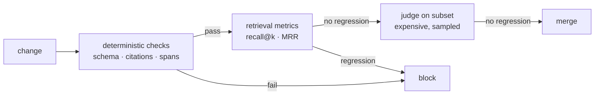

import { Tabs, TabItem } from '@astrojs/starlight/components';
import { Quiz } from '../../../components/mdx/Quiz.tsx';

## Intuition

Every other page in this section describes a change you might make: retrieve
differently, chunk differently, rerank, change the prompt, change the model.
**Evaluation is what tells you whether the change helped**, and without it none
of the others are engineering — they are guessing with extra steps.

This is unusually true for LLM systems, for a specific reason. Traditional
software is mostly deterministic: a change either breaks the test or it does
not. Here, output varies run to run, "correct" is often a judgement, and the
failure modes are subtle enough that a change can improve the three examples you
looked at while degrading the distribution.

The trap has a recognisable shape. You look at a handful of outputs, tweak
something, look again, and it seems better. That is not measurement — it is
sampling bias with a feedback loop. **Human spot-checking systematically
overestimates improvement**, because you are checking the cases you just thought
about.

### The three questions worth separating

Most confusion in this area comes from mixing these up:

1. **Is retrieval finding the right material?** Measurable objectively, cheaply,
   with no model involved.
2. **Is the generation faithful to what it was given?** Partly automatable —
   citations, spans, schema.
3. **Is the answer good?** Genuinely a judgement, and the expensive one.

Answer them in that order. A team debugging question 3 when the problem is
question 1 is the most common and most expensive failure in this field, and it
is entirely avoidable.

## Mechanics

### Start with a golden set

Fifty labelled examples beat a sophisticated framework with nothing in it.

The critical property is **provenance**: examples must come from real usage, not
from imagination. A set you invented tests the failures you can think of, which
are by definition not the ones catching you out.

<Tabs syncKey="lang">
<TabItem label="Python">

```python
from dataclasses import dataclass, field

@dataclass
class Case:
    id: str
    question: str
    # For retrieval: which chunks SHOULD come back. This is what lets you score
    # retrieval without involving the generator at all.
    expected_chunks: list[str]
    # For generation: facts that must appear, and facts that must not.
    must_contain: list[str] = field(default_factory=list)
    must_not_contain: list[str] = field(default_factory=list)
    # Why this case is in the set. Six months from now, a failing case with no
    # provenance gets deleted by someone who assumes it was arbitrary.
    origin: str = ""
```

</TabItem>
<TabItem label="TypeScript">

```typescript
interface Case {
  id: string;
  question: string;
  expectedChunks: string[];
  mustContain?: string[];
  mustNotContain?: string[];
  /** Why this case exists — a ticket id, an incident, a reported failure. */
  origin: string;
}
```

</TabItem>
</Tabs>

The `origin` field looks like bookkeeping and is not. A test that fails a year
later, with no record of why it exists, gets deleted by someone who assumes it
was arbitrary — and that is how a regression set decays into nothing.

**Where cases come from, in order of value:** production failures, user reports,
edge cases found during development, and only then invented ones.

### Score retrieval first — no model required

This is the cheapest, most objective, and most-skipped measurement.

<Tabs syncKey="lang">
<TabItem label="Python">

```python
def recall_at_k(cases, retrieve, k=5) -> float:
    """Fraction of cases where at least one expected chunk is in the top k."""
    hits = 0
    for case in cases:
        got = {chunk.id for chunk in retrieve(case.question, k=k)}
        if got & set(case.expected_chunks):
            hits += 1
    return hits / len(cases)

def mrr(cases, retrieve, k=10) -> float:
    """Mean reciprocal rank — rewards putting the right chunk FIRST.

    recall@k treats rank 1 and rank 5 identically, but the generator does not:
    material at the top of the context is used more reliably than material
    buried in it. MRR is what tells you whether reranking is working.
    """
    total = 0.0
    for case in cases:
        expected = set(case.expected_chunks)
        for rank, chunk in enumerate(retrieve(case.question, k=k), start=1):
            if chunk.id in expected:
                total += 1 / rank
                break
    return total / len(cases)
```

</TabItem>
<TabItem label="TypeScript">

```typescript
function recallAtK(cases: Case[], retrieve: Retrieve, k = 5): number {
  const hits = cases.filter((c) => {
    const got = new Set(retrieve(c.question, k).map((chunk) => chunk.id));
    return c.expectedChunks.some((id) => got.has(id));
  });
  return hits.length / cases.length;
}
```

</TabItem>
</Tabs>

Two metrics, two different questions. **Recall@k** asks whether the material is
present at all — if this is low, nothing downstream can help. **MRR** asks
whether it is near the top, which is what reranking exists to improve and what
lost-in-the-middle makes matter.

### Deterministic checks before probabilistic ones

Before reaching for a judge model, exhaust what code can decide:

| Check | Catches | Cost |
|---|---|---|
| Schema validation | Malformed output | Free |
| Cited id was in context | Fabricated sources | Free |
| Quoted span appears verbatim | Misattributed claims | Free |
| `must_contain` / `must_not_contain` | Known-required facts | Free |
| Exact refusal string | Ungrounded answering | Free |
| Output length bounds | Rambling, truncation | Free |

These are fast, reproducible, and they never disagree with themselves. Teams
routinely skip straight to an LLM judge and end up with an expensive,
noisy measurement of things a regex could have decided.

### LLM-as-judge, and its biases

For the genuinely subjective residue, a model can grade. It works, and it has
well-documented biases you must design against:

- **Position bias.** In a pairwise comparison, the first option is favoured.
  *Fix: run both orders and keep only consistent verdicts.*
- **Length bias.** Longer answers score higher, independent of quality.
  *Fix: control for length, or compare answers of similar length.*
- **Self-preference.** A model rates its own family's output higher.
  *Fix: use a different model as judge than as generator.*
- **Fluency bias.** Confident prose scores well — which is exactly the failure
  mode you are trying to catch. *Fix: require the judge to cite the specific
  criterion violated, not a global impression.*

<Tabs syncKey="lang">
<TabItem label="Python">

```python
RUBRIC = """
Score the answer 1-5 against the source documents ONLY.

5 — every claim supported by a cited document
4 — supported, minor unsupported detail
3 — mostly supported, one unsupported claim
2 — several unsupported claims
1 — contradicts the documents, or invents a source

Output JSON: {"score": int, "unsupported_claims": [str]}
Do not reward fluency or length. Judge support, nothing else.
"""

def judge(answer, documents, ask) -> dict:
    # Pairwise? Run both orders and discard inconsistent verdicts — that is the
    # only cheap defence against position bias, and it also gives you a free
    # reliability signal: a high inconsistency rate means the rubric is vague.
    return ask(RUBRIC, answer=answer, documents=documents, temperature=0)
```

</TabItem>
<TabItem label="TypeScript">

```typescript
const RUBRIC = `Score 1-5 against the source documents ONLY.
Output JSON: {"score": number, "unsupported_claims": string[]}
Do not reward fluency or length.`;
```

</TabItem>
</Tabs>

Requiring `unsupported_claims` rather than a bare score is the single most
useful design choice here: it forces the judge to point at something specific,
which both improves its accuracy and gives you something to read when you
disagree with it.

**Validate the judge against humans.** Grade 50 cases by hand, compare, and
measure agreement. A judge that agrees with humans 60% of the time is noise
dressed as a metric. Re-validate when you change the rubric or the judge model.

### Wire it into CI



Cheap and deterministic first, expensive and probabilistic last — the same
principle as any other test pyramid. See
[testing](/cs-fundamentals/5-systems/testing/) for the general version.

## Cost & limits

### What an evaluation run costs

For a 200-case set:

| Stage | Model calls | Relative cost |
|---|---|---|
| Deterministic checks | 0 | ~0 |
| Retrieval metrics | 0 (embedding only) | very low |
| Generation | 200 | 1× |
| LLM judge | 200 | ~1× again |
| Pairwise, both orders | 400 | ~2× |

Running the full suite on every commit gets expensive fast. A workable split:
deterministic checks on every commit, full generation and judging nightly and
before release.

### Statistical significance, briefly

With 50 cases, a change from 82% to 86% is **not** a result. The standard error
on a proportion is roughly:

$$
\text{SE} = \sqrt{\frac{p(1-p)}{n}}
$$

At $p = 0.84$, $n = 50$: $\text{SE} \approx 5.2\%$. A 4-point move is well inside
the noise.

| Cases | SE at p≈0.85 | Detectable difference (~2 SE) |
|---|---|---|
| 50 | 5.0% | ~10 points |
| 200 | 2.5% | ~5 points |
| 1,000 | 1.1% | ~2 points |

**Practical consequence:** with a small set, only believe large moves. And use
**paired** comparison — run both variants on the same cases and count how many
individually changed — which is far more sensitive than comparing two aggregate
percentages.

### Set size in practice

- **20-50 cases** — enough to catch outright breakage. Start here today.
- **100-200** — enough to compare prompts and models with some confidence.
- **500+** — enough to detect small regressions; usually needs synthetic
  augmentation or real traffic sampling to reach.

<aside class="dated-figure">

**Not verified from here.** Public benchmark scores are not quoted on this page
deliberately: they measure a different distribution from yours, are frequently
contaminated by training data, and age within months. The arithmetic above holds
regardless. The only score that governs your system is the one from your set.

</aside>

## When NOT to use it

**Do not build an evaluation framework before you have cases.** The most common
form of this mistake is a week spent on harness code with twelve invented
examples in it. Fifty real cases in a CSV and a twenty-line script beats it
comprehensively.

**Do not use an LLM judge for what code can decide.** Schema validity, citation
presence, exact-match fields, forbidden strings — all deterministic. Paying a
model to check them adds cost and noise.

**Do not trust public benchmarks for your decision.** They measure a different
distribution, they leak into training data, and the ranking they produce
frequently disagrees with the ranking on your task. Use them to shortlist, never
to choose.

**Do not evaluate end-to-end when a component regressed.** An aggregate score
that dropped tells you something is wrong; it does not tell you what. Component
metrics — retrieval separately from generation — are what make a regression
actionable.

**Do not gate on a metric you have not validated.** A judge that has never been
compared against human grades is not a quality gate; it is a random number
generator with a rubric.

## Real-world usage

- **Pre-release regression gates.** The full set runs before a prompt or model
  change ships. This is the primary use and it is what stops quality drifting
  downward one well-intentioned fix at a time.
- **Model migration.** Same set, both models, paired comparison. The only honest
  way to answer "is the new model better *for us*".
- **Retrieval tuning.** Chunk size, `k`, hybrid weighting, reranker on or off —
  all scored on recall@k and MRR with no generation involved, which makes the
  loop fast and cheap.
- **Production sampling.** Score a small random sample of live traffic
  continuously. This is how you detect drift that a fixed set cannot see,
  because the input distribution moves.
- **Incident response.** A reported failure becomes a case, the case reproduces
  the bug, and the fix is verified against it. Then it stays in the set forever.

## Failure modes

### The set that only contains solved problems

**Symptom:** the evaluation set is at 98% and production complaints continue.

**Cause:** cases were added when they were fixed, so the set is a record of past
successes. It has no power to detect anything new.

**Fix:** add cases from production continuously, especially unresolved ones. A
healthy set has failing cases in it — those are the backlog. A set at 100% is
measuring nothing.

### Overfitting to the evaluation set

**Symptom:** scores climb steadily; users do not agree.

**Cause:** iterating against the same 50 examples eventually tunes the prompt to
those examples specifically.

**Fix:** hold out a test set that is used only to confirm a decision, never to
iterate. Rotate in fresh production cases regularly.

### Judge drift

**Symptom:** scores shift with no change to the system.

**Cause:** the judge model was updated by the provider, or the rubric was edited.

**Fix:** pin the judge model version. Version the rubric alongside the code. Keep
a small set of human-graded anchors and re-check agreement whenever either
changes.

### Averaging away the failures that matter

**Symptom:** an aggregate score looks fine while a specific class of query fails
consistently.

**Cause:** the mean hides the distribution. 90% overall can be 99% on the
frequent cases and 20% on a category that matters.

**Fix:** slice by category, source, question type and length. Report the worst
slice alongside the mean — that is the number that predicts complaints.

### Measuring the wrong half

**Symptom:** weeks spent tuning prompts with no improvement.

**Cause:** the failure was in retrieval, and end-to-end scoring cannot
distinguish the two.

**Fix:** measure retrieval independently, first, always. It is cheap and it is
the fastest way to avoid the most expensive mistake in this field.

## Practice problems

**1. Is this an improvement?**

A prompt change moves a 50-case evaluation from 82% to 88%. Ship it?

<details>
<summary>Solution</summary>

Not on this evidence.

$\text{SE} = \sqrt{0.85 \times 0.15 / 50} \approx 5\%$. A 6-point move is
roughly one standard error — comfortably inside the noise. Three cases changed.

**What to do instead:**

1. **Paired analysis.** Run both variants on the same 50 cases and count
   individual changes. If it is +5/−2, that is a weak signal; if it is +6/−0,
   that is much stronger evidence from the same data, because pairing removes
   case-to-case variance.
2. **Look at the changes.** Three cases is few enough to read. Did they improve
   for the reason you intended, or coincidentally?
3. **Check the slices.** A gain concentrated in one category and a loss in
   another is a different decision from a uniform gain.
4. **Enlarge the set** if this class of change matters. Detecting 5-point moves
   needs ~200 cases.

**The trap to avoid:** shipping it because the number went up, then shipping the
next change the same way. Ten such decisions and you have drifted somewhere
nobody chose, with a metric that says everything is fine.

</details>

**2. The judge that grades fluency.**

An LLM judge scores RAG answers 1-5. Verbose, confident answers score 4-5 even
when unsupported; correct terse answers score 3. Fix it.

<details>
<summary>Solution</summary>

Length bias and fluency bias, and the rubric is inviting both by asking for a
global impression.

**Fix the rubric first — most of the problem is there.**

1. **Score one specific thing.** Not "how good is this answer" but "is every
   claim supported by a cited document". Global quality invites the model to use
   fluency as a proxy.
2. **Require evidence.** Make the judge output `unsupported_claims: [...]`
   alongside the score. It must point at something specific, which both improves
   accuracy and lets you audit disagreements.
3. **State the anti-criterion explicitly.** "Do not reward length or
   confidence." Weak on its own, useful in combination.
4. **Decompose.** Score faithfulness, completeness and conciseness separately.
   The aggregate was hiding that they disagree.

**Then validate.** Hand-grade 50 cases and measure agreement with the judge. If
agreement is poor, the rubric is still wrong — iterate on the rubric against the
human grades, which is the actual work here.

**Structural fixes on top:** use a different model family as judge than as
generator, to remove self-preference. For pairwise comparisons, run both orders
and discard inconsistent verdicts — the inconsistency rate is itself a free
reliability metric.

</details>

**3. Design the evaluation for a support bot.**

A RAG bot answers from a 4,000-document knowledge base. Complaints: sometimes
wrong, sometimes says "I do not know" when the answer exists. Design the
evaluation.

<details>
<summary>Solution</summary>

Two complaints, two different failure modes, and they need different metrics —
noticing that is most of the answer.

**Build the set from the complaints, not from imagination.** 100 real questions,
each labelled with the chunk ids that contain the answer, and a `should_answer`
boolean (some questions genuinely have no answer in the corpus; the bot should
refuse those).

**Then measure three layers:**

*Retrieval* — recall@5 and MRR. **This is where "says I do not know" almost
certainly lives**: the chunk was never retrieved, so refusing was correct
behaviour on the information available.

*Grounding* (deterministic, free) — cited ids were in the context; quoted spans
appear verbatim; the refusal string is exact.

*Answer quality* (judged, sampled) — faithfulness against the retrieved
documents, on a subset.

**And two rates that map directly to the two complaints:**

- **False refusal rate** — refused when `should_answer` was true. Driven by
  retrieval recall.
- **False answer rate** — answered when `should_answer` was false. Driven by
  grounding discipline.

These two trade off against each other, and making the trade explicit is the
point: tightening the refusal threshold reduces wrong answers and increases
unhelpful ones. That is a product decision, and it needs both numbers on the
table.

**Slice everything by document age and category.** "Wrong sometimes" is very
often "wrong about the newest documents", which is an indexing problem, not a
model problem — and the mean will never show you that.

</details>

<Quiz
  client:visible
  id="eval-significance"
  kind="concept"
  question="A 50-case evaluation moves from 82% to 88% after a prompt change. What is the right conclusion?"
  options={[
    { label: 'Inconclusive — that is about one standard error; use paired comparison and look at which cases changed', correct: true },
    { label: 'A clear 6-point improvement — ship it' },
    { label: 'A regression, since small evaluation sets systematically overestimate gains' },
    { label: 'Invalid, because prompt changes cannot be measured with fixed test sets' },
  ]}
>
  <Fragment slot="explanation">
    <p>
      The standard error of a proportion is{' '}
      <code>√(p(1−p)/n)</code>, which at p≈0.85 and n=50 is about 5 points. A
      6-point move is roughly one standard error — three cases changed — and is
      well inside what you would see from noise alone.
    </p>
    <p>
      The useful response is not "get more data" but "use the data better". A{' '}
      <strong>paired</strong> comparison — same cases, both variants, counting
      individual flips — removes case-to-case variance and is far more sensitive
      than comparing two aggregates. +6/−0 is meaningful evidence where +9/−6 is
      not, and both look like "+6%".
    </p>
    <p>
      Reading the three changed cases is also worth more than the percentage at
      this size. Did they improve for the reason you intended, or by coincidence?
    </p>
  </Fragment>
</Quiz>

<Quiz
  client:visible
  id="eval-order"
  kind="concept"
  question="You have limited time to build evaluation for a RAG system. What do you measure first?"
  options={[
    { label: 'Retrieval, with recall@k against known-correct chunks — it is objective, needs no model, and rules out the most expensive misdiagnosis', correct: true },
    { label: 'End-to-end answer quality with an LLM judge, since that is what users experience' },
    { label: 'Public benchmark scores for the model you chose' },
    { label: 'Latency and cost per request, since those are the easiest to measure reliably' },
  ]}
>
  <Fragment slot="explanation">
    <p>
      Retrieval is measurable objectively, cheaply, and without invoking a model
      at all — you need only a set of questions with known source chunks. And it
      is the first thing to rule out, because if the right chunk never arrives,
      no amount of prompt work can recover it.
    </p>
    <p>
      End-to-end judging is what users experience, but it conflates two failure
      modes with completely different fixes. A dropped aggregate score tells you
      something is wrong and not what — which is how teams end up spending weeks
      tuning prompts against a retrieval bug.
    </p>
    <p>
      Public benchmarks measure a different distribution from yours and are
      frequently contaminated by training data; useful for shortlisting, never
      for deciding. Latency and cost are worth tracking and answer a different
      question entirely.
    </p>
  </Fragment>
</Quiz>

## Interview answers

**"How do you evaluate an LLM feature?"**

> I start with a golden set of real cases — from production failures and user
> reports, not invented ones — because a set I imagined tests the failures I can
> think of, which are by definition not the ones catching us out. Fifty cases in
> a CSV beats a framework with twelve made-up examples.
>
> Then I measure in layers, cheapest first. Retrieval on its own with recall@k
> and MRR, which needs no model. Deterministic checks — schema, citations,
> quoted spans. And only the genuinely subjective residue goes to a judge model.
>
> The most important structural decision is measuring retrieval separately from
> generation. "Bad answer" has two causes with different fixes and they are
> indistinguishable end to end.

**"How do you use an LLM as a judge without fooling yourself?"**

> Validate it against humans first — hand-grade fifty cases and measure
> agreement. A judge nobody has checked is a random number generator with a
> rubric.
>
> Then design against the known biases. Position bias, so run pairwise
> comparisons in both orders and discard inconsistent verdicts. Length and
> fluency bias, so score one specific criterion rather than global quality, and
> require the judge to name the claim it objected to. Self-preference, so use a
> different model family as judge than as generator.
>
> And pin the judge's model version. Otherwise a provider update moves your
> scores and you will spend a day looking for a change you did not make.

**"A prompt change improved your eval from 82% to 88%. Ship it?"**

> Not on that alone. At fifty cases the standard error is about five points, so
> that is roughly one — three cases moved.
>
> I would run it paired: same cases, both variants, count which individually
> flipped. That removes case-to-case variance and is much more sensitive, and
> +6/−0 tells a very different story from +9/−6 even though both show "+6%". At
> fifty cases I would also just read the three that changed, and check the
> slices — a gain in one category and a loss in another is a different decision
> from a uniform gain.

**The caveats worth voicing:**

- A set at 100% is measuring nothing. Healthy sets contain failing cases.
- Hold out a test set you never iterate against, or you will overfit the
  fifty examples you keep looking at.
- Report the worst slice next to the mean; the mean hides the category that
  generates complaints.
- Record why each case exists, or someone deletes it in a year.
- Public benchmarks shortlist models. They do not choose them.
