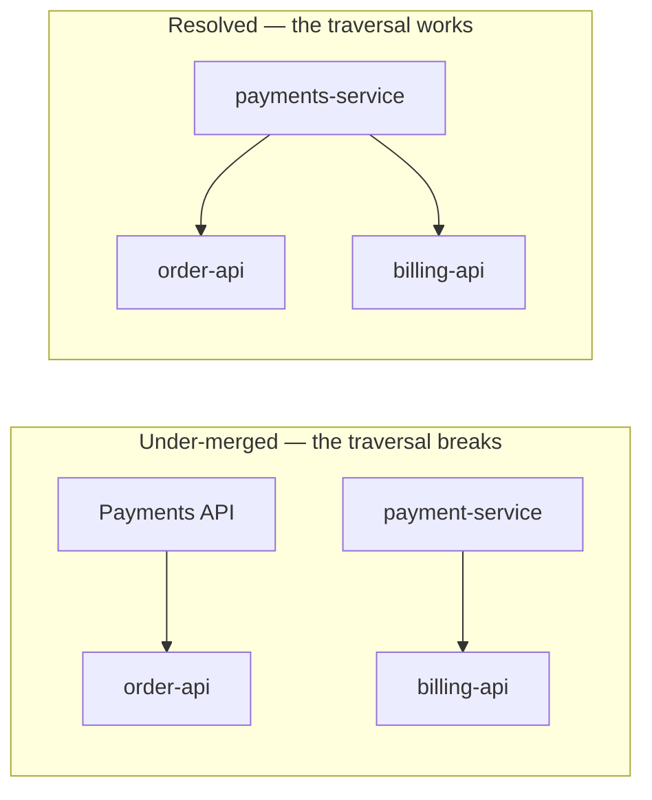
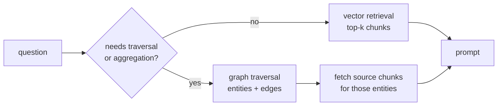

import { Tabs, TabItem } from '@astrojs/starlight/components';
import { Quiz } from '../../../components/mdx/Quiz.tsx';

## Intuition

Vector retrieval answers "what text is about this?" A knowledge graph answers
"what is connected to what?"

Those sound similar and they fail on completely different questions. The
distinction is sharpest with an example:

> *"Which of our customers are affected by the outage in the payments service?"*

Embedding search retrieves documents that *talk about* customers, payments and
outages. It cannot traverse `payments-service → hosts → order-api →
used-by → customer`, because that path is a structure, not a topic. No chunk
contains the answer, so no retrieval over chunks can find it.

The graph framing:

- **Entities** are nodes — a service, a customer, a person, a policy.
- **Relationships** are edges — `depends_on`, `owns`, `supersedes`,
  `reports_to`.
- The answer is a **traversal**, and traversal is something a vector index
  cannot do at all.

You already have the machinery for this from
[graphs](/cs-fundamentals/2-data-structures/graphs/); what is new is where the
nodes and edges come from, and whether extracting them is worth the cost.

### The three questions a graph is for

1. **Multi-hop.** "Which teams own services that depend on the library with the
   CVE?" Two hops, and no single document contains it.
2. **Aggregation over structure.** "How many customers does this outage affect?"
   Counting requires the structure, not a summary of it.
3. **Global questions.** "What are the main themes across 10,000 reviews?" A
   top-k retrieval samples five; the question is about all of them.

If your questions are none of these — and most support and documentation
questions are not — **you do not need a graph**, and building one is a large
project for no gain.

## Mechanics

### Building the graph

Two sources of edges, with very different cost and reliability.

**Structured data you already have** is nearly free and nearly correct: a service
catalogue, an org chart, a dependency manifest, foreign keys in your database.
**Start here.** It is under-exploited precisely because it is not exciting.

**Extraction from text** is expensive and noisy:

<Tabs syncKey="lang">
<TabItem label="Python">

```python
EXTRACTION = """
Extract entities and relationships from the text.

Entity types: Service, Team, Person, Customer, Incident
Relationship types: DEPENDS_ON, OWNS, AFFECTS, REPORTS_TO

Rules:
- Use the exact name as written; do not normalise or expand abbreviations.
- Only extract relationships the text states. Do not infer.
- Output JSON: {"entities": [...], "relationships": [...]}
"""

def extract(chunk: str) -> Graph:
    result = model.complete(EXTRACTION, chunk, schema=GraphSchema)
    # Provenance on every edge. Without it the graph is a set of assertions
    # nobody can verify, and a wrong edge is undebuggable — you cannot tell
    # whether the source said it or the model invented it.
    for rel in result.relationships:
        rel.source_chunk = chunk.id
        rel.confidence = result.confidence
    return result
```

</TabItem>
</Tabs>

**"Do not normalise" is deliberate**, and counter-intuitive. Let extraction be
literal and resolve entities in a separate, auditable step. A model asked to
normalise inline will silently merge "Payments API" and "payment-service"
sometimes and not others, and you will never find out which.

### Entity resolution is the hard part

`Payments API`, `payments-api`, `payment service`, `PaymentsAPI` — one entity or
four? Getting this wrong destroys the graph in one of two ways: over-merging
creates false edges, under-merging fragments the answer.



The layered approach, cheapest first:

1. **Exact match on a canonical id** where one exists — a service catalogue id, a
   customer id. Free and correct. Use it wherever you can.
2. **Normalised string match** — lowercase, strip punctuation and common
   suffixes.
3. **Embedding similarity** above a threshold, as a *candidate generator* only.
4. **Human review** for the ambiguous middle, especially for high-degree nodes
   where a wrong merge propagates furthest.

**Never auto-merge on embedding similarity alone.** "Payments API" and "Payouts
API" are semantically close and operationally distinct, and merging them produces
a graph that is confidently wrong in a way no query will reveal.

### Querying

<Tabs syncKey="lang">
<TabItem label="SQL">

```sql
-- Recursive CTE — you do not need a graph database for a graph. Postgres does
-- multi-hop traversal perfectly well at modest scale, with transactions,
-- backups and joins to your relational data included.
WITH RECURSIVE affected AS (
  SELECT id, name, 0 AS depth
  FROM services WHERE name = 'payments-service'

  UNION ALL

  SELECT s.id, s.name, a.depth + 1
  FROM affected a
  JOIN dependencies d ON d.depends_on_id = a.id
  JOIN services s     ON s.id = d.service_id
  WHERE a.depth < 4          -- bound it, or a dependency cycle runs forever
)
SELECT DISTINCT c.name
FROM affected a
JOIN customer_services cs ON cs.service_id = a.id
JOIN customers c          ON c.id = cs.customer_id;
```

</TabItem>
<TabItem label="Python">

```python
# The same traversal as breadth-first search, which is all it is. See
# /cs-fundamentals/2-data-structures/graphs/ for the general version.
def affected_customers(graph, start: str, max_depth: int = 4) -> set[str]:
    seen, frontier, customers = {start}, [start], set()

    for _ in range(max_depth):
        nxt = []
        for node in frontier:
            for neighbour in graph.dependents(node):
                if neighbour in seen:      # cycles are common in dependency
                    continue               # graphs and will hang you
                seen.add(neighbour)
                nxt.append(neighbour)
                customers.update(graph.customers_of(neighbour))
        frontier = nxt
        if not frontier:
            break

    return customers
```

</TabItem>
</Tabs>

**The depth bound is not optional.** Real dependency graphs contain cycles, and
an unbounded traversal hangs. It also bounds the result size, which matters
because a four-hop traversal on a dense graph can return most of the estate.

### GraphRAG: use both

The productive pattern combines them rather than choosing:



The graph finds *which* entities matter; the vector store supplies the *text*
about them. Passing raw triples to the model reads poorly and loses nuance —
retrieving the source chunks for the entities the traversal found is the version
that works.

## Cost & limits

### Extraction dominates

For 100,000 chunks:

| Stage | Cost driver |
|---|---|
| Embedding for vector RAG | one cheap call per chunk |
| **Entity/relationship extraction** | **one full model call per chunk** |
| Entity resolution | pairwise comparison, plus human review |
| Graph storage | small — edges are tiny |
| Re-extraction on document change | the same again |

**Graph construction is roughly two orders of magnitude more expensive than
embedding the same corpus**, because extraction needs a capable model on every
chunk while embedding needs a cheap one. That ratio, plus the human review for
entity resolution, is what decides most build-or-not decisions.

### Quality compounds downward

Two independent error rates multiply along a path:

- Extraction: some relationships are missed, some invented.
- Resolution: some entities wrongly merged or split.

A two-hop traversal needs both edges correct. If each is 90% reliable, the path
is 81%; three hops is 73%. **Deep traversals over extracted graphs are
unreliable by construction**, which is the strongest argument for extracting
from structured sources where you can, and for keeping traversals shallow where
you cannot.

### You probably do not need a graph database

| | Postgres recursive CTE | Neo4j / graph DB |
|---|---|---|
| Setup | none — you have it | a new datastore |
| Joins to relational data | native | export/import |
| Traversal depth | fine to ~4-6 hops | better beyond |
| Ops burden | zero extra | real |
| Very deep or dense traversal | degrades | designed for it |

Start with recursive CTEs. **Adopt a graph database when traversal depth or
density genuinely demands it**, not at the start — the second datastore is a real
operational cost and most graphs are shallow.

<aside class="dated-figure">

**Not verified from here.** The "two orders of magnitude" figure follows from the
structural difference between one embedding call and one full completion per
chunk, not from a benchmark; the ratio depends on model choice. The reliability
arithmetic is arithmetic.

</aside>

## When NOT to use it

**When the questions are single-hop.** "What is the refund policy?" is answered
by a document. Most support and documentation questions are like this, and a
graph adds enormous cost for nothing.

**When the structure already exists in a database.** If services and dependencies
are already rows with foreign keys, you have a graph — query it. Extracting the
same facts from prose with an LLM is a way to make correct data noisy.

**When entity resolution is intractable.** If entity names are inconsistent and
there is no canonical id, the graph will be a mess of near-duplicates. Fix the
naming first; that is a data-governance project and it is the actual work.

**When the corpus changes constantly.** Re-extraction is expensive, and a stale
graph produces confidently wrong traversals — the same failure as stale
documents, with more leverage.

**Before vector RAG has been tried.** Graphs are the more complex tool. Establish
that the questions genuinely need traversal before taking on extraction and
resolution.

## Real-world usage

- **Dependency and impact analysis** — the strongest case, and usually built from
  a service catalogue rather than extraction. "What breaks if this fails?"
- **Customer 360** — linking accounts, tickets, orders and interactions that live
  in separate systems. Structured sources, minimal extraction.
- **Compliance and lineage** — which reports depend on which tables, which
  depend on which sources. Regulators ask multi-hop questions.
- **Drug discovery and research literature** — the canonical extraction case,
  where the relationships genuinely live in prose and nowhere else.
- **Fraud rings** — detecting shared addresses, devices and payment methods
  across accounts. A pure structure question that no text search answers.
- **GraphRAG over documentation** — entities from headings and code references,
  used to expand retrieval to related pages.

## Failure modes

### Entity fragmentation

**Symptom:** traversals return incomplete results, and the missing edges look
arbitrary.

**Cause:** the same entity exists under several names, so the path is broken.

**Fix:** canonical ids wherever possible; layered resolution with human review
for the ambiguous middle. Monitor the count of near-duplicate entity names as a
health metric.

### Over-merging

**Symptom:** confidently wrong traversals — results include things that are not
actually connected.

**Cause:** embedding-similarity auto-merge joined two distinct entities.

**Fix:** never auto-merge on similarity alone. Require a canonical id match or
human confirmation, and be strictest about high-degree nodes where the error
propagates furthest.

### Hallucinated relationships

**Symptom:** an edge in the graph that nothing in the source supports.

**Cause:** extraction inferred rather than extracted, especially with a prompt
that encouraged completeness.

**Fix:** provenance on every edge — source chunk and quoted span — and a
verification pass asserting the span exists. Instruct against inference
explicitly.

### The stale graph

**Symptom:** traversals reflect an architecture that changed months ago.

**Cause:** extraction ran once. Nothing re-runs on document change.

**Fix:** incremental re-extraction on change, with the graph carrying an
`as_of` timestamp so consumers can see its age.

### Traversals that return everything

**Symptom:** a four-hop query returns most of the estate.

**Cause:** a dense graph with hub nodes — a shared library everything depends on.

**Fix:** bound depth, exclude or specially handle hub nodes above a degree
threshold, and weight edges so traversal prefers strong relationships.

### The graph nobody queries

**Symptom:** it was built, it is maintained, and no feature uses it.

**Cause:** it was built before establishing that the questions needed traversal.

**Fix:** the question audit first. Collect real questions and classify them —
single-hop, multi-hop, aggregate. If under 10% need traversal, the graph is not
the project.

## Practice problems

**1. Graph or vectors?**

Classify each and justify.

- (a) "What is our data retention policy for audit logs?"
- (b) "Which customers use services that depend on the library with CVE-2026-1234?"
- (c) "Summarise the main complaints in last quarter's 4,000 support tickets."

<details>
<summary>Solution</summary>

**(a) Vectors. Single-hop.** The answer is a sentence in one document. Retrieval
returns the chunk and the model answers. A graph adds nothing — there is no
traversal, and building one to answer this would be a large project for a
solved problem.

**(b) Graph, and specifically from structured data.** Three hops:
`CVE → library → services → customers`. No document contains this, so no chunk
retrieval can find it however good the embeddings are.

The important detail: **do not extract this from prose.** The dependency data is
almost certainly already structured — package manifests, a service catalogue, a
customer-entitlement table. That is a recursive CTE over tables you have, and it
is both cheaper and far more reliable than LLM extraction. This is the most
common missed opportunity in graph projects.

**(c) Neither, as usually built.** This is a *global* question, and top-k
retrieval samples five tickets out of 4,000 — answering a question about the
whole corpus from a biased sample.

The right shape is map-reduce: classify or summarise every ticket (cheap model,
parallel), aggregate the categories, then summarise the aggregation. Deterministic
counts, complete coverage.

This is what GraphRAG's community-summarisation is for, and it is worth noting
that a `GROUP BY` over classified tickets achieves the same thing at a fraction
of the cost. Reach for the simple version first.

</details>

**2. Fix the resolution.**

An extracted graph has entities: `Payments API`, `payments-api`, `Payment
Service`, `PaymentsAPI`, `Payouts API`, `payouts-service`. Design the resolution
and say what could go wrong.

<details>
<summary>Solution</summary>

Two real entities across six names, and the trap is right there in the list.

**Layered, cheapest and safest first:**

1. **Canonical id.** If a service catalogue exists, match against it. Free,
   correct, and it is the answer whenever available — which is more often than
   teams assume.
2. **Normalisation.** Lowercase, strip punctuation, strip suffixes
   (`api`, `service`, `svc`). That collapses `Payments API` / `payments-api` /
   `Payment Service` / `PaymentsAPI` → `payment`, and `Payouts API` /
   `payouts-service` → `payout`.
3. **Embedding similarity** to *propose* remaining merges — never to apply them.
4. **Human review** of proposals, prioritised by node degree, since a wrong merge
   on a high-degree node corrupts the most paths.

**What could go wrong, and it is the whole point of the exercise:**

**`Payments` and `Payouts` are semantically very close and operationally
distinct.** An embedding-similarity threshold loose enough to catch
`Payment Service` ↔ `payments-api` is very likely loose enough to merge payments
with payouts. That produces a graph that is confidently wrong: traversals return
customers affected by an outage that never touched them, and **no query will
reveal the error** — the graph looks healthy.

Stemming has the same risk from the other direction: an aggressive stemmer maps
both to `pay`.

**So: normalisation and canonical ids can auto-apply. Similarity proposes and a
human decides.** The asymmetry is deliberate — under-merging degrades results
visibly (missing edges, incomplete answers), over-merging corrupts them
invisibly.

**Monitor afterwards:** count of entities whose normalised names are within a
small edit distance. A rising count means new naming variants are appearing and
resolution is drifting.

</details>

**3. Budget the build.**

50,000 documents, ~200,000 chunks. You are considering a knowledge graph.
Estimate the cost drivers and say what you would do first.

<details>
<summary>Solution</summary>

**The cost drivers, in order:**

1. **Extraction: 200,000 full model calls.** Not embeddings — a capable model per
   chunk, because extraction is a reasoning task. This is roughly two orders of
   magnitude above embedding the same corpus, and it dominates everything else.
2. **Entity resolution**, including human review of the ambiguous middle. Days of
   attention, and it recurs as the corpus grows.
3. **Re-extraction on change**, which is the ongoing cost people omit from the
   business case entirely.
4. **Storage: negligible.** Edges are tiny.

**What I would do first, and it is not building:**

**Audit the questions.** Collect 100 real questions and classify them: single-hop,
multi-hop, or aggregate. If fewer than 10% need traversal, the graph is not the
project — and that finding takes a day.

**Then, if traversal questions are real, check for structured sources.** The
multi-hop questions usually concern services, teams, customers or dependencies —
entities that already exist as rows with foreign keys. Building that graph is a
few recursive CTEs, it is exact rather than extracted, and it costs almost
nothing. **This alone resolves a large share of graph projects**, and it is
skipped because it does not look like AI work.

**Only if the relationships genuinely live in prose** — research literature,
contracts, incident write-ups — does extraction become necessary. Then scope it:
extract from the 5,000 documents that matter rather than all 50,000, and measure
edge precision against a hand-labelled sample before committing to the rest.

**The number that decides it:** extraction precision. At 90% per edge, a two-hop
traversal is 81% reliable and three hops is 73%. If your questions need three
hops over extracted edges, the answers will be wrong a quarter of the time — and
that may disqualify the approach regardless of budget.

</details>

<Quiz
  client:visible
  id="kg-when"
  kind="concept"
  question="Which question genuinely requires a knowledge graph rather than vector retrieval?"
  options={[
    { label: '"Which customers use services that depend on the library with this CVE?"', correct: true },
    { label: '"What does our security policy say about password rotation?"' },
    { label: '"Find documents similar to this incident report."' },
    { label: '"Summarise the API authentication options."' },
  ]}
>
  <Fragment slot="explanation">
    <p>
      The first is a three-hop traversal —{' '}
      <code>CVE → library → services → customers</code> — and crucially{' '}
      <em>no document contains the answer</em>. It exists only as a path through
      relationships, so retrieval over chunks cannot find it however good the
      embeddings are.
    </p>
    <p>
      The other three are single-hop: the answer sits in a document, and
      retrieving that document answers the question. Most support and
      documentation questions look like this, which is why graphs are far more
      often built than needed.
    </p>
    <p>
      The follow-on worth knowing: for this <em>particular</em> question the data
      is almost certainly already structured — package manifests, a service
      catalogue, an entitlements table. That makes it a recursive CTE over tables
      you have, which is cheaper and far more reliable than extracting the same
      facts from prose with a model.
    </p>
  </Fragment>
</Quiz>

<Quiz
  client:visible
  id="kg-merge"
  kind="concept"
  question="Why should entity resolution never auto-merge on embedding similarity alone?"
  options={[
    { label: 'Distinct entities can be semantically very close — merging "Payments API" with "Payouts API" corrupts traversals invisibly', correct: true },
    { label: 'Embedding similarity is too slow to run across all entity pairs' },
    { label: 'Embeddings cannot represent short strings like entity names' },
    { label: 'It would merge too few entities, leaving the graph fragmented' },
  ]}
>
  <Fragment slot="explanation">
    <p>
      A threshold loose enough to merge "Payment Service" with "payments-api" is
      very likely loose enough to merge "Payments" with "Payouts" — names that
      are semantically adjacent and operationally distinct. The resulting graph
      reports customers affected by an outage that never touched them.
    </p>
    <p>
      What makes this the worst kind of bug is the asymmetry. Under-merging fails{' '}
      <em>visibly</em>: traversals return incomplete results and someone notices.
      Over-merging fails <em>invisibly</em>: the graph looks healthy, queries
      succeed, and the answers are wrong with no signal.
    </p>
    <p>
      So similarity proposes and something authoritative decides — a canonical id
      match, or human review prioritised by node degree, since a wrong merge on a
      high-degree node corrupts the most paths.
    </p>
  </Fragment>
</Quiz>

## Interview answers

**"When would you use a knowledge graph instead of vector search?"**

> When the question is about connections rather than content. "Which customers
> are affected by this outage" is a traversal — service to service to customer —
> and no document contains that path, so chunk retrieval cannot find it however
> good the embeddings are.
>
> Three shapes justify one: multi-hop questions, aggregation over structure, and
> global questions about a whole corpus. If the questions are single-hop, which
> most support and documentation questions are, a graph is a very large project
> for no gain.
>
> The thing I would push hardest on is checking for structured sources first.
> The multi-hop questions usually concern services, teams and dependencies that
> already exist as rows with foreign keys — that is a recursive CTE, exact rather
> than extracted, and nearly free. Extracting the same facts from prose with an
> LLM makes correct data noisy.

**"What is the hardest part of building one?"**

> Entity resolution. Extraction gives you "Payments API", "payments-api" and
> "Payment Service" as three entities, and the graph is only as good as your
> ability to know they are one.
>
> I layer it: canonical ids where they exist, then normalisation, then embedding
> similarity as a *candidate generator* only, then human review for the
> ambiguous middle.
>
> The rule I would not bend is never auto-merging on similarity. "Payments" and
> "Payouts" are close and distinct, and the failure is asymmetric — under-merging
> gives visibly incomplete results, over-merging gives confidently wrong ones
> that no query reveals.

**"What are the limits of extracted graphs?"**

> Error rates compound along a path. Extraction misses and invents some edges;
> resolution merges and splits some entities. If each edge is 90% reliable, a
> two-hop traversal is 81% and three hops is 73%.
>
> So deep traversals over extracted graphs are unreliable by construction. That
> pushes me hard toward structured sources wherever they exist, and toward
> keeping traversals shallow where they do not.
>
> And I would not reach for a graph database at the start. Postgres recursive
> CTEs handle four to six hops fine, with transactions, backups and joins to the
> relational data included. A second datastore is a real operational cost that
> should be earned.

**The caveats worth voicing:**

- Provenance on every edge — source chunk and span — or a wrong edge is
  undebuggable.
- Bound traversal depth. Dependency graphs have cycles and hub nodes.
- Extraction is roughly two orders of magnitude more expensive than embedding the
  same corpus.
- A stale graph produces confidently wrong traversals; budget re-extraction.
- Audit the questions before building. If under 10% need traversal, that is the
  answer.
