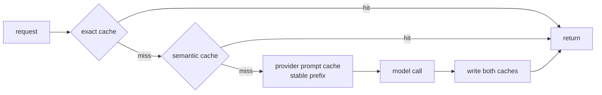
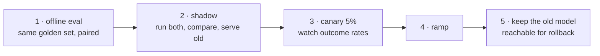

import { Tabs, TabItem } from '@astrojs/starlight/components';
import { Quiz } from '../../../components/mdx/Quiz.tsx';

## Intuition

Operating an LLM feature differs from operating a normal service in one way that
changes everything downstream:

> **The same input can produce a different output, and neither is an error.**

That breaks the usual toolkit. You cannot alert on a wrong answer, because
"wrong" is not a status code. You cannot reproduce a bug by replaying the
request, because the model may decide differently. You cannot diff two versions
by their outputs, because they differ anyway.

So the discipline shifts. Instead of catching failures, you **measure
distributions** — of cost, latency, refusal rate, retrieval recall, output
length — and watch for the shape changing. And instead of reproducing failures,
you **record them completely enough that reproduction is unnecessary**.

The three things that pay for themselves fastest, in order:

1. **Log the assembled prompt.** Not the template — the actual final string.
   Most "the model is wrong" reports turn out to be "the model was never shown
   the thing".
2. **Cache aggressively.** Cost and latency both, and it is the one lever with no
   quality trade-off.
3. **Track token usage per request**, attributed to a feature and a customer.
   Otherwise the bill is one number with no handle on it.

## Mechanics

### What to log

<Tabs syncKey="lang">
<TabItem label="Python">

```python
@dataclass
class LLMTrace:
    request_id: str
    feature: str                 # attribution — which feature spent this
    tenant_id: str | None

    model: str
    model_version: str           # a provider alias like "latest" moves under you
    temperature: float
    prompt_hash: str             # groups identical prompts across requests

    # The single most valuable field, and the most commonly omitted. Storage is
    # cheap; the alternative is guessing what the model was shown.
    prompt: str
    output: str

    input_tokens: int
    output_tokens: int
    cached_tokens: int           # cache hit rate is invisible without this
    stop_reason: str             # "max_tokens" is a silent failure

    latency_ms: int
    time_to_first_token_ms: int  # separates prompt processing from generation

    # Application-level outcome, not the API's. Did the JSON parse? Did the
    # citation check pass? Did the user accept the answer?
    outcome: Literal["ok", "invalid_output", "ungrounded", "refused", "error"]
```

</TabItem>
<TabItem label="TypeScript">

```typescript
interface LLMTrace {
  requestId: string;
  feature: string;
  tenantId?: string;
  model: string;
  modelVersion: string;
  promptHash: string;
  prompt: string;
  output: string;
  inputTokens: number;
  outputTokens: number;
  cachedTokens: number;
  stopReason: string;
  latencyMs: number;
  timeToFirstTokenMs: number;
  outcome: 'ok' | 'invalid_output' | 'ungrounded' | 'refused' | 'error';
}
```

</TabItem>
</Tabs>

Two fields carry more weight than the rest.

**`outcome` is application-level, not API-level.** The provider returns 200 for a
truncated answer, an ungrounded answer, and a refusal. Your system knows the
difference; the API does not. Without this field your dashboards show 100%
success while users complain.

**`prompt` in full.** Teams resist this for storage reasons and it is close to
always wrong. A few kilobytes per request buys the ability to answer "what was it
actually shown", which is the first question in every investigation.

The obvious caveat: prompts contain user data, so retention and access controls
apply to this table exactly as they do to the source data.

### The metrics that matter

| Metric | Watch for | Usually means |
|---|---|---|
| `stop_reason == max_tokens` rate | any rise | silent truncation |
| Refusal rate | rise | retrieval degraded |
| `invalid_output` rate | rise | model or prompt drift |
| Cache hit rate | fall | prompt prefix changed |
| Output token p50 | rise | cost creep, latency creep |
| Tokens per request per feature | rise | context bloat |
| Retrieval recall on a sample | fall | index staleness |

**Refusal rate is the most underrated.** It is a single cheap number that tracks
retrieval health, and it moves before users complain — because a refusal is what
a well-behaved system does when retrieval fails.

### Caching, in three layers



**Exact cache** — hash of `(prompt, model, version, temperature)`. Free, exact,
and on real support traffic the hit rate is usually far higher than teams expect,
because a few questions dominate.

**Semantic cache** — embed the question, return a cached answer if a previous one
is close enough. Real savings and **a real risk**: too loose a threshold serves a
confidently wrong answer to a question nobody asked. Calibrate it against
labelled pairs, and never enable it for personalised or time-sensitive answers.

**Provider prompt cache** — discounts a repeated prefix. Requires only correct
ordering, so it is the cheapest of the three to adopt. See
[context engineering](/cs-fundamentals/10-ai-engineering/context-engineering/).

The model-version component of the exact cache key is what saves you on upgrade
day: a version bump becomes a clean cache miss rather than silently serving
answers from the old model.

### Shipping a model change

A model upgrade is a **migration**, not a config change, and the reason is that
nothing fails when it goes wrong — quality just drops.



Shadow mode is the step usually skipped and the one that pays. Run both models on
real traffic, serve the incumbent, and store both outputs. You get a paired
comparison on your actual distribution — which is strictly better evidence than
any benchmark, and it costs a second call on a sampled fraction of traffic.

## Cost & limits

### Where the money goes

For a typical RAG feature at 100,000 requests/day, ~2,500 input and ~300 output
tokens:

| Line | Daily tokens | Share |
|---|---|---|
| Input (context) | 250M | ~89% |
| Output | 30M | ~11% |

Input dominates by volume — but output is priced several times higher per token,
so the **cost** split is much closer than the token split. Compute both before
optimising, because the two point at different fixes.

The levers, in order of effect per unit of work:

1. **Exact caching.** Free, exact, no quality risk. Do this first.
2. **Prompt caching.** Requires only prompt reordering.
3. **Fewer retrieved chunks.** Cuts cost *and* usually improves quality.
4. **Trim tool definitions.** Re-sent on every request.
5. **Route to a smaller model** for easy requests — classification, routing,
   extraction. A large fraction of traffic does not need the frontier model.
6. **Shorter outputs.** Also the most effective latency fix available.

<aside class="dated-figure">

**Not verified from here.** Per-token prices, cache discounts and cache TTLs are
provider-specific and change frequently. The token arithmetic above follows from
the stated assumptions; deliberately no dollar figures. Record the date beside
any price you rely on.

</aside>

### Latency

```
time to first token    ∝ input length   (prompt processing)
total time             ∝ output length  (sequential generation)
```

Two consequences that determine what you can optimise:

- **Streaming does not make generation faster.** It makes the wait visible, which
  is a genuine product improvement and not a performance one.
- **The only real latency fix is generating fewer tokens.** Ask for shorter
  answers, cap `max_tokens` honestly, and drop chain-of-thought where it does not
  change the answer.

### Rate limits and failure

Providers rate-limit on both requests and tokens per minute, and they have
outages. Neither is exceptional; both need a plan.

- **Exponential backoff with jitter** on 429 and 5xx. Without jitter, a fleet
  retries in lockstep and creates its own thundering herd.
- **A circuit breaker**, so a provider outage fails fast rather than queueing
  every request until the whole service is exhausted. See
  the standard resilience patterns.
- **A fallback model**, ideally a different provider. Worth having configured
  before the incident.
- **Queue non-interactive work** so batch jobs cannot consume the interactive
  path's quota.

## When NOT to use it

Read this as: when the machinery is not worth building yet.

**Do not build a semantic cache before an exact one.** Exact caching is free,
exact, and frequently captures most of the available saving. Semantic caching
adds a correctness risk for the remainder.

**Do not build a custom evaluation platform.** A CSV of cases, a script, and a
CI job cover most of the value. Platform work is a very effective way to spend a
month not measuring anything.

**Do not alert on individual bad outputs.** Output is non-deterministic; one bad
answer is a sample, not a signal. Alert on rates and distributions.

**Do not optimise cost before measuring attribution.** "The LLM bill is high" is
not actionable. "Feature X is 60% of spend and 3% of usage" is.

**Do not pin to a provider alias like `latest`.** It is a config value that
changes your system without a deploy, and the change is invisible until quality
moves.

## Real-world usage

- **Prompt and output logging** with a hash for grouping — the foundation
  everything else is built on.
- **Cost attribution by feature and tenant**, which is what makes an
  optimisation conversation possible at all.
- **Semantic caching** in high-volume support, with a conservative threshold and
  a per-question kill switch.
- **Shadow deployments** for model upgrades, comparing on live traffic.
- **Sampled online evaluation** — score 1% of production traffic continuously, to
  catch drift a fixed golden set cannot see.
- **Model routing** — a cheap classifier sends easy requests to a small model.
  Often the single largest cost saving available.
- **Per-tenant token quotas**, so one customer's runaway loop does not consume
  everyone's capacity.

## Failure modes

### 100% success rate, unhappy users

**Symptom:** dashboards green, complaints rising.

**Cause:** only the API status code is monitored. Truncated, ungrounded and
refused answers are all 200.

**Fix:** the application-level `outcome` field. This is the single highest-value
observability change in most LLM codebases.

### Costs rise with no deploy

**Symptom:** the bill grows week over week; nothing changed.

**Cause:** usually the context growing — more documents indexed, longer
conversations, an added tool — or a cache hit rate quietly falling.

**Fix:** track tokens per request as a time series per feature. It shows the
drift; the bill only shows the total.

### The cache that stopped hitting

**Symptom:** costs jump after an unrelated deploy.

**Cause:** something entered the prompt prefix — a version string, a timestamp, a
reordered list.

**Fix:** alert on cache hit rate directly. It is a leading indicator of a cost
problem and it moves the day the deploy lands.

### Provider version drift

**Symptom:** behaviour changes overnight with no deploy on your side.

**Cause:** an alias like `latest` resolved to a new model.

**Fix:** pin explicit versions. Treat upgrades as migrations with evaluation and
a canary.

### The retry storm

**Symptom:** a brief provider slowdown becomes a full outage of your service.

**Cause:** retries without jitter, no circuit breaker, and a queue that grows
until connections are exhausted.

**Fix:** backoff with jitter, a circuit breaker, and a bounded queue that sheds
load rather than absorbing it indefinitely.

### Semantic cache serving the wrong answer

**Symptom:** occasional answers that are confident, well-formed, and about a
different question.

**Cause:** the similarity threshold is too loose. "How do I cancel my
subscription" and "how do I cancel my order" are semantically close and
operationally opposite.

**Fix:** calibrate against labelled pairs, exclude personalised and
time-sensitive queries, and log every cache hit so you can audit them.

## Practice problems

**1. Green dashboards, angry users.**

A support assistant shows 99.98% success and p95 latency of 1.8s. Complaints are
rising: "it says it doesn't know", "answers cut off mid-sentence". What is
missing?

<details>
<summary>Solution</summary>

The dashboard measures the API, not the feature. Every one of those complaints is
a 200 response.

**Three fields would surface all of it:**

1. **`stop_reason`** — "cut off mid-sentence" is `max_tokens`. This is returned
   as a normal successful response, and it is the single most common silently
   shipped bug in LLM systems. Alert on any nonzero rate.
2. **Refusal rate** — "it says it doesn't know" is the model behaving
   *correctly* on a retrieval failure. A rising refusal rate is your earliest
   signal that retrieval degraded, and it is one cheap number.
3. **Grounding validity** — did cited ids appear in the context? Deterministic
   and free.

**Implement as an `outcome` enum** — `ok | invalid_output | ungrounded | refused
| truncated | error` — set by your code after validation, not by the HTTP status.
Then the dashboard shows what users experience.

**The immediate diagnosis to expect:** the refusal rate rose because the indexing
pipeline has been silently processing zero documents for a fortnight, which is
the most common version of this. Add `documents_processed_per_run` while you are
in there.

**The trap to avoid:** raising `max_tokens` to fix the truncation. That treats a
symptom — the real question is whether answers should be that long, and longer
answers cost more and are slower.

</details>

**2. Attribute the bill.**

Monthly LLM spend has tripled in three months. Usage grew 40%. Where do you look
and in what order?

<details>
<summary>Solution</summary>

Spend tripled while usage grew 40%, so **cost per request roughly doubled**. That
is the number to explain, and it means the answer is in what each request sends.

**Order of investigation, cheapest first:**

1. **Tokens per request over time, split by feature.** One time series answers
   most of this. A step change points at a deploy; a gradual ramp points at data
   growth.
2. **Cache hit rate over the same window.** A fall here explains a cost rise with
   no other change, and it is the most common single cause.
3. **Input versus output split.** They have different fixes: input growth is
   context bloat, output growth is answers getting longer.
4. **Per-feature attribution.** Almost always concentrated — one feature is
   usually most of the spend and a small share of usage.

**The likely findings, in rough order of frequency:** more documents indexed so
`k` chunks got larger; tool definitions added by another team; a timestamp added
to the prompt prefix killing the cache; conversation history growing because
nobody capped it.

**What makes this answerable at all** is per-request token logging attributed to
a feature. Without it, "the bill is high" has no handle and the investigation is
guesswork. If that instrumentation does not exist, adding it is the first task,
and it is an afternoon.

</details>

**3. Ship the upgrade.**

A new model version is available: cheaper and benchmarks better. Your RAG feature
serves 50,000 requests/day. Plan the rollout.

<details>
<summary>Solution</summary>

Treat it as a migration. Nothing throws when a model upgrade goes wrong — quality
just drops, and you find out from users.

**1. Offline, paired.** Run the golden set on both models, same cases, and count
individual flips rather than comparing aggregate percentages. Paired comparison
removes case-to-case variance and is far more sensitive. Ignore the public
benchmark — it measures a different distribution from yours.

**2. Shadow, 5% of live traffic.** Call both, serve the incumbent, store both
outputs. This is the step usually skipped and it is the one that pays: a paired
comparison on your real distribution, at the cost of a second call on a
twentieth of traffic. Compare grounding validity, refusal rate, output length and
token counts — not just "which answer is better".

**3. Canary 5% for real**, watching `outcome` rates rather than answer quality.
A rise in `invalid_output` usually means structured output changed shape, which
is the most common upgrade break.

**4. Ramp** 5 → 25 → 50 → 100 with a hold at each step long enough to see the
metrics.

**5. Keep the old model reachable** behind a config flag, and keep the model
version in the cache key so rollback does not serve new-model answers from cache.

**What I would specifically check regardless of benchmarks:**

- **Output length.** A model that answers 30% longer is more expensive and slower
  even at a lower per-token price. This routinely erases the saving.
- **Refusal rate.** Different models have different thresholds for declining, and
  it moves both ways.
- **Structured output conformance**, if you rely on schemas.

**The trap to avoid:** shipping on the benchmark and the price. Both are real and
neither measures your distribution — the model that scores better in general can
be worse on your corpus, and the cheaper model can cost more per answer.

</details>

<Quiz
  client:visible
  id="llmops-outcome"
  kind="concept"
  question="Your LLM feature reports a 99.9% success rate but users complain about truncated and unhelpful answers. What is the most likely gap?"
  options={[
    { label: 'Only the API status is monitored — truncation, refusals and ungrounded answers all return 200', correct: true },
    { label: 'The p95 latency threshold is set too high to catch slow responses' },
    { label: 'Errors are being retried successfully, hiding the underlying failure rate' },
    { label: 'The success rate is sampled, so rare failures are not represented' },
  ]}
>
  <Fragment slot="explanation">
    <p>
      A response truncated at <code>max_tokens</code> is a successful HTTP call.
      So is a refusal, and so is a confidently ungrounded answer. The provider
      cannot tell you these are failures because from its side they are not — only
      your application knows what a good outcome looks like.
    </p>
    <p>
      The fix is an application-level <code>outcome</code> field set after your
      own validation: did the JSON parse, did the cited ids appear in the
      context, was the refusal string returned, was{' '}
      <code>stop_reason</code> <code>max_tokens</code>. This is usually the
      single highest-value observability change in an LLM codebase.
    </p>
    <p>
      Refusal rate deserves its own alert. It is one cheap number that tracks
      retrieval health, and it moves before users complain — a refusal is exactly
      what a well-behaved system does when retrieval fails.
    </p>
  </Fragment>
</Quiz>

<Quiz
  client:visible
  id="llmops-cost"
  kind="concept"
  question="Costs rose 60% with no deploy and no traffic increase. What do you check first?"
  options={[
    { label: 'Cache hit rate and tokens per request over time — context growth and cache misses both raise cost silently', correct: true },
    { label: 'Whether the provider raised prices without notice' },
    { label: 'Whether retries are duplicating requests' },
    { label: 'Whether output token limits were raised in configuration' },
  ]}
>
  <Fragment slot="explanation">
    <p>
      Cost per request is what changed, and the two things that move it without a
      deploy are the context growing — more documents indexed, longer
      conversations, a bigger <code>k</code> — and the prompt cache quietly
      missing. Both are visible as time series and invisible on the bill, which
      shows only a total.
    </p>
    <p>
      Cache hit rate is the sharper leading indicator of the two, because a
      single change to the prompt prefix takes it to near zero the day it ships.
      A timestamp, a request id, or a reordered list of retrieved chunks all do
      it.
    </p>
    <p>
      The distractors are all real causes with different signatures. A price
      change is trivially checkable and rarely silent. Retries would show as a
      request-count increase, which was ruled out. A config change is a deploy,
      which was also ruled out — and reading the question that carefully is most
      of the answer.
    </p>
  </Fragment>
</Quiz>

## Interview answers

**"What do you monitor for an LLM feature?"**

> The thing I would establish first is that the API status tells you almost
> nothing. A truncated answer, a refusal and a confidently ungrounded answer are
> all 200s, so a dashboard built on status codes shows 100% success while users
> complain.
>
> So I log an application-level outcome — did the JSON parse, did the cited ids
> appear in the context, was `stop_reason` `max_tokens` — and alert on rates
> rather than individual outputs, because output is non-deterministic and one bad
> answer is a sample.
>
> The two numbers I would watch most closely are refusal rate, because it tracks
> retrieval health and moves before complaints, and tokens per request per
> feature, because that is what turns "the bill is high" into something
> actionable.

**"How would you cut LLM costs?"**

> Measure attribution first — per-feature token counts — because the spend is
> almost always concentrated in one feature that is a small share of usage, and
> without that you are optimising blind.
>
> Then in order: exact caching, which is free and exact and captures more than
> people expect on real traffic. Prompt caching, which needs only correct
> ordering of the prompt. Fewer retrieved chunks, which cuts cost and usually
> improves quality because of lost-in-the-middle. And routing easy requests to a
> smaller model, which is often the largest single saving.
>
> Semantic caching I would leave until last. It is the only one on the list with
> a correctness risk — too loose a threshold serves a confident answer to a
> different question.

**"How do you roll out a new model version?"**

> As a migration, because nothing throws when it goes wrong. Quality drops and
> you hear it from users.
>
> Offline evaluation on the golden set first, paired — same cases, count
> individual flips rather than comparing two percentages. Then shadow mode on a
> slice of live traffic: call both, serve the incumbent, store both outputs. That
> gives a paired comparison on my actual distribution, which is better evidence
> than any benchmark. Then a canary, watching outcome rates rather than answer
> quality.
>
> Two things I check that people miss. Output length, because a model that
> answers 30% longer is slower and more expensive even at a lower per-token
> price — that erases the saving surprisingly often. And structured output
> conformance, which is the most common thing an upgrade breaks.

**The caveats worth voicing:**

- Log the assembled prompt, not the template. Most "the model is wrong" reports
  are "the model was never shown the thing".
- Pin explicit model versions; an alias changes your system without a deploy.
- Put the model version in the cache key, or an upgrade serves stale answers.
- Retries need jitter, or a fleet retries in lockstep and makes the outage.
- Streaming improves perceived latency only — the generation takes just as long.
