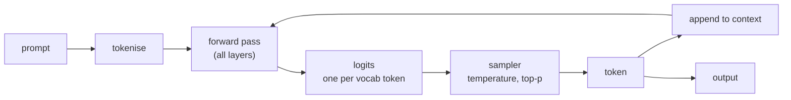

import { Tabs, TabItem } from '@astrojs/starlight/components';
import { Quiz } from '../../../components/mdx/Quiz.tsx';

## Intuition

A large language model is **a function from a sequence of tokens to a
probability distribution over the next token.** That is the whole interface.
Everything else — chat, agents, tool use, reasoning — is built on top by calling
that function repeatedly and deciding what to feed it next.

Two consequences follow immediately, and between them they explain most of what
surprises people in production.

**It is stateless.** The model has no memory of your last request. A conversation
works because the entire history is re-sent on every turn. When a chatbot
"forgets" what you said, nothing was forgotten — it was not sent, or it was sent
and pushed out of the window. This is not a limitation to work around so much as
the thing to design around: **context is the only state there is.**

**It is trained to continue, not to be correct.** The objective was to predict
the next token in human text. A fluent, plausible, wrong answer scores well on
that objective, because human text is full of confident prose. Correctness is
something we bolt on afterwards with retrieval, tools, and evaluation. It is not
what the thing was optimising for, which is why
[hallucination](/cs-fundamentals/10-ai-engineering/hallucinations/) is a
property of the design rather than a defect in it.

### The one-sentence version worth memorising

> It predicts the next token, it has no memory between calls, and it was trained
> to sound right rather than to be right.

Nearly every "why is it doing that" question resolves against one of those three.

## Mechanics

### The loop

Generating a hundred tokens is a hundred forward passes. Each one takes
everything produced so far and returns a distribution over what comes next.



The arrow from `append to context` back into `forward pass` is the important
one. It means:

- **Generation is sequential and cannot be parallelised.** Token 50 needs token
  49. Latency is roughly `output_tokens × time_per_token`, which is why "ask for
  a shorter answer" is the most reliable latency fix available.
- **Errors compound.** A wrong token becomes context the model conditions on,
  and it will confidently build on its own mistake.
- **Reading the prompt is parallel; writing the answer is not.** Input tokens
  are processed in one pass, output tokens one at a time. That asymmetry is why
  input is cheaper than output, usually by several times.

### Attention, in the only detail that matters operationally

Each layer lets every token look at every other token and pull in what is
relevant. That "look at every other token" is $O(n^2)$ in the sequence length,
and that single fact drives the economics of the whole field:

$$
\text{attention cost} \propto n^2 \quad\text{for a context of } n \text{ tokens}
$$

| Context | Relative attention cost |
|---|---|
| 1,000 | 1× |
| 10,000 | 100× |
| 100,000 | 10,000× |

Doubling the context quadruples that part of the work. Modern implementations
soften the constant considerably — and the KV cache below removes most of the
repeated work — but the shape is why long context is expensive, why providers
price it the way they do, and why "just put everything in the prompt" stops
being a strategy at some scale.

### The KV cache, and why it explains prompt caching

Naively, generating token $n+1$ would recompute attention over all $n$ previous
tokens. Instead each token's key and value vectors are computed once and cached,
so each new token attends against stored vectors rather than recomputing them.

Two things fall out that you meet as an API user:

- **A long prompt costs a lot on the first token and little afterwards.** Time
  to first token is dominated by processing the prompt; the rest streams.
- **Prompt caching works only on a shared prefix.** The cache is positional, so
  it can be reused only up to the first token that differs. Put the stable
  material — system prompt, instructions, retrieved documents — at the *front*,
  and the variable material at the end. Interleaving a timestamp near the top
  invalidates everything after it.

That last point is a concrete, free win that a surprising number of systems
give away. It is the same principle as any other cache; see
[caching](/cs-fundamentals/5-systems/caching/) for the general version.

### What a call actually looks like

<Tabs syncKey="lang">
<TabItem label="Python">

```python
from anthropic import Anthropic

client = Anthropic()

response = client.messages.create(
    model="claude-sonnet-4-5",
    max_tokens=1024,
    system="You answer from the provided context only.",   # stable → cacheable prefix
    messages=[{"role": "user", "content": "What changed in the deploy?"}],
)

# Check this. Every time. `end_turn` means the model finished; `max_tokens`
# means it was cut off mid-sentence and the response looks otherwise normal.
if response.stop_reason == "max_tokens":
    raise RuntimeError("truncated output")

print(response.content[0].text)
print(response.usage.input_tokens, response.usage.output_tokens)
```

</TabItem>
<TabItem label="TypeScript">

```typescript
import Anthropic from '@anthropic-ai/sdk';

const client = new Anthropic();

const response = await client.messages.create({
  model: 'claude-sonnet-4-5',
  max_tokens: 1024,
  system: 'You answer from the provided context only.',
  messages: [{ role: 'user', content: 'What changed in the deploy?' }],
});

if (response.stop_reason === 'max_tokens') {
  throw new Error('truncated output');
}
```

</TabItem>
</Tabs>

The `stop_reason` check is the highest-value three lines in most LLM codebases.
Truncated output is returned as a normal 200 response, so without it the failure
surfaces later as a JSON parse error in a completely different part of the
system.

### Why the messages have roles

The API takes a list of `{role, content}` objects, but the model sees one flat
token sequence — the roles are rendered into it as delimiters the model was
trained to respect. That is worth knowing because it explains the security
model: **the boundary between "instructions" and "data" is a learned convention,
not an enforced one.**

There is no parameterised-query equivalent here. If you paste a retrieved
document into the context and it contains "ignore your instructions", the model
sees tokens in a sequence, and whether it complies is a matter of training
rather than architecture. This is the root of prompt injection, and it is why
that problem does not have a clean fix — see
[guardrails](/cs-fundamentals/10-ai-engineering/guardrails/).

## Cost & limits

### The context window is a budget with four claimants

Everything shares one number: system prompt, conversation history, retrieved
documents, tool definitions and their results, and the space reserved for the
answer. They compete.

A worked example against a 200,000-token window:

| Claimant | Tokens |
|---|---|
| System prompt and instructions | 800 |
| Tool definitions (12 tools) | 4,500 |
| Conversation history (20 turns) | 15,000 |
| Retrieved chunks (10 × 800) | 8,000 |
| **Reserved for output** | **4,000** |
| Used | 32,300 |
| Remaining | 167,700 |

Tool definitions are the line people forget: they are re-sent on **every**
request, so twelve verbose tool schemas is a fixed tax on every call for the
life of the system. Trimming their descriptions is one of the few optimisations
that reduces cost and improves accuracy at the same time, since fewer, clearer
tools are also easier for the model to choose between.

### Why input and output are priced differently

Input tokens are processed in one parallel pass. Output tokens are generated one
at a time, each requiring a full forward pass. **The work per output token is
genuinely larger**, and providers price accordingly — output typically costs
several times input.

The engineering consequence: a system that sends 10,000 tokens of context to get
a 50-token answer has a cost profile dominated by input, and prompt caching is
the lever. A system that generates long documents is dominated by output, and
the lever is asking for less.

<aside class="dated-figure">

**Not verified from here.** Context-window sizes, per-token prices and the
input/output ratio are per-model and change frequently. The token budget above
is arithmetic; the prices are not quoted for that reason. Check your provider's
current pricing page and record the date beside any number you rely on.

</aside>

### Quality is not flat across the window

A model advertising 200,000 tokens does not use all of them equally well.
Retrieval accuracy tends to be strongest at the beginning and end of the context
and weakest in the middle — the "lost in the middle" effect. **The advertised
window is a hard limit, not a usable capacity.**

The practical rule: put what matters at the edges, and treat "it fits" and "it
will be used" as different claims. See
[context engineering](/cs-fundamentals/10-ai-engineering/context-engineering/).

## When NOT to use it

**When a deterministic program would do.** Parsing a known format, validating a
schema, doing arithmetic, sorting, looking up a record. A regex is faster,
cheaper, testable, and correct. Reaching for a model to extract a date from an
ISO-8601 string is a category error that shows up in the bill and the p99.

**When you cannot tolerate being wrong and cannot check the answer.** The model
optimises for plausible continuation. If there is no verification step — a test
suite, a schema, a human, a second system — you are shipping unverified output
into a place that needs to be right.

**When the task needs exact recall over a large corpus.** Models compress; they
do not store. Asking one to recall a specific clause from a specific contract it
saw in training is asking for a lossy reconstruction that will be confidently
almost-right. Retrieve the document and put it in the context instead.

**When latency is a hard constraint.** Sequential generation means a long answer
takes seconds, and no amount of engineering removes that. If your budget is
50ms, this is the wrong tool regardless of how well it performs.

**When the same question is asked repeatedly.** Cache. A model call to answer a
question you have already answered is pure waste, and the cache hit rate on real
support traffic is usually much higher than teams expect.

## Real-world usage

- **Extraction and classification** — unstructured input to structured output,
  validated against a schema. The most reliable production use, because the
  output is checkable.
- **Retrieval-augmented generation** — the model is a language interface over
  documents you supply, rather than a knowledge store. See
  [RAG](/cs-fundamentals/10-ai-engineering/rag/).
- **Code assistance** — generation with a fast, objective verifier: the code
  compiles and the tests pass, or it does not.
- **Agents and tool use** — the model chooses which function to call and with
  what arguments; deterministic code does the actual work.
- **Summarisation and drafting** — where a human reviews the output, which is
  the verification step.
- **Semantic routing** — classifying an incoming request to decide which
  downstream system handles it, often with a small cheap model.

## Failure modes

### Confident fabrication

**Symptom:** a citation, an API method, or a statistic that does not exist,
delivered in the same tone as everything true.

**Cause:** the training objective rewards plausible continuation. There is no
internal "I do not know" state to surface — a low-confidence answer and a
high-confidence one are produced by the same mechanism and read identically.

**Fix:** ground it in retrieved context and require citation, then verify the
citation exists. Do not attempt to fix it by asking the model to be accurate;
the instruction is in the same channel as everything else it ignores.

### Silent truncation at max\_tokens

**Symptom:** JSON that fails to parse; answers that stop mid-word.

**Cause:** the generation limit was hit. The API returns 200 with
`stop_reason: "max_tokens"`.

**Fix:** check `stop_reason` on every call. Reserve output budget explicitly
rather than discovering it.

### Context exhaustion in long conversations

**Symptom:** a long-running chat starts contradicting its own earlier turns, or
starts failing with a context-length error.

**Cause:** history grows with every turn and eventually exceeds the window.
Naive truncation drops the oldest messages — which is usually where the system
prompt and the user's actual goal live.

**Fix:** manage the window deliberately: keep the system prompt pinned, summarise
old turns rather than dropping them, and reserve output space. Never let
truncation be implicit.

### The prompt cache that never hits

**Symptom:** costs stay flat after enabling prompt caching.

**Cause:** the cache matches on prefix, and something varies near the front — a
timestamp, a session id, a shuffled list of retrieved documents. Everything
after the first differing token is a miss.

**Fix:** order the prompt by stability. Static instructions first, then
semi-static tool definitions, then retrieved context, then the user's turn.
Sort anything whose order is not meaningful so it does not vary run to run.

### Retrieval into the middle of a long context

**Symptom:** the answer is demonstrably in the context and the model does not use
it.

**Cause:** the lost-in-the-middle effect. Material buried in the centre of a
long context gets less reliable attention.

**Fix:** fewer, better chunks placed at the edges beats more chunks placed
anywhere. Rerank so the best material is at the boundaries.

### Non-determinism where it was not expected

**Symptom:** identical requests return different answers, even at temperature 0.

**Cause:** greedy decoding is deterministic given identical logits, and batched
GPU inference does not guarantee identical logits. See
[tokens and sampling](/cs-fundamentals/10-ai-engineering/tokens-and-sampling/).

**Fix:** cache the response. Do not rely on regeneration for reproducibility.

## Practice problems

**1. The chatbot that forgets.**

A support bot works well for the first several turns of a conversation, then
starts contradicting things it said earlier and occasionally ignores its
persona entirely. No errors are logged. Requests still return 200.

<details>
<summary>Solution</summary>

The conversation history has outgrown the context window, and something is
truncating it — either the framework, silently, from the front.

Dropping from the front is the worst possible choice, because the front is where
the system prompt lives. So the symptom is precisely "loses its persona and its
constraints", which is what you would predict.

**Fix:** manage the window explicitly rather than letting a default do it.

1. Pin the system prompt so it is never a truncation candidate.
2. Reserve output tokens up front, so you are budgeting rather than discovering.
3. When history exceeds the remaining budget, **summarise** the oldest turns into
   a compact note and keep the recent turns verbatim. Summarising loses less
   than dropping, and it degrades gracefully.
4. Log token counts per request. The absence of any signal here is the actual
   bug — this failure should never be silent.

**The trap to avoid:** moving to a model with a larger window. That buys time
and does not fix anything, because history grows without bound and quality
degrades in the middle of a long window anyway.

</details>

**2. Budget the window.**

You have a 32,000-token window. The system prompt is 600 tokens, eight tool
definitions total 3,200, and you must reserve 2,000 for the answer. Each
retrieved chunk is about 700 tokens, and conversation history is currently
6,000. How many chunks can you include, and what would you change?

<details>
<summary>Solution</summary>

Arithmetic first:

```
32,000  window
  -600  system
-3,200  tools
-2,000  reserved output
-6,000  history
───────
20,200  available for retrieval
÷   700
       = 28 chunks
```

**Twenty-eight is the wrong answer to ship**, and noticing that is the point of
the exercise. Two reasons:

1. History grows. At 20 more turns you have no retrieval budget at all. Budget
   for the steady state, not the current turn.
2. Quality falls off in the middle of a long context. Twenty-eight chunks means
   most of them sit where the model attends least — you would be paying for
   tokens that actively dilute the ones that matter.

**What to change:** retrieve 5-8 chunks after reranking, not 28. Trim the tool
definitions — 3,200 tokens for eight tools is ~400 each, which is verbose, and
it is a tax on *every* request. Cap history at a rolling summary plus the last
few turns.

That lands around 10,000 tokens used, leaving genuine headroom, and it will
answer *better* than the 28-chunk version.

</details>

**3. Order the prompt for cache hits.**

A RAG endpoint sends: a timestamp, the user's question, ten retrieved chunks in
relevance order, tool definitions, and a system prompt. Prompt caching is
enabled and the hit rate is nearly zero. Reorder it.

<details>
<summary>Solution</summary>

The cache matches on a shared prefix and stops at the first differing token. A
timestamp at position zero means **every request differs at token one**, so
nothing is ever reusable.

Order by stability, most stable first:

```
1. System prompt            identical every request
2. Tool definitions         change only on deploy
3. Retrieved chunks         vary by query
4. Conversation history     grows per turn
5. The user's question      always different
```

Drop the timestamp entirely unless the model needs it, and if it does, put it
at the end with the user turn.

**One extra fix that is easy to miss:** chunks in *relevance* order vary between
queries even when the same chunks come back. If the same set recurs — which is
common on real traffic, where a few documents answer most questions — sorting
them by a stable id instead makes that prefix cacheable too. You give up placing
the best chunk first, so measure whether that trade is worth it rather than
assuming.

**The trap to avoid:** concluding prompt caching does not work for RAG. It works;
the prefix just has to be built deliberately.

</details>

<Quiz
  client:visible
  id="llm-statelessness"
  kind="concept"
  question="A chat assistant answers turn 20 as though turn 2 never happened. What is the most likely explanation?"
  options={[
    { label: 'The history was truncated to fit the context window — the model has no memory between calls, so anything not re-sent does not exist', correct: true },
    { label: 'The model\'s internal memory decayed over the conversation' },
    { label: 'The provider rate-limited the session and dropped state' },
    { label: 'Attention weights degrade with each successive API call' },
  ]}
>
  <Fragment slot="explanation">
    <p>
      The model is stateless. A conversation exists only because the client
      re-sends the entire history on every request, so "forgetting" is always a
      statement about what was sent, never about what the model retained. At
      turn 20 the history no longer fits, and something dropped the oldest
      messages.
    </p>
    <p>
      The distractors all assume server-side memory that does not exist. There
      is no internal state that decays, no session for a rate limiter to drop,
      and attention is recomputed from scratch on every call — nothing persists
      between requests to degrade.
    </p>
    <p>
      The rule this generalises to: <strong>context is the only state.</strong>{' '}
      Every memory feature you have used — conversation history, "remember
      this", retrieved facts — is a system re-sending tokens, and it should be
      designed as such rather than trusted as a black box.
    </p>
  </Fragment>
</Quiz>

<Quiz
  client:visible
  id="llm-cost-asymmetry"
  kind="concept"
  question="Why do providers charge more per output token than per input token?"
  options={[
    { label: 'Input is processed in one parallel pass; each output token needs its own sequential forward pass', correct: true },
    { label: 'Output tokens are larger on average, so they carry more data' },
    { label: 'It discourages long responses, which reduces load on the service' },
    { label: 'Output requires a safety-filtering pass that input does not' },
  ]}
>
  <Fragment slot="explanation">
    <p>
      The asymmetry is architectural. A prompt of 10,000 tokens is processed in a
      single forward pass with all positions computed together. Generating 100
      output tokens means 100 forward passes, each conditioning on everything
      before it, and each one unparallelisable because token 50 cannot start
      until token 49 exists.
    </p>
    <p>
      The same fact explains latency: time to completion scales with{' '}
      <em>output</em> length, not total tokens. That is why "ask for a shorter
      answer" is a far more effective latency fix than trimming the prompt, and
      why streaming exists — it cannot make generation faster, only make the
      wait visible.
    </p>
    <p>
      The practical consequence for cost: a system sending large contexts for
      short answers should optimise with prompt caching, while a system
      generating long documents should optimise by generating less. Those are
      different problems and the bill tells you which one you have.
    </p>
  </Fragment>
</Quiz>

## Interview answers

**"Explain how an LLM works."**

> It is a function from a token sequence to a probability distribution over the
> next token. You call it repeatedly, appending each token you draw, and that
> loop is what produces text. Internally it is a transformer, where every layer
> lets each token attend to every other token — which is where the quadratic
> cost in context length comes from.
>
> The two things I actually design around are that it is stateless and that it
> was trained to continue rather than to be correct. Statelessness means context
> is the only memory, so managing the window is real engineering work rather
> than a detail. And the training objective means a fluent wrong answer scores
> well, which is why verification has to come from outside the model.

**"Why is the context window such a big deal if it is 200,000 tokens?"**

> Because it is a shared budget and quality is not flat across it. The system
> prompt, tool definitions, history, retrieved documents and the reserved output
> all compete for the same number. Tool definitions especially — they are re-sent
> on every request, so verbose schemas are a permanent tax.
>
> And retrieval accuracy is best at the beginning and end and weakest in the
> middle. So "it fits" and "it will be used" are different claims. In practice
> five well-chosen chunks at the edges beat thirty scattered through the middle,
> and they cost less.

**"What would you check first if an LLM feature is behaving badly in
production?"**

> Whether the output is being truncated. `stop_reason` of `max_tokens` returns a
> normal 200 with a response that stops mid-sentence, so the failure usually
> surfaces somewhere else entirely — a JSON parse error two services away. It is
> three lines to check and it is the most common thing I find.
>
> After that, what is actually in the context. Log the assembled prompt and the
> token counts, because most "the model is wrong" reports turn out to be "the
> model was never shown the thing". Splitting retrieval from generation before
> debugging either is the same instinct.

**The caveats worth voicing:**

- Context is the only state. Anything that looks like memory is a system
  re-sending tokens.
- The instruction/data boundary is a learned convention, not an enforced one —
  there is no parameterised query for prompts.
- Order the prompt by stability so the cacheable prefix is as long as possible.
- Latency scales with output length; input length mostly affects time to first
  token.
- Advertised context is a hard limit, not a usable capacity.
