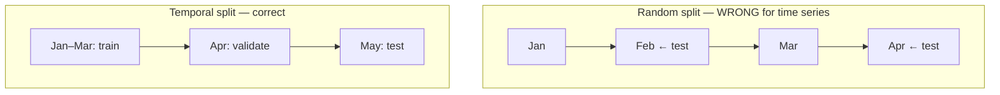

import { Tabs, TabItem } from '@astrojs/starlight/components';
import { Quiz } from '../../../components/mdx/Quiz.tsx';

## Intuition

Data preparation is where models are actually made or broken, and it has a
property that makes it uniquely dangerous: **its bugs make results look better,
not worse.**

A bug in your training loop produces a bad score and you investigate. A leak in
your feature pipeline produces an *excellent* score, everyone celebrates, and the
failure surfaces weeks later in production with no obvious cause. There is no
error, no exception, and the number that would have warned you is the number that
reassured you.

That asymmetry sets the discipline for this whole stage:

> **Be suspicious of good results. Investigate them as hard as bad ones.**

A jump from 0.72 to 0.94 AUC after adding a feature is far more likely to be a
leak than a breakthrough. The prior should be strongly against you.

### The one question that catches most of it

For every feature, ask:

> **Would this value exist, with this value, at the moment of prediction?**

Three parts, all load-bearing. *Exist* — is the column populated yet?
*With this value* — has it been updated since? *At the moment of prediction* — not
at analysis time, when everything looks available.

Applied per feature, this takes minutes and catches most leakage.

## Mechanics

### Split before you touch anything

The most common leak is not a feature at all — it is fitting a transformation on
data that includes the test set.

<Tabs syncKey="lang">
<TabItem label="Python">

```python
from sklearn.pipeline import Pipeline
from sklearn.preprocessing import StandardScaler
from sklearn.impute import SimpleImputer

# WRONG. The scaler has seen the test set's mean and standard deviation, so
# test performance is optimistic in a way nothing will flag. Same for
# imputation, feature selection, and target encoding.
X_scaled = StandardScaler().fit_transform(X)
X_train, X_test = train_test_split(X_scaled)

# RIGHT. Split first, then fit transformations on train only. A Pipeline makes
# this the default rather than something you must remember — which is the real
# reason to use one.
X_train, X_test, y_train, y_test = train_test_split(X, y, stratify=y)

pipeline = Pipeline([
    ("impute", SimpleImputer(strategy="median")),
    ("scale", StandardScaler()),
    ("model", LogisticRegression()),
])
pipeline.fit(X_train, y_train)      # every step fits on train only
pipeline.score(X_test, y_test)      # every step only transforms here
```

</TabItem>
</Tabs>

The `Pipeline` is not stylistic. Manual preprocessing means remembering to apply
the *fitted* transformer to test data every time, and one lapse produces a silent
optimistic bias. Making the correct thing automatic is the point.

### Splitting when there is structure

Random splitting is correct only when rows are independent. Often they are not.



| Structure | Correct split |
|---|---|
| Time series | temporal — train on past, test on future |
| Multiple rows per user | **group** split — a user is entirely in one side |
| Multiple rows per document | group by document |
| Geographic | group by region, if you must generalise to new regions |
| Rare classes | stratified, so the class survives the split |

**Group splitting is the one most often missed.** If a customer has 40 rows and
they are randomly distributed, the model learns that customer's idiosyncrasies in
training and is tested on them. That is memorisation scoring as generalisation.

<Tabs syncKey="lang">
<TabItem label="Python">

```python
from sklearn.model_selection import GroupShuffleSplit

# Every row for a given customer lands on one side. The model is then tested on
# customers it has genuinely never seen, which is the deployment condition.
splitter = GroupShuffleSplit(test_size=0.2, random_state=42)
train_idx, test_idx = next(splitter.split(X, y, groups=df["customer_id"]))
```

</TabItem>
</Tabs>

### Encoding categorical variables

| Method | Use when | Watch out for |
|---|---|---|
| One-hot | few categories (< ~15) | explodes with high cardinality |
| Ordinal | genuine order exists | invents order where there is none |
| Target encoding | high cardinality, tree models | **leaks badly without care** |
| Hashing | very high cardinality, streaming | collisions, no interpretability |
| Frequency | cardinality is itself signal | ties between equally-frequent categories |

**Target encoding is the one that bites.** Replacing a category with the mean
target for that category means the row's own label contributed to its feature.

<Tabs syncKey="lang">
<TabItem label="Python">

```python
# WRONG — each row's own label is baked into its feature value. This produces
# spectacular validation scores and a model that learns nothing transferable.
df["city_encoded"] = df.groupby("city")["target"].transform("mean")

# RIGHT — out-of-fold encoding. Each row's encoding is computed from OTHER
# folds only, so its own label never contributes to its own feature.
from sklearn.model_selection import KFold

df["city_encoded"] = np.nan
for train_idx, val_idx in KFold(5, shuffle=True, random_state=42).split(df):
    means = df.iloc[train_idx].groupby("city")["target"].mean()
    df.loc[df.index[val_idx], "city_encoded"] = df.iloc[val_idx]["city"].map(means)

# Unseen categories at inference get the global mean, not NaN — otherwise a new
# city crashes serving or silently imputes to something arbitrary.
df["city_encoded"] = df["city_encoded"].fillna(df["target"].mean())
```

</TabItem>
</Tabs>

### Missing values carry information

`NaN` is rarely random. A missing income field may mean "declined to answer",
which is itself predictive — and imputing the median destroys that signal.

<Tabs syncKey="lang">
<TabItem label="Python">

```python
# Keep the fact of missingness as its own feature before filling. Cheap, and it
# frequently outperforms any cleverness in the imputation itself.
for column in ["income", "age", "last_login"]:
    df[f"{column}_missing"] = df[column].isna().astype(int)

df[column] = df[column].fillna(df_train[column].median())   # train median only
```

</TabItem>
</Tabs>

Note `df_train[column].median()`. Filling from the full dataset's median is the
same leak as fitting a scaler on everything.

### Imbalance

Three approaches, and the first is underrated:

1. **Do nothing; fix the threshold.** Most models output probabilities. Train
   normally and choose the decision threshold from the cost ratio. This preserves
   calibration, which the other two damage.
2. **Class weights.** `class_weight="balanced"` tells the loss function to care
   more about the rare class. Cheap, and it does not fabricate data.
3. **Resampling** — SMOTE and friends. Synthesises minority examples by
   interpolation. **Only ever on the training fold**, never before splitting, and
   it distorts the probabilities so calibration is gone.

**Prefer the first.** Teams reach for SMOTE early, damage calibration, and then
cannot use the probabilities for the cost-based decision that would have solved
the problem directly.

## Cost & limits

### The label budget dominates

| Volume | At 1 min/label | At 5 min/label (expert) |
|---|---|---|
| 1,000 | 17 hours | 83 hours |
| 10,000 | 167 hours | 833 hours |
| 100,000 | 1,667 hours | infeasible |

Which is why these are worth considering before a labelling project:

- **Weak supervision** — label with rules, accept the noise, and use volume to
  compensate.
- **Active learning** — label only what the model is most uncertain about;
  frequently reaches the same performance with a fraction of the labels.
- **LLM pre-labelling** with human review. Reviewing a proposed label is several
  times faster than producing one, and the errors cluster where the model was
  uncertain.

### Inter-annotator agreement is your ceiling

If two annotators disagree on 12% of examples, no model can exceed roughly 88%
on that task — the ground truth is not consistent enough to learn.

**Measure it before training anything.** A day double-labelling 200 examples
tells you the maximum achievable score, and it regularly reveals that the task
definition is ambiguous rather than the model being weak. That is a much cheaper
discovery than three weeks of modelling.

<aside class="dated-figure">

**Not verified from here.** The labelling-time figures are illustrative
arithmetic, not measured rates; real throughput varies enormously by task. The
leakage mechanics and split rules are structural and do not vary.

</aside>

### Feature engineering cost

Every engineered feature must be computed **identically** at training and
serving. That is a maintenance obligation, not a one-off: a feature computed in
a notebook and reimplemented in a service is training/serving skew waiting to
happen.

The practical rule: **share the transformation code between both paths**, or use
a feature store. Two implementations of the same feature will diverge.

## When NOT to use it

Read as: when the elaborate version is not warranted.

**Do not engineer features before establishing a baseline.** The raw features may
be enough, and without the baseline you cannot tell what the engineering bought.

**Do not resample before you have tried thresholding.** It damages calibration,
and calibrated probabilities are what let you make the cost-based decision that
usually solves imbalance outright.

**Do not impute what you can leave missing.** Gradient-boosted trees handle
missing values natively and often better than any imputation, because
missingness is signal.

**Do not build a feature store for one model.** It is infrastructure that pays off
across teams and models; for a single model it is overhead.

**Do not clean outliers automatically.** In fraud, anomaly detection and
monitoring, the outliers *are* the target. Removing them removes the problem.

## Real-world usage

- **Point-in-time feature stores** — the standard answer to leakage at scale.
  Every feature carries a timestamp and is queried "as of" the prediction moment.
- **Group-aware splitting** in anything with users, sessions or documents.
- **Out-of-fold target encoding** for high-cardinality categoricals in
  gradient-boosted models, which is where it genuinely helps.
- **Weak supervision** for large text corpora — rules generate noisy labels at
  volume.
- **Active learning** in medical and legal domains, where each label is expensive
  expertise.
- **Shared transformation code** between training and serving paths, as the
  standard defence against skew.

## Failure modes

### The feature that only exists afterwards

**Symptom:** excellent validation, poor production.

**Cause:** a feature reflecting the outcome — `agent_count`, `refund_issued`,
`resolution_time`.

**Fix:** the point-in-time question, per feature. Then rebuild features as
snapshots at the prediction timestamp.

### Preprocessing fitted on everything

**Symptom:** a small, consistent optimistic bias that nobody can trace.

**Cause:** a scaler, imputer or feature selector fitted before the split.

**Fix:** `Pipeline`. Make the correct behaviour automatic rather than
remembered.

### Rows from the same entity on both sides

**Symptom:** strong validation, degrades on new users.

**Cause:** random splitting when a user has many rows. The model memorised the
user.

**Fix:** group splitting. Ask what the model must generalise *to* — new users, new
documents, new regions — and group by that.

### Target encoding with the row's own label

**Symptom:** an implausibly strong categorical feature.

**Cause:** in-fold target encoding.

**Fix:** out-of-fold encoding, plus a defined fallback for unseen categories.

### Training/serving skew

**Symptom:** offline metrics never reproduce online.

**Cause:** two implementations of the same feature — different null handling,
different time zone, different rounding.

**Fix:** one implementation, shared. Log served features and compare
distributions against training.

### Duplicates across the split

**Symptom:** suspiciously high scores.

**Cause:** near-duplicate rows — a re-submitted form, a scraped page captured
twice — landing on both sides.

**Fix:** deduplicate before splitting, including near-duplicates. Embedding
similarity is a reasonable detector for text.

## Practice problems

**1. The 0.99 AUC.**

A model predicting whether a loan will default reaches 0.99 AUC. Features:
applicant income, credit score, loan amount, employment length, `n_payments_made`,
`days_since_last_contact`. What do you check?

<details>
<summary>Solution</summary>

0.99 on default prediction is not a result, it is a symptom. Real credit models
land far lower. **Investigate it as a bug.**

**`n_payments_made` is the leak.** At application time — the moment of prediction
— it is zero for everyone. A non-zero value exists only after the loan is
running, and defaulters have made few payments. The model has learned "people who
stopped paying, defaulted", which is the label restated.

**`days_since_last_contact` is suspicious for a subtler reason.** If contact
means collections calls, it is post-outcome. If it means pre-approval
correspondence, it is legitimate. This is not answerable from the column name —
it needs a conversation with whoever owns the data, and that conversation is the
work.

**The process, not just the answer:**

1. **Define the prediction moment.** "At application" is a different product from
   "at month three of repayment", with different feature sets and different
   users.
2. **Point-in-time question per feature.** Would this value exist, with this
   value, then?
3. **Rebuild as snapshots** as of the application timestamp.
4. **Re-validate.** Expect a large drop. That number is real, and it is the one
   you can build a business on.

**The trap to avoid:** keeping the feature "because it is predictive". It is
perfectly predictive and completely unavailable when you need it, which makes it
worth zero.

</details>

**2. Fix the split.**

An app predicts whether a user's next session will convert. 50,000 users, ~200
sessions each — 10M rows. Split randomly 80/20. Validation AUC 0.91, production
0.63. Diagnose.

<details>
<summary>Solution</summary>

Two independent problems, both from the random split, and the gap is the sum.

**1. Group leakage.** With 200 sessions per user randomly distributed, ~80% of
every user's sessions are in training. The model learned *individual user
behaviour* and was tested on the same users. In production it meets users it has
never seen.

**2. Temporal leakage.** Sessions are ordered in time. Random splitting lets the
model train on March and test on February — predicting the past from the future,
which it cannot do in deployment.

**The fix, and both must be applied:**

```python
# Group by user AND respect time. Users are disjoint across splits, and the
# test period is strictly after the training period.
cutoff = df["timestamp"].quantile(0.8)
train_users, test_users = split_users(df["user_id"].unique(), test_size=0.2)

train = df[(df.user_id.isin(train_users)) & (df.timestamp <= cutoff)]
test  = df[(df.user_id.isin(test_users))  & (df.timestamp >  cutoff)]
```

**Expect AUC to fall to roughly 0.65** — close to the production number, which is
the confirmation that the diagnosis is right.

**What to do with that:** it is not a worse model, it is an honest measurement of
the same model. Now improvements are real. And it reframes the problem: if
per-user history was doing the work, the product question may be whether you need
to predict for *new* users at all, or whether a personalised model per returning
user is the actual design.

**The check worth adding permanently:** assert no `user_id` appears in both
splits, and assert `max(train.timestamp) <= min(test.timestamp)`. Two lines,
runs in CI, and this class of bug never recurs.

</details>

**3. Design the labelling.**

You need to classify 200,000 support tickets into 12 categories. Budget: two
people for three weeks. Manual labelling runs about 20 tickets/hour.

<details>
<summary>Solution</summary>

The budget does not reach the target by a wide margin, so the answer is not a
better labelling process — it is a different strategy.

```
2 people × 3 weeks × 35 productive hours = 210 hours
210 × 20 = 4,200 tickets manually labelled
```

4,200 out of 200,000, and that is if nobody does anything else.

**The strategy:**

**Week 1 — define and measure the ceiling.** Both people label the *same* 200
tickets independently. Measure agreement. If it is 75%, no model can exceed
~75%, and the finding is that the categories are ambiguous — fix the taxonomy
before labelling 200,000 of anything. **This is the highest-value week and the
one that gets skipped.**

**Week 1 (rest) — LLM pre-labelling.** Prompt a model with the 12 category
definitions and a few examples per category, and label all 200,000. Cheap and
fast.

**Weeks 2-3 — humans review, not label.** Reviewing a proposed label runs several
times faster than producing one, so 210 hours of review covers far more than
4,200 tickets. Prioritise:

1. Tickets where the model expressed low confidence.
2. A stratified random sample, to measure the LLM's accuracy per category —
   without this you do not know what you have.
3. Categories with the fewest examples, which are where the model is weakest and
   where a trained classifier will need the most help.

**Outcome:** 200,000 labels of known, measured quality, plus a few thousand
gold-standard human labels for the test set — which must be human-labelled, or
you are measuring agreement with the LLM rather than correctness.

**The trap to avoid:** labelling 4,200 tickets by hand and training on those.
Fewer labels, no coverage of rare categories, and no measurement of the ceiling.

</details>

<Quiz
  client:visible
  id="prep-groupsplit"
  kind="concept"
  question="Each user contributes ~200 rows. You split randomly and validation is excellent; production is poor. What is the cause?"
  options={[
    { label: 'Group leakage — the same users are in train and test, so the model memorised individuals rather than generalising', correct: true },
    { label: 'The test set is too small relative to the number of features' },
    { label: 'Class imbalance that the random split failed to preserve' },
    { label: 'The model is overfitting and needs stronger regularisation' },
  ]}
>
  <Fragment slot="explanation">
    <p>
      With 200 rows per user randomly distributed, roughly 80% of every user's
      rows land in training. The model learns each individual's idiosyncrasies
      and is then tested on those same individuals — memorisation scoring as
      generalisation. In production it meets users it has never seen, and the
      score collapses.
    </p>
    <p>
      Regularisation is the tempting answer and does not address it: the model is
      not fitting noise, it is fitting real per-user signal that happens to be
      unavailable for new users. The fix is structural — a group split where every
      row for a user lands on one side.
    </p>
    <p>
      The question that generalises: <strong>what must the model generalise
      to?</strong> New users, new documents, new regions, next month. Group by
      that, and if there is temporal structure as well, apply both.
    </p>
  </Fragment>
</Quiz>

<Quiz
  client:visible
  id="prep-target-encoding"
  kind="concept"
  question="You replace a high-cardinality category with the mean target for that category, computed across the training set. What is wrong?"
  options={[
    { label: 'Each row\'s own label contributed to its own feature value — the encoding must be computed out-of-fold', correct: true },
    { label: 'Nothing, provided the encoding is fitted on training data only' },
    { label: 'Mean target encoding cannot handle categories unseen at inference' },
    { label: 'It creates a feature on a different scale from the others, requiring normalisation' },
  ]}
>
  <Fragment slot="explanation">
    <p>
      Even fitted on training data only, a row's own label is included in the mean
      for its category — so its feature partly <em>is</em> its label. For a rare
      category with three rows the effect is severe: the encoding is almost
      entirely determined by those three labels, one of which is the row being
      encoded.
    </p>
    <p>
      The fix is out-of-fold encoding: compute each row's value from folds that
      exclude it, so no label ever contributes to its own feature. This is why
      target encoding is listed as the categorical method that bites — it is
      genuinely useful for high-cardinality features in tree models, and it is
      easy to implement in the leaking way.
    </p>
    <p>
      Unseen categories at inference are a real, separate concern with a simple
      answer: fall back to the global mean rather than leaving NaN, or a new
      category crashes serving.
    </p>
  </Fragment>
</Quiz>

## Interview answers

**"What is data leakage and how do you find it?"**

> Information in the training data that would not be available at prediction
> time. What makes it dangerous is the direction of the failure: it makes results
> look *better*, so nobody investigates. A bug in the training loop gives a bad
> score and you debug it; a leak gives a great score and you ship it.
>
> The test I apply per feature is: would this value exist, with this value, at
> the moment of prediction? All three parts matter — it might exist but have been
> updated since. That catches most of it in minutes.
>
> The other common form is not a feature at all — fitting a scaler or imputer
> before splitting, so the transformation has seen the test set. I use a Pipeline
> so that is the default rather than something I have to remember.

**"How do you split data?"**

> By asking what the model has to generalise to, which determines the split.
>
> If rows are independent, random and stratified. If there is time structure,
> temporal — train on the past, test on the future — because a random split lets
> the model train on the future. If there are multiple rows per user or document,
> group split, so every row for an entity lands on one side.
>
> Group splitting is the one most often missed, and it is dramatic: with two
> hundred sessions per user, a random split means the model memorises individuals
> and gets tested on them. Validation looks excellent and production is a third
> worse.
>
> And three splits, not two. The test set gets touched once — every look leaks a
> little into your decisions.

**"How do you handle class imbalance?"**

> Usually by not treating it as an imbalance problem. Most models output
> probabilities, so I train normally and choose the decision threshold from the
> cost ratio — if a false negative costs fifty times a false positive, the
> threshold should say so. That preserves calibration.
>
> If that is not enough, class weights, which are cheap and do not fabricate
> data. Resampling like SMOTE is the last resort: it distorts the probabilities,
> so you lose the calibration that would have let you make the cost-based
> decision in the first place. And it goes on the training fold only, never
> before splitting.
>
> The thing I would check before any of it is the base rate arithmetic. For an
> event at one in a million, even excellent precision produces mostly false
> alerts, and that is a project-viability question rather than a modelling one.

**The caveats worth voicing:**

- Investigate good results as hard as bad ones. A jump to 0.99 is a leak until
  proven otherwise.
- Measure inter-annotator agreement first; it is your ceiling, and it often
  reveals the taxonomy is ambiguous.
- Missingness is signal — add an `is_missing` flag before imputing.
- Deduplicate before splitting, including near-duplicates.
- One implementation of each feature, shared between training and serving. Two
  will diverge.
