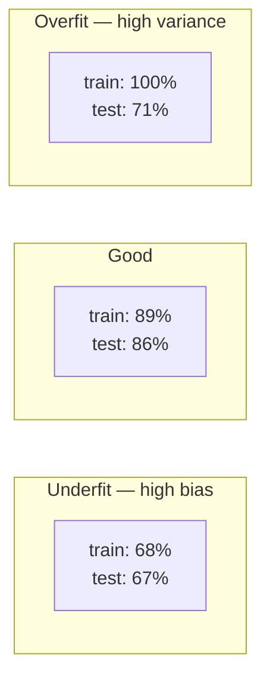

import { Tabs, TabItem } from '@astrojs/starlight/components';
import { Quiz } from '../../../components/mdx/Quiz.tsx';

## Intuition

Machine learning is **curve fitting with a held-out test**.

A model is a function with adjustable parameters. Training adjusts them to
reduce error on data you have. The held-out test is what makes it engineering
rather than numerology: a model that fits the training data perfectly and fails
on new data has learned the noise, and only a test set it never saw can tell you
which happened.

That framing is enough for most of what an AI engineer needs, because the job is
usually not training models. It is **deciding whether to**, evaluating one
someone else built, and preparing the data that determines whether either
succeeds.

Three things worth having straight:

**Learning means generalising, not memorising.** The training loss is not the
objective; it is a proxy. The objective is performance on data that does not
exist yet.

**Every model has an inductive bias.** Linear models assume additivity. Trees
assume the answer is a series of thresholds. Neural networks assume
compositional structure. There is no assumption-free model, and matching the bias
to the problem matters more than the algorithm.

**The data ceiling is real and usually binding.** If two identical inputs have
different labels — because two annotators disagreed — no model can be right about
both. That irreducible error bounds every model you will ever train on that
dataset, and measuring it is usually more valuable than trying another
algorithm.

## Mechanics

### The vocabulary

| Term | Meaning |
|---|---|
| **Feature** | An input variable. `X` |
| **Label / target** | What you predict. `y` |
| **Supervised** | Learn from labelled examples |
| **Unsupervised** | Find structure with no labels (clustering, topics) |
| **Loss** | A number measuring wrongness; training minimises it |
| **Overfitting** | Low training error, high test error — memorised the noise |
| **Underfitting** | High error everywhere — the model is too simple |
| **Regularisation** | Penalising complexity to reduce overfitting |
| **Hyperparameter** | A setting you choose, not learned (tree depth, learning rate) |
| **Inference** | Using a trained model to predict |

### The bias-variance trade-off, concretely



**The gap between train and test is the diagnostic**, and it tells you which
problem you have and therefore what to do:

- **Small gap, both bad** → underfitting. More features, a more expressive model,
  less regularisation.
- **Large gap** → overfitting. More data, fewer features, more regularisation, a
  simpler model.
- **Small gap, both good** → ship it.

Reading that gap before changing anything is the habit that separates directed
work from random search.

### Metrics: why accuracy usually lies

For a fraud detector where 1 in 1,000 transactions is fraudulent, predicting
"never fraud" achieves **99.9% accuracy** and is worthless.

The confusion matrix and what comes from it:

|  | Predicted positive | Predicted negative |
|---|---|---|
| **Actually positive** | TP | FN |
| **Actually negative** | FP | TN |

$$
\text{precision} = \frac{TP}{TP + FP} \qquad
\text{recall} = \frac{TP}{TP + FN}
$$

- **Precision** — of what I flagged, how much was real? Low precision means false
  alarms, and the cost is wasted human attention.
- **Recall** — of what was real, how much did I catch? Low recall means misses,
  and the cost is whatever the miss causes.

**They trade off, and the trade is a product decision, not a modelling one.**
Cancer screening wants recall — a missed case is fatal and a false alarm is a
follow-up test. Spam filtering wants precision — a missed spam is an annoyance
and a false positive loses a real email.

`F1` is their harmonic mean, and it is a reasonable default when you genuinely
have no view. Reaching for it because choosing is hard usually means the product
question was never asked.

**AUC-ROC** measures ranking quality across all thresholds and is misleading on
severely imbalanced data — it can look excellent while the top of the ranking is
useless. Prefer **AUC-PR** there.

### Always establish a baseline

<Tabs syncKey="lang">
<TabItem label="Python">

```python
from sklearn.dummy import DummyClassifier
from sklearn.metrics import classification_report

# The number that makes every later number meaningful. "Our model gets 94%"
# means nothing until you know that predicting the majority class gets 93%.
baseline = DummyClassifier(strategy="most_frequent").fit(X_train, y_train)
print(classification_report(y_test, baseline.predict(X_test)))

# The second baseline worth having: the simplest real model. If logistic
# regression is within a point of the gradient-boosted ensemble, ship the
# logistic regression — it trains in seconds, explains itself, and will not
# surprise you in production.
simple = LogisticRegression(max_iter=1000).fit(X_train, y_train)
```

</TabItem>
</Tabs>

Two baselines, both cheap, and skipping them is the most common way an ML
project produces a number nobody can interpret.

### Splitting data correctly

<Tabs syncKey="lang">
<TabItem label="Python">

```python
from sklearn.model_selection import train_test_split, TimeSeriesSplit

# Stratify on the target so the class balance survives the split. Without this,
# a rare class can be absent from the test set entirely and your metric is
# measuring nothing.
X_train, X_temp, y_train, y_temp = train_test_split(
    X, y, test_size=0.3, stratify=y, random_state=42
)
X_val, X_test, y_val, y_test = train_test_split(
    X_temp, y_temp, test_size=0.5, stratify=y_temp, random_state=42
)

# Time series: NEVER shuffle. A random split lets the model train on Thursday
# and predict Wednesday, which is not a thing it can do in production. The
# resulting score is inflated and the model fails on deployment.
for train_idx, test_idx in TimeSeriesSplit(n_splits=5).split(X):
    ...
```

</TabItem>
</Tabs>

**Three splits, not two.** Train fits parameters, validation guides your choices,
test is touched **once**. Every time you look at the test set and change
something, you leak a little information into your decisions — and after enough
iterations it has become a second validation set, silently.

## Cost & limits

### Where the effort actually goes

| Stage | Typical share of effort |
|---|---|
| Problem framing and metric choice | 10% |
| Data collection and labelling | 40% |
| Cleaning and feature engineering | 30% |
| Model training and tuning | 10% |
| Evaluation, deployment, monitoring | 10% |

Model training — the part that looks like machine learning — is a small
fraction. **The leverage is in the data**, which is why
[ML data preparation](/cs-fundamentals/10-ai-engineering/ml-data-preparation/)
is a longer page than this one.

### Diminishing returns on model complexity

Rough shape, and the specifics vary:

| Approach | Effort | Typical gain over baseline |
|---|---|---|
| Majority-class baseline | minutes | — |
| Logistic regression | hours | large |
| Gradient boosting | days | moderate |
| Tuned ensemble | weeks | small |
| Deep learning on tabular data | weeks | often **negative** |

The last row is not a joke. Gradient-boosted trees remain extremely strong on
tabular data, and reaching for a neural network there usually costs weeks and
returns less.

### The labelling budget

Labelled data is the constraint on most supervised projects. Ten thousand
examples at a minute each is 167 hours of skilled attention, and if the task
needs domain expertise, that is expensive expertise.

Which is why the honest first question is often: **can this be done without
training a model at all?** A rules engine, a lookup, or a prompted LLM may reach
80% of the value at 5% of the cost — and it ships this week.

<aside class="dated-figure">

**Not verified from here.** The effort percentages are directional, drawn from
common experience rather than a measured study, and vary enormously by domain.
The metric definitions and the split discipline are not empirical claims and do
not vary.

</aside>

## When NOT to use it

**When rules work.** If the logic is expressible — "flag transactions over
£10,000 from a new device" — write it. It is auditable, instant, free, and it
does not drift.

**When you have no labels and cannot get them.** Supervised learning needs
ground truth. Without it, you are choosing between unsupervised methods that
answer a different question and a labelling project you have not budgeted.

**When you cannot measure success.** If nobody can define what a correct
prediction is, no amount of modelling helps. This is a product problem wearing a
technical costume.

**When the base rate makes it pointless.** For an event occurring once in a
million, even excellent precision produces overwhelmingly false alerts. Do the
arithmetic before the project, not after.

**When a prompted LLM is enough.** For text classification with few examples, a
prompted model with a handful of few-shot examples often matches a trained
classifier and ships in an afternoon. Train when volume, cost, or latency
justifies it.

## Real-world usage

- **Ranking and recommendation** — the highest-value classical ML in most
  products, and largely unaffected by the LLM shift.
- **Fraud and anomaly detection** — severe imbalance, so precision/recall
  trade-offs and calibrated thresholds are the whole game.
- **Forecasting** — demand, capacity, churn. Time-aware splits are mandatory and
  routinely got wrong.
- **Embeddings** — the bridge into AI engineering; the model is trained, and you
  consume its output.
- **Content moderation** — a classifier as a cheap first pass, with a model or a
  human on the uncertain middle.
- **Routing and triage** — classify an incoming item to decide which system or
  team handles it.

## Failure modes

### Data leakage

**Symptom:** superb validation scores, useless in production.

**Cause:** information in the features that would not exist at prediction time. A
`refund_issued` column when predicting fraud; a feature computed over the whole
dataset before splitting.

**Fix:** for every feature, ask "would this value exist, with this value, at the
moment of prediction?" This single question catches most leakage. See
[ML data preparation](/cs-fundamentals/10-ai-engineering/ml-data-preparation/).

### The test set that became a validation set

**Symptom:** the model degrades on deployment despite a clean test score.

**Cause:** the test set was consulted repeatedly during development. Each look
leaked a little into the decisions.

**Fix:** three splits, and touch the test set once. If you must look more often,
you need a fresh holdout.

### Optimising the wrong metric

**Symptom:** the model scores well and nobody uses it.

**Cause:** accuracy on imbalanced data, or F1 when the product needed recall.

**Fix:** choose the metric from the cost of each error type, before training. If
a false negative costs 50× a false positive, the metric should say so.

### Training/serving skew

**Symptom:** offline metrics do not reproduce online.

**Cause:** features computed differently in the training pipeline and the serving
path — different defaults, different time zones, different null handling.

**Fix:** share the transformation code between both paths. Log served features
and compare their distribution to training.

### Silent drift

**Symptom:** performance decays over months with no deploy.

**Cause:** the input distribution moved. New customer mix, new product, new
fraud patterns.

**Fix:** monitor feature distributions and prediction distributions, not just
outcomes — outcome labels often arrive too late to be an alarm.

### A model nobody can explain

**Symptom:** a decision is challenged and no one can say why.

**Cause:** a complex model in a domain that requires justification.

**Fix:** decide the explainability requirement *before* choosing the model. In
lending, hiring, or anything regulated, it may be a hard constraint that rules
out the best-scoring option.

## Practice problems

**1. The 99.4% model.**

A churn model reports 99.4% accuracy. The business says it never flags anyone who
actually churns. Churn is 0.6% monthly.

<details>
<summary>Solution</summary>

The model predicts "will not churn" for everyone, and that is exactly 99.4%
accurate on a 0.6% base rate. It has learned the majority class and nothing else.

**What went wrong, in order:**

1. **No baseline.** A `DummyClassifier(strategy="most_frequent")` would have
   scored 99.4% in ten seconds and made the model's 99.4% obviously worthless.
   This is why the baseline is not optional.
2. **Accuracy on imbalanced data.** It is dominated by the majority class by
   construction. Should have been precision, recall and AUC-PR.
3. **No cost analysis.** A missed churner costs their lifetime value; a false
   positive costs a retention email. Those are wildly different and the metric
   never reflected it.

**What to do:**

- Report precision and recall at a **chosen threshold**, plus AUC-PR.
- Set the threshold from the cost ratio. If a churner is worth £400 and an
  intervention costs £5, you can afford ~80 false positives per catch — which
  implies a very low threshold and a recall-first stance.
- Handle the imbalance with class weights or resampling, but note this changes
  the calibration of the probabilities.

**The trap to avoid:** balancing the dataset 50/50 and reporting accuracy on the
balanced set. The number looks much better and describes a world that does not
exist.

</details>

**2. Find the leak.**

A model predicting whether a support ticket will escalate scores 0.97 AUC in
validation and 0.61 in production. Features include: ticket text, customer tier,
time of day, `agent_count` (how many agents touched the ticket), and
`first_response_minutes`.

<details>
<summary>Solution</summary>

**`agent_count` is the leak, and it is almost certainly the whole 0.36 gap.**

Apply the test: at the moment of prediction — when the ticket arrives — how many
agents have touched it? Exactly one, or zero. A value of four exists only for
tickets that already escalated. The model learned "tickets many agents touched
tend to escalate", which is a restatement of the label, not a prediction.

**`first_response_minutes` is subtler and probably also leaking.** It exists only
after the first response, so it is unavailable at ticket creation. If you predict
*after* first response, it is legitimate — and that is a product decision about
when the prediction is made, which nobody appears to have written down.

**The fix:**

1. Define the prediction moment explicitly. "When the ticket is created" and
   "after first response" are different products with different feature sets.
2. Drop every feature unavailable at that moment.
3. Rebuild features as **point-in-time snapshots** — value as of the prediction
   timestamp, not as of now.
4. Re-validate. Expect the AUC to drop toward 0.65-0.75, which is the honest
   number.

**The general test, worth memorising:** for every feature, ask *"would this value
exist, with this value, at the moment of prediction?"* It catches most leakage
and takes minutes.

**The trap to avoid:** concluding the model "just needs retraining on recent
data". The 0.97 was never real, and retraining reproduces it.

</details>

**3. Model or rules?**

Classify each and justify.

- (a) Flag transactions likely to be fraudulent. 50M transactions, 0.1% fraud,
  labelled from chargebacks.
- (b) Route support tickets to one of five teams. ~200 tickets/day, no labels.
- (c) Decide whether a user qualifies for a discount: over 12 months tenure and
  more than £500 spent.

<details>
<summary>Solution</summary>

**(c) Rules. Not a discussion.** The criteria are stated in the requirement — two
thresholds and an `AND`. A model here would be slower, unauditable, occasionally
wrong, and would need monitoring for a function that is one line of SQL. Reaching
for ML on stated business logic is a category error, and it happens surprisingly
often.

**(a) A model, genuinely.** The pattern is complex, adversarial, and shifts —
exactly where rules decay and require constant hand-maintenance. Ample labelled
data from chargebacks.

Details that decide whether it works: heavily imbalanced, so AUC-PR rather than
AUC-ROC and a threshold set from the cost ratio. Labels arrive **late** —
chargebacks take weeks — so the training data is always stale and the monitoring
must watch feature drift rather than waiting for outcomes. Time-aware splits are
mandatory; a random split trains on the future.

**(b) Start with a prompted LLM, not a trained model.** No labels, and 200
tickets/day does not justify a labelling project. A prompted classifier with five
clear category descriptions and a few examples ships this week and produces
labelled data as a side effect.

Revisit in six months: if volume grows or per-request cost matters, you now have
thousands of labels — many corrected by the agents who received misroutes — and
training a small classifier becomes cheap and well-founded.

**The general principle:** rules when the logic is stated, a prompted model when
labels are absent, a trained model when the pattern is complex *and* labels
exist *and* volume justifies it.

</details>

<Quiz
  client:visible
  id="ml-accuracy"
  kind="concept"
  question="A model detecting a condition present in 0.5% of cases reports 99.5% accuracy. What is the most likely explanation?"
  options={[
    { label: 'It predicts the negative class for everything — which is exactly 99.5% accurate and detects nothing', correct: true },
    { label: 'It is genuinely excellent; 99.5% on a hard problem is a strong result' },
    { label: 'The test set is too small for the accuracy figure to be reliable' },
    { label: 'The classes were balanced before evaluation, inflating the score' },
  ]}
>
  <Fragment slot="explanation">
    <p>
      When 99.5% of cases are negative, predicting "negative" every time scores
      99.5%. The number matches the base rate exactly, which is the tell — and
      it is why a majority-class baseline is not optional. Ten seconds of work
      makes the model's number interpretable, and without it "99.5%" means
      nothing.
    </p>
    <p>
      The right metrics here are precision and recall at a chosen threshold, plus
      AUC-PR. AUC-ROC is also misleading under severe imbalance: it can look
      excellent while the top of the ranking — the part you would actually act
      on — is useless.
    </p>
    <p>
      The last option describes a real and related mistake with the opposite
      sign: balancing the data and then reporting accuracy on the balanced set
      produces a number that describes a world which does not exist.
    </p>
  </Fragment>
</Quiz>

<Quiz
  client:visible
  id="ml-leakage"
  kind="concept"
  question="Which test most reliably catches data leakage in a feature?"
  options={[
    { label: 'Ask whether that value would exist, with that value, at the moment of prediction', correct: true },
    { label: 'Check whether the feature is highly correlated with the target' },
    { label: 'Confirm the feature was not used to construct the label' },
    { label: 'Verify the train and test sets were split randomly' },
  ]}
>
  <Fragment slot="explanation">
    <p>
      Leakage is fundamentally a <em>timing</em> problem: the feature carries
      information that does not exist yet when the prediction is made. A ticket's{' '}
      <code>agent_count</code> of four is unavailable at ticket creation — it
      only exists for tickets that already escalated. The point-in-time question
      catches this in seconds, per feature.
    </p>
    <p>
      High correlation with the target is a symptom that also describes your best
      legitimate features, so it cannot separate the two. And a feature can leak
      without being used to build the label — it just has to be a downstream
      consequence of the outcome.
    </p>
    <p>
      Random splitting is the opposite concern: for time-series data, a random
      split is <em>itself</em> a leak, because it lets the model train on the
      future and predict the past.
    </p>
  </Fragment>
</Quiz>

## Interview answers

**"What is overfitting and how do you detect it?"**

> The model has learned patterns specific to the training data — including the
> noise — rather than patterns that generalise. It is memorising rather than
> learning.
>
> The detection is the gap between training and test performance. A small gap
> with both scores poor is underfitting, and the fix is a more expressive model
> or better features. A large gap is overfitting, and the fix is more data,
> fewer features, or more regularisation.
>
> The habit I would emphasise is reading that gap *before* changing anything. It
> tells you which of two opposite fixes to apply, and skipping it turns tuning
> into random search.

**"Why is accuracy usually the wrong metric?"**

> Because it is dominated by the majority class. For something occurring 0.5% of
> the time, predicting "no" always gets 99.5% and detects nothing — so the number
> is measuring the base rate rather than the model.
>
> I would use precision and recall at a chosen threshold, and choose the
> threshold from the cost of each error type rather than a default. Screening
> wants recall because a miss is catastrophic and a false alarm is a follow-up
> test; spam filtering wants precision because a false positive loses a real
> email. That is a product decision, not a modelling one.
>
> And I would always run a majority-class baseline. It takes ten seconds and it
> is what makes every subsequent number interpretable.

**"Walk me through starting a new ML project."**

> Define the prediction and the metric first, from the cost of each error type.
> Then check whether it needs ML at all — if the logic is stated in the
> requirement, write the rule; if there are no labels, a prompted model may reach
> most of the value this week and generate labels as a side effect.
>
> If it is genuinely ML: split the data properly — three splits, stratified, and
> time-aware if there is any temporal structure, because a random split on time
> series trains on the future. Then a majority baseline and the simplest real
> model, usually logistic regression.
>
> Most of the work after that is data, not modelling. And the specific thing I
> would audit hardest is leakage: for every feature, would this value exist, with
> this value, at the moment of prediction? That one question catches most of the
> too-good-to-be-true results.

**The caveats worth voicing:**

- Touch the test set once. Repeated looks turn it into a second validation set
  silently.
- Deep learning on tabular data usually loses to gradient-boosted trees, after
  weeks more work.
- Training/serving skew is a shared-code problem; the same transformation should
  run in both paths.
- Monitor feature distributions, not just outcomes — labels often arrive too late
  to serve as an alarm.
- Decide the explainability requirement before choosing the model, not after.
