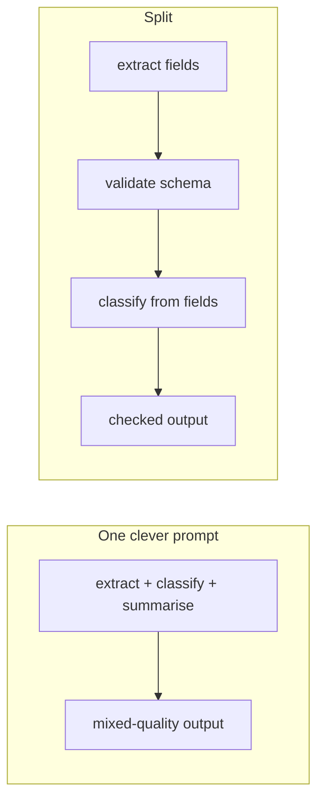

import { Tabs, TabItem } from '@astrojs/starlight/components';
import { Quiz } from '../../../components/mdx/Quiz.tsx';

## Intuition

A prompt is not an instruction to an assistant. It is **a context that makes the
output you want the most likely continuation.**

That reframing explains why the techniques that work, work. Few-shot examples do
not "teach" the model in any lasting sense — they establish a pattern that the
next tokens continue. A worked example beats a described rule because
demonstration constrains the continuation more tightly than description. Asking
for JSON after showing three JSON responses is nearly free; asking for JSON after
three paragraphs of prose is fighting the context you built.

The practical consequence is a ranking of what to reach for. In rough order of
effect per unit of effort:

1. **Give it the information.** Most "bad prompt" problems are missing-context
   problems. No wording recovers a fact that was never supplied.
2. **Show, do not describe.** Two or three examples beat two paragraphs of rules.
3. **Constrain the output shape.** A schema removes an entire class of failure.
4. **Split the task.** Two focused calls usually beat one clever one.
5. **Tune the wording.** Real, and much smaller than the four above.

Teams tend to spend their time in reverse order. The single most common
expensive mistake in this field is rewriting a prompt for a week when the
retrieval was broken.

## Mechanics

### Structure so the boundaries survive tokenisation

The model sees one flat token sequence. Delimiters that clearly separate your
instructions from supplied data help it tell them apart — and help you debug
what was actually sent.

```text
<instructions>
Classify each ticket into exactly one category: billing, technical, account.
Output JSON matching the schema. No prose.
</instructions>

<examples>
<example>
  <input>My card was charged twice this month</input>
  <output>{"category": "billing", "confidence": "high"}</output>
</example>
<example>
  <input>It says my password is wrong but I just reset it</input>
  <output>{"category": "account", "confidence": "high"}</output>
</example>
</examples>

<ticket>The export button spins forever on large reports</ticket>
```

Note the second example: `account`, not `technical`. **Examples are most useful
where they disambiguate**, so spend them on the boundary cases rather than the
obvious ones. Three examples of clearly-billing tickets teach almost nothing.

### Structured output beats parsing prose

Prose responses have to be parsed, and parsing is where reliability goes to die.
Most providers support a schema directly — use it.

<Tabs syncKey="lang">
<TabItem label="Python">

```python
from pydantic import BaseModel, Field
from typing import Literal

class Classification(BaseModel):
    category: Literal["billing", "technical", "account"]
    confidence: Literal["high", "low"]
    # Optional and last: the model fills fields in order, so anything it should
    # "think about" must come BEFORE the field it informs, not after.
    reasoning: str | None = None

# The schema is a contract the runtime enforces, not a request the model may
# decline. Validation failures become exceptions rather than silent bad data.
result = Classification.model_validate_json(response.content[0].text)
```

</TabItem>
<TabItem label="TypeScript">

```typescript
import { z } from 'zod';

const Classification = z.object({
  category: z.enum(['billing', 'technical', 'account']),
  confidence: z.enum(['high', 'low']),
  reasoning: z.string().optional(),
});

const result = Classification.parse(JSON.parse(text));
```

</TabItem>
</Tabs>

**A `Literal`/`enum` is doing more work than it looks.** "Classify as billing,
technical or account" in prose gets you `Billing`, `tech`, and occasionally
`billing (possibly technical)`. A constrained type makes those unrepresentable.

The ordering note in the comment is the part people get wrong: fields are
generated in sequence, so a `reasoning` field placed *after* `category` was
written after the decision was made. It is a post-hoc rationalisation, not the
reasoning that produced the answer. If you want reasoning to inform the output,
it goes first.

### Chain of thought, and when it is worth it

Asking for intermediate steps genuinely improves multi-step reasoning, because
the intermediate tokens become context the later tokens condition on. The model
is not "thinking harder" — it is giving itself more relevant context.

This means it helps exactly where the task decomposes into steps, and does
nothing for recall or classification:

| Task | Chain of thought |
|---|---|
| Multi-step arithmetic | Helps — though a calculator helps more |
| Logical deduction | Helps |
| Comparing options against criteria | Helps |
| Single-label classification | No effect, costs tokens |
| Factual lookup | No effect — it cannot reason its way to a fact it lacks |

It costs output tokens, which are the expensive ones and the ones that drive
latency. On a high-volume classifier, reasoning that does not change the answer
is pure waste.

### Splitting beats cleverness

A prompt doing three things badly usually becomes two prompts doing one thing
well.



The split version costs two calls and is usually better on every axis that
matters: each step is separately testable, a failure is attributable, and the
validation between them catches errors before they propagate. The one-call
version is cheaper and you cannot tell which part is wrong.

### Make refusal machine-detectable

If the model should sometimes decline, give it an **exact string**:

```text
If the documents do not contain the answer, reply exactly: NOT_IN_CONTEXT
```

"Say you do not know" produces a dozen phrasings, none of which your downstream
code matches, so the refusal gets treated as an answer.

## Cost & limits

### Prompt length is a per-request tax

Every token in the prompt is paid on every call. A system prompt that grows to
2,000 tokens across a few sprints — as they do, one edge case at a time — costs
that on every request forever.

Two things make this less painful than it sounds:

- **Prompt caching** makes a stable prefix cheap, provided the ordering is right.
  See [context engineering](/cs-fundamentals/10-ai-engineering/context-engineering/).
- **Examples are usually the largest line item.** Five examples at 150 tokens is
  750 tokens on every request, and the fifth example is rarely earning its keep.

Measure the marginal value: run your evaluation set at 0, 2, 3, and 5 examples.
The curve almost always flattens by three.

### Output tokens dominate latency

Chain-of-thought reasoning can easily triple output length, and output length
sets latency. On an interactive path, "think step by step" is a real latency
decision — worth it when it changes the answer, expensive when it does not.

<aside class="dated-figure">

**Not verified from here.** Whether a given model benefits from explicit
chain-of-thought prompting varies by model and has changed substantially — some
current models reason internally and prompting for steps adds cost without
benefit. Test on your own task rather than applying a rule of thumb from a paper
or from this page.

</aside>

## When NOT to use it

**When the problem is missing information.** No prompt recovers a fact that is
not in the context or the weights. If the answer requires last week's deploy
log, prompt engineering is the wrong project — retrieval is.

**When a schema would do it.** "Please return valid JSON" is a request the model
may decline. A structured-output API is a constraint it cannot. Never solve with
wording what you can solve with a type.

**When you are tuning without measurement.** Prompt changes have subtle,
interacting effects, and human judgement on five examples is not evaluation. A
prompt "improved" against the last three failures you looked at will usually be
worse overall. See
[evaluation](/cs-fundamentals/10-ai-engineering/evaluation/).

**When you are on the fourth rewrite.** Diminishing returns arrive fast. If
three serious attempts have not worked, the problem is almost certainly the
task decomposition, the context, or the model — not the words.

**When a deterministic program is correct.** Extracting an ISO date, validating
an email, summing a column. Prompting for these is slower, costlier, and less
reliable than the ten lines of code.

## Real-world usage

- **Classification and routing** — few-shot with boundary cases, constrained
  enum output, low temperature. The workhorse.
- **Extraction** — schema-constrained output with required source spans, so the
  result is verifiable rather than merely well-formed.
- **RAG answering** — instructions to use only the context, cite document ids,
  and emit an exact refusal string when the answer is absent.
- **Code generation** — style and constraints in the system prompt, the relevant
  interfaces in context, tests as the verifier.
- **Agent step selection** — clear tool descriptions matter far more than the
  surrounding prose; the model is choosing between schemas, so the schemas are
  the prompt.
- **Evaluation rubrics** — an LLM judge needs a rubric with explicit criteria and
  examples of each score, or it grades on fluency.

## Failure modes

### Format drift

**Symptom:** JSON parsing succeeds for weeks, then fails — usually on unusual
input, often wrapped in a markdown code fence or preceded by "Sure, here is the
JSON:".

**Cause:** the format was requested in prose, so it is a tendency rather than a
guarantee. Unusual inputs push the continuation somewhere else.

**Fix:** structured-output APIs. Failing that, validate and retry once with the
validation error included — and count the retries, because a rising retry rate
is your early warning that something upstream changed.

### Instruction burial

**Symptom:** an instruction added to the middle of a long system prompt is
ignored.

**Cause:** lost in the middle — attention is weakest there — compounded by having
too many instructions competing.

**Fix:** the critical constraints go at the beginning or the end. If the system
prompt has grown to twenty rules, that is the actual finding: split the task.

### Examples that teach the wrong thing

**Symptom:** the model copies a superficial pattern from the examples — all
outputs are the same length as the examples, or reuse their vocabulary.

**Cause:** the examples were too similar to one another, so the pattern the model
extracted included accidents of the sample.

**Fix:** vary examples deliberately along the dimensions that should vary, and
choose them for the boundaries they clarify rather than for being typical.

### Reasoning that is decoration

**Symptom:** a `reasoning` field that always agrees with the answer, including
when the answer is wrong.

**Cause:** the field is generated *after* the answer, so it is a rationalisation
of a decision already made.

**Fix:** put reasoning first in the schema if it should inform the output. If
it is only for debugging, label it as such and do not trust it as an
explanation.

### Prompt injection through supplied content

**Symptom:** a retrieved document or a user-supplied file changes the system's
behaviour.

**Cause:** the boundary between instructions and data is a learned convention,
not an enforced one. There is no parameterised query for prompts.

**Fix:** delimit data structurally, state that content inside the delimiters is
data, and — critically — do not rely on that alone. See
[guardrails](/cs-fundamentals/10-ai-engineering/guardrails/).

### Overfitting to the last failure

**Symptom:** each fix to a reported failure breaks something that used to work.

**Cause:** tuning against individual examples without a regression set.

**Fix:** every reported failure becomes a test case *before* the prompt is
changed. That set is the only thing that makes prompt changes safe.

## Practice problems

**1. The classifier that regressed.**

A ticket classifier is 91% accurate. A user reports a misrouted billing ticket.
An engineer adds a rule to the system prompt: "Tickets mentioning charges,
refunds or invoices are billing." The reported case now works. Overall accuracy
drops to 84%.

<details>
<summary>Solution</summary>

The rule is too broad. "I was charged for a plan I cancelled because the account
page would not load" mentions a charge and is an account problem. "Refund me for
the downtime" mentions a refund and is technical. A keyword rule stated in prose
gets applied as a keyword rule.

**What should have happened, in order:**

1. **Add the failing case to a regression set** before changing anything.
2. **Measure the current baseline** on that set — otherwise "84%" is not
   comparable to anything.
3. Fix it with an **example, not a rule.** Add the misrouted ticket as a few-shot
   example with the correct label. Examples constrain by demonstration and
   generalise far better than prose rules, which the model applies literally.
4. **Re-measure.** Accept the change only if overall accuracy did not drop.

**The trap to avoid:** the whole shape of this bug. One reported failure produced
one prose rule with no measurement, and traded 7 points of overall accuracy for
one case. This is the most common way prompt quality degrades over time, and it
is invisible without an evaluation set.

</details>

**2. Fix the schema.**

```python
class Extraction(BaseModel):
    amount: float
    currency: str
    vendor: str
    reasoning: str
```

Output is well-formed but the amounts are frequently wrong, and `currency`
arrives as `USD`, `usd`, `$`, and `US Dollars`. What is wrong with this schema?

<details>
<summary>Solution</summary>

Two independent problems.

**`currency: str` accepts anything**, so the model produces whatever form the
source document used. Make the invalid states unrepresentable:

```python
currency: Literal["USD", "EUR", "GBP", "JPY"]
```

Now normalisation is the runtime's job and drift is a validation error rather
than dirty data.

**`reasoning` is last, so it cannot inform the answer.** Fields are generated in
order — the model wrote `amount` first and then wrote a justification for it. To
make reasoning actually do work, it goes first:

```python
class Extraction(BaseModel):
    reasoning: str          # generated first, so it conditions what follows
    source_quote: str       # the exact text the amount came from
    amount: float
    currency: Literal["USD", "EUR", "GBP", "JPY"]
    vendor: str
```

`source_quote` is the addition that fixes the wrong amounts: assert in code that
the quote appears verbatim in the document, and that the amount appears in the
quote. That turns "frequently wrong" into "wrong and detected".

**Why not just add 'be careful with amounts' to the prompt:** because it is
unmeasurable and unenforceable. A verifiable field is worth more than any
instruction.

</details>

**3. Diagnose before prompting.**

A RAG assistant gives vague, hedging answers. The team has rewritten the system
prompt four times over two weeks with no improvement. What would you do first?

<details>
<summary>Solution</summary>

Stop rewriting and find out whether this is a prompt problem at all. Vague
hedging answers are the classic signature of **retrieval failure** — the model
is hedging because it genuinely was not given the answer, which is the correct
behaviour.

**Split the system and measure the halves separately.**

1. Build 30-50 questions with known correct source chunks.
2. Measure **recall@k**: is the right chunk in what retrieval returned? Ignore
   generation entirely.
3. If recall is poor — the likely outcome — the fix is chunking, embedding,
   hybrid search or reranking. No prompt reaches a document that was never
   retrieved.
4. Only if recall is good, hand-feed the correct chunks and check whether the
   answer is good. *That* is a prompt problem, and now you can measure changes to
   it.

**The lesson, which is the most expensive one in this field:** "bad answer" has
two causes with completely different fixes, and they are indistinguishable from
the output. Two weeks were spent on the wrong half because nobody split them —
and the split is an afternoon's work.

</details>

<Quiz
  client:visible
  id="prompt-reasoning-order"
  kind="concept"
  question="A schema has fields in the order: answer, then reasoning. What is the effect of the reasoning field?"
  options={[
    { label: 'Almost none on quality — it is generated after the answer, so it rationalises a decision already made', correct: true },
    { label: 'It improves accuracy, since the model must justify every answer it gives' },
    { label: 'It improves accuracy only when temperature is above 0' },
    { label: 'It has no effect either way, because field order in a schema is not preserved' },
  ]}
>
  <Fragment slot="explanation">
    <p>
      Tokens are generated in sequence, each conditioning on what came before. A
      reasoning field written <em>after</em> the answer cannot influence it — the
      answer tokens already exist. What you get is a post-hoc justification, and
      it will confidently justify wrong answers as readily as right ones.
    </p>
    <p>
      Reversing the order genuinely helps, and for a mechanical reason rather
      than a motivational one: the reasoning tokens become context that the
      answer tokens condition on. That is the whole basis of chain-of-thought
      prompting.
    </p>
    <p>
      The last option is the tempting distractor because JSON objects are
      unordered <em>as data</em>. But generation is sequential, so the order you
      declare is the order the model writes — which makes field order a real
      design decision rather than a formatting one.
    </p>
  </Fragment>
</Quiz>

<Quiz
  client:visible
  id="prompt-vs-retrieval"
  kind="concept"
  question="A RAG assistant gives vague, hedging answers. What should you check before rewriting the prompt?"
  options={[
    { label: 'Whether retrieval is returning the correct chunks at all — measure recall@k against known-correct sources', correct: true },
    { label: 'Whether temperature is too high, causing inconsistent phrasing' },
    { label: 'Whether the system prompt is long enough to cover the edge cases' },
    { label: 'Whether the model is large enough for the task' },
  ]}
>
  <Fragment slot="explanation">
    <p>
      Hedging is what a well-behaved model does when it was not given the
      answer. So the symptom points at retrieval first, and "bad answer" has two
      causes — bad retrieval and bad generation — that are indistinguishable from
      the output alone.
    </p>
    <p>
      Measuring recall@k separates them in an afternoon: build a set of questions
      with known source chunks and check whether retrieval returns them, ignoring
      generation entirely. If the right chunk never arrives, no prompt can
      recover it and every hour spent on wording is wasted.
    </p>
    <p>
      The distractors are all real levers that do not produce this symptom.
      Temperature affects phrasing variety, not confidence. A longer system
      prompt more often hurts — instructions get buried. And a larger model
      still cannot cite what it was never shown.
    </p>
  </Fragment>
</Quiz>

## Interview answers

**"How do you approach prompt engineering?"**

> By trying not to do it for as long as possible, because it is usually the
> lowest-leverage thing available. Most "bad prompt" problems are missing-context
> problems — no wording recovers a fact that was never supplied — so I check
> what is actually in the context first.
>
> When it is genuinely a prompting problem, the order that works for me is:
> constrain the output with a schema, show two or three examples chosen for the
> boundary cases rather than the typical ones, and split the task if it is doing
> more than one thing. Wording matters least and gets tuned last.

**"How do you get reliable structured output?"**

> Use the provider's structured-output API rather than asking in prose — a schema
> is a constraint, a request is a tendency, and the tendency fails on exactly the
> unusual inputs you care about.
>
> Two details I would mention. Use enums rather than strings wherever the value
> set is closed; it makes the invalid states unrepresentable instead of leaving
> you to normalise `USD` and `usd` and `$` downstream. And field order matters,
> because generation is sequential — a reasoning field after the answer is a
> rationalisation, not reasoning. If you want it to do work, it goes first.

**"When does chain-of-thought help?"**

> When the task actually decomposes into steps — multi-step arithmetic, logical
> deduction, weighing options against criteria. The mechanism is that the
> intermediate tokens become context the later tokens condition on, so it helps
> where later steps depend on earlier ones.
>
> It does nothing for classification or factual recall, and it is not free —
> output tokens are the expensive ones and they set latency. On a high-volume
> classifier, reasoning that does not change the answer is pure cost. And I would
> test it rather than assume: some current models reason internally and
> prompting for steps just adds tokens.

**The caveats worth voicing:**

- Examples earn their keep at the decision boundaries; three typical examples
  teach almost nothing.
- Every reported failure becomes a test case before the prompt changes,
  otherwise each fix quietly breaks something else.
- Give the model an exact refusal string, not "say you are unsure".
- The instruction/data boundary is a learned convention, not an enforced one.
- Diminishing returns arrive fast — by the fourth rewrite, the problem is the
  decomposition or the context, not the words.
