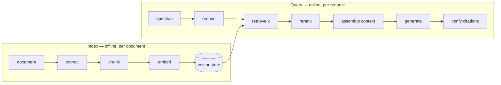

import { Tabs, TabItem } from '@astrojs/starlight/components';
import { Quiz } from '../../../components/mdx/Quiz.tsx';

## Intuition

RAG is one idea: **do not ask the model what it knows, tell it what it needs to
know.**

The model stops being a knowledge store and becomes a language interface over
documents you control. That single move fixes most of what makes raw LLM output
unusable in production — the training cutoff, the inability to see private data,
the unverifiable answer — and it introduces a retrieval system, with all the
failure modes a retrieval system has.

The framing that matters most for building one:

> **Retrieval quality is a hard ceiling on answer quality. The model cannot cite
> what it was never shown.**

Everything follows from that. If the right chunk does not arrive, no prompt, no
larger model, and no amount of temperature tuning recovers it. And since a
missing chunk and a bad prompt produce the *same* symptom — a vague, hedging, or
wrong answer — the single most valuable thing you can build is the ability to
tell them apart.

### RAG is a pipeline, not a feature



Nine stages. Each can fail independently, each is separately measurable, and
almost every team measures only the last one. That is the mistake this page is
organised around.

## Mechanics

### The minimal implementation

<Tabs syncKey="lang">
<TabItem label="Python">

```python
def answer(question: str, k: int = 5) -> Answer:
    # 1. Retrieve. Over-fetch, then rerank down — the embedding model is good
    #    at "roughly related" and bad at ordering, which is what reranking fixes.
    candidates = store.search(embed(question), k=k * 6)
    chunks = rerank(question, candidates)[:k]

    # 2. Assemble. Ids in the prompt are what make the citation checkable
    #    later; without them "cite your source" is unverifiable.
    context = "\n\n".join(
        f'<document id="{c.id}" source="{c.source}">{c.text}</document>'
        for c in chunks
    )

    # 3. Generate, constrained to the context, with an exact refusal string.
    response = model.complete(PROMPT.format(context=context, question=question))

    # 4. Verify. Grounding without verification is theatre — the model can cite
    #    a document that was never provided, and that is trivially detectable.
    provided = {c.id for c in chunks}
    cited = set(CITATION_RE.findall(response))
    if cited - provided:
        raise UngroundedAnswer(f"cited unprovided: {cited - provided}")

    return Answer(text=response, sources=[c for c in chunks if c.id in cited])
```

</TabItem>
<TabItem label="TypeScript">

```typescript
async function answer(question: string, k = 5): Promise<Answer> {
  const candidates = await store.search(await embed(question), k * 6);
  const chunks = (await rerank(question, candidates)).slice(0, k);

  const context = chunks
    .map((c) => `<document id="${c.id}" source="${c.source}">${c.text}</document>`)
    .join('\n\n');

  const text = await model.complete(prompt(context, question));

  const provided = new Set(chunks.map((c) => c.id));
  const cited = new Set(text.match(CITATION_RE) ?? []);
  const invented = [...cited].filter((id) => !provided.has(id));
  if (invented.length) throw new UngroundedAnswer(invented.join(', '));

  return { text, sources: chunks.filter((c) => cited.has(c.id)) };
}
```

</TabItem>
</Tabs>

Three details that separate this from the tutorial version:

**Over-fetch then rerank.** Embeddings are good at "roughly about the same
thing" and mediocre at ordering. Retrieving 30 and reranking to 5 costs one
extra model call and reliably improves what reaches the context. See
[reranking](/cs-fundamentals/10-ai-engineering/reranking-and-hybrid-search/).

**Ids in the markup.** Without them, "cite your sources" produces prose citations
you cannot check. With them, verification is a set difference.

**Verification is not optional.** A cited id that was never provided is a
hallucination you can detect with three lines and no judgement call.

### The prompt

```text
<instructions>
Answer using only the documents below. Cite the id of every document you use,
in the form [doc-123].

If the documents do not contain the answer, reply exactly: NOT_IN_CONTEXT
Do not use knowledge from outside the documents.
</instructions>

<documents>
{context}
</documents>

<question>{question}</question>
```

The exact refusal string is deliberate. "Say you do not know" yields a dozen
phrasings — "I'm not certain", "The provided context doesn't specify" — none of
which downstream code matches, so a refusal gets counted and displayed as an
answer.

### Measure the stages separately

This is the section that saves weeks.

| Stage | Metric | Needs a model? |
|---|---|---|
| Chunking | answer text intact in some chunk | no |
| Retrieval | recall@k, MRR | no |
| Reranking | MRR before vs after | no (one reranker call) |
| Generation | faithfulness, citation validity | partly |
| End to end | answer correctness | yes |

**Work top to bottom.** The top three are objective, cheap, and require no
judgement — and they locate the failure. An end-to-end score tells you the system
is bad; recall@k tells you *why*.

<Tabs syncKey="lang">
<TabItem label="Python">

```python
def diagnose(cases) -> dict:
    """Locate the failing stage rather than scoring the whole pipeline.

    Each number answers a different question, and they are ordered so the first
    failure explains the rest: if chunks do not contain the answer, retrieval
    recall CANNOT be good, and debugging the prompt is wasted effort.
    """
    return {
        # Can the answer be retrieved at all?
        "chunk_integrity": mean(
            any(c.answer_text in chunk.text for chunk in index.chunks_for(c.doc))
            for c in cases
        ),
        # Is it in the top k?
        "recall_at_5": mean(
            bool(set(retrieve(c.question, k=5)) & set(c.expected_chunks))
            for c in cases
        ),
        # Is it near the top?
        "mrr": mean(reciprocal_rank(retrieve(c.question, k=20), c.expected_chunks)
                    for c in cases),
        # Does the answer stay inside what it was given?
        "citation_validity": mean(is_grounded(generate(c.question)) for c in cases),
    }
```

</TabItem>
<TabItem label="TypeScript">

```typescript
async function diagnose(cases: Case[]) {
  return {
    chunkIntegrity: await mean(cases, (c) => index.chunksFor(c.doc).some((k) => k.text.includes(c.answerText))),
    recallAt5: await mean(cases, async (c) => intersects(await retrieve(c.question, 5), c.expectedChunks)),
    mrr: await mean(cases, async (c) => reciprocalRank(await retrieve(c.question, 20), c.expectedChunks)),
  };
}
```

</TabItem>
</Tabs>

A worked reading of the output:

- `chunk_integrity` 0.6 → **stop here.** 40% of answers cannot be retrieved at
  any k. Fix chunking; nothing downstream can compensate.
- integrity 0.95, `recall_at_5` 0.5 → chunks exist, retrieval misses them.
  Hybrid search or a better embedding model.
- recall 0.9, `mrr` 0.4 → found but ranked low, so it lands in the middle of the
  context where attention is weakest. Rerank.
- retrieval good, `citation_validity` 0.7 → now, and only now, it is a
  prompting problem.

## Cost & limits

### Per-request cost

For a typical configuration — k=5 chunks of 400 tokens, 300-token question and
instructions, 300-token answer:

| Stage | Tokens | Notes |
|---|---|---|
| Query embedding | ~20 | negligible, cacheable |
| Input to generator | ~2,300 | dominates |
| Output | ~300 | priced higher per token |
| Reranker | ~30 × 400 | separate, cheaper model |

**Input dominates**, which makes prompt caching the primary cost lever — provided
the prompt is ordered so a stable prefix exists. See
[context engineering](/cs-fundamentals/10-ai-engineering/context-engineering/).

The second lever is `k`, and it is the one worth reaching for first because
**lowering it often improves quality**: five reranked chunks beat twenty
unranked ones, and cost 4× less.

### Index cost

One-off embedding plus ongoing storage. For 100,000 chunks at 1536 dimensions:
614 MB raw, roughly 1 GB with an HNSW index. The recurring cost is re-embedding
when documents change, which is why an **incremental** pipeline — hash each
chunk, re-embed only what changed — is worth building before the corpus is
large.

### Latency budget

```
query embedding      30-60ms    network round trip
vector search         1-5ms     if the index is in RAM
rerank               50-150ms   a second model call
generation          1-4s       dominates everything
```

**Generation is 90%+ of the wall clock.** Optimising retrieval latency is
almost always the wrong place to spend effort; streaming the answer is the only
thing that meaningfully improves perceived speed.

<aside class="dated-figure">

**Not verified from here.** Per-token prices, reranker pricing and model latencies
are provider-specific and change. The token counts above are arithmetic from the
stated configuration; the latency ranges are directional and should be measured
on your own stack.

</aside>

## When NOT to use it

**When the corpus fits in the context window.** A few dozen pages fits in a
modern window. RAG adds extraction, chunking, embedding, an index and retrieval —
five stages that can fail — to buy nothing. Send the documents.

**When the answer is structured data.** "How many orders did this customer place
last month" is a SQL query. Embedding your database rows and retrieving them
semantically is a worse database with no transactions and approximate answers.
Text-to-SQL is the right pattern there, not RAG.

**When the question spans the whole corpus.** "What are the themes across these
500 reviews?" cannot be answered from five retrieved chunks. That is map-reduce
or aggregation, and RAG will confidently answer it from a biased sample.

**When freshness requirements are sub-minute.** The index is a cache with a
staleness window. If answers must reflect the last thirty seconds, query the
source of truth.

**When you cannot show the sources.** Much of RAG's value is that the user can
verify. If the product cannot display citations, you have taken the costs and
left the main benefit behind.

## Real-world usage

- **Internal knowledge search** — the canonical case. Wikis, runbooks, policies:
  the corpus is private, changes often, and the value is finding rather than
  reasoning.
- **Customer support deflection** — grounded in help-centre articles, with the
  cited article shown so the user can confirm.
- **Documentation assistants** — versioned by product release, which makes the
  metadata filter as important as the vector search.
- **Contract and policy review** — clause-level chunks, mandatory quoted spans,
  positioned as retrieval assistance for a professional rather than as an answer.
- **Codebase question answering** — function-level chunks, usually hybrid with
  exact symbol search, because identifiers are what embeddings are worst at.
- **Semantic caching in front of expensive calls** — the same retrieval
  machinery, answering "have we answered this already?"

## Failure modes

### The vague answer that is really a retrieval failure

**Symptom:** hedging, generic answers. The team rewrites the prompt for two
weeks with no improvement.

**Cause:** the right chunk was never retrieved. Hedging is *correct* behaviour
when the context lacks the answer.

**Fix:** measure recall@k before touching the prompt. This is the single most
expensive mistake in the field and the cheapest to avoid.

### Index and query in different embedding spaces

**Symptom:** relevance collapses to noise, all at once, no errors. Scores still
look plausible because unrelated vectors in high dimensions never score zero.

**Cause:** documents embedded with one model, queries with another.

**Fix:** store model name and version with every vector; reject mismatches at
query time. Re-embedding is a migration with a new index and a cutover.

### Stale index

**Symptom:** answers reflect documentation that was updated weeks ago.

**Cause:** no incremental re-indexing, or a failing pipeline nobody monitors.

**Fix:** hash chunks and re-embed on change; alert on index age and on the
number of documents processed per run. A pipeline that silently processes zero
documents is the common version of this.

### Retrieved but ignored

**Symptom:** the correct chunk is demonstrably in the context and the answer does
not use it.

**Cause:** lost in the middle. With k=20, the good chunk is at position 12, where
attention is weakest.

**Fix:** rerank and lower k. Five chunks at the edges beat twenty scattered.

### Citations that do not support the claim

**Symptom:** a cited document is real and provided, and does not say what was
claimed.

**Cause:** id-level verification only checks the document was present.

**Fix:** require a quoted span per claim and assert it appears verbatim in the
cited document. A substring check catches this.

### Conflicting documents

**Symptom:** the answer confidently states one of two contradictory policies.

**Cause:** an outdated document was never removed, and retrieval returned both.
Nothing in the pipeline notices disagreement.

**Fix:** metadata filtering on version and effective date, and an explicit
instruction to surface conflicts rather than resolve them. Prevention is better:
delete superseded documents from the index.

### One tenant's data reaching another

**Symptom:** a compliance incident.

**Cause:** tenant filtering implemented as a post-filter, or absent from one code
path.

**Fix:** per-tenant namespaces so isolation is structural rather than a
predicate that a code path can forget. See
[vector search](/cs-fundamentals/10-ai-engineering/vector-search/).

## Practice problems

**1. Two weeks on the wrong half.**

A team has spent two weeks improving the system prompt of a documentation
assistant. Answers remain vague. They are about to try a larger model. What do
you do instead, and what do you expect to find?

<details>
<summary>Solution</summary>

Stop and measure retrieval, which is an afternoon's work and almost certainly
where the problem is. Vague hedging answers are what a well-behaved model
produces when it was not given the answer.

**The diagnostic, in order:**

1. Build 30 questions with the answer sentence located by hand in the source
   documents.
2. **Chunk integrity** — does the answer text appear intact in any chunk? Needs no
   model, takes minutes.
3. **recall@5** — is a correct chunk in the top five?
4. Only if both are good, hand-feed the correct chunks and check the answer. That
   is the prompt's actual performance.

**What I would expect:** chunk integrity somewhere around 0.6-0.8, and recall@5
below 0.6. Those two account for most vague-answer reports.

**Why the larger model would not have helped:** it changes stage 8 of a
nine-stage pipeline. If the chunk never arrives, a better model produces a more
eloquent hedge.

**The general principle:** an end-to-end score tells you the system is bad.
Component metrics tell you which component. The stages are cheap to measure
individually and expensive to guess about.

</details>

**2. Design the freshness path.**

A support RAG covers 12,000 help articles. Editors publish 20-40 edits a day.
Users complain answers are sometimes out of date. Design re-indexing.

<details>
<summary>Solution</summary>

**Incremental, event-driven, hash-based.**

1. **Trigger on publish**, not on a schedule. A nightly full rebuild means up to
   24 hours of staleness and re-embeds 12,000 articles to reflect 30 changes.
2. **Hash each chunk** after chunking. Re-embed only chunks whose hash changed —
   an edited paragraph usually touches one or two chunks, not the whole article.
3. **Delete before insert.** The most common bug here is orphaned chunks: an
   article shortened from 10 chunks to 7 leaves 3 stale ones that still retrieve.
   Delete all chunks for the article id, then insert the new set.
4. **Store `updated_at` in the metadata** so retrieval can prefer recent versions
   and you can filter on it.

**Monitoring, which is the part that gets skipped:**

- **Index age**: max time since a published article was indexed. Alert past 15
  minutes.
- **Documents processed per run.** A pipeline silently processing zero is the
  classic failure — it looks healthy, has no errors, and quietly stops updating.
- **Chunk count per article**, to catch the orphan bug.

**The trap to avoid:** a nightly full rebuild "for consistency". It is expensive,
it does not fix the staleness window, and it hides the orphan bug by
periodically papering over it.

</details>

**3. The contradictory policy.**

A RAG assistant answers "refunds within 30 days". The current policy is 14 days.
Both documents are in the index — the 2023 version was never removed. Retrieval
returns both. Fix it at every layer.

<details>
<summary>Solution</summary>

Four layers, and the first is the real fix.

**1. Data.** Delete the superseded document from the index. This is a content
lifecycle problem masquerading as a retrieval problem, and no amount of clever
ranking fully compensates for having wrong data indexed. Most of the effort
belongs here.

**2. Metadata filtering.** Add `effective_from` / `effective_to` and
`status: current|archived`. Filter to current at query time. This makes the fix
systematic rather than a one-off deletion.

**3. Ranking.** Boost recency, so a newer document outranks an older one at
similar relevance. A tiebreak, not a solution — it degrades silently when the
older document happens to be a better lexical match.

**4. Generation.** Instruct the model to surface conflicts rather than resolve
them:

```text
If documents conflict, say so and cite both, with their dates.
Do not silently choose one.
```

This is the safety net for when the first three fail, and it converts a
confident wrong answer into a visible flag — which is the difference between a
bug and an incident.

**And add the regression test:** this exact question, asserting the answer says
14 days. It goes in the evaluation set permanently, with a note recording why —
otherwise someone deletes it in a year.

</details>

<Quiz
  client:visible
  id="rag-diagnose"
  kind="concept"
  question="A RAG system gives vague answers. Retrieval returns chunks that look topically relevant. What do you measure first?"
  options={[
    { label: 'Whether the answer text survives chunking intact, then recall@k — both objective and neither needs a model', correct: true },
    { label: 'End-to-end answer quality with an LLM judge, since that is what users experience' },
    { label: 'Whether the generation temperature is causing inconsistent phrasing' },
    { label: 'Whether the context window is large enough to hold more chunks' },
  ]}
>
  <Fragment slot="explanation">
    <p>
      "Topically relevant" is not the same as "contains the answer". The cheapest
      check is whether the answer sentence exists intact in <em>any</em> chunk —
      a substring search, no model involved. If a boundary split it, retrieval
      cannot return it at any k and every downstream fix is wasted effort.
    </p>
    <p>
      Then recall@k, which separates "the chunk exists but ranks poorly" from
      "the chunk does not exist". Those have completely different fixes and the
      same symptom.
    </p>
    <p>
      An LLM judge measures the last stage of a nine-stage pipeline: it will
      confirm the answers are bad and tell you nothing about which stage caused
      it. That is how teams end up spending weeks on prompts while retrieval is
      broken — the most expensive mistake in this field, and the cheapest to
      avoid.
    </p>
  </Fragment>
</Quiz>

<Quiz
  client:visible
  id="rag-k"
  kind="concept"
  question="Retrieval recall@20 is high but answers still miss facts that are in the retrieved chunks. What is the most likely fix?"
  options={[
    { label: 'Rerank and reduce k — the right chunk is landing in the middle of the context where attention is weakest', correct: true },
    { label: 'Increase k further, so the correct chunk is more certain to be included' },
    { label: 'Increase temperature so the model considers more of the context' },
    { label: 'Switch to a model with a larger context window' },
  ]}
>
  <Fragment slot="explanation">
    <p>
      High recall@20 means the chunk <em>is</em> in the context, so this is not a
      retrieval problem any more. Attention across a long context is roughly
      U-shaped — strongest at the beginning and end — so a chunk at position 12
      of 20 sits exactly where it is least likely to be used.
    </p>
    <p>
      Reranking fixes the ordering so the best chunk is at an edge, and lowering
      k removes the near-misses competing with it. This is the rare change that
      improves quality <em>and</em> cuts cost, since you are sending fewer tokens.
    </p>
    <p>
      Raising k or the window size makes it worse by pushing the good chunk
      further into the middle. And temperature controls sampling randomness — it
      has no bearing on which parts of the context get attended to.
    </p>
  </Fragment>
</Quiz>

## Interview answers

**"How does RAG work?"**

> You embed your documents into a vector store ahead of time, embed the user's
> question at query time, retrieve the nearest chunks, and put them in the prompt
> with an instruction to answer only from them. The model stops being a knowledge
> store and becomes a language interface over documents you control.
>
> What I would emphasise is that it is a pipeline, not a feature — extraction,
> chunking, embedding, retrieval, reranking, assembly, generation, verification.
> Each stage fails independently. The single most useful property to internalise
> is that retrieval quality is a hard ceiling on answer quality: the model cannot
> cite what it was never shown.

**"How do you debug a RAG system giving bad answers?"**

> By locating the stage, not by scoring the whole thing. A bad answer has two
> very different causes — the chunk never arrived, or it arrived and the model
> mishandled it — and they look identical from outside.
>
> So I measure upstream first, and the top checks need no model at all. Does the
> answer text survive chunking intact? That is a substring search. Then recall@k
> against known-correct chunks. Then MRR, because a chunk retrieved at rank 12
> lands in the middle of the context where attention is weakest.
>
> Only when those are healthy is it a prompting problem. Teams routinely spend
> weeks on prompts against a retrieval bug, and the split is an afternoon's work.

**"How do you stop it making things up?"**

> Grounding gets you most of the way — the answer is in the context rather than
> in the weights. But grounding without verification is theatre, so I put ids on
> the documents in the prompt and require the model to cite them. Then a cited id
> that was never provided is a set difference, three lines of code, no judgement.
>
> The next level is requiring a quoted span per claim and asserting it appears
> verbatim in the cited document. That catches the case where the document is
> real and does not say what was claimed, which is what grounding alone leaves
> behind.
>
> And an exact refusal string rather than "say you do not know" — otherwise a
> refusal comes back in a dozen phrasings and gets displayed as an answer.

**The caveats worth voicing:**

- Over-fetch and rerank; embeddings are good at "roughly related" and mediocre at
  ordering.
- Lowering k often improves quality and always cuts cost.
- Generation is 90% of the latency — optimising retrieval latency is usually
  effort in the wrong place.
- Delete before insert when re-indexing, or shortened documents leave orphaned
  chunks that still retrieve.
- Alert on documents-processed-per-run. A pipeline silently processing zero looks
  perfectly healthy.
