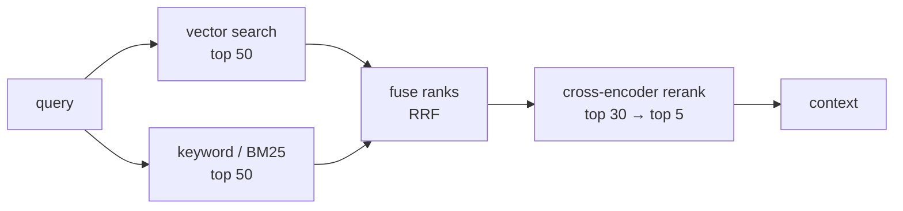

import { Tabs, TabItem } from '@astrojs/starlight/components';
import { Quiz } from '../../../components/mdx/Quiz.tsx';

## Intuition

Two facts about embedding search, both uncomfortable:

1. **It is bad at exact tokens.** `ERR_CONN_REFUSED`, an order number, a
   function name, your internal product codename. Embeddings map text to a
   semantic neighbourhood, and an identifier's meaning is that it is *that exact
   string*. A user searching for an error code does not want documents about
   similar errors.
2. **It is better at "roughly related" than at ordering.** A bi-encoder embeds
   the query and the document *independently*, so nothing in the computation
   ever compares the two directly. It compares two summaries.

Each has a fix, and they are different fixes.

**Hybrid search** handles the first: run keyword search alongside vector search
and fuse. Their failure cases are pleasingly uncorrelated — keyword search nails
identifiers and misses paraphrases, embeddings do the reverse.

**Reranking** handles the second: take the top ~30 candidates and score each one
against the query with a model that sees both together. Expensive per pair, so
it only runs on candidates, which is exactly why the cheap stage exists.

### The shape that results



Cheap and broad first, expensive and precise last. The same pyramid as any other
system that cannot afford to run its best algorithm on everything.

## Mechanics

### Why a cross-encoder is better, and why you cannot use it alone

| | Bi-encoder (embeddings) | Cross-encoder (reranker) |
|---|---|---|
| Input | query and doc **separately** | query and doc **together** |
| Output | two vectors, compared later | one relevance score |
| Precompute | yes — index once | **no — nothing can be cached** |
| Cost per query | one embedding + ANN search | one forward pass **per document** |
| Ordering quality | moderate | high |

The decisive row is precompute. A bi-encoder embeds each document once, at index
time, and a query then compares against millions of stored vectors cheaply. A
cross-encoder must run the model on every (query, document) pair — there is
nothing to store, because the score does not exist until both halves are
present.

That is why it cannot be your retriever at any scale, and why it is excellent as
a second stage: **30 forward passes is affordable, 30 million is not.**

### Reciprocal Rank Fusion

The problem with combining BM25 and cosine scores is that they are not on the
same scale, not on the same distribution, and not stable across queries.
Normalising them is a trap — min-max normalisation makes the top result of every
list score 1.0 regardless of whether it was any good.

RRF sidesteps this by using **ranks, not scores**:

$$
\text{RRF}(d) = \sum_{r \in \text{rankers}} \frac{1}{k + \text{rank}_r(d)}
$$

<Tabs syncKey="lang">
<TabItem label="Python">

```python
def rrf(rankings: list[list[str]], k: int = 60) -> list[tuple[str, float]]:
    """Fuse ranked lists by rank, not by score.

    `k` damps the influence of the top positions. At k=60 the difference between
    rank 1 and rank 2 is small (1/61 vs 1/62), so a document has to rank well in
    SEVERAL lists to win — which is the behaviour you want. At k=0 the top hit of
    any single list dominates, and fusion stops being fusion.
    """
    scores: dict[str, float] = {}
    for ranking in rankings:
        for rank, doc_id in enumerate(ranking, start=1):
            scores[doc_id] = scores.get(doc_id, 0.0) + 1.0 / (k + rank)
    return sorted(scores.items(), key=lambda kv: -kv[1])
```

</TabItem>
<TabItem label="TypeScript">

```typescript
function rrf(rankings: string[][], k = 60): [string, number][] {
  const scores = new Map<string, number>();
  for (const ranking of rankings) {
    ranking.forEach((id, i) => {
      scores.set(id, (scores.get(id) ?? 0) + 1 / (k + i + 1));
    });
  }
  return [...scores].sort((a, b) => b[1] - a[1]);
}
```

</TabItem>
</Tabs>

Three properties that make it the right default:

- **Scale-free.** No normalisation, no per-ranker weight to tune, nothing that
  drifts when the corpus changes.
- **Robust.** A document ranked 3rd in both lists beats one ranked 1st in a
  single list — which is usually correct, because agreement between independent
  rankers is real evidence.
- **One parameter**, and 60 works. Compare with weighted score fusion, which
  needs an $\alpha$ you will retune forever as score distributions shift.

### BM25, briefly

The keyword half. It scores a document by term frequency, damped, weighted by
term rarity, and normalised for length. It is what "keyword search" means in
Postgres full-text, Elasticsearch, and every search library.

The reason it survives alongside embeddings is that it does one thing perfectly:
**an exact rare token is a strong signal**, and BM25 weights it accordingly.
`ERR_CONN_REFUSED` appears in three documents out of a million, so a document
containing it is almost certainly relevant. No embedding captures that as
sharply.

### Putting it together

<Tabs syncKey="lang">
<TabItem label="Python">

```python
def hybrid_search(query: str, k: int = 5) -> list[Chunk]:
    # Both retrievers run on every query. Do NOT try to classify the query and
    # route it — the classifier will be wrong, and its errors are invisible.
    # Running both costs one extra cheap search.
    dense = [c.id for c in vector_store.search(embed(query), k=50)]
    sparse = [c.id for c in bm25_index.search(query, k=50)]

    fused = [doc_id for doc_id, _ in rrf([dense, sparse])][:30]

    # Only now the expensive model, on 30 candidates rather than the corpus.
    scored = reranker.score(query, [store.get(i) for i in fused])
    return [chunk for chunk, _ in sorted(scored, key=lambda p: -p[1])[:k]]
```

</TabItem>
<TabItem label="TypeScript">

```typescript
async function hybridSearch(query: string, k = 5): Promise<Chunk[]> {
  const [dense, sparse] = await Promise.all([
    vectorStore.search(await embed(query), 50),
    bm25Index.search(query, 50),
  ]);

  const fused = rrf([dense.map((c) => c.id), sparse.map((c) => c.id)])
    .slice(0, 30)
    .map(([id]) => id);

  const scored = await reranker.score(query, fused.map((id) => store.get(id)));
  return scored.sort((a, b) => b.score - a.score).slice(0, k).map((s) => s.chunk);
}
```

</TabItem>
</Tabs>

The comment about routing is load-bearing. The intuitive design is a classifier
that decides "this looks like an identifier, use keyword search". It performs
worse than running both, because a misrouted query fails completely and silently,
while fusion degrades gracefully — the ranker that had nothing useful to say
simply contributes low ranks.

## Cost & limits

### What each stage costs

| Stage | Latency | Scales with |
|---|---|---|
| Query embedding | 30-60ms | fixed |
| Vector search | 1-5ms | log(corpus) |
| BM25 search | 5-20ms | corpus, sub-linear |
| RRF fusion | `<1ms` | candidates |
| **Cross-encoder, 30 docs** | **50-200ms** | **linear in candidates** |

The reranker is the only stage that scales linearly with what you feed it, which
makes the candidate count the parameter that matters. Doubling from 30 to 60
doubles reranking latency for a usually-small quality gain — measure the MRR
curve rather than guessing.

### Is reranking worth its latency?

Against a generation step of 1-4 seconds, 100ms of reranking is **3-8% of the
total**. For a large improvement in what reaches the context, that is close to
free.

The exception is a search-only product with no generation, where 100ms is the
difference between a snappy result list and a sluggish one. There, consider
reranking only the top 10, or only when the top scores are close together.

### Running BM25 alongside

If you already run Postgres, `tsvector` gives you this with no new
infrastructure — an index and a query, in the database that already holds your
documents. That is the cheapest possible path to hybrid search, and it is
frequently overlooked in favour of adding a second search cluster.

<aside class="dated-figure">

**Not verified from here.** Reranker pricing, hosted-model latencies and BM25
throughput are implementation-specific. Latency ranges above are directional.
The RRF arithmetic and the bi/cross-encoder distinction are structural and do
not change.

</aside>

## When NOT to use it

**When recall is the problem, not ordering.** Reranking can only reorder what
retrieval returned. If the right chunk is not in the top 50, a reranker cannot
conjure it — and teams reach for reranking when their real problem is chunking
or embedding. Measure recall@50 first: if it is low, reranking is the wrong
project.

**When the corpus has no meaningful lexical signal.** Hybrid search earns its
keep on identifiers, jargon, product names and codes. On a corpus of narrative
prose with no such tokens, BM25 adds infrastructure for a marginal gain.

**When latency is the product.** A type-ahead suggestion box cannot afford
150ms. Reranking belongs where a human is waiting for an answer, not for a
keystroke.

**When you have not measured MRR before and after.** Reranking is easy to add and
easy to believe in. Without the before/after number you cannot tell whether you
bought anything, and a badly-matched reranker can be *worse* than the retriever's
own ordering.

## Real-world usage

- **Documentation and support search** — hybrid is close to mandatory. Error
  codes, API names and version numbers are exactly where pure vector search
  disappoints.
- **E-commerce** — brand names and SKUs are lexical; "waterproof jacket for
  hiking" is semantic. Both, always.
- **Code search** — function names and symbols demand exact matching; "how do I
  authenticate a request" needs semantics.
- **Legal research** — case citations are identifiers; the legal question is
  semantic.
- **RAG generally** — over-fetch 30-50, rerank to 5. The most common single
  quality improvement available to an existing RAG system.
- **Multi-source retrieval** — RRF is also how you fuse results from several
  corpora whose scores were never comparable in the first place.

## Failure modes

### Adding a reranker did nothing

**Symptom:** MRR is unchanged after adding reranking.

**Cause:** the candidate set does not contain the right document. Reranking
reorders; it cannot retrieve.

**Fix:** measure recall@50 first. If it is 0.6, your ceiling is 0.6 no matter how
good the reranker is. Fix retrieval.

### Weighted score fusion that needs constant retuning

**Symptom:** an $\alpha$ balancing BM25 and cosine works, then stops working
after a corpus change.

**Cause:** the two score distributions shifted independently. Normalisation does
not stabilise them — it just hides the shift.

**Fix:** RRF. Ranks are stable under distribution changes in a way scores are
not.

### The router that guesses wrong

**Symptom:** some queries return nothing useful, with no pattern anyone can find.

**Cause:** a classifier routing between keyword and vector search. When it
misroutes, the query fails completely, and there is no signal it happened.

**Fix:** run both and fuse. Fusion degrades gracefully where routing fails
absolutely.

### Reranking the wrong field

**Symptom:** the reranker scores everything similarly.

**Cause:** it was given a chunk that is mostly boilerplate, or a summary rather
than the text that matched.

**Fix:** rerank the same text the user's answer will come from. And strip
boilerplate — a cross-encoder is not immune to every document looking alike.

### Latency doubled after tuning candidates upward

**Symptom:** p99 degrades after raising the candidate count for quality.

**Cause:** the reranker is linear in candidates, unlike every stage before it.

**Fix:** plot MRR against candidate count. It flattens, usually well before 50 —
past the flattening point you are buying latency and nothing else.

## Practice problems

**1. The error code nobody can find.**

A documentation search uses pure vector retrieval. Users searching
`ERR_CONN_REFUSED` get pages about connection handling generally, never the page
documenting that specific code. Semantic questions work well.

<details>
<summary>Solution</summary>

The failure is structural, not a tuning issue. `ERR_CONN_REFUSED` almost
certainly tokenises into fragments, and its *meaning* to the embedding model is
"something about connections and errors" — which is exactly the wrong
generalisation. The user wants that literal string.

**Fix: add BM25 and fuse with RRF.**

BM25 handles this perfectly and for a specific reason: the token appears in a
handful of documents out of the corpus, so its IDF is enormous, and a document
containing it scores far above everything else. That sharpness is precisely what
embeddings smooth away.

```python
dense  = vector_store.search(embed(query), k=50)
sparse = bm25_index.search(query, k=50)
results = rrf([ids(dense), ids(sparse)])
```

**Why not detect identifiers and route to BM25:** the classifier will be wrong on
cases nobody anticipated — a product name that looks like a word, a version
string, a mixed query like "ERR_CONN_REFUSED when deploying". A misroute fails
completely and silently. Running both costs one cheap extra search and degrades
gracefully.

**Why not just fix the embeddings:** you cannot. This is not a quality problem
with the model; it is what semantic similarity *means*. The tools are
complementary by construction, which is why hybrid is the standard answer rather
than a workaround.

</details>

**2. Fusion arithmetic.**

Two rankers return, for one query:

```
vector: [A, B, C, D, E]
bm25:   [C, F, A, G, B]
```

Compute RRF with k=60 and explain the winner.

<details>
<summary>Solution</summary>

$\text{RRF}(d) = \sum 1/(60 + \text{rank})$, absent documents contribute nothing:

| Doc | vector | bm25 | Score |
|---|---|---|---|
| A | 1 → 1/61 | 3 → 1/63 | 0.01639 + 0.01587 = **0.03226** |
| C | 3 → 1/63 | 1 → 1/61 | 0.01587 + 0.01639 = **0.03226** |
| B | 2 → 1/62 | 5 → 1/65 | 0.01613 + 0.01538 = **0.03151** |
| D | 4 → 1/64 | — | 0.01563 |
| F | — | 2 → 1/62 | 0.01613 |
| E | 5 → 1/65 | — | 0.01538 |
| G | — | 4 → 1/64 | 0.01563 |

**A and C tie at the top**, and that is the behaviour you want. Each was first in
one ranker and third in the other, so they have equally strong support from two
independent signals. B follows closely, appearing in both.

**The important comparison is B against F.** F was ranked 2nd by BM25 — higher
than B's 5th — yet B scores above it, because B appears in *both* lists. RRF is
rewarding agreement over any single ranker's confidence, and that is the whole
point: two independent methods agreeing is stronger evidence than one method
being sure.

**Why k=60 matters here:** the gap between 1/61 and 1/62 is tiny, so no single
top-1 placement dominates. At k=0, A would score 1.0 + 0.333 = 1.333 and C would
score 0.333 + 1.0 — still tied, but F at 0.5 would leap above B at 0.7... and
generally the top hit of any one list would dominate. The damping is what makes
fusion actually fuse.

</details>

**3. Budget the pipeline.**

A RAG endpoint has a 2-second p95 budget. Current: query embedding 45ms, vector
search 3ms, generation 1,400ms. You want to add hybrid search and reranking.
What fits, and what would you measure?

<details>
<summary>Solution</summary>

```
current:                    45 + 3 + 1,400          = 1,448ms
+ BM25 (parallel w/ vector):  no added latency       = 1,448ms
+ RRF:                        <1ms                   = 1,449ms
+ rerank 30 candidates:       ~120ms                 = 1,569ms
```

**It fits, with ~430ms of headroom.** Two things make it comfortable:

- **BM25 runs in parallel with vector search**, so it is free in wall-clock
  terms. Issue both concurrently; a sequential implementation wastes 15ms for no
  reason.
- **Reranking is ~8% of the budget** and it improves what reaches the context,
  which is the highest-leverage thing available.

**What I would measure before shipping:**

1. **recall@50 of the fused candidate set.** If this is not high, reranking has
   nothing to work with and the 120ms is wasted. This is the go/no-go number.
2. **MRR against candidate count** — 10, 20, 30, 50. It flattens; find where.
   Past the flattening point you are buying latency and nothing else.
3. **p99, not p95.** Reranker latency has a worse tail than the arithmetic above
   suggests, especially on a hosted endpoint.

**The lever I would keep in reserve:** with reranking in place, `k` to the
generator can usually *drop* — five reranked chunks beat ten unranked ones. That
cuts generation input tokens, which claws back both cost and some latency.

</details>

<Quiz
  client:visible
  id="rerank-rrf"
  kind="concept"
  question="Why does Reciprocal Rank Fusion use ranks rather than normalised scores?"
  options={[
    { label: 'BM25 and cosine scores are on different scales and distributions that shift with the corpus; ranks are stable', correct: true },
    { label: 'Ranks are cheaper to compute than normalised scores' },
    { label: 'Score normalisation is lossy, and ranks preserve the original magnitudes' },
    { label: 'Ranks allow the two retrievers to run in parallel, which scores do not' },
  ]}
>
  <Fragment slot="explanation">
    <p>
      A BM25 score is unbounded and corpus-dependent; a cosine similarity sits in
      a narrow band whose baseline depends on the embedding model. There is no
      principled conversion between them, and min-max normalisation actively
      misleads — it forces the top hit of every list to 1.0 whether or not it was
      any good.
    </p>
    <p>
      Ranks discard magnitude, which sounds lossy and is the point: rank 1 means
      the same thing in both lists. That makes fusion scale-free, with no
      per-ranker weight to tune and nothing that drifts when the corpus changes.
    </p>
    <p>
      The <code>k</code> constant (typically 60) damps the top positions so a
      document must rank well in <em>several</em> lists to win. That is why a
      document at rank 3 in both can beat one at rank 1 in only one — agreement
      between independent retrievers is stronger evidence than one retriever's
      confidence.
    </p>
  </Fragment>
</Quiz>

<Quiz
  client:visible
  id="rerank-ceiling"
  kind="concept"
  question="You add a cross-encoder reranker and MRR does not improve. What is the most likely cause?"
  options={[
    { label: 'The correct document is not in the candidate set — reranking reorders, it cannot retrieve', correct: true },
    { label: 'The reranker needs fine-tuning on your domain before it works at all' },
    { label: 'The candidate count is too low for the reranker to have signal' },
    { label: 'Cross-encoders only improve precision, so MRR is the wrong metric' },
  ]}
>
  <Fragment slot="explanation">
    <p>
      A reranker's ceiling is whatever the first stage handed it. If recall@50 is
      0.6, then 40% of queries have no correct document among the candidates and
      no reordering can produce one. Measuring recall@50 <em>before</em> adding a
      reranker tells you whether there is anything to gain.
    </p>
    <p>
      This matters because reranking is easy to add and easy to believe in, and
      it is frequently reached for when the real problem is upstream — chunking
      that split the answer, or an embedding model that never surfaced the right
      chunk.
    </p>
    <p>
      MRR is exactly the right metric here: it measures whether the correct
      document is near the top, which is precisely what reranking is supposed to
      change. Recall@k, by contrast, would be unaffected by reranking a fixed
      candidate set — the same documents are present either way.
    </p>
  </Fragment>
</Quiz>

## Interview answers

**"Why is hybrid search better than pure vector search?"**

> Because embeddings are structurally bad at exact tokens. An error code or a
> SKU means "that literal string", and semantic similarity generalises it to "a
> thing like that" — which is the wrong answer. BM25 handles it perfectly,
> because a rare token has enormous IDF and a document containing it scores far
> above everything else.
>
> The two methods fail on uncorrelated cases, which is what makes fusing them
> worth the infrastructure. And I would run both on every query rather than
> routing — a classifier deciding "this looks like an identifier" fails
> completely and silently when it guesses wrong, where fusion degrades
> gracefully.

**"How do you combine two rankings with incompatible scores?"**

> Reciprocal Rank Fusion. Sum one over (k plus rank) across the rankers, with k
> around 60. It uses ranks rather than scores, so the fact that BM25 is unbounded
> and cosine sits in a narrow band stops mattering.
>
> The alternative — normalise both and blend with a weight — needs an alpha that
> you retune forever, because the score distributions shift as the corpus
> changes. And min-max normalisation is actively misleading: it forces the top
> hit of every list to 1.0 whether or not it was good.
>
> The k constant is doing real work too. It damps the top positions so a document
> has to rank well in several lists to win, which means agreement between
> retrievers beats one retriever's confidence.

**"When is a cross-encoder worth the latency?"**

> Almost always in RAG, and the reason is the ratio. Reranking 30 candidates is
> around 100ms against a generation step of one to four seconds — under 10% of
> the budget — and it improves what actually reaches the context, which is the
> highest-leverage thing available.
>
> The precondition I would check first is recall@50. A reranker can only reorder
> what it was given, so if the correct document is not in the candidate set the
> latency buys nothing. That is the most common reason adding one appears to do
> nothing.
>
> Where I would not use it is search-as-you-type, where 100ms is the product.

**The caveats worth voicing:**

- A cross-encoder cannot be the retriever: nothing can be precomputed, because
  the score does not exist until query and document are both present.
- Run BM25 in parallel with vector search — sequentially is free latency thrown
  away.
- Plot MRR against candidate count; it flattens, and past that you are buying
  latency only.
- With reranking in place, k to the generator can usually drop, which claws back
  cost and tokens.
- Rerank the same text the answer will come from, not a summary of it.
