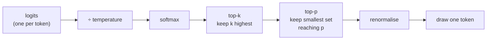

import { Tabs, TabItem } from '@astrojs/starlight/components';
import { Quiz } from '../../../components/mdx/Quiz.tsx';
import { TemperatureSampler } from '../../../components/viz/widgets/TemperatureSampler.tsx';

## Intuition

A language model does not produce text. It produces, for every position, **a
probability distribution over its entire vocabulary** — fifty thousand or so
numbers that sum to 1. Something else has to turn that distribution into a
token, and that something is the sampler.

This split is the most useful thing to internalise on this page, because it
tells you which problems are which:

- The **model** decides what is likely. Changing that means changing the model,
  the prompt, or the context.
- The **sampler** decides what to do with those likelihoods. Temperature, top-p
  and top-k live entirely here, they are cheap, and they are yours.

An enormous amount of production LLM behaviour — output that rambles, output
that repeats, output that varies between identical requests — is a sampler
setting, not a model capability. It is worth being able to tell those apart
before reaching for a bigger model.

### Tokens, briefly

The vocabulary is not words. It is **tokens**: sub-word fragments chosen so
common words are one token and rare ones split into several. As a working rule
for English prose, one token is about four characters, so 1,000 tokens is
roughly 750 words. Non-English text and code both fragment worse, sometimes far
worse — which is why an identical prompt in another language can cost twice as
much.

Two consequences that bite in practice:

- **The model cannot see letters.** "How many r's in strawberry" is hard for a
  system whose atoms are multi-character fragments, and this is a tokenisation
  artefact rather than a reasoning failure.
- **Your cost and your context limit are measured in tokens, not characters.**
  Estimating either from string length will be wrong by a factor that depends on
  the content.

## Mechanics

### Watch a distribution get reshaped

<TemperatureSampler client:visible />

Everything in that widget is counted from a small corpus that ships alongside
it, so the probabilities are real frequencies rather than invented numbers. The
grey bar is the model's own probability; the solid bar is what the sampler
leaves after your settings. Three things to try:

1. **Drag temperature to 0.** The output collapses into `the index makes the
   index makes…` — a loop, identical for every seed.
2. **Set top-p to 0.9, then drag temperature from 0.5 up to 2.** Watch the
   number of surviving tokens *grow*. That coupling is the point below.
3. **Set top-k to 1.** Entropy goes to exactly 0 — there is no choice left to
   make.

### The pipeline

Every mainstream inference stack applies the same four stages in the same order.



**Temperature first** is the detail that explains most confusing behaviour, and
it comes back below.

### Temperature

Divide every logit by $T$, then softmax:

$$
p_i = \frac{e^{z_i / T}}{\sum_j e^{z_j / T}}
$$

- $T < 1$ spreads the logits apart, so the leader pulls further ahead. Sharper,
  more predictable.
- $T = 1$ is the model's own distribution, untouched.
- $T > 1$ squashes them together toward uniform. Flatter, more surprising.
- $T = 0$ is a division by zero. Every implementation special-cases it to mean
  **greedy**: always take the argmax.

<Tabs syncKey="lang">
<TabItem label="Python">

```python
import math

def softmax(logits: list[float]) -> list[float]:
    # Subtracting the max is mathematically a no-op — the constant cancels —
    # and practically the difference between working and returning NaN. At
    # T=0.05 a logit of 3 becomes 60, and math.exp(400) overflows.
    top = max(logits)
    exps = [math.exp(z - top) for z in logits]
    total = sum(exps)
    return [e / total for e in exps]

def apply_temperature(logits: list[float], t: float) -> list[float]:
    if t <= 0:
        best = logits.index(max(logits))          # argmax: ties break by position
        return [1e9 if i == best else -1e9 for i, _ in enumerate(logits)]
    return [z / t for z in logits]
```

</TabItem>
<TabItem label="TypeScript">

```typescript
function softmax(logits: number[]): number[] {
  const top = Math.max(...logits);
  const exps = logits.map((z) => Math.exp(z - top));
  const total = exps.reduce((a, b) => a + b, 0);
  return exps.map((e) => e / total);
}

function applyTemperature(logits: number[], t: number): number[] {
  if (t <= 0) {
    const best = logits.indexOf(Math.max(...logits));
    return logits.map((_, i) => (i === best ? 1e9 : -1e9));
  }
  return logits.map((z) => z / t);
}
```

</TabItem>
</Tabs>

That max-subtraction is not defensive programming for its own sake. Low
temperature is the first setting anyone reaches for, and it is precisely where a
naive `exp` overflows.

### Top-k and top-p

Both truncate the tail before sampling. They differ in *how* they decide where
the tail starts.

**Top-k** keeps the `k` highest-probability tokens. Fixed width, regardless of
how confident the model is.

**Top-p** (nucleus sampling) keeps the smallest set of tokens whose cumulative
probability reaches `p`. **Adaptive width** — and that is the entire argument
for preferring it:

| The model is… | top-k = 40 keeps | top-p = 0.9 keeps |
|---|---|---|
| certain (leader at 0.95) | 40 tokens, 39 of them junk | 1 token |
| torn (top 20 all ≈ 0.04) | 40 tokens | ~22 tokens |

Fixed-k admits garbage when the model is confident and truncates real options
when it is not. Top-p tracks the model's own confidence, which is why it is the
default nearly everywhere.

One boundary detail worth getting right: **the token that crosses the threshold
is included.** Otherwise `p = 0.9` against a leader already holding 0.95 keeps
nothing at all, and the sampler has no candidates.

### Why temperature and top-p fight

Because temperature is applied **first**, raising it does not merely flatten the
odds — it moves probability mass out of the leader and into the tail, so the
nucleus must widen to reach `p`.

In the widget, with top-p held at 0.9, going from temperature 0.5 to 2.0
increases the number of surviving tokens. Neither knob was touched except
temperature.

**The practical rule: change one, not both.** Most teams should set top-p to
0.9-0.95, leave it, and tune temperature alone. "Temperature 1.4 with top-p 0.9"
is not a mild combination of two mild settings.

### Sampling

<Tabs syncKey="lang">
<TabItem label="Python">

```python
import random

def sample(tokens: list[str], probs: list[float], rng: random.Random) -> str:
    # Inverse-CDF. Walk the cumulative distribution until it passes r.
    r = rng.random()
    for token, p in zip(tokens, probs):
        r -= p
        if r <= 0:
            return token
    # Floating-point residue can leave r a hair above zero. Returning the last
    # live token is correct and cannot fall off the end.
    return tokens[-1]
```

</TabItem>
<TabItem label="TypeScript">

```typescript
function sample(tokens: string[], probs: number[], rng: () => number): string {
  let r = rng();
  for (let i = 0; i < tokens.length; i++) {
    r -= probs[i]!;
    if (r <= 0) return tokens[i]!;
  }
  return tokens[tokens.length - 1]!;
}
```

</TabItem>
</Tabs>

## Cost & limits

### Entropy is the honest readout

Temperature is a knob; its *effect* depends on the distribution it acts on.
Entropy measures the effect directly and is comparable across distributions:

$$
H = -\sum_i p_i \log_2 p_i
$$

Measured on the widget's real distribution after the word "the" (11 possible
continuations):

| Temperature | Entropy | Effective choices ($2^H$) |
|---|---|---|
| 0.3 | 2.30 bits | 4.9 |
| 1.0 | 3.23 bits | 9.4 |
| 2.0 | 3.40 bits | 10.5 |

Two things this table shows that "temperature 2 is twice as random" hides.
Doubling temperature from 1 to 2 barely moves entropy — it is already near the
3.46-bit ceiling for 11 tokens. And $2^H$ is the number that actually means
something: "the model is effectively choosing among five options" is checkable,
"temperature 0.3" is not.

### Sampling is free; the tokens are not

Temperature, top-k and top-p cost essentially nothing — a few operations over a
vocabulary-sized array, per token, which is noise beside the forward pass.

What sampling settings *do* affect is length, and length is what you pay for.
High temperature produces more rambling and fewer clean stops, so it raises
output tokens — and output tokens are typically several times the price of input
tokens. A temperature change can move your bill without touching a single other
setting.

<aside class="dated-figure">

**Not verified from here.** Per-token prices and the input/output ratio vary by
provider and change. Check your provider's current pricing and record the date.
The entropy figures above need no vendor: they are computed from the corpus in
`traces/sampling.ts` and asserted in its test suite.

</aside>

### Latency is set by output length, not settings

Generation is sequential — each token conditions on the last — so time to
completion is roughly `output_tokens × time_per_token`. **A 500-token answer
takes about five times as long as a 100-token one.** No sampler setting changes
that, which makes "ask for a shorter answer" the most reliable latency
optimisation available, and streaming the only way to improve *perceived*
latency once the answer is genuinely long.

## When NOT to use it

**Do not raise temperature to make output "more creative" when the real problem
is the prompt.** Temperature adds entropy; it does not add ideas. A model given
a vague brief at temperature 1.3 produces varied mediocrity rather than better
work. Fix the prompt first — it is the higher-leverage knob and its effects are
inspectable.

**Do not set temperature to 0 for extraction and classification without
checking.** It is the right instinct, but greedy decoding on a genuinely
uncertain distribution picks the leader by a hair and commits with no signal
that it was close. For anything where you need to know the model was unsure,
read the log-probabilities rather than inferring confidence from a
zero-temperature answer.

**Do not use both top-k and top-p to "be safe".** They compose in ways nobody
reasons about correctly, and top-k is nearly always the redundant one. Pick
top-p.

**Do not tune sampling at all until you have evaluation.** These are three
continuous knobs whose effects are subtle and interacting. Without a scored test
set you are not tuning, you are wandering — and you will end up with settings
that felt better on the last three examples you happened to look at.

## Real-world usage

- **Extraction, classification, structured output** — temperature 0. You want
  the same input to give the same output, and there is no upside to variety.
- **Chat and assistants** — temperature 0.7-1.0 with top-p ~0.95. Low enough to
  stay coherent, high enough not to loop.
- **Creative drafting and brainstorming** — temperature 1.0-1.3, and generate
  several candidates rather than one. The point is a spread to choose from.
- **Code generation** — low, typically 0-0.3. There are far more ways to be
  wrong than right, and the distribution's tail is mostly syntax errors.
- **Self-consistency** — deliberately sample the *same* prompt several times at
  temperature ~0.7 and take the majority answer. This uses variance as a
  feature: agreement across independent samples is a genuine confidence signal
  in a way that a single confident-sounding answer is not.

## Failure modes

### Temperature 0 loops

**Symptom:** the model repeats a phrase, a sentence, or a list item forever, and
often stops only at the token limit.

**Cause:** greedy decoding is a deterministic walk over finitely many states, so
it must eventually revisit a state — and once it does, it repeats forever. The
widget shows this on the first drag: `the index makes the index makes…`

**Fix:** any temperature above 0, or a repetition penalty. This is why no chat
product ships at temperature 0 despite reproducibility being desirable.

### "Temperature 0 is deterministic" is not quite true

**Symptom:** the same request at temperature 0 returns different text, rarely,
and never when you are watching.

**Cause:** greedy decoding is deterministic *given identical logits*. The logits
themselves are not guaranteed identical — batching changes floating-point
reduction order on GPU, and the resulting last-bit differences flip genuinely
near-tied tokens. Mixture-of-experts routing can depend on batch composition
too, which means **your request's output can depend on who else was in the batch
with you.**

**Fix:** treat temperature 0 as "low variance", not "no variance". If you need
byte-identical output, cache the response. If you need auditability, store what
was actually returned rather than assuming you can regenerate it.

### The tail poisons long outputs

**Symptom:** output starts well and degenerates — a paragraph in, it drifts
off-topic or slips into another language.

**Cause:** with no truncation, a rare token gets sampled, and the model now
conditions on it. Errors compound because each token becomes context for the
next. A single unlucky draw at token 40 changes everything after it.

**Fix:** top-p at 0.9-0.95 truncates the tail these draws come from. This is the
main reason nucleus sampling is a default rather than an option.

### Prices and limits are token-based, and your estimate is character-based

**Symptom:** costs run over projections; requests hit the context limit at
"clearly short enough" inputs.

**Cause:** the 4-characters-per-token rule is an English-prose average. Code,
JSON, non-Latin scripts and long identifiers all fragment far worse — sometimes
one token per character.

**Fix:** count tokens with the provider's tokenizer, not `len(text) / 4`. Assert
against the limit before sending rather than handling the error after.

### Silent truncation at max\_tokens

**Symptom:** JSON that fails to parse, answers that stop mid-sentence.

**Cause:** the output hit `max_tokens`. The response is returned normally, with
`finish_reason: "length"` — a field almost nobody checks.

**Fix:** check `finish_reason` on every call and treat `"length"` as an error.
This is the single cheapest reliability improvement available in most LLM
codebases.

## Practice problems

**1. The extraction job that will not reproduce.**

A nightly job extracts structured fields from documents at temperature 0. It is
supposed to be idempotent, but re-running it over the same documents produces
diffs on about 1 in 500 records. The prompt has not changed.

<details>
<summary>Solution</summary>

Temperature 0 gives you greedy decoding, not determinism. It is deterministic
given identical logits, and logits are not guaranteed identical across requests:
batching changes GPU floating-point reduction order, and last-bit differences
flip tokens that were nearly tied. 1 in 500 is exactly the rate you would expect
from near-ties on ambiguous documents.

**Fix:** stop relying on regeneration for idempotency.

1. Cache by a hash of `(document, prompt, model, version)`, and re-use the stored
   output rather than recomputing it.
2. Store what the model actually returned, since that is the auditable artefact.
3. If a field is genuinely ambiguous, that is signal — log the log-probability
   and route low-confidence records to review.

**The trap to avoid:** switching models or providers to find a "properly
deterministic" one. This is a property of batched floating-point inference, not
a vendor defect.

</details>

**2. Diagnose the knobs.**

Three complaints from one product, all sampler-related:

- (a) The summariser sometimes emits a sentence in Spanish.
- (b) The FAQ bot answers the same question differently each time, and support
  cannot reproduce reports.
- (c) The brainstorming tool returns three nearly identical ideas.

Settings: temperature 1.0, top-p 1.0, top-k 0 — for all three features.

<details>
<summary>Solution</summary>

One shared config for three features with three different requirements. Each
needs a different setting, and (a) needs a fix nobody guesses first.

**(a) Spanish sentence — the untruncated tail.** With top-p at 1.0 nothing is
cut, so a rare token is occasionally drawn; once "En" is in the context the
model conditions on it and continues in Spanish. Fix: top-p 0.9. Note this is
*not* a temperature problem — temperature 1.0 is the model's own distribution,
and the issue is that its tail is never truncated.

**(b) Irreproducible FAQ answers — wrong feature for sampling variety.** A
factual lookup has no upside from variance. Fix: temperature 0-0.2 plus response
caching so support can reproduce a report from the cache rather than the model.

**(c) Identical brainstorms — variance is the product here.** Fix: temperature
1.1-1.3, and generate n candidates in one request rather than hoping a single
completion is diverse. Diversity across independent samples is a different thing
from diversity within one.

**The general lesson:** sampling settings belong to the *task*, not the
application. One global temperature is a smell.

</details>

**3. Predict the interaction.**

A team runs temperature 0.8, top-p 0.9. Output is too conservative, so they
raise temperature to 1.6 — and output becomes much wilder than the 2× they
expected. Why, and what should they have done?

<details>
<summary>Solution</summary>

Because temperature is applied **before** top-p, the two changes compound.

At 0.8, temperature sharpens the distribution, so the leader holds a large share
and the 0.9 nucleus is narrow — maybe four or five tokens. At 1.6 the
distribution flattens, mass moves from the leader into the tail, and the nucleus
must now widen to reach 0.9 — perhaps a dozen tokens. So the change did two
things: it flattened the odds *and* admitted roughly three times as many
candidates. The widget shows exactly this, with top-p fixed at 0.9.

**What they should have done:** move one knob. Fix top-p at 0.9 and step
temperature 0.8 → 1.0 → 1.1, scoring each on a held-out set. If output is still
too conservative at temperature 1.0, the next lever is the prompt, not a
temperature of 1.6.

**Why not raise top-p instead:** it does not address conservatism. Top-p only
ever removes candidates; raising it re-admits low-probability ones without
changing the odds among the plausible tokens, which is a good way to add
weirdness without adding range.

</details>

<Quiz
  client:visible
  id="sampling-topp-vs-topk"
  kind="concept"
  question="The model is very confident — the top token holds 0.95 probability. What do top-k = 40 and top-p = 0.9 each keep?"
  options={[
    { label: 'top-k keeps 40 tokens; top-p keeps 1', correct: true },
    { label: 'Both keep roughly the same few tokens' },
    { label: 'top-k keeps 40; top-p keeps 0, so sampling falls back to greedy' },
    { label: 'top-k keeps 1, since the others are below the cutoff' },
  ]}
>
  <Fragment slot="explanation">
    <p>
      Top-k is a <strong>fixed</strong> width: it keeps the 40 highest tokens no
      matter how the probability is distributed, so 39 near-zero tokens stay
      eligible. Top-p is <strong>adaptive</strong>: it walks down the sorted
      list until the cumulative probability reaches 0.9, and since the first
      token already holds 0.95, it stops there.
    </p>
    <p>
      The third option names a real design question with the opposite answer.
      The token that <em>crosses</em> the threshold is included — if it were
      not, a leader above <code>p</code> would leave the sampler with no
      candidates at all. Inclusive boundary, always at least one token.
    </p>
    <p>
      This is the whole argument for nucleus sampling: one setting behaves
      correctly whether the model is certain or torn, where any fixed{' '}
      <code>k</code> is wrong at one end or the other.
    </p>
  </Fragment>
</Quiz>

<Quiz
  client:visible
  id="sampling-temp-zero"
  kind="concept"
  question="Which is the most accurate statement about temperature 0?"
  options={[
    { label: 'It is greedy decoding — low variance, but not a guarantee of identical output across requests', correct: true },
    { label: 'It makes the API fully deterministic: same input always gives byte-identical output' },
    { label: 'It disables sampling, so top-p and top-k become the only active controls' },
    { label: 'It returns the model\'s most confident answer, so it is the right default for accuracy' },
  ]}
>
  <Fragment slot="explanation">
    <p>
      Greedy decoding is deterministic <em>given identical logits</em>, and that
      premise does not hold in production. Batched GPU inference changes
      floating-point reduction order, so logits differ in their last bits
      between runs, and genuinely near-tied tokens flip. With
      mixture-of-experts routing, output can even depend on which other requests
      shared your batch.
    </p>
    <p>
      The other options each contain a plausible-sounding error. Temperature 0
      does not disable the filters — it makes them irrelevant, since a one-hot
      distribution survives any truncation. And "most confident" is not the same
      as "most accurate": greedy decoding picks the leader by a hair with no
      signal that it was close, which is why self-consistency (sampling several
      times at moderate temperature and taking the majority) often beats it on
      reasoning tasks.
    </p>
    <p>
      The rule: treat temperature 0 as low-variance, and get reproducibility
      from a cache rather than from the sampler.
    </p>
  </Fragment>
</Quiz>

## Interview answers

**"What does temperature actually do?"**

> It divides the logits before the softmax. Below 1 that spreads them apart so
> the leading token pulls ahead and output gets more predictable; above 1 it
> squashes them together toward uniform. At 0 it degenerates to argmax.
>
> The framing I find most useful is that the model produces a distribution and
> the sampler decides what to do with it. So temperature is not a model
> capability — it is a cheap knob on the output side, and a lot of behaviour
> people blame on the model is really a sampler setting.

**"Top-p or top-k?"**

> Top-p, essentially always. Top-k keeps a fixed number of candidates regardless
> of how confident the model is, so it admits junk when the model is certain and
> truncates real options when it is torn. Top-p keeps the smallest set reaching
> a cumulative probability, so its width tracks the model's own confidence.
>
> The caveat worth voicing is that temperature is applied before top-p, so they
> are coupled. Raising temperature pushes mass into the tail, which widens the
> nucleus — so changing both at once gives you a bigger effect than you
> intended. I fix top-p around 0.9 and tune temperature alone.

**"How would you make an LLM feature reproducible?"**

> Not with temperature 0 alone, which is the usual answer and is only half
> right. Greedy decoding is deterministic given identical logits, but batching
> changes floating-point reduction order on GPU and near-tied tokens flip. In
> practice it is low-variance, not zero-variance.
>
> So I cache. Key on a hash of the prompt, the model, and the version, and
> store what was actually returned — that is the auditable artefact. If someone
> needs to reproduce a support report six weeks later, the cache answers it and
> regeneration does not.

**The caveats worth voicing:**

- Sampling settings belong to the task, not the application. One global
  temperature across features is a smell.
- Check `finish_reason` on every call. Silent truncation at `max_tokens` is the
  cheapest reliability bug to fix and the most commonly shipped.
- Count tokens with the real tokenizer; `len(text) / 4` is an English-prose
  average that code and non-Latin scripts break badly.
- Entropy, or $2^H$ as "effective number of choices", is a more honest readout
  than any temperature value.
- Do not tune three continuous interacting knobs without a scored evaluation
  set. That is wandering, not tuning.
