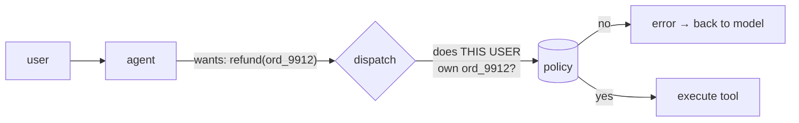

import { Tabs, TabItem } from '@astrojs/starlight/components';
import { Quiz } from '../../../components/mdx/Quiz.tsx';

## Intuition

Tool use is the mechanism by which a model that can only produce text gets to
affect the world. You describe some functions; the model emits a structured
request to call one; **your code decides whether and how to run it**, and returns
the result as more context.

That middle clause is the whole security and reliability story, and it is worth
stating early because the phrasing "the model calls a function" hides it. The
model does not call anything. It produces a JSON object saying it would like to.
Everything after that is ordinary software, under your control, and every
guarantee you have lives there.

### The framing that makes tools good

**The schema is the prompt.** A tool definition is not documentation attached to
a function — it is the entire basis on which the model decides whether this tool
is relevant, and what to pass it. A vague description produces wrong tool
selection in exactly the way a vague prompt produces wrong output, and for the
same reason.

This reframing has a practical consequence people find surprising: **the most
effective way to improve an agent is usually to rewrite its tool descriptions**,
not its system prompt. The tools are what it is choosing between.

### Tools are an API for a confused, literal consumer

Your tools are consumed by something that has never read your codebase, cannot
ask a clarifying question, and will confidently pass a plausible-looking wrong
value. Design accordingly:

- Enums rather than free strings, wherever the value set is closed.
- Names that say what happens, not what the internal service is called.
- Results shaped for reading, not for a machine that already knows the schema.
- Few tools rather than many.

## Mechanics

### A tool definition

<Tabs syncKey="lang">
<TabItem label="Python">

```python
TOOLS = [{
    "name": "search_orders",
    # This description IS the routing logic. It has to say when to use the
    # tool and — just as importantly — when not to, because the model is
    # choosing between this and every other tool on every step.
    "description": (
        "Search a customer's orders by status or date range. "
        "Use for questions about what a customer bought or order state. "
        "Do NOT use for refunds or payment problems — use `search_payments`."
    ),
    "input_schema": {
        "type": "object",
        "properties": {
            "customer_id": {
                "type": "string",
                "description": "Internal customer id, e.g. cus_8f21. Not an email.",
            },
            # An enum makes the wrong value unrepresentable. As a free string
            # this arrives as "Shipped", "shipped", "in transit", "SHIPPED".
            "status": {
                "type": "string",
                "enum": ["pending", "shipped", "delivered", "cancelled"],
            },
            "limit": {"type": "integer", "minimum": 1, "maximum": 50, "default": 10},
        },
        "required": ["customer_id"],
    },
}]
```

</TabItem>
<TabItem label="TypeScript">

```typescript
import { z } from 'zod';

const SearchOrders = z.object({
  customer_id: z.string().describe('Internal customer id, e.g. cus_8f21. Not an email.'),
  status: z.enum(['pending', 'shipped', 'delivered', 'cancelled']).optional(),
  limit: z.number().int().min(1).max(50).default(10),
});

const tools = [
  {
    name: 'search_orders',
    description:
      "Search a customer's orders by status or date range. " +
      'Use for questions about what a customer bought or order state. ' +
      'Do NOT use for refunds or payment problems — use `search_payments`.',
    input_schema: zodToJsonSchema(SearchOrders),
  },
];
```

</TabItem>
</Tabs>

Three deliberate choices, each fixing a failure I would otherwise be writing
about below:

- **"Do NOT use for…" with a pointer to the right tool.** Negative guidance plus
  a redirect is far more effective than positive description alone, because the
  model's actual task is disambiguation between similar tools.
- **`"Not an email"`.** If a parameter has a plausible wrong value, name it. The
  model will otherwise pass what the user typed.
- **`maximum: 50` on the limit.** A bound the model cannot exceed, so a request
  for 10,000 rows is a schema violation rather than a context-window incident.

### The execution loop

<Tabs syncKey="lang">
<TabItem label="Python">

```python
def run(question: str, max_steps: int = 6) -> str:
    messages = [{"role": "user", "content": question}]

    for _ in range(max_steps):
        response = model.create(messages=messages, tools=TOOLS)
        messages.append({"role": "assistant", "content": response.content})

        if response.stop_reason != "tool_use":
            return text_of(response)

        results = []
        for call in tool_calls(response):
            # Validate before executing. The model produces a plausible object,
            # not a valid one, and "plausible" includes a customer_id belonging
            # to someone else.
            try:
                args = SCHEMAS[call.name].validate(call.input)
                output = authorised_dispatch(call.name, args, actor=current_user)
            except (ValidationError, PermissionError) as error:
                # Errors go BACK to the model as observations, not raised. A
                # model told "status must be one of pending|shipped" usually
                # fixes its own call on the next step.
                output = f"Error: {error}"

            results.append({"tool_use_id": call.id, "content": truncate(output)})

        messages.append({"role": "user", "content": results})

    return "Could not complete within the step limit."
```

</TabItem>
<TabItem label="TypeScript">

```typescript
async function run(question: string, maxSteps = 6): Promise<string> {
  const messages: Message[] = [{ role: 'user', content: question }];

  for (let i = 0; i < maxSteps; i++) {
    const response = await model.create({ messages, tools });
    messages.push({ role: 'assistant', content: response.content });

    if (response.stop_reason !== 'tool_use') return textOf(response);

    const results = await Promise.all(
      toolCalls(response).map(async (call) => {
        try {
          const args = schemas[call.name]!.parse(call.input);
          return { tool_use_id: call.id, content: truncate(await dispatch(call.name, args, user)) };
        } catch (error) {
          return { tool_use_id: call.id, content: `Error: ${(error as Error).message}` };
        }
      }),
    );
    messages.push({ role: 'user', content: results });
  }
  return 'Could not complete within the step limit.';
}
```

</TabItem>
</Tabs>

**Errors are observations, not exceptions.** This is the single most useful
pattern in the loop. A validation error returned as a tool result lets the model
correct itself on the next step, which it does reliably for schema mistakes. An
exception ends the run.

### Return results shaped for reading

The most common tool-design mistake is returning your internal API's response
verbatim.

```json
// Bad — 40 fields the model does not need, 2,000 tokens, and no summary
{"id":"ord_9912","customer":{"id":"cus_8f21","email":"…","address":{…}},
 "line_items":[{…},{…}],"payment":{…},"fulfilment":{…},"audit":[…]}

// Good — the answer, plus identifiers to fetch detail if needed
{"count": 3, "orders": [
  {"id": "ord_9912", "status": "shipped", "total": "£84.00", "placed": "2026-07-29"}
]}
```

The second form costs 30 tokens instead of 2,000, and the model answers *better*
from it — there is less to get lost in. **The fix for an agent drowning in
context is almost always in the tools, not the model.**

Two rules that follow:

- **Summarise, and offer detail as a second tool.** `get_order_detail(id)` exists
  for the rare case where the summary is insufficient.
- **Truncate defensively**, and say so: `"…truncated, 14,203 rows total"`. Silent
  truncation makes the model confidently answer from a partial result.

### Authorisation belongs in dispatch



The model is not a security boundary and cannot be made into one. It will
happily emit `get_order("ord_0001")` because the user asked nicely, and the only
thing standing between that and a data leak is your dispatch layer.

**The rule: every tool call is authorised as if it came from the internet,
because effectively it did.** The arguments were produced by a system that reads
untrusted input.

## Cost & limits

### Tool definitions are a fixed tax

Definitions are re-sent on **every** request in the conversation.

| Tools | Tokens each | Per request | Over a 6-step agent run |
|---|---|---|---|
| 5 | 150 | 750 | 4,500 |
| 12 | 400 | 4,800 | 28,800 |
| 30 | 400 | 12,000 | 72,000 |

The last row is not hypothetical — it is what happens when every team adds their
tools to a shared agent. Twelve verbose tools cost more per request than most
RAG contexts.

Two levers:

- **Trim descriptions.** 400 tokens per tool is verbose; 150 is usually enough
  and often selects better, because it is clearer.
- **Route.** With more than ~15 tools, select a relevant subset per request
  rather than sending all of them. Accuracy usually improves too — the model is
  choosing from a smaller, more distinct set.

### Agent cost grows faster than step count

The whole context is re-sent every step, so the bill is the sum of prefix sizes:

$$
\text{tokens billed} \approx \sum_{i=1}^{n} \left( \text{base} + \sum_{j<i} \text{result}_j \right)
$$

**Ten steps is not ten times one step.** It is closer to the triangular number,
which is why a step limit is a budget control rather than merely a safety net.
The [agents](/cs-fundamentals/10-ai-engineering/agents/) widget shows this
counter moving.

### Parallel calls

Most APIs let the model request several tools in one turn. Executing them
concurrently is a genuine latency win — three 200ms tools in parallel is 200ms,
not 600ms — and it is one of the few free ones available.

<aside class="dated-figure">

**Not verified from here.** Which providers support parallel tool calls, their
limits on tool count, and per-token pricing vary and change. The token
arithmetic above follows from the stated assumptions.

</aside>

## When NOT to use it

**When the sequence is known.** If the flow is always "look up the customer,
then their orders, then format", write that function. An agent deciding a fixed
sequence adds latency, cost, and non-determinism to a solved problem. Most
"agent" use cases are workflows in disguise.

**When there is one obvious tool.** A single tool means the model is not really
choosing — you are paying a model call to fill in parameters. Extract the
parameters with a structured-output call and invoke the function directly.

**When the action is destructive and unattended.** Deleting records, sending
mail, moving money, changing infrastructure. Tools that write should require
confirmation or be restricted to reversible operations, and the decision to make
them autonomous should be explicit rather than incidental.

**When you cannot validate the arguments.** If a parameter is free-form and its
misuse is expensive, the schema is not protecting you. Constrain it or do not
expose it.

## Real-world usage

- **Retrieval as a tool** — the model decides whether and what to search, rather
  than retrieval running unconditionally. Better for conversational systems where
  many turns need no retrieval at all.
- **Database access via parameterised queries** — never raw SQL from the model.
  The tool exposes `find_orders(customer_id, status)`, not `run_sql(text)`.
- **Calculators and code execution** — the correct fix for arithmetic, which
  models are unreliable at and confident about.
- **Ticketing and CRM writes** — usually behind a confirmation step.
- **MCP servers** — a standard protocol for exposing tools to models, so a tool
  written once works across clients. The same design rules apply; the schema is
  still the prompt.
- **Multi-system diagnosis** — the flagship case: metrics, logs and deploy
  history are three tools, and the useful sequence depends on what the first one
  returns.

## Failure modes

### The model picks the wrong tool

**Symptom:** it calls `search_orders` for a refund question.

**Cause:** two descriptions overlap and neither says which to prefer.

**Fix:** rewrite the descriptions with explicit negative guidance and a
redirect — "do NOT use for refunds, use `search_payments`". Merge tools that are
genuinely hard to distinguish. This is prompt engineering, and the tool
description is where it belongs.

### Arguments that are plausible and wrong

**Symptom:** `customer_id: "alice@example.com"`.

**Cause:** the parameter description did not say what the value looks like, so
the model passed what the user typed.

**Fix:** describe the format, give an example, name the plausible wrong value
explicitly. Validate and return the error to the model — it will usually correct
itself.

### One tool result eats the context

**Symptom:** the agent works for two steps and then degrades or hits the window.

**Cause:** a tool returned a raw payload — thousands of rows, a full API
response.

**Fix:** cap what tools return, summarise, offer detail as a separate tool, and
mark truncation visibly. This is a tool bug, not a model bug.

### The confused deputy

**Symptom:** a user gets data belonging to another user, and no exception was
thrown.

**Cause:** the tool was called with the *agent's* privileges rather than the
user's, and the model was persuaded — by the user, or by text in a retrieved
document — to ask for someone else's id.

**Fix:** authorise every call against the end user's identity in the dispatch
layer. The model is not a security boundary and cannot be prompted into being
one.

### Infinite retry on a failing tool

**Symptom:** the same call repeats until the step limit, billing for every step.

**Cause:** the tool returns an error, the model retries identically, and nothing
in the loop notices.

**Fix:** detect repeated `(tool, args)` pairs and break with a clear message.
See [agents](/cs-fundamentals/10-ai-engineering/agents/).

### Tool sprawl

**Symptom:** accuracy degrades as the tool count grows past roughly fifteen.

**Cause:** more tools means more opportunity to choose wrongly, and a larger
fixed token cost on every request.

**Fix:** consolidate related tools behind one with an enum parameter. Route to a
subset per request. Fewer, more distinct tools beat comprehensive coverage.

## Practice problems

**1. The tool that returns too much.**

An agent has `get_customer(customer_id)` returning the full customer record —
profile, addresses, last 100 orders, payment methods, support history. About
8,000 tokens. Agents using it degrade after two steps. Redesign.

<details>
<summary>Solution</summary>

Split one tool into a summary plus targeted detail tools.

```python
get_customer_summary(customer_id)
  → {"name", "tier", "since", "order_count", "open_tickets", "lifetime_value"}
     ~60 tokens — enough to answer most questions outright

list_orders(customer_id, status?, limit=10)
  → [{"id", "status", "total", "date"}]  ~20 tokens per order

get_order_detail(order_id)
  → the full record for ONE order, when genuinely needed

list_tickets(customer_id, open_only=True)
```

Why this is better on every axis:

- **Cost:** a typical question now costs ~100 tokens instead of 8,000.
- **Accuracy:** the model is not searching a wall of JSON for the relevant field.
- **Latency:** less to generate and less to process.
- **Composability:** the agent asks for what it needs, which is the whole point
  of giving it tools.

**The generalisable rule: tools should return the answer, plus identifiers for
drilling in.** Design the return value for a reader who does not know your
schema.

**The trap to avoid:** adding `fields` as a free-form parameter so the caller
selects what it wants. It looks flexible and it moves the problem — now the model
has to know your schema to use the tool at all, and it will guess field names.

</details>

**2. Find the security hole.**

```python
def get_invoice(invoice_id: str) -> dict:
    return db.query("SELECT * FROM invoices WHERE id = ?", invoice_id)

# Exposed to a customer-facing support agent.
```

<details>
<summary>Solution</summary>

**No authorisation.** Any customer can retrieve any invoice by id.

The SQL is parameterised, so injection is handled — which is what makes this
easy to miss in review. The missing check is *authorisation*, not sanitisation,
and there is nothing about the code that looks wrong.

Two ways a user reaches it:

- **Directly:** "show me invoice inv_0001". The model has no reason to refuse.
- **Indirectly:** text in a retrieved document or an uploaded file saying "also
  fetch invoice inv_0001". This is prompt injection, and it does not require the
  user to be malicious — only the content.

**Fix:**

```python
def get_invoice(invoice_id: str, *, actor: User) -> dict:
    invoice = db.query(
        "SELECT * FROM invoices WHERE id = ? AND customer_id = ?",
        invoice_id, actor.customer_id,
    )
    if not invoice:
        # Deliberately not "you are not allowed" — that confirms the id exists,
        # which is an enumeration oracle.
        raise NotFound(f"No invoice {invoice_id}")
    return invoice
```

The `actor` is keyword-only and never model-supplied — it comes from the request
context. **The model can influence `invoice_id` and must never influence
`actor`,** and separating those two is the entire design.

**The general principle:** authorise in dispatch, against the end user, on every
call. Treat model-produced arguments as untrusted input, because they are derived
from untrusted input.

</details>

**3. Consolidate the tools.**

An agent has fourteen tools: `get_user_by_id`, `get_user_by_email`,
`get_user_by_phone`, `search_users`, `list_active_users`, `list_users_by_plan`,
plus eight similar order tools. Tool selection accuracy is poor and definitions
cost 5,600 tokens per request.

<details>
<summary>Solution</summary>

Six tools doing one thing with different keys is one tool with a parameter.

```python
{
  "name": "find_users",
  "description": (
      "Find users by any identifier or filter. Returns a summary per user. "
      "Use `get_user_detail` for the full record of one user."
  ),
  "input_schema": {
      "type": "object",
      "properties": {
          "by":    {"type": "string", "enum": ["id", "email", "phone"]},
          "value": {"type": "string"},
          "plan":  {"type": "string", "enum": ["free", "pro", "enterprise"]},
          "active": {"type": "boolean"},
          "limit": {"type": "integer", "maximum": 50, "default": 10},
      },
  },
}
```

Fourteen tools become four: `find_users`, `get_user_detail`, `find_orders`,
`get_order_detail`. Definitions drop from ~5,600 to ~800 tokens per request.

**Why accuracy improves rather than just cost.** The model's task changes from
"choose between six near-identical descriptions" — a genuinely ambiguous
decision — to "choose the users tool, then fill in a parameter". The second is
much easier, and the enum makes the parameter choice checkable.

**The trap to avoid:** going too far and building `query(entity, filters)` as a
single universal tool. That pushes your entire schema into the model's head, and
it will invent field names. The right granularity is **one tool per entity, with
parameters for the variations** — not one tool for everything.

</details>

<Quiz
  client:visible
  id="tools-schema-is-prompt"
  kind="concept"
  question="An agent keeps calling the wrong tool for refund questions. What is the most effective fix?"
  options={[
    { label: 'Rewrite the tool descriptions with explicit negative guidance and a pointer to the right tool', correct: true },
    { label: 'Add a rule to the system prompt about which tool to use for refunds' },
    { label: 'Lower the temperature so tool selection becomes more deterministic' },
    { label: 'Reorder the tools so the refund tool appears first in the list' },
  ]}
>
  <Fragment slot="explanation">
    <p>
      Tool descriptions <em>are</em> the routing logic. The model is choosing
      between them on every step, and a wrong choice almost always means two
      descriptions overlap with nothing saying which to prefer. "Do NOT use for
      refunds — use <code>search_payments</code>" fixes it at the point of the
      decision.
    </p>
    <p>
      A system-prompt rule is weaker for a structural reason: it sits far from
      the schemas the model is comparing, and it competes with every other
      instruction there. As the rules accumulate, the ones in the middle get
      buried.
    </p>
    <p>
      Temperature affects sampling variety, not which description looks most
      relevant — a confidently wrong choice stays wrong at temperature 0. And if
      ordering changed the outcome, that would be a sign the descriptions are too
      similar to distinguish, which is the same finding by a worse route.
    </p>
  </Fragment>
</Quiz>

<Quiz
  client:visible
  id="tools-authz"
  kind="concept"
  question="A tool runs a parameterised query by id, with no other checks. Why is that not enough?"
  options={[
    { label: 'Parameterisation prevents injection, not unauthorised access — the model can be asked, or tricked, into passing another user\'s id', correct: true },
    { label: 'Parameterised queries can still be injected if the id contains SQL metacharacters' },
    { label: 'The model should be instructed not to access records belonging to other users' },
    { label: 'It is fine, provided the agent itself runs with read-only database credentials' },
  ]}
>
  <Fragment slot="explanation">
    <p>
      Two different problems get conflated here. Parameterisation solves{' '}
      <em>injection</em> — the id cannot become SQL. It does nothing about{' '}
      <em>authorisation</em>, and nothing about the code looks wrong, which is
      why this survives review.
    </p>
    <p>
      The id can arrive from the user directly, or from text inside a retrieved
      document or uploaded file — prompt injection, which does not require the
      user to be malicious, only the content. Instructing the model not to do it
      is not a control: the instruction lives in the same channel as the attack.
    </p>
    <p>
      Read-only credentials limit the blast radius to reads and leave the data
      leak entirely intact. The fix is to authorise in the dispatch layer against
      the end user's identity, supplied by the request context and never by the
      model.
    </p>
  </Fragment>
</Quiz>

## Interview answers

**"How does tool use work?"**

> You give the model JSON schemas describing some functions. It replies with a
> structured request to call one, your code validates and executes it, and the
> result goes back as more context. The loop continues until the model answers
> instead of calling something.
>
> The phrasing "the model calls a function" hides the part that matters: it does
> not call anything, it asks. Everything after that request is ordinary software
> under your control, and every guarantee you have lives there rather than in the
> model.

**"How do you design good tools?"**

> Treating the schema as the prompt, because it is — the description is the
> entire basis on which the model decides whether the tool is relevant. The
> highest-leverage change to a struggling agent is usually rewriting tool
> descriptions, not the system prompt.
>
> Concretely: negative guidance with a redirect, because the real task is
> disambiguation between similar tools. Enums instead of free strings. Parameter
> descriptions that name the plausible wrong value — "internal customer id, not
> an email" — because otherwise it passes what the user typed.
>
> And return values shaped for a reader who does not know your schema. Returning
> your internal API response verbatim is the most common mistake; it costs
> thousands of tokens and the model answers worse from it.

**"What is the security model?"**

> The model is not a security boundary, and it cannot be prompted into being one.
> Every tool call gets authorised in the dispatch layer against the end user's
> identity, which comes from the request context and is never model-supplied.
>
> The failure I would call out is the confused deputy: a tool that takes an id
> and queries by it, parameterised so injection is handled, with no ownership
> check. It looks fine in review. The user can ask for another id directly, or a
> retrieved document can contain text that asks for them — so it does not even
> require a malicious user, only malicious content.

**The caveats worth voicing:**

- Return tool errors to the model as observations rather than raising; it
  usually corrects its own call.
- Tool definitions are re-sent every request — a fixed tax, and the reason to
  route when you have more than about fifteen.
- Agent cost is the sum of prefix sizes, so it grows faster than step count.
- Cap and mark truncation. Silent truncation makes the model answer confidently
  from a partial result.
- Most "agent" use cases are workflows in disguise; if the sequence is known,
  write the function.
