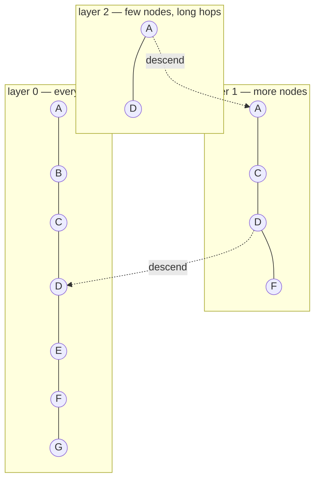

import { Tabs, TabItem } from '@astrojs/starlight/components';
import { Quiz } from '../../../components/mdx/Quiz.tsx';

## Intuition

Finding the nearest vector to a query is trivially easy and completely
impractical: compare against every stored vector and keep the best. That is
$O(n \cdot d)$ — for a million 1536-dimensional vectors, about **1.5 billion
multiply-adds per query.**

Approximate nearest neighbour search buys a better complexity class, and it pays
for it in a currency that is unusual in this book: **correctness**. An ANN index
will sometimes miss a true nearest neighbour. Not because it is buggy, but
because that is the deal.

This is the same trade the rest of this site makes visible elsewhere — see
[Big-O](/cs-fundamentals/1-complexity/big-o/) — with one difference worth
sitting with. Usually we trade memory for time, or preprocessing for query
speed, and the answer stays right. Here the answer is sometimes wrong, and
**how often is a parameter you set.**

That reframing is the useful part. Recall is not a property of the database that
you discover; it is a dial you choose, and every vector database exposes it under
a different name. Teams who do not know they have chosen a recall level have
chosen a default one.

### Why exact search fails at scale

Two reasons, and the second is the one that surprises people.

**The obvious one:** cost is linear in corpus size, so query time grows with
your success.

**The subtle one:** in high dimensions, the classic space-partitioning
structures stop working. A k-d tree over 1536 dimensions has to examine nearly
every branch, because distances concentrate — in high-dimensional space, the
ratio between the nearest and farthest point shrinks toward 1, so partitioning
prunes almost nothing. Exact indexing does not have a clever answer here. That
is why the field went approximate.

## Mechanics

### HNSW, the default

Hierarchical Navigable Small World is what most vector databases use. The idea is
a navigable graph with express lanes:



A search enters at the top layer, greedily walks toward the query until it
cannot improve, then drops a layer and repeats. The upper layers cover distance
quickly; the bottom layer refines. Search is roughly $O(\log n)$ hops rather
than $O(n)$ comparisons.

**Where the approximation enters:** greedy graph walking can get stuck in a local
minimum. The true nearest neighbour may sit behind a node that looked worse, and
the walk never went that way.

The three parameters every implementation exposes, under these names or close
variants:

| Parameter | Controls | Raising it |
|---|---|---|
| `m` | edges per node | better recall, more memory, slower build |
| `ef_construction` | candidates explored at build | better graph quality, slower build |
| `ef_search` | candidates explored at query | **better recall, slower queries** |

`ef_search` is the dial that matters operationally, because it is the only one
you can change **without rebuilding the index**. It is your recall/latency knob
in production, and the first thing to reach for when relevance complaints
arrive.

### IVF, the alternative

Inverted File indexes cluster the vectors, then search only the nearest few
clusters. `nprobe` sets how many clusters to examine — the same recall/latency
dial under a different name.

| | HNSW | IVF |
|---|---|---|
| Query speed | faster | fast, tunable |
| Memory | higher | lower |
| Build time | slower | faster |
| Incremental inserts | good | degrades — needs periodic retraining |
| Best for | most workloads | very large corpora, memory-constrained |

The line that catches people is **incremental inserts**. IVF's clusters are
trained on the data present when the index was built. Add a million vectors
about a new topic and the clusters no longer describe the data, so recall decays
silently until someone retrains. HNSW handles insertion far more gracefully.

### Measuring recall — the step everyone skips

Recall@k is measurable, cheaply, on a sample. There is no excuse for not knowing
it.

<Tabs syncKey="lang">
<TabItem label="Python">

```python
import numpy as np

def measure_recall(index, vectors, queries, k=10) -> float:
    """Compare the ANN index against brute force on a sample.

    Brute force over the WHOLE corpus for a few hundred queries is affordable
    even when it is unaffordable per request — which is the point. You are
    buying ground truth once, offline, to calibrate a dial you then use forever.
    """
    hits = 0
    for query in queries:
        # Ground truth: exhaustive, exact, slow, correct.
        scores = vectors @ query
        truth = set(np.argpartition(-scores, k)[:k])

        approximate = set(index.search(query, k=k))
        hits += len(truth & approximate)

    return hits / (len(queries) * k)
```

</TabItem>
<TabItem label="TypeScript">

```typescript
async function measureRecall(index: Index, all: Vector[], queries: Vector[], k = 10) {
  let hits = 0;
  for (const query of queries) {
    const truth = new Set(
      all
        .map((v, i) => ({ i, score: dot(v, query) }))
        .sort((a, b) => b.score - a.score)
        .slice(0, k)
        .map((e) => e.i),
    );
    const approx = await index.search(query, k);
    hits += approx.filter((i) => truth.has(i)).length;
  }
  return hits / (queries.length * k);
}
```

</TabItem>
</Tabs>

Run it with 200 sampled queries, sweep `ef_search`, and plot recall against p99
latency. **That curve is the actual engineering artefact** — it turns "is search
good enough" from an argument into a decision with two numbers on it.

### Filtering is where it gets hard

Real queries are rarely pure similarity. "Documents like this, from this tenant,
created this year" mixes vector search with predicates, and there are three
strategies with very different failure modes:

- **Pre-filter** — restrict to matching rows, then search within them. Correct,
  and it can be slow: the graph's connectivity assumes the whole dataset, so a
  restrictive filter makes the walk traverse mostly-excluded nodes.
- **Post-filter** — search, then drop non-matching results. Fast, and **it
  silently returns too few results.** Ask for 10, filter to a tenant holding 1%
  of the corpus, and you may get zero — with no error.
- **Filtered search** — the filter is applied during traversal. What good
  engines do, and what you should prefer.

**Post-filtering is a common and quiet correctness bug.** If your tenant
isolation is implemented as a post-filter, small tenants get worse results than
large ones and nothing in the system says so.

## Cost & limits

### The memory cliff

HNSW must be resident in RAM to deliver its advertised latency. The graph edges
are a large fraction of the total:

$$
\text{memory} \approx n \times (4d + 8m \times \text{layers})
$$

For 1536 dimensions at `m = 16`:

| Vectors | Raw float32 | + graph | Practical RAM |
|---|---|---|---|
| 100,000 | 614 MB | ~150 MB | ~1 GB |
| 1,000,000 | 6.1 GB | ~1.5 GB | ~9 GB |
| 10,000,000 | 61 GB | ~15 GB | ~90 GB |

**This is a cliff, not a curve.** Below the memory limit, queries are
sub-millisecond. Above it, the index pages to disk and p99 degrades by two or
three orders of magnitude — a graph walk has terrible locality, so nearly every
hop is a fault.

The operational tell is distinctive and worth recognising: **p50 stays fine
while p99 explodes.** Most queries stay in the resident portion; the unlucky
ones do not.

### Reducing the footprint

| Technique | Reduction | Recall cost |
|---|---|---|
| `float32` → `int8` | 4× | small, usually acceptable |
| Binary quantisation | 32× | large — needs a rescoring pass |
| Dimension reduction (1536→512) | 3× | corpus-dependent, measure it |
| Product quantisation | 8-16× | moderate, tunable |

The standard pattern for large corpora is **quantised search then exact
rescoring**: retrieve 100 candidates using compressed vectors, then re-rank those
100 with full-precision vectors fetched from disk. You get most of the memory
saving and nearly all of the recall, because errors that matter are concentrated
in the ordering of the top results, which the rescoring pass fixes.

<aside class="dated-figure">

**Not verified from here.** Managed vector-database pricing, per-engine memory
overheads and the exact recall cost of each quantisation scheme are
vendor-specific and change. The memory arithmetic above follows from the stated
formula and dimensions; treat the recall column as directional and measure on
your corpus.

</aside>

### Query cost

Sub-millisecond for an in-memory HNSW index over a million vectors is realistic.
Which means **the vector search is almost never your bottleneck** — the embedding
call for the query is a network round trip of tens of milliseconds, and the
generation that follows is seconds.

That ratio should govern where you spend effort. Teams tune `ef_search` for
latency while an un-cached query embedding costs 50× more.

## When NOT to use it

**When the corpus is small.** Under roughly 10,000 vectors, brute force in
NumPy takes single-digit milliseconds and is exactly correct. You skip an index,
a rebuild story, a parameter set, and a recall question. The crossover is higher
than most people assume.

**When the query is exact.** Identifiers, SKUs, error codes, file paths. A hash
index or a `WHERE` clause is correct and instant; ANN gives you something
approximately like it, which is precisely wrong for an identifier.

**When you need guaranteed recall.** Legal discovery, compliance audits, safety
screening. "We probably found all the matching documents" is not an acceptable
answer in those settings. Use exact search and pay for it.

**When you already run Postgres and the corpus is modest.**
**pgvector** puts vectors next to
the rows they describe: one backup story, real joins, real transactions. A
separate vector database is a second datastore to operate, and that is a
significant cost to take on before you need it.

**When the filter is highly selective.** If most queries restrict to a tiny
subset, filtered scan over that subset may beat vector search over everything —
and it is exact.

## Real-world usage

- **RAG retrieval** — the dominant use. Modest corpora, k of 5-50, recall at 0.9+
  is generally plenty since a reranker fixes the ordering afterwards.
- **Semantic caching** — check whether a similar question was answered recently.
  Here recall matters less and **precision matters enormously**: a false positive
  serves a wrong cached answer.
- **Recommendation** — item and user embeddings in one space, nearest-neighbour
  lookup as the recommendation.
- **Deduplication** — find near-identical documents at ingest. Usually run at
  high recall, because a missed duplicate is a permanent data-quality problem.
- **Image and multimodal search** — same machinery, different encoder.
- **Anomaly detection** — distance to the nearest neighbours as an outlier score.

## Failure modes

### p99 latency explodes, p50 is fine

**Symptom:** median stays sub-millisecond, the tail goes to hundreds of
milliseconds, usually after a growth milestone.

**Cause:** the index no longer fits in RAM. Graph traversal has poor locality, so
queries touching resident memory are fast and queries that fault are not.

**Fix:** more memory, quantisation, or sharding. Monitor index size against
available RAM and alert *before* the cliff, because after it the system is
already unusable.

### Filtered queries return too few results

**Symptom:** filtered searches return fewer than `k` results, or none, with no
error.

**Cause:** post-filtering. The engine found the top `k` globally, then discarded
those failing the predicate.

**Fix:** use an engine with filtered traversal. If you must post-filter,
over-fetch — retrieve `k × (1 / selectivity)` — and treat "fewer than k after
filtering" as a condition to detect and handle, not to ignore.

### Recall decays silently after inserts

**Symptom:** relevance degrades over months. No deploy correlates.

**Cause:** with IVF, clusters were trained on the original distribution and new
data does not fit them. With HNSW, heavy deletion leaves tombstones that degrade
connectivity.

**Fix:** re-measure recall on a schedule — it is the only way to see this.
Rebuild or retrain periodically. Put recall on a dashboard next to latency.

### The distance metric does not match how vectors were stored

**Symptom:** results are plausible but subtly wrong; long documents dominate.

**Cause:** vectors were stored un-normalised and the index is configured for
inner product, which then rewards magnitude — i.e. length.

**Fix:** normalise on write and use cosine or inner product interchangeably.
Assert the norm at insert time rather than trusting the pipeline.

### Two indexes, two embedding models

**Symptom:** relevance is noise after a model upgrade, with no errors.

**Cause:** documents embedded with one model, queries with another. Both are
`float[1536]`; nothing validates semantics.

**Fix:** store the model name and version with every vector, and reject
mismatches at query time. Treat re-embedding as a migration with a new index and
a cutover.

## Practice problems

**1. The tail that appeared overnight.**

A RAG service ran at p50 0.8ms and p99 3ms for months. After a bulk import
tripling the corpus to 4 million vectors, p50 is 1.1ms and p99 is 380ms. The
instance has 16 GB of RAM.

<details>
<summary>Solution</summary>

The index no longer fits in memory.

```
4,000,000 × 1536 × 4 bytes            = 24.6 GB raw
+ HNSW graph at m=16                  ≈  6 GB
                                      ≈ 30 GB, on a 16 GB box
```

The p50/p99 split is the diagnostic signature. Roughly half the index is
resident, so the median query is served from RAM while the unlucky tail faults
to disk — and a graph walk has terrible locality, so a faulting query faults
repeatedly.

**Fix, in increasing order of effort:**

1. **More RAM** — a 64 GB instance. Immediate, and the honest answer if the
   corpus keeps growing.
2. **`int8` quantisation** — 4× reduction takes it to ~7.5 GB, comfortably
   resident, at a small recall cost you should measure rather than assume.
3. **Quantised search plus exact rescoring** — retrieve 100 candidates from the
   compressed index, rescore with full-precision vectors from disk. Nearly all
   the recall, most of the memory saving.
4. **Shard** if growth continues, accepting the operational cost.

**What to do regardless:** alert on index size against available RAM, at 70%.
This failure has no gradual phase — you are fine until you are not, and by then
it is a production incident.

</details>

**2. The tenant that gets bad results.**

A multi-tenant search filters by `tenant_id` after retrieval. Large tenants are
happy. The smallest tenant reports that search "returns nothing useful". No
errors are logged.

<details>
<summary>Solution</summary>

Post-filtering, and it degrades exactly in proportion to how small the tenant
is.

The engine retrieves the global top 10 across all tenants, then discards
non-matching rows. For a tenant holding 0.5% of the corpus, the expected number
of survivors from a global top 10 is 0.05 — so usually **zero results, returned
as a successful empty response.**

**Fix, in order of preference:**

1. **Filtered traversal.** Most engines support applying the predicate during
   the graph walk. This is correct and it is what you want.
2. **Per-tenant namespaces or collections.** Each tenant gets its own index, so
   the filter is structural rather than a predicate. Also the cleanest isolation
   story — worth it independently of this bug.
3. **Over-fetch** as a stopgap: retrieve `k / selectivity`, so 10 results for a
   0.5% tenant means fetching 2,000. Works, and it is expensive and fragile.

**The part to fix first, before any of those:** the silence. "Returned fewer than
k results after filtering" must be logged and alerted. This bug ran in production
for months because an empty result set looked like a successful request, and
that is the actual defect.

</details>

**3. Choose the index.**

Three workloads. Pick an approach and justify it.

- (a) 8,000 internal documents, ~50 queries/day, exactness matters.
- (b) 40 million product embeddings, 5,000 queries/second, 100ms budget.
- (c) 2 million support articles, 50 queries/second, updated continuously.

<details>
<summary>Solution</summary>

**(a) 8,000 documents — no index at all.**

A brute-force matrix multiply over 8,000 × 1536 floats is a few milliseconds in
NumPy, exactly correct, and needs 50 MB. At 50 queries/day that is not a
performance problem in any sense. You avoid an index, a rebuild path, a
parameter set, and the recall question entirely. **The crossover for "needs an
ANN index" is much higher than people assume** — and this workload also wanted
exactness, which ANN cannot promise.

**(b) 40 million at 5,000 QPS — IVF or IVF-PQ, sharded.**

Raw storage is 245 GB, so a single-node in-memory HNSW is out. This is the
regime IVF was designed for: lower memory, and `nprobe` as an explicit
recall/latency dial. Add product quantisation to fit shards on reasonable
instances, plus exact rescoring of the top 100 to recover ranking quality. Shard
by an attribute that most queries filter on, so a query touches one shard.

The trap: this workload is *not* continuously updated, so IVF's retraining
weakness does not bite. Check that assumption before committing.

**(c) 2 million, continuously updated — HNSW.**

12 GB of vectors plus ~3 GB of graph fits comfortably in a 32 GB instance, and
50 QPS is nothing. The deciding factor is **continuous updates**: IVF's clusters
would drift as new articles arrive and recall would decay silently until
someone retrained. HNSW handles incremental insertion well.

The thing to watch is deletions — tombstones degrade graph connectivity over
time — so schedule a periodic rebuild and, more importantly, **measure recall on
a schedule** so drift is visible rather than inferred from complaints.

</details>

<Quiz
  client:visible
  id="ann-tradeoff"
  kind="concept"
  question="What does an approximate nearest neighbour index trade away, compared to exhaustive search?"
  options={[
    { label: 'Guaranteed correctness — it can miss true nearest neighbours, at a rate you control with a parameter', correct: true },
    { label: 'Memory — it is slower per query but uses far less RAM than storing all vectors' },
    { label: 'Nothing, provided the index is built with enough edges per node' },
    { label: 'Update speed — queries are exact but inserts become expensive' },
  ]}
>
  <Fragment slot="explanation">
    <p>
      This is the unusual trade in the family. Most indexes buy query speed with
      memory or preprocessing and keep the answer exact. ANN buys a better
      complexity class by <em>sometimes returning the wrong answer</em> —
      greedy graph traversal can settle in a local minimum and never visit the
      true nearest neighbour.
    </p>
    <p>
      The important consequence is that recall is a <strong>dial</strong>, not a
      property you discover. <code>ef_search</code> in HNSW and{' '}
      <code>nprobe</code> in IVF both trade query latency for recall, and{' '}
      <code>ef_search</code> can be changed without rebuilding — which makes it
      the first thing to reach for when relevance complaints arrive.
    </p>
    <p>
      HNSW also uses <em>more</em> memory than the raw vectors, not less: the
      graph edges are a substantial addition on top. That extra memory is what
      the speed is bought with.
    </p>
  </Fragment>
</Quiz>

<Quiz
  client:visible
  id="ann-postfilter"
  kind="concept"
  question="A multi-tenant search post-filters by tenant after retrieving the global top k. What is the symptom?"
  options={[
    { label: 'Small tenants silently receive few or zero results, while large tenants are unaffected', correct: true },
    { label: 'All tenants see slower queries, because filtering happens after the expensive step' },
    { label: 'Results leak between tenants, since the filter runs too late to isolate them' },
    { label: 'Recall drops uniformly across tenants in proportion to the number of tenants' },
  ]}
>
  <Fragment slot="explanation">
    <p>
      Post-filtering retrieves the global top k and then discards rows failing
      the predicate. For a tenant holding 0.5% of the corpus, the expected number
      of survivors from a global top 10 is about 0.05 — so usually zero, returned
      as a perfectly successful empty response.
    </p>
    <p>
      The damage scales inversely with tenant size, which is what makes it so
      persistent: the large customers who would complain loudest are the ones
      unaffected, and the small ones assume the product is simply not very good.
    </p>
    <p>
      There is no data leak — the filter does run — so this is a relevance and
      correctness bug rather than a security one. The fixes are filtered
      traversal during the graph walk, or per-tenant namespaces so isolation is
      structural. And regardless of fix: log when a filtered result set comes
      back short, because the silence is the real defect.
    </p>
  </Fragment>
</Quiz>

## Interview answers

**"Why not just compare against every vector?"**

> Because it is $O(n \cdot d)$ — a million 1536-dimensional vectors is about 1.5
> billion multiply-adds per query. And the classic exact structures do not rescue
> you: a k-d tree over 1536 dimensions prunes almost nothing, because distances
> concentrate in high dimensions.
>
> So the field went approximate. HNSW gives roughly logarithmic hops instead of
> linear comparisons, and what it pays with is correctness — it will sometimes
> miss a true neighbour.
>
> The caveat I would add is that brute force is right more often than people
> think. Under about ten thousand vectors it is a few milliseconds in NumPy and
> exactly correct, and you skip the index, the parameters and the recall
> question entirely.

**"How do you know your vector search is good enough?"**

> Measure recall against brute force. Sample a couple of hundred queries, compute
> exact top-k offline — expensive per request, trivial as a one-off — and compare
> with what the index returns.
>
> Then sweep `ef_search` and plot recall against p99 latency. That curve is the
> engineering artefact: it turns "is search good enough" into a decision with two
> numbers, and it tells you which direction to move when someone complains.
>
> The thing worth voicing is that recall decays. IVF clusters drift as data
> arrives, HNSW connectivity degrades under heavy deletion. So recall belongs on
> a dashboard next to latency, not in a one-off benchmark.

**"What breaks first as a vector index grows?"**

> Memory, and it is a cliff rather than a curve. HNSW has to be resident to hit
> its latency; once it does not fit, graph traversal has terrible locality so
> almost every hop faults.
>
> The signature is distinctive — p50 stays fine and p99 explodes — because most
> queries stay in the resident portion and the unlucky ones do not. I would alert
> on index size against available RAM at around 70%, because after the cliff you
> are already in an incident.
>
> The fix ladder is more RAM, then int8 quantisation, then quantised search with
> exact rescoring of the top hundred, then sharding.

**The caveats worth voicing:**

- Post-filtering is a silent correctness bug in multi-tenant systems; prefer
  filtered traversal or per-tenant namespaces.
- Store the embedding model and version with every vector and reject mismatches.
- The vector search is rarely the bottleneck — the query embedding round trip
  usually costs far more.
- Normalise on write; then cosine and inner product are the same operation.
- Recall is chosen, not discovered. A team that has not measured it has accepted
  a default.
