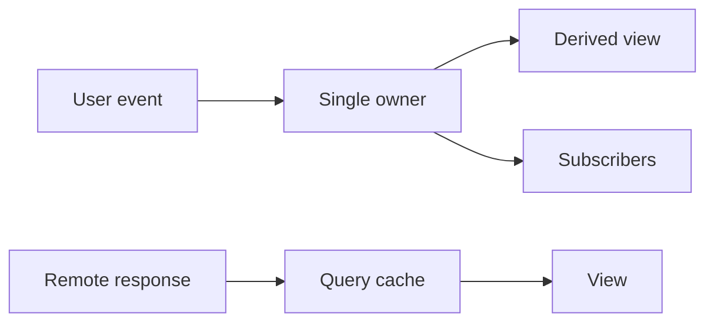

## Intuition

State is a fact that can change, not a synonym for “data used by a component”. The useful question is who owns the fact and who needs to observe it. A search box usually owns its draft locally; a signed-in identity belongs to the application session; a server response belongs to a cache with freshness rules.

## Mechanics

Start at the narrowest owner and move outward only when a second consumer genuinely needs the same value. Keep derived values as functions of source state, and keep server data in a query cache rather than copying it into a second mutable store. A reducer or state machine helps when transitions have named events; a store helps when many distant consumers subscribe to the same client-owned facts.

The dependency shape is:

## Cost & limits

For a store with `n` subscribers, a change costs the work of notifying the subscribers that the selector says changed. Broadcasting the whole state to all `n` subscribers is O(n); selector-based subscriptions approach O(k), where `k` is the number whose selected slice changed. The real ceiling is render work: 100 cheap subscribers can be fine, while one subscriber that reconstructs a 10,000-row table on every keystroke is not.

## When NOT to use it

Do not add a global store for one component’s draft, a value that can be passed through two or three stable owners, or data that is already owned by the URL, browser, or server cache. Do not store derived totals or filtered lists when recomputing them from a small source is cheaper and removes a synchronization path.

## Real-world usage

Local state fits an open menu and an input draft. URL state fits filters that must survive refresh and be shareable. A query cache fits a product list with loading, stale, retry, and invalidation semantics. A small client store fits preferences or a multi-step editor whose state must survive route changes.

## Failure modes

**The UI shows two answers.** A response was copied into both a query cache and a global store; one was invalidated and the other was not. Keep one source of truth and derive views from it.

**Typing feels delayed.** A global update causes an expensive tree to render on every keypress. Keep the draft local, subscribe narrowly, and measure render duration.

**Refresh loses the filter.** State lived only in memory although the URL was the user’s navigation state. Encode shareable state in URL parameters and validate it on read.

## Practice problems

1. A dashboard has a selected account, a search draft, and a fetched invoice list. Place each in local state, URL state, session state, or query cache. The answer is draft local, account URL/session depending on the product, and invoices in a query cache.
2. A selector returns a new array on every call. The fix is to memoize the derived result or select stable primitives; otherwise every subscriber appears changed.

## Interview answers

State management is ownership plus subscriptions: keep a fact at its narrowest durable owner, derive rather than duplicate, and use a cache for remote data. The production caveat is that a “global store” does not solve freshness, invalidation, or expensive renders by itself.
