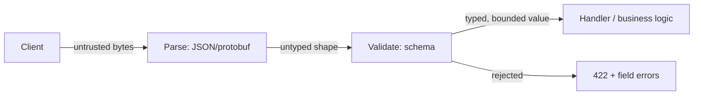

## Intuition

[Forms and validation](/cs-fundamentals/11-web-frontend/forms-validation/)
already draws the line on the client: browser validation is a convenience,
not a guarantee, because it runs on a machine the user controls. This page
is the other side of that line — **the server is the trust boundary.**
Every byte that crosses it, from any client, honest or not, is untyped and
unverified until validation says otherwise.

Serialization and validation get lumped together and treated as plumbing —
"parse the JSON, call the handler" — but they are two different jobs done in
sequence. Serialization turns bytes into a shape (an object, with whatever
types JSON gives you: string, number, boolean, null, array, object).
Validation turns that shape into a value your application is allowed to
trust: this string is actually an email, this number is actually a
non-negative integer, this array actually has at most 50 elements. Skipping
the second step and coding against the first is how `req.body.age` ends up
as the string `"twelve"` three call frames deep in a function that assumed
a number.

## Mechanics

### Serialization: shape, not meaning

```json
{ "age": "30", "email": "  a@b.com  ", "roles": ["admin"] }
```

JSON parsing gives you a JavaScript object. It does not give you: that `age`
should be a number and not a numeric string, that `email` should be trimmed
and lowercased, or that `roles` should never legitimately contain `"admin"`
from an unauthenticated signup endpoint. Those are validation's job, and
none of them are caught by `JSON.parse` succeeding.

### Validation as a typed boundary

```typescript
import { z } from 'zod';

const SignupSchema = z.object({
  age: z.coerce.number().int().min(13).max(120),
  email: z.string().trim().toLowerCase().email(),
  roles: z.array(z.enum(['member'])).max(5),
});

app.post('/signup', (req, res) => {
  const parsed = SignupSchema.safeParse(req.body);
  if (!parsed.success) {
    return res.status(422).json({ errors: parsed.error.flatten() });
  }
  // parsed.data is typed, coerced, and bounded from here on.
  createUser(parsed.data);
});
```

The schema does three things at once. It handles fields it doesn't
recognize — `z.object()` strips unknown keys by default, so an unexpected
`isAdmin: true` is silently dropped rather than stored; `.strict()` instead
makes the same schema reject the whole payload outright when an unknown key
shows up, which is the better default for anything security-sensitive,
since silent stripping can hide a client bug that thinks a field was
accepted. It coerces to the right type. And it bounds the range (`.max(120)`,
`.max(5)`). `roles` only
ever allowing `'member'` at signup is the validation layer doing
authorization's job for one field — the schema is also where "this field
can never contain a privileged value from this endpoint" gets enforced,
because leaving that check to a later authorization layer means the invalid
value already reached application code once.

### Where validation belongs in the pipeline



Validation runs once, at the boundary, before the value reaches anything
that assumes it's already correct. A handler re-checking `if (age < 0)`
three layers deep means the boundary leaked — either duplicate validation
logic to keep in sync, or a path that reaches the handler without going
through the schema at all (a background job replaying old, unvalidated
data is the common way that happens).

### Serialization formats: JSON versus a binary schema

```protobuf
message Signup {
  int32 age = 1;
  string email = 2;
  repeated string roles = 3;
}
```

Protocol Buffers move part of validation into the wire format itself: `age`
cannot arrive as the string `"30"`, because the schema is compiled into both
client and server and the wire format is typed, not text. That does not
replace range or business-rule validation (`age <= 120` still has to be
checked explicitly) — it removes only the type-confusion class of bug, at
the cost of losing JSON's human-readability and requiring a compiled schema
on both ends.

## Cost & limits

**Validation overhead per request.** A `zod` schema parse over a typical
20-field payload runs in the tens of microseconds — negligible next to a
database round trip (single-digit milliseconds). The cost that matters is
not CPU time, it's the one-time cost of writing the schema and the ongoing
cost of keeping it in sync with the database schema and the client's type
definitions; a schema that drifts from reality either rejects valid input
or — worse — accepts input the database then rejects with a less useful
error three layers deeper.

**What an unvalidated field costs when it reaches the database.** A string
field with no length bound accepted directly into a `TEXT` column has no
storage ceiling until the database's own row-size or column limit — for
Postgres, a single `TEXT` value can reach 1 GB. One request with a
malicious or buggy 500 MB string field is 500 MB of write I/O, WAL
generation, and replication lag for every replica, from a single HTTP
request that a 10 KB `.max()` bound would have rejected for the cost of a
length comparison — but only once the schema gets to see it. A schema
validates the parsed body; the 500 MB still has to be read off the socket
and buffered into memory by the body parser first, which is its own
resource cost regardless of what the schema later rejects. A request-body
size cap at the proxy or body-parser layer (`express.json({ limit: '100kb'
})`, or the equivalent on the reverse proxy in front of it) is the control
that stops an oversized payload before parsing, and is a separate line of
defense from the schema's per-field `.max()` bounds, not a replacement for
either.

**Ceiling and what happens at it.** A schema validation failure is a
rejection with field-level errors — cheap, synchronous, and informative —
returned under whichever status code the API has chosen as its contract for
that (`422 Unprocessable Entity` and `400 Bad Request` both see wide use;
pick one and apply it consistently, since neither is a universal standard
for this case). The alternative — no schema, relying on the database's
constraints to catch bad data — pushes the same bad input past the boundary
until a constraint violation fires, and an application that doesn't
explicitly catch and map that violation back to a structured client error
turns it into a raw `500` with a stack trace instead of a field name,
discovered by whoever's paging on database errors instead of by the client
that sent it.

## When NOT to use it

- **Never** — this isn't optional infrastructure the way a cache or a queue
  can be deferred until scale demands it. Any handler reading untrusted
  input without validating it has a trust boundary with a hole in it. The
  judgment call is how strict the schema is, not whether one exists.
- **Duplicating client-side validation rules verbatim on the server as the
  only server-side check.** The client's rules exist for UX (instant
  feedback, no round trip); replaying the exact same rules server-side and
  calling it done misses that the server sees traffic the client-side code
  never ran against — direct API calls, replayed requests, other clients
  entirely.
- **Validating shape but not scale.** A schema that checks `roles` is an
  array of the right enum but not that it has at most 5 elements has
  validated the wrong axis — an attacker sends 100,000 valid enum values
  instead of one invalid one.

## Real-world usage

Stripe's API returns structured `400 Bad Request` errors with a `param`
field naming the exact offending key (`"param": "email"`) — schema
validation surfaced directly as API contract, not an internal
implementation detail. Postgres
itself enforces a hard 1 GB limit per field value regardless of what your
application layer does, which is why relying on the database as your only
validation layer still leaves you exposed to everything below that ceiling
— a 900 MB string is still a very bad request.

## Failure modes

**Symptom: the database's disk fills up over a weekend with no deploy and
no obvious traffic spike.** Cause: an unbounded text field (a "notes" or
"bio" field with no `.max()`) let a script — buggy or malicious — write
increasingly large payloads, and nothing rejected them before they hit
storage. Fix: add a length bound to the schema, backfill a migration
truncating or flagging existing oversized rows, alert on p99 payload size
per field going forward.

**Symptom: a field that was `"admin"` string-typed on the client shows up
as the literal string `"[object Object]"` in the database.** Cause: no
server-side schema, so a client bug serializing an object where a string
was expected passed straight through `JSON.parse` (valid JSON, wrong shape)
into a column typed `TEXT`, which accepted it uncomplaining. Fix: a schema
that specifies `z.string()` rejects this at the boundary with a clear `422`
instead of silently storing garbage; detect existing damage with a query
scanning for the literal string pattern.

**Symptom: a privilege-escalation bug where new signups can set
`role: "admin"`.** Cause: the signup handler passed the entire request body
to the user-creation function instead of validating field-by-field —
"parse, don't just deserialize" was skipped, and an extra field the client
was never supposed to send rode along, trusted. Fix: an allowlisting schema
(`.strict()`, or simply never spreading `req.body` — always constructing
the write from named, validated fields) removes the class of bug rather
than patching this one field.

## Practice problems

**1. This schema passed code review — find the gap.**
```typescript
const Schema = z.object({
  email: z.string(),
  age: z.number(),
});
```
— `z.string()` on `email` accepts any string, not an email; `.email()` is
missing. `z.number()` on `age` accepts negative numbers, decimals, and
`Infinity`; `.int().min(0).max(150)` (or a domain-appropriate bound) is
missing. Neither field has a scale bound if it were an array instead —
worth checking on every list-typed field in the same review.

**2. A `PATCH` endpoint accepts a partial update object.** What's the
validation gap specific to `PATCH` that a `POST`-only schema wouldn't have?
— A schema written for full-object creation (`POST`) typically requires
every field; naively reusing it for `PATCH` either rejects valid partial
updates or, if fields are made optional to fix that, loses the "required on
create" constraint entirely. `.partial()` fixes the first problem
correctly: an *omitted* field is left untouched, and whichever fields are
present still go through their original per-field constraints. It does not
fix a second, easy-to-miss problem: `.partial()` doesn't distinguish
"omitted" from "explicitly sent as `null`" — a field typed with
`.optional()` alone rejects an explicit `null` in the payload, and one that
should legitimately accept `null` as a real, distinct value (clearing a
field on purpose) needs `.nullable()` or `.nullish()`, not just
`.partial()`. A schema also has to name which fields are immutable after
creation (an `id` or `createdAt`) and drop them from the update schema
entirely, since `.partial()` alone would happily accept and apply an
update to either.

## Interview answers

**"Why validate on the server if the client already validates?"** Because
the server is the actual trust boundary — the client is one path among many
that can reach the endpoint (a replayed request, a script, another team's
service, an attacker), and client-side validation runs on hardware the
sender controls. The [client-side counterpart](/cs-fundamentals/11-web-frontend/forms-validation/)
exists for UX, not security; treating it as the security layer is the
mistake. The caveat that signals production experience: validation isn't
just type-checking — it's where scale bounds (`.max()` on strings and
arrays) belong, and those are the checks that get forgotten because a type
mismatch fails loudly in testing while an unbounded field only fails at a
scale nobody tested against.
