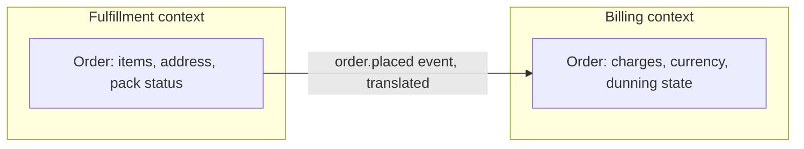

## Intuition

Every non-trivial system eventually needs a way to decide where one part
ends and another begins — which module a change belongs in, which team
owns a table, which service a new feature gets added to. Most teams answer
this by technical layer: a `controllers/` folder, a `services/` folder, a
`repositories/` folder. That boundary is comfortable to draw and wrong for
almost every purpose that matters, because a single business change —
"orders can now be partially refunded" — touches a controller, a service,
and a repository simultaneously. The boundary that was supposed to
localize change instead guarantees that every real change crosses it.

Domain-Driven Design's actual claim is narrower than the pattern catalogue
that grew up around it: **draw boundaries around areas of the business
that have their own internally consistent model and vocabulary, not
around technical concerns.** The test for where a boundary belongs isn't
architectural taste, it's language. When the word "customer" means a
different thing to the support team than it does to billing — one wants a
person with a ticket history, the other wants a person with a payment
method and a balance — you have found a boundary, whether or not anyone
draws it in code. Pretending it's one "Customer" model is what produces
the god object that a dozen unrelated features all reach into.

## Mechanics

**Bounded context.** A boundary around part of the domain within which a
term has exactly one meaning and one model. "Order" inside the fulfillment
context is a set of line items with a shipping address and a pack status.
"Order" inside the billing context is a set of charges with a currency and
a dunning state. They are not the same object with different fields —
they are two different models that happen to share an ID, synchronized by
an explicit translation at the boundary rather than by sharing a class.

**Ubiquitous language.** The vocabulary used in code, tickets, and
conversation with the domain expert inside a bounded context should be
identical — the same word in a `class` name that a product manager uses
in a sentence. When code says `Account` and the business says
"subscription," every new engineer pays a translation tax on every
conversation, and the mismatch is usually a sign the boundary itself is
wrong: the code drew the line somewhere the business doesn't actually
think in.

**Aggregate.** Inside a bounded context, the aggregate is the unit that
must stay consistent within a single transaction — typically a root
entity plus the objects that can't exist without it. An `Order` aggregate
enforces that `total` always equals the sum of its line items; nothing
outside the aggregate is allowed to write a line item directly, because
that's exactly the kind of write that produces a total that no longer
adds up. The size of the aggregate is a direct trade: too large, and
unrelated changes contend for the same lock; too small, and consistency
guarantees that used to be free (line items summing to a total) become a
cross-aggregate problem you have to solve with eventual consistency and
compensating writes instead of a database constraint.

**Finding the boundary in a real codebase**, in order:
1. Interview the people who do the job, not the people who wrote the
   ticket — the language a support agent actually uses when a refund goes
   wrong is more reliable than the field names in the refund service.
2. Write down every place the same noun means two different things across
   teams. Each one is a candidate boundary.
3. Check whether the two meanings change on different schedules — billing
   rules changing at a different cadence than fulfillment rules is
   corroborating evidence, not the definition itself.
4. Draw the context map: which contexts call which, and whether the
   relationship is a shared model, a translation layer, or one context
   just consuming the other's published events (the mechanism the
   [message-brokers](/cs-fundamentals/5-systems/message-brokers/) page
   covers for the transport, and the
   [event-driven-architecture](/cs-fundamentals/13-architecture/event-driven-architecture/)
   page covers for what a context gives up by choosing it).

This is deliberately not a checklist of the fifteen-plus patterns the
original DDD book coined (specification, factory, repository interfaces,
and so on) — most of those are implementation details that fall out
naturally once the boundary and the language are right, and memorizing
the vocabulary without doing the interviews above produces the "we did
DDD" codebase that has `Aggregate` suffixes on every class and the same
tangled boundaries it started with.

## Cost & limits

**What the boundary buys, in coordination terms.** A bounded context with
its own model means a schema change inside it doesn't require a
cross-team review, because nothing outside consumes that internal model
directly — only the translated events or API it publishes. That
coordination saving is the actual return on the modeling effort; it's not
measured in a runtime metric, it's measured in how many teams a Tuesday
schema migration has to loop in. A boundary drawn correctly turns an
N-team sign-off into a one-team change; drawn incorrectly (the context
still shares a table with another team) it changes nothing about the
coordination cost, it just adds the modeling overhead on top.

**What it costs upfront.** Finding real boundaries requires the interviews
above, which is calendar time with domain experts, not engineering time —
and it front-loads work that a technical-layer split doesn't require at
all. A team of three shipping an MVP does not have the domain maturity or
the headcount to justify running this exercise; the model will be wrong
in six weeks regardless of how carefully it's drawn, because the domain
itself is still being discovered.

## When NOT to use it

- **The domain is not yet understood.** DDD models a domain that has
  stabilized enough to have a real vocabulary. On a pre-product-market-fit
  team, the domain changes weekly, and a carefully bounded context from
  last month is now actively wrong — cheaper to keep one flexible model
  and pay the refactor cost later than to formalize boundaries around a
  business that hasn't decided what it is yet.
- **The system is small enough that one person holds the whole model in
  their head.** A codebase two engineers can reason about end to end
  doesn't have the team-coordination problem bounded contexts solve; the
  formalism adds ceremony (translation layers, published events) with no
  buyer.
- **The domain is genuinely simple and technical.** A CRUD admin panel or
  an internal reporting tool over one table doesn't have competing
  meanings of the same noun across teams — there's no boundary to find,
  because there's only one context.

## Real-world usage

E-commerce platforms are the canonical case: catalog, inventory, pricing,
fulfillment, and billing are each a distinct bounded context with
"product" or "order" meaning something different in each, integrated
through published domain events rather than a shared schema — Amazon's
and Shopify's service architectures are both organized this way at the
top level, with each context owned by a separate team and its own
datastore. In banking, "account" inside the ledger context (a append-only
sequence of postings) is a deliberately different model from "account"
inside the customer-onboarding context (a KYC record with a status), and
conflating them is a recurring source of production incidents in that
domain specifically because a ledger's consistency requirements are much
stricter than onboarding's.

## Failure modes

**The anemic domain model.** Objects that are just field bags — getters
and setters with no behavior — while every rule that should live on the
aggregate is scattered across a dozen service classes that all reach in
and mutate the same fields. Symptom: `order.setStatus("shipped")` is
callable from six different files, none of which check whether the order
has actually been packed, and eventually one of them ships an order with
no items on it. The fix is invariants enforced on the aggregate itself —
`order.ship()` that checks preconditions internally — not another service
class.

**Context boundaries that don't match team boundaries.** If the fulfillment
bounded context is modeled correctly in the codebase but two different
teams both deploy changes to it, the boundary hasn't actually reduced
coordination cost — it just moved the coordination problem from the code
into cross-team Slack threads before every deploy. Conway's Law is not
optional: draw the bounded context to match who can ship without asking
someone else, or the modeling exercise doesn't pay for itself.

**The distributed monolith via shared kernel.** Two contexts that are
supposed to be independent both import a shared library of "common"
domain types, and now a change to that library requires coordinating
every context that depends on it — the exact coupling DDD was meant to
remove, reintroduced through a dependency instead of a database table.

## Practice problems

1. Two teams both have a `Customer` class. Support's version has a
   `ticketHistory` field; billing's has a `paymentMethods` field, and
   someone recently added `ticketHistory` to billing's version too "for
   consistency." What boundary is this masking, and what should replace
   the shared class?
2. An `Order` aggregate enforces that `total == sum(line_items)`. A new
   requirement: a warehouse needs to know line-item pack status in
   real time, updated by a separate service. Does pack status belong
   inside the `Order` aggregate or outside it, and what does the answer
   imply about transaction boundaries?
3. A context map shows Context A calling Context B's internal repository
   directly, bypassing B's published API, because "it was faster during
   the incident." What does this shortcut cost six months later, and what
   should have been reached for instead?

## Interview answers

**Two-minute version:** "DDD is about drawing service and module
boundaries around business capabilities instead of technical layers,
because the boundary that survives contact with real change is the one
where a single business rule change stays inside one boundary instead of
crossing several. The tool for finding that boundary is language — when
the same noun means two different things to two teams, that's the
boundary, and you formalize it as a bounded context with its own model,
connected to others by translation or events rather than a shared
schema."

**The caveat that signals real usage:** the hard part was never the
patterns — it was that our first attempt at a bounded context matched
what the code looked like, not who actually owned the deploy pipeline for
it. Two teams kept shipping to the same "cleanly bounded" service and
fighting over the same files, and the fix wasn't more modeling, it was
splitting the team ownership to match the boundary we'd already drawn on
paper.
