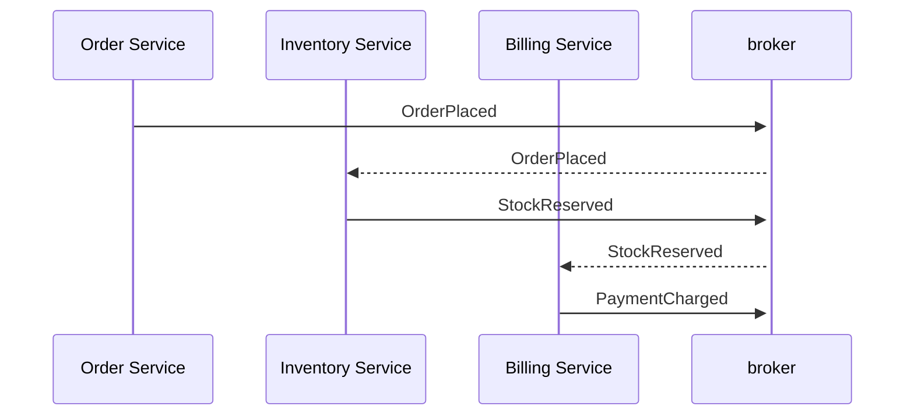

## Intuition

This page is not about brokers. Delivery guarantees, dead-letter queues,
and at-least-once versus exactly-once semantics are covered in
[message-brokers](/cs-fundamentals/5-systems/message-brokers/) — the
mechanics of getting an event from a producer to a consumer reliably are
solved there, and this page assumes you already have that plumbing
working. What it's about is the architectural consequence of switching
from a call to an event, which has nothing to do with whether the broker
delivers the message.

A synchronous call has a property you stop noticing until it's gone: the
caller *knows what happened*. `chargeCard()` returns success or a
specific exception, and the calling code branches on it. Publish
`OrderPlaced` instead, and the producer's job ends the instant the broker
accepts the message — it has no return value, no exception, and by design
no idea whether zero, one, or five services will act on it, whether they
succeeded, or whether they will act on it in the next ten milliseconds or
after a redeploy tomorrow. Decoupling and knowing are the same trade
looked at from two sides: the producer is decoupled from the consumer
precisely because it no longer holds a reference to what the consumer
does with the message, and "no reference to what happens next" is
indistinguishable from "no idea what happened" until you build something
to close that gap back up.

## Mechanics

**Choreography versus orchestration.** In choreography, each service
reacts to events and emits its own, with no central coordinator — `Order
Service` emits `OrderPlaced`, `Inventory Service` reacts by reserving
stock and emits `StockReserved`, `Billing Service` reacts to that and
emits `PaymentCharged`. Nobody owns the sequence; it emerges from each
service's own reaction rules.

This works cleanly for three services and becomes unreadable for ten,
because the "sequence" — what actually happens when an order is placed —
now lives nowhere as a single artifact; it's the emergent result of
reading every service's event handlers and mentally simulating them. In
orchestration, a coordinator (a saga, a workflow engine) holds the
sequence explicitly and calls or awaits each step, trading the emergent
flexibility of choreography for a single place that says what happens
and in what order — at the cost of a component that now has to know
about every step, which is exactly the coupling event-driven design was
trying to remove. Neither is strictly better: choreography suits a small
number of loosely related reactions; orchestration suits a business
process where the sequence itself is the thing stakeholders need to read
and change.

**What the producer used to get for free, and no longer does.** A
synchronous call chain gives you, without any extra work: a return value,
a stack trace across service boundaries if you had distributed tracing
wired up on the call path, and a request ID that ties every downstream
effect back to the request that caused it, visible in one trace. Switch
`Order Service → Billing Service` from an HTTP call to
`Order Service` publishing `OrderPlaced` and `Billing Service` consuming
it asynchronously, and every one of those disappears by default: there is
no return value (the event fired and the handler moved on), no exception
propagates back (a failure in the consumer is invisible to the producer
unless the consumer explicitly reports it somewhere), and unless you
propagate a correlation ID through the event's metadata, the trace that
used to be one continuous span is now two unrelated spans that happen to
be close together in time.

**What you build back, deliberately, to recover it:**
- **A correlation ID and causation ID on every event.** The correlation
  ID is the same value for every event in the chain that started with
  one triggering request; the causation ID is the specific event that
  caused this one. Without both, "why did this refund get issued" is a
  grep across five services' logs hoping the timestamps line up, instead
  of one query filtered by correlation ID.
- **A traced event bus.** Distributed tracing (see
  [distributed-tracing](/cs-fundamentals/14-production/distributed-tracing/))
  extended across the broker, so a span exists for "publish" and another
  for "consume," stitched together by the propagated trace context riding
  in the event's headers — the same discipline a synchronous call gets
  automatically from most APM agents.
- **An audit trail or event log as the source of truth for "what
  happened."** Because no single service holds the full sequence in
  choreography, the append-only stream of events itself — often the same
  log the broker already persists — becomes the artifact you replay to
  answer "what happened to order 4471," rather than any one service's
  database.
- **Consumer-side status reporting back to a queryable store.** If the
  producer (or an operator) needs to know whether `Billing Service`
  actually processed `OrderPlaced`, that has to be built explicitly —
  typically the consumer writes its own outcome (`processed`, `failed`,
  `retrying`) to a status table keyed by the event ID, which something
  can poll or query. This is new code that a synchronous call never
  needed, because the call's return value *was* that status.

## Cost & limits

**The traceability tax, quantified.** Each of the four items above is
work that a synchronous call gets from the runtime and language for
free, and that an event-driven flow has to build and operate: a schema
convention for correlation/causation IDs, tracing instrumentation across
the broker, a durable event log with a retention policy, and a status
table per consumer with its own storage and query cost. On a five-service
choreographed flow, this is roughly the same order of engineering effort
as building the business logic those services contain — teams that skip
it ship the events and discover the debugging gap during the first
production incident that spans three services, not before.

**The end-to-end latency floor moves, not necessarily up.** A single
synchronous call chain has a latency that's the sum of every hop, held
open the whole time; a choreographed flow's *user-facing* latency can be
much lower (the client gets a response the instant the first event is
accepted) at the cost of the *business* completing asynchronously — "order
placed" and "order fully processed, stock reserved, and payment
captured" are now different moments, sometimes by seconds, sometimes by
minutes if a consumer is backed up. Whether that gap is acceptable is a
product decision, not a technical one, and it has to be made explicitly
rather than discovered by a support ticket asking why a paid order still
shows "pending."

## When NOT to use it

- **The caller needs the answer before it can respond to its own caller.**
  A checkout flow that must confirm inventory is actually reserved before
  telling the customer the order succeeded needs a synchronous call (or a
  synchronous-feeling request/reply over the broker) for that specific
  step, even if the rest of the flow is eventful — don't force a
  fire-and-forget event onto a step where the answer gates the response.
- **The team can't yet operate a synchronous system reliably.** Event-driven
  architecture adds an entire second observability problem (tracing across
  an async boundary) on top of the one you already have; a team still
  debugging synchronous timeouts and retries hasn't earned the additional
  surface area yet.
- **The sequence has two or three steps and one team owns all of them.**
  The choreography/orchestration overhead — schemas, correlation IDs,
  status tables — pays for itself when it decouples teams or scales
  independently. One team, three steps, one deploy: a function call inside
  a single service is strictly simpler and gives you the stack trace for
  free.

## Real-world usage

Order-fulfillment pipelines at e-commerce scale are the textbook case:
`OrderPlaced` fans out to inventory, billing, shipping, and notification
services that each react independently, and the platform invests in a
central event log (often the broker's own retained topic) specifically so
"what happened to this order" is answerable without reconstructing state
from five databases. Financial ledgers and audit-heavy domains lean on
event sourcing — the event stream *is* the record of truth, and current
state is a projection of it — precisely because the traceability that a
mutable database's current row doesn't give you (what sequence of changes
produced this balance) is the entire point of the audit requirement.

## Failure modes

**The event that nobody's consuming.** A producer ships `OrderCancelled`,
a downstream team's consumer is still being built, and the event is
silently dropped or piles up in a queue with no alert — the symptom is a
customer-reported bug ("I cancelled but still got charged") days after
the event was published, with no error anywhere because nothing failed
loudly; it just never happened. Detection requires monitoring consumer
lag or an explicit expected-consumers registry, not waiting for a support
ticket.

**Debugging by grepping five services' logs.** Without correlation IDs
propagated through the event chain, tracing a single business
transaction across services degrades to matching timestamps by eye —
the exact traceability loss this page opened with, showing up as a
multi-hour incident investigation for a bug that would have been a
five-minute trace lookup in a synchronous system.

**Choreography that nobody can describe.** As reaction chains grow past
five or six services, "what happens when an order is placed" stops being
answerable by reading any single file, and onboarding a new engineer to
the flow requires them to trace it live in a staging environment because
no artifact describes the sequence. This is the specific point at which
teams migrate parts of the flow to orchestration — not because
choreography is wrong, but because the sequence has become something
stakeholders need to read, and only an orchestrator's definition is
readable in one place.

## Practice problems

1. `Order Service` publishes `OrderPlaced`. Three weeks later, support
   asks "did billing ever process order 8842?" and there is no way to
   answer without SSHing into the billing service's logs and grepping by
   approximate timestamp. What three pieces of infrastructure from the
   Mechanics section are missing, and which one would have answered the
   question fastest?
2. A choreographed flow across six services has no single document
   describing what happens on `OrderPlaced`. A new consumer is added that
   creates an unexpected cycle — its output event triggers a handler that
   re-triggers the original flow. What made this bug possible, and what
   would orchestration have prevented that choreography didn't?
3. Given a correlation ID and a causation ID on every event, sketch the
   query you'd run against an event log to answer "show me every event
   caused, directly or transitively, by this one HTTP request."

## Interview answers

**Two-minute version:** "Switching a call to an event decouples the
producer from the consumer, but the thing you're actually giving up is
traceability — a synchronous call's return value and stack trace told you
what happened for free, and an event fired into a broker doesn't. You get
that back deliberately: correlation and causation IDs on every event,
tracing extended across the broker, an event log as the source of truth,
and consumers reporting their own outcomes somewhere queryable. None of
that is broker mechanics — it's architecture you build on top regardless
of which broker or delivery guarantee you picked."

**The caveat that signals real usage:** the first time this bit us wasn't
a lost message — the broker delivered fine — it was a support escalation
that took four hours to resolve because no two services' logs had a
shared ID to filter by, and by the time we added correlation IDs
everywhere, we'd already spent more engineering time debugging by hand
than the instrumentation would have cost upfront.
