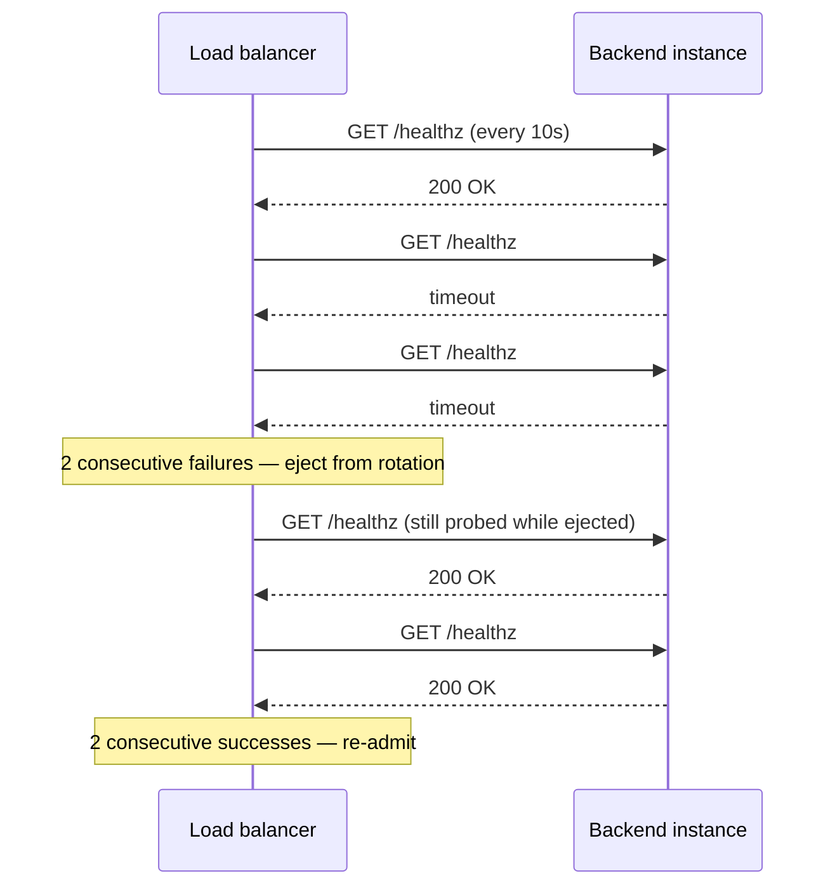

## Intuition

A load balancer's job description sounds trivial — spread requests across
backends — and the part that's actually hard is what happens when the
backends stop being interchangeable: one is slower because it's running a
heavier query, one is warming up after a deploy, one has quietly stopped
responding but hasn't crashed. Every load-balancing algorithm is really a
policy for that moment, not the easy case where every backend is identical
and any policy works equally well.

An **API gateway** is a load balancer with opinions: it also terminates
TLS, authenticates the request, applies rate limits (already covered in
depth on the [API design](/cs-fundamentals/5-systems/api-design/) page —
linked here, not re-derived), and routes by path or header to the right
backend service — the single front door a decomposed system needs so
callers aren't tracking the address of every service individually. The
load-balancing algorithm underneath is the same problem either way: given
N backends and one request, which one gets it.

## Mechanics

**Layer 4 vs. Layer 7.** An L4 balancer routes on IP and TCP port without
looking at the request — cheap, fast, protocol-agnostic, but blind to
content: it can't route `/api/orders` and `/api/search` to different
backends, because it never reads that far. An L7 balancer terminates the
connection and reads the HTTP request — path, headers, cookies — before
deciding, which is what makes path-based and header-based routing (and TLS
termination, and request-level rate limiting) possible, at the cost of
doing more work per request.

**Round robin.** Requests go to backends in fixed rotation:
1, 2, 3, 1, 2, 3. Under identical backends and identical request cost,
this is exactly fair. Under an uneven backend — one that's slower per
request, whether from a cold cache, a noisier neighbor, or simply less
CPU — round robin keeps sending it the same *count* of requests as every
other backend, which is not the same as the same *load*: a backend taking
3x as long per request accumulates a growing queue of in-flight work while
its peers finish and go idle, because the algorithm has no signal that
tells it this backend is falling behind.

**Weighted round robin.** The same rotation, but a backend with weight 3
gets three requests for every one a weight-1 backend gets — a static
correction for backends known ahead of time to have different capacity
(a bigger instance type in a mixed fleet). It fixes a *known, fixed*
imbalance; it does nothing for an imbalance that appears at runtime, like
one backend degrading mid-traffic — the weights don't adapt.

**Least connections.** Routes each request to whichever backend currently
has the fewest in-flight requests. This is the one that self-corrects
under an uneven backend: a backend running slow accumulates open
connections precisely because it isn't finishing them, so least-connections
naturally routes new requests away from it without needing to know *why*
it's slow — the connection count is a live proxy for "this backend is
falling behind" that round robin has no equivalent of. The cost is state:
the balancer has to track in-flight count per backend, which is trivial for
a single load balancer instance and a genuine coordination problem for a
fleet of them (each needs a consistent view of connection counts, or they
independently converge on the same "least loaded" backend and overload it
together — the thundering-herd variant of this algorithm).

**Consistent hashing.** Routes based on a hash of some request property —
client IP, a session key — onto a hash ring, so the same key consistently
lands on the same backend. This isn't chosen for balance under an uneven
backend at all; it's chosen when routing has to be *sticky* — a
session affinity requirement, or a cache-locality argument where hitting
the same backend for the same key means that backend's local cache stays
warm for that key. Under an uneven backend, consistent hashing does
nothing to correct the imbalance — a hot key mapped to a struggling
backend stays mapped there — which is the tradeoff made deliberately in
exchange for stickiness.

**Health checks and ejection.** A backend is removed from rotation when it
fails a **liveness check** — typically an HTTP `GET /healthz` on an
interval (5–10s is common), ejected after N consecutive failures (2–3 is
typical) to avoid ejecting on one transient blip, and re-admitted after M
consecutive successes once it recovers. The health-check *condition* is
the part worth deriving rather than defaulting: a shallow check (does the
process answer at all) catches a crashed process but not a process that's
up and answering while its database connection pool is exhausted — a
**deep health check** that verifies the dependency the backend actually
needs (a fast query against its database, not just a 200 from the process)
catches the second case, at the cost of the health check itself now being
able to fail for a reason unrelated to that specific backend instance (the
shared database being down takes every backend's deep check down with it,
ejecting the entire fleet at once — a shallow check would have correctly
left them all in rotation, unable to help either way).

## Cost & limits

**Per-algorithm work.** Round robin and weighted round robin are O(1) per
request — a counter increment, no per-backend state to compare. Least
connections is O(n) in the naive form (scan every backend's count) or
O(log n) with a min-heap keyed on connection count — at fleet sizes under
a few hundred backends this is microseconds either way and not the
bottleneck; it becomes relevant at the scale of a CDN edge balancing
across thousands of origins, where the heap variant is the one actually
used. Consistent hashing is O(log n) per lookup against the hash ring
(binary search for the nearest point), independent of request rate.

**Health-check interval as a latency-vs-cost knob.** A 5-second check
interval with a 2-failure threshold detects a dead backend within roughly
10–15 seconds worst case (time to next check, plus one more to confirm) —
that's the window of requests still routed to a dead backend and failing
before ejection takes effect. Halving the interval to 2.5s roughly halves
that detection window, at 2x the health-check request volume against
every backend — for a fleet of 50 backends that's the difference between
10 and 20 health-check requests/sec of pure overhead traffic, negligible
against real traffic but not zero, and each check against a *deep* health
endpoint costs whatever the dependency check itself costs (a database
round trip, typically low single-digit milliseconds), which is the reason
deep checks run less frequently than shallow ones in practice.

**What an uneven backend costs under each algorithm, concretely.** Take 3
backends, one running at half the throughput of the other two (a degraded
instance, not yet failing health checks). Under round robin, that backend
receives 33% of requests but can only clear 33% of the *fleet's* combined
throughput budget in the time the other two clear 66% each proportionally
— its queue grows without bound as long as the imbalance persists, and its
p99 latency degrades continuously until it either recovers or fails health
checks. Under least connections, that backend's growing queue is exactly
the signal the algorithm reads, so its request share drops roughly in
proportion to its slowdown — not to zero, but to something closer to the
share it can actually clear, which is the self-correction round robin
lacks.

## When NOT to use it

- **Don't reach for consistent hashing as the default algorithm.**
  It solves stickiness and cache locality specifically; applied where
  neither is a requirement, it adds hash-ring complexity and gives up the
  self-correcting behavior least-connections has for free, for no benefit
  the workload actually needs.
- **Don't run only shallow health checks on a backend with a hard
  dependency (a database, a required downstream service) whose failure
  should take the backend out of rotation.** A backend that answers
  `/healthz` while every real request fails against a dead connection
  pool passes every liveness check while actively serving errors — the
  gap a deep check exists to close.
- **Don't run only deep health checks either, without considering the
  shared-dependency blast radius.** A deep check against a shared
  database means a database blip ejects the entire fleet simultaneously
  — sometimes correct (nothing can serve anyway), sometimes worse than
  shallow checks would have been (a brief blip that would have recovered
  in seconds now triggers a full re-admission ramp-up across every
  instance). The right answer is usually both: a shallow liveness check
  gating basic rotation, plus a separate readiness signal for
  deploy-time traffic admission.
- **Don't build a custom API gateway when an existing one (Envoy, Kong,
  AWS API Gateway, NGINX) already covers the routing and health-check
  behavior needed.** Custom gateway code earns its cost only when the
  routing logic is genuinely business-specific — most of what a gateway
  does is already a solved, heavily-tested problem.

## Real-world usage

Envoy's default load-balancing policy is a variant of least-requests
(least connections generalized with power-of-two-choices sampling to
avoid the herd problem noted above), specifically because Envoy is
commonly deployed as a service-mesh sidecar where backend response times
vary continuously with real workload skew, not just at failure boundaries
— round robin was a worse default for that environment. AWS's Application
Load Balancer performs health checks against a configurable path with
independently tunable healthy/unhealthy thresholds and interval, and
explicitly documents a *deregistration delay* (connection draining) —
requests already in flight to a backend being removed are allowed to
finish rather than dropped mid-response, which is the detail that
separates "ejecting a backend" from "ejecting a backend without breaking
whoever's already talking to it."

## Failure modes

**Symptom: one backend's p99 latency climbs steadily over an hour while
the others stay flat, with no alerts firing because the backend never
actually goes down.** Cause: round robin is spreading requests evenly by
count while that backend is slower per request — its queue grows
continuously, and nothing about round robin or a shallow health check
detects a *slow* backend, only a *dead* one. Fix: switch to least
connections (or a latency-aware variant) so request share adapts to
actual backend capacity, and add a latency-based alert per backend, not
just an aggregate. Detect it earlier by monitoring per-backend p99, not
just fleet-wide p99 — a fleet-wide average can look fine while one
instance is in real trouble.

**Symptom: a deploy takes the whole fleet down simultaneously even though
instances were rolled out gradually.** Cause: a deep health check against
a shared resource (a schema migration mid-flight, a shared cache being
warmed) fails identically on every instance at once, since the shared
dependency — not the individual instance — is what's actually unhealthy.
Fix: separate the liveness check (is this process itself healthy) from a
readiness check tied to the specific rollout condition, and stage the
shared-resource change so it doesn't create a moment where every deep
check fails at once. Detect it earlier by testing the health-check
behavior specifically during the deploy sequence, not just at steady
state.

**Symptom: users see intermittent errors immediately after a scale-down
event removes an instance.** Cause: the instance was terminated without a
deregistration delay — in-flight requests were dropped mid-response
instead of allowed to finish, because the load balancer removed it from
routing and the infrastructure killed the process in the same step. Fix:
configure connection draining (a grace period where the instance stops
receiving new requests but finishes in-flight ones) before termination.
Detect it earlier with a test that terminates an instance under active
load and asserts zero dropped in-flight requests, not just zero new
failures after the fact.

## Practice problems

**1. A fleet of 5 backends, uniform under normal load, briefly has one
instance running a slow background task that doubles its response time
for 60 seconds.** Compare round robin vs. least connections for that
window. — Round robin sends the slow instance the same 20% share of
requests throughout, so its queue of in-flight work grows for the full 60
seconds and its p99 latency for requests routed to it roughly doubles for
that window. Least connections detects the growing in-flight count
immediately and reduces that instance's share below 20% for the duration,
converging back to even once the background task finishes and its
queue drains — the tradeoff is the small bookkeeping cost of tracking
per-backend in-flight counts, negligible at 5 backends.

**2. Design a health-check policy for a backend whose only hard
dependency is a database, given that a shallow check alone lets it serve
errors while healthy, and a deep check alone risks ejecting the whole
fleet on a database blip.** — Run two checks: a shallow liveness check
(process responds) on a short interval (5s, 2-failure threshold) gating
basic traffic eligibility, and a separate deep readiness check (a fast
query against the database) on a longer interval or with a higher failure
threshold (e.g. 5 consecutive failures) gating whether the instance is
admitted for *new* traffic during rollout — so a brief database blip
doesn't eject already-healthy instances from steady-state rotation, but a
sustained one still surfaces.

## Interview answers

**"Round robin or least connections — which do you pick, and why?"** Least
connections whenever backend cost per request can vary at runtime — which
is most real systems, since request cost depends on data size, cache
state, and downstream latency, not just which backend answered. Round
robin is the right, simpler choice specifically when backends and request
costs are both genuinely uniform — a stateless, CPU-bound service behind
identical instances, where the extra bookkeeping least-connections needs
buys nothing. The caveat that signals production use: knowing that
health checks and load-balancing algorithm are two separate decisions
that compound — the best algorithm still routes to a backend that's
failing silently if the health check watching it is too shallow to
notice, which is the gap that actually causes outages, not the choice of
algorithm itself.
