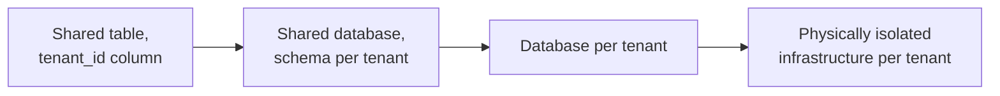

## Intuition

Multi-tenancy usually gets pitched as a cost problem: one set of
infrastructure serving many customers is cheaper than one set per
customer, and the interesting question is how much cheaper. That framing
is true and also the less important half of the story. The question that
actually determines whether a multi-tenant system is safe to run is: **if
tenant A's query has a bug, or tenant A's account is compromised, can it
read or write tenant B's data?** That's not an efficiency question, it's a
correctness question with the same stakes as any other memory-safety
bug — the difference is that "which tenant does this row belong to" is
enforced by application logic, a database policy, or a physical boundary,
and the choice of which one determines what happens when the logic has a
bug.

The second axis that gets underweighted is performance isolation. A
system built to share compute, connections, or storage across tenants by
design also shares contention across tenants by design — one tenant running
an expensive report or getting hit by a traffic spike can degrade latency
for every other tenant on the same shared resource, even though nothing
about their own request changed. Both axes — can data leak, can one
tenant degrade another — have to be answered explicitly for the specific
layer you're isolating at, because "we're multi-tenant" answers neither
question on its own.

## Mechanics

**The isolation spectrum, from weakest to strongest guarantee:**



- **Shared table with a `tenant_id` column.** Every query must filter by
  `tenant_id`, enforced by application code or, better, a database-level
  policy. Cheapest to run, weakest guarantee: the isolation exists only as
  long as every single query path — including future ones nobody's
  written yet — remembers the filter.
- **Row-level security (RLS).** The same shared table, but the database
  itself enforces the tenant filter as a policy attached to the table,
  evaluated on every query regardless of whether the application code
  remembered to add a `WHERE tenant_id = ?` clause. The guarantee only
  holds for the trust boundary it's actually installed at — a policy is
  enforced against the connecting role, and in Postgres a table owner or
  any role with `BYPASSRLS` skips it entirely, so the application must
  connect as a plain, non-owner role with no bypass privilege, and the
  table needs `FORCE ROW LEVEL SECURITY` so even the owner is bound by
  it when the app does connect as owner for migrations. The tenant
  context itself should come from the authenticated request and be set
  per transaction, not left as a session default a later query on a
  pooled connection could inherit from a different request:

  ```sql
  ALTER TABLE orders ENABLE ROW LEVEL SECURITY;
  ALTER TABLE orders FORCE ROW LEVEL SECURITY;

  CREATE POLICY tenant_isolation ON orders
    USING (
      tenant_id = nullif(current_setting('app.current_tenant', true), '')::uuid
    );
  ```

  ```sql
  -- per transaction, after authenticating the request:
  SET LOCAL app.current_tenant = '3f2e...';
  ```

  `current_setting(..., true)` — the `missing_ok` form — returns `NULL`
  instead of raising when no tenant context has been set, so a code path
  that forgets to set it fails closed (the policy compares `tenant_id` to
  `NULL`, which matches nothing) rather than erroring in a way that might
  get caught and swallowed. `SET LOCAL` scopes the value to the current
  transaction, which matters on a pooled connection: a `SET` without
  `LOCAL` persists on the connection and can leak into whatever request
  reuses it next. Application-level filtering (a `WHERE tenant_id = ?`
  the app remembers to add) is a weaker fallback for databases without
  policy enforcement, not a substitute for it — it moves the guarantee
  from "the database enforces it structurally" back to "every engineer
  remembered," which is the exact gap RLS closes.

  This moves the isolation guarantee from "every engineer remembered" to
  "the database enforces it structurally" — a forgotten `WHERE` clause
  now returns zero rows instead of another tenant's rows, which turns a
  data breach into a visible bug, provided the role connecting has no
  bypass and the table has `FORCE ROW LEVEL SECURITY` set.
- **Schema-per-tenant.** Each tenant gets its own schema within a shared
  database instance — stronger blast-radius containment (a migration
  gone wrong, or a bug in one schema's data, doesn't touch another
  schema's tables) but now schema count is a real operational variable:
  a migration has to run once per schema, and connection pooling has to
  account for however many schemas are in play.
- **Database-per-tenant.** Full logical isolation at the connection and
  storage level — a bug in a query for tenant A cannot physically address
  tenant B's rows, because they're not in the same database. Costs
  linearly more in connection management and operational overhead
  (backups, migrations, monitoring, all multiplied by tenant count) in
  exchange for the strongest guarantee that's still "shared
  infrastructure."
- **Physically isolated infrastructure per tenant.** Separate compute,
  separate network boundary, sometimes a separate cloud account —
  reserved for tenants whose compliance requirements (healthcare, finance,
  government) mandate it contractually, where the cost of full isolation
  is smaller than the cost of losing that contract.

**Noisy-neighbor containment**, independent of which isolation tier above
is chosen: rate limits and resource quotas per tenant, so one tenant's
traffic spike or expensive query can't consume a shared connection pool,
a shared cache, or shared compute past the point where other tenants
start seeing degraded latency. This has to be enforced at the layer
that's actually shared — a rate limit on the API gateway doesn't help if
the contention is a shared database connection pool, because a small
number of API calls can still hold every connection with a slow query.

## Cost & limits

**Isolation strength versus operational cost, made concrete.** A
shared-table-with-RLS design might run a thousand tenants on a single
database cluster costing a few hundred dollars a month in compute;
schema-per-tenant on the same tenant count multiplies migration and
connection-pool overhead roughly linearly with tenant count, and most
managed Postgres offerings cap total connections in the low thousands —
so a schema-per-tenant design with per-schema pooled connections runs
into that ceiling well before a thousand tenants, forcing either
connection pooling middleware (PgBouncer) or a move to database-per-tenant
with sharding. The isolation axis and the cost axis move together but not
proportionally: the jump from shared-table to RLS is nearly free (a
policy, evaluated per query); the jump from RLS to schema-per-tenant is a
real multiplier on every operational task.

**What the RLS-versus-nothing decision actually derives from.** RLS
enforcement is a policy check on every row read or written — for a table
with a covering index on `tenant_id`, this is not a meaningfully different
query plan than the equivalent manual `WHERE` clause, so the performance
cost of RLS itself is close to zero. What it buys is not speed, it's
converting "a missing WHERE clause is a security incident" into "a
missing WHERE clause is a bug that returns zero rows" — a categorically
different failure mode, not a performance trade at all.

## When NOT to use it

- **Contractual or regulatory isolation is required.** If a customer's
  contract specifies physically isolated infrastructure — common in
  healthcare and government procurement — no amount of RLS or
  schema-per-tenant satisfies it; the requirement is not a technical
  question at all, it's a legal one, and building a shared system for
  that tenant and hoping it's close enough is how the contract gets
  breached.
- **Tenant counts are small and each tenant is large.** At ten enterprise
  customers each running significant load, the coordination savings of
  sharing infrastructure across them are small relative to the blast
  radius of one tenant's incident affecting the other nine — dedicated
  infrastructure per tenant (or per small group) is often simpler to
  reason about *and* cheaper to insure against a bad incident, at that
  tenant count.
- **A single-tenant product with a hypothetical future customer.** Building
  tenant-aware schemas, RLS policies, and per-tenant rate limits for a
  product that has exactly one customer today is exactly the premature
  infrastructure case the rest of this site warns about — the isolation
  problem doesn't exist yet, and the design will change once real
  multi-tenant requirements (which tier, which compliance bar) are known.

## Real-world usage

Salesforce's core platform is the reference case for row-level
multi-tenancy at scale — every table in their shared database carries an
organization ID, enforced structurally, serving hundreds of thousands of
orgs on shared infrastructure, with the isolation guarantee being the
entire basis of customer trust in the platform. At the other end,
healthcare SaaS platforms handling PHI frequently run database-per-tenant
or fully isolated deployments per customer specifically because HIPAA
business-associate agreements and customer security reviews require
demonstrable physical or logical separation that a shared-table design
can't produce evidence for during an audit. Most mid-size B2B SaaS
products land in the middle — shared database, RLS or an equivalent
application-enforced tenant filter, with an upgrade path to
database-per-tenant offered as an enterprise tier for customers who
require it contractually.

## Failure modes

**The missing WHERE clause.** A new engineer adds a query path — an
export endpoint, an admin report, a background job — and forgets the
tenant filter. Without RLS, this returns every tenant's rows to whoever
triggered it; the symptom from the outside is a customer support ticket
that says "I can see another company's data," which is the worst possible
way to discover the bug, and by then it's a breach disclosure, not a code
review comment. With RLS as a structural backstop, the same missing
filter returns zero rows for anyone but the current tenant, and the bug
surfaces as "this report is empty" — annoying, not catastrophic.

**The noisy tenant.** One tenant runs a large batch import or gets hit by
a traffic spike, saturates a shared connection pool or a shared cache,
and every other tenant on the same infrastructure sees latency climb even
though nothing about their own traffic changed. The symptom is a
platform-wide latency alert with no corresponding platform-wide traffic
increase — the tell that it's one tenant, not overall load, is a p99 spike
that correlates with one account's traffic graph and nobody else's.
Without per-tenant quotas at the actually-contended resource, there is no
per-tenant lever to pull during the incident except manually blocking the
noisy tenant, which is itself a customer-facing outage for them.

**Migration drift across schema-per-tenant.** A schema migration is run
against 950 of 1,000 tenant schemas before a deploy is aborted for an
unrelated reason, leaving the fleet in two different schema versions. The
symptom is intermittent errors that only reproduce for a subset of
tenants and are hard to correlate, because the bug isn't in the code —
it's in which tenants have which schema version, information that lives
in a migration tracking table nobody thought to check first.

## Practice problems

1. A support ticket reports that a user briefly saw a row belonging to
   another company in an export. The table has no RLS policy, only an
   application-level `WHERE tenant_id = ?` added in most but not all
   query paths. Identify the two structural fixes — one immediate, one
   preventing recurrence — and explain why the immediate fix alone isn't
   sufficient.
2. Platform-wide p99 latency has doubled with no change in total request
   volume. Given access to per-tenant traffic graphs and a shared
   database connection pool, describe the diagnostic steps to determine
   whether this is a noisy-neighbor incident, and the two remediations
   available in the next five minutes versus the one that actually fixes
   it long-term.
3. A product currently runs shared-table-with-RLS for 500 tenants. An
   enterprise prospect's security review requires storage and compute
   dedicated to their data, verifiable without trusting a shared
   database's policy configuration — RLS's logical, policy-enforced
   isolation is explicitly not sufficient for their compliance bar. Which
   isolation tier satisfies that requirement, and what does adopting it
   cost operationally that RLS didn't?

## Interview answers

**Two-minute version:** "Multi-tenancy has two separate guarantees that
get conflated: whether tenant data can leak across tenants, and whether
one tenant's load can degrade another tenant's performance. The first is
a correctness problem, not a cost problem — the isolation tier you pick,
from a shared table with a manually-filtered `tenant_id` up to database
per tenant, trades operational cost for how structurally enforced that
guarantee is. RLS is the sweet spot for most SaaS: nearly free
performance-wise, and it converts a forgotten filter from a data breach
into a bug that returns zero rows. The second guarantee — noisy
neighbors — needs its own answer independent of isolation tier: quotas
and rate limits at whatever resource is actually shared."

**The caveat that signals real usage:** the incident that actually taught
this lesson wasn't a data leak, it was a single enterprise customer's
nightly batch job saturating the shared connection pool and degrading
every other tenant's daytime traffic for twenty minutes before anyone
correlated it — the fix wasn't more isolation tiers, it was a per-tenant
connection cap, which is a five-line config change that nobody had
prioritized because the incident hadn't happened yet.
