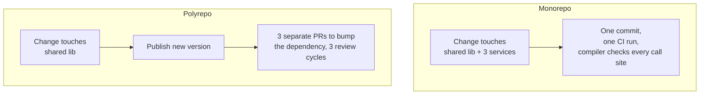

## Intuition

"Monorepo or polyrepo" gets argued as a tooling preference — Nx versus
Turborepo versus separate GitHub repos — when the actual question
underneath it has nothing to do with tooling: **when a change needs to
touch two things at once, do you want that to be one commit or a
coordinated sequence of releases?** Every repository layout is an answer
to that question, and the two layouts answer it in opposite directions.

A monorepo makes cross-cutting change cheap: renaming a function used by
twelve services is one commit, one CI run, one review, because every
consumer is checked out in the same tree and the compiler or test suite
catches every call site in one pass. A polyrepo makes cross-cutting
change expensive by design — that same rename requires publishing a new
version of a shared package, then opening eleven follow-up PRs in the
consuming repos to bump the dependency, each on its own review and
release cycle. What the monorepo bought back is coupling: every service
in the tree now builds against the same version of everything else,
which means a bad commit to the shared code can break every consumer
simultaneously, and a team's CI run now depends on code it doesn't own.
The trade is symmetric — cheap coordination costs you isolation, cheap
isolation costs you coordination — and no build tool changes which side
of that trade you're on.

## Mechanics

**What actually differs between the two, mechanically:**

**Blast radius follows the same trade in the other direction.** In a
monorepo, a broken build in one package can — depending on how CI is
wired — block merges across the whole tree, because the tree is meant to
build as a single consistent unit; a team that never touched the broken
code is still blocked by it. In a polyrepo, that same broken build is
contained to the one repository that owns it; every other repo keeps
shipping, unaware anything happened, until the day they bump the
dependency and inherit the bug on their own schedule instead of
immediately.

**What actually has to be built to make either layout work at scale**,
independent of tool choice:
- **Monorepo:** change detection that runs CI only against the packages
  actually affected by a diff (otherwise every commit re-tests everything,
  and CI time grows with the whole tree regardless of change size);
  ownership metadata (a CODEOWNERS-equivalent) so a review request routes
  to the right team even though everyone shares one tree; and a policy for
  who's allowed to land a breaking change to shared code and when.
- **Polyrepo:** a versioning and publishing pipeline for every shared
  package (semver discipline, a registry, a release process); a way to
  track which consumers are on which version, because "who's still on the
  vulnerable version of this library" is now a fleet-wide query instead of
  a `grep`; and a norm for how urgently consumers are expected to bump —
  without one, security fixes to shared code linger unapplied in slow-moving
  consumers indefinitely.

Build-tool choice (Nx, Turborepo, Bazel, Lerna, or nothing more than
directories and a shared CI config) is how you implement the change
detection and dependency graph a monorepo needs — it does not change
whether a monorepo is the right call for a given org. That's a separate
decision from the one this page is teaching, and it's out of scope here
deliberately: the trade-off is coupling against coordination cost, and a
better build tool narrows the CI-time cost of that trade without touching
the trade itself.

## Cost & limits

**Coordination cost, derived.** For a change that touches `k` consumers of
a shared component, a polyrepo requires `k` separate release cycles —
`k` PRs, `k` reviews, `k` deploys, each with its own latency before the
change is live everywhere. A monorepo requires 1 commit and 1 CI run
regardless of `k`, but that CI run's cost scales with however much of the
tree it has to rebuild and retest, which without change-aware tooling is
close to the whole tree, every time. The crossover point — where the
monorepo's per-commit CI cost exceeds the polyrepo's coordination cost for
a typical cross-cutting change — depends entirely on `k` (how many
consumers a shared change typically touches) and how good the change
detection is; an org with a handful of tightly related services and
frequent cross-cutting changes has a low `k` and a high coordination cost
per polyrepo change, which is exactly the profile that favors a monorepo.

**Coupling cost, derived.** A monorepo where every service builds against
the same commit of shared code has, by construction, zero version skew —
there is no "which version of the auth library is service X on," there is
only the current commit. That's a correctness win (no split-brain between
two services running two versions of the same validation logic) purchased
at the cost of a single bad commit to shared code being able to break
every consumer simultaneously, and of every team's CI depending on the
health of code outside their control. A polyrepo bounds that blast radius
to one repo per bad commit, at the cost of version skew being the default
state — most polyrepo fleets run several versions of any given shared
library at any time, and "audit which services are still on the
vulnerable version" becomes recurring operational work.

## When NOT to use it

**Monorepo, when not to:**
- **Teams need independent access control or open-source boundaries.** A
  monorepo makes it hard to open-source one component without exposing
  the rest of the tree's history and structure, and hard to restrict read
  access to one team's code when everyone needs the tree checked out to
  build anything.
- **The org is larger than the tooling investment it's made.** A monorepo
  without change-aware CI degrades linearly as the tree grows — every
  commit re-testing everything — and an org that hasn't invested in that
  tooling will feel it first as CI time, then as a team afraid to touch
  shared code because the blast radius is the whole company.

**Polyrepo, when not to:**
- **A small number of tightly coupled services that always change
  together.** If two services' code changes in lockstep on nearly every
  feature, a polyrepo turns that natural coupling into forced coordination
  overhead — two PRs, two reviews, a version bump between them — for
  changes that would have been one commit in a monorepo, with no
  corresponding isolation benefit because the services were never
  independent to begin with.
- **The team is too small to need the isolation.** A five-person team
  running three services doesn't have the cross-team blast-radius problem
  polyrepo isolation solves; it has the coordination-overhead problem a
  monorepo solves, and gets none of the polyrepo's benefit in exchange.

## Real-world usage

Google's internal monorepo is the canonical extreme case — effectively
the entire company's non-Android, non-Chrome codebase in one tree,
justified specifically because it makes company-wide refactors (a shared
library's API change, propagated and fixed at every call site in one
changelist) tractable at a scale where coordinating thousands of
independent repos would be its own full-time discipline. Most companies
land on a middle ground: a monorepo per closely related product area
(a backend platform's services in one tree, a separate mobile monorepo)
with polyrepo boundaries between areas that genuinely deploy and evolve
independently — Uber and Airbnb have both published engineering blog
posts describing this exact per-domain split after outgrowing an
all-or-nothing choice in either direction.

## Failure modes

**The monorepo nobody can build fast.** CI time climbs as the tree grows,
without change-aware test selection, until every commit takes twenty
minutes to validate regardless of how small the diff is — the symptom is
engineers batching unrelated changes into fewer, larger commits just to
amortize the CI wait, which defeats the small-safe-commits discipline the
monorepo was supposed to encourage in the first place.

**The polyrepo with silent version skew.** A security fix lands in a
shared library's repo, gets a release, and six of the fifteen consuming
repos bump to it within a week — the other nine don't, because there's no
mechanism forcing or even tracking the bump. The symptom surfaces months
later as a security audit or an incident traced back to a vulnerability
that was "fixed" in the shared library's changelog the whole time,
in a version most of the fleet never adopted.

**The distributed monolith across a polyrepo boundary.** Two services
split into separate repos still deploy in lockstep because one calls an
unversioned internal API of the other with no compatibility contract —
the repo split didn't buy the isolation it promised, it just moved the
coordination cost from "a PR in one repo" to "a Slack thread coordinating
two simultaneous deploys," which is strictly worse because it's no longer
visible in either repo's history.

## Practice problems

1. A shared validation library used by 20 services needs a breaking API
   change. Compare, step by step, what the change process looks like in a
   monorepo versus a polyrepo, and identify the point in the polyrepo
   process where the change is most likely to be forgotten by a consumer.
2. An org's monorepo CI run takes 25 minutes per commit regardless of
   diff size, and engineers have started batching several days of work
   into single commits to reduce how often they pay that cost. Identify
   the missing piece of tooling, and explain why adding more compute to
   CI wouldn't fix the underlying problem.
3. Two services in separate repos deploy together on every release
   because service A calls an internal, unversioned endpoint on service B
   that changes with A's requirements. Is this a polyrepo problem or a
   service-boundary problem, and what would fixing the actual cause look
   like?

## Interview answers

**Two-minute version:** "Monorepo versus polyrepo is a coupling-against-
coordination trade, not a tooling choice — a monorepo makes cross-cutting
changes cheap because everything builds against the same commit, at the
cost of every consumer sharing blast radius when shared code breaks; a
polyrepo isolates that blast radius per repo, at the cost of every
cross-cutting change becoming a coordinated multi-repo release with real
version skew in between. The build tool — Nx, Bazel, whatever — just
determines how well a monorepo scales CI as the tree grows; it doesn't
change which side of the trade-off you're on."

**The caveat that signals real usage:** the mistake I've actually seen
teams make isn't picking the wrong layout, it's picking a layout and then
not building the thing that layout requires to work — a monorepo with no
change-aware CI, or a polyrepo with no enforced policy on how fast
consumers have to bump a security-fixed dependency. The layout is a
five-minute decision; the tooling and process that make it actually pay
off is the part that takes a quarter.
