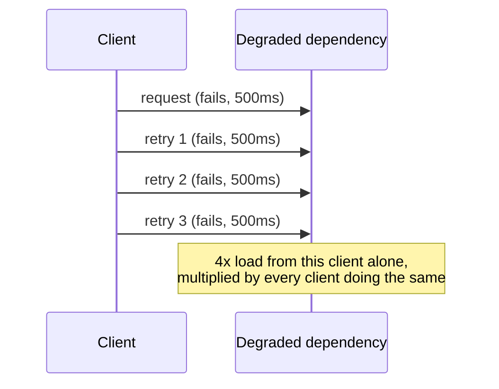
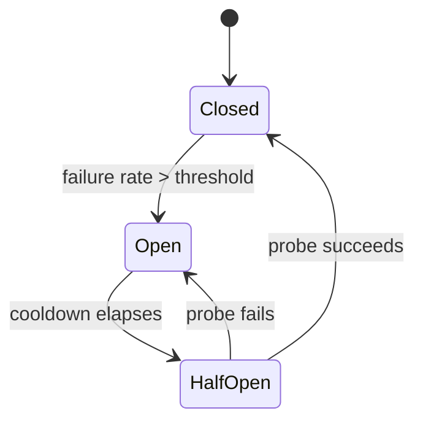

## Intuition

The instinct behind a retry is correct in isolation: a single request
failed, the failure might be transient, try again. What that instinct
skips is that the request didn't fail in a vacuum — it failed because
something downstream is degraded, and a downstream that's degraded
because it's overloaded gets *more* load from every client that reacts to
the failure by immediately trying again. A retry is a bet that the
failure was random noise; on an overloaded dependency it's almost never
noise, it's a symptom, and betting on noise while the actual cause is
sustained overload is how a retry turns one failed request into the
mechanism that keeps the dependency overloaded.

This page assumes you've read
[cascading-failures](/cs-fundamentals/14-production/cascading-failures/),
which walks a captured incident where a retry storm produced a 5x traffic
amplification on an already-struggling downstream — that page is the
mechanism and the symptom. This page is about the specific bound that
prevents it: **a retry without a budget is not a resilience pattern, it's
an amplifier**, and the fix is never "don't retry," it's "retry inside a
budget that's provably smaller than what caused the failure to begin
with."

## Mechanics

**The naive retry, and why it amplifies.** A client that retries every
failed call up to 3 times, immediately, with no delay, turns N incoming
requests against a degraded dependency into up to 4N outbound requests —
the original plus three retries — at the exact moment the dependency can
least afford it. If every one of those retries also times out and is
itself retried by whatever called *this* client, the multiplier compounds
across each hop in the call chain.

**The bound: retry budget + backoff + jitter + circuit breaker.**

- **Exponential backoff with jitter.** Instead of retrying immediately,
  wait a random duration up to `min(cap, base * 2^attempt)` — jitter
  drawn from inside that capped window, not added on top of it, so the
  delay itself never exceeds the cap — so that a thousand clients that
  all failed at the same instant don't all retry at the same instant
  again. Synchronized retries reproduce the thundering herd even with
  backoff if every client backs off on the identical schedule; jitter is
  what breaks the synchronization, the cap is what bounds the worst-case
  wait.
- **A retry budget, not a per-request retry count.** Cap total retries as
  a *percentage of total request volume* over a sliding window (a common
  bound is 10%), tracked per client — once the budget is spent, further
  failures return immediately with no retry, regardless of how many
  retries any individual request has left. This is the mechanism that
  actually prevents amplification: a per-request cap of 3 retries still
  lets every one of a million requests retry 3 times simultaneously; a
  budget caps the extra load *that one client* is allowed to generate,
  independent of how many individual requests are failing. That guarantee
  is per instance, not aggregate, unless the budget's counters are shared:
  a service horizontally scaled to 50 instances, each independently
  tracking its own 10% budget in memory, can still collectively send up
  to 50 times a single instance's allotted extra load to the downstream
  dependency. Getting an aggregate bound out of a fleet requires either a
  shared counter (a fast, TTL'd counter in a cache like Redis, itself a
  new dependency to keep off the critical retry path) or a per-instance
  budget deliberately set to `target_aggregate / instance_count` — which
  has to be re-tuned every time the fleet autoscales, or it silently
  drifts from the bound it was meant to enforce.
- **A circuit breaker.** Tracks the failure rate to a dependency and,
  once it crosses a threshold, stops sending requests entirely for a
  cooldown window — failing fast locally instead of waiting out a timeout
  on every call. This protects the caller (no threads or connections tied
  up waiting on a doomed call) as much as it protects the callee (traffic
  stops entirely instead of merely backing off).

- **A timeout shorter than the caller's own deadline.** A retry is only
  worth attempting if there's time budget left to attempt it — a call
  with a 2-second timeout retried inside a request that has a 1-second
  deadline just guarantees the caller times out anyway, having spent the
  extra latency for nothing. Timeouts have to be set relative to the
  end-to-end deadline, tightening at each hop, not chosen independently
  per service.
- **Bulkheads.** Isolate the connection pool or thread pool used for one
  dependency from the pool used for others, so a dependency saturated
  with retries exhausts only its own pool, not every pool in the process —
  this is what stops one degraded dependency from starving requests to
  unrelated, healthy dependencies. Covered in more depth as one of the
  three cascading-failure mechanisms on the
  [cascading-failures](/cs-fundamentals/14-production/cascading-failures/)
  page; this page names it because a retry budget without a bulkhead
  still lets a slow dependency hold every thread in a shared pool even at
  a reduced retry rate.

**Only retry what's actually retryable.** A `500` from a stateless `GET`
is usually safe to retry. A `POST` that creates a resource is not, unless
it's idempotent — carrying an idempotency key the server can use to
recognize and no-op a duplicate. Retrying a non-idempotent write blindly
doesn't amplify load the way an unbounded retry does, but it produces a
different failure: duplicate charges, duplicate orders, duplicate emails.

## Cost & limits

**The amplification, quantified.** With a naive 3-retry, no-backoff
policy, one client sends up to 4x its normal request volume to a
dependency that's already failing. If three services in a chain each
retry independently on top of each other (A retries calls to B, B
retries calls to C), the multiplier compounds: A can generate up to 4x
load on B, and each of those B calls that fails can itself trigger up to
4x load on C — a worst case of roughly 16x C's normal load from a single
originating failure. This is the arithmetic behind why the
[cascading-failures](/cs-fundamentals/14-production/cascading-failures/)
page's captured incident saw a 5x amplification from what looked like a
minor downstream blip.

**What a retry budget costs to operate.** Tracking a sliding-window
success/failure ratio per dependency per client is a small amount of
in-memory state (a counter or two, decayed over the window) — cheap
computationally, but it requires every client to actually implement it
rather than call a bare HTTP client with a manual `for` loop, which is
where most naive-retry incidents originate: a developer added `retry: 3`
to satisfy a code review comment about flakiness, with no budget, backoff,
or circuit breaker attached to it.

**The trade the bound makes.** A retry budget and circuit breaker
guarantee that a client's own contribution to downstream load is capped —
they do not guarantee the request succeeds. Once the budget is spent or
the breaker is open, the caller has to have a real fallback (cached data,
a degraded response, a queued retry for later) or it's just failing fast
instead of failing slow. Failing fast is strictly better for the
*dependency*; whether it's better for the *user* depends on whether
there's anything useful to show them when the primary call is refused.

## When NOT to use it

- **The dependency's failure is not load-related.** A circuit breaker and
  retry budget are built to protect against overload; if a dependency is
  returning `400`s because of a client-side bug, retrying with a budget
  just delays surfacing the bug — the fix is fixing the request, not
  bounding the retry.
- **The call is a write with side effects and no idempotency key.**
  Bounding the retry rate doesn't make a non-idempotent retry safe; the
  fix there is idempotency, not backoff. Don't reach for backoff as a
  substitute for making the operation safe to repeat.
- **A single-instance, low-traffic internal tool.** The amplification
  this page describes is a function of scale — one client occasionally
  retrying a call to a service with no other callers doesn't produce a
  cascading failure, because there's no herd to synchronize and no
  aggregate load to bound. A circuit breaker here is defensive
  engineering with no attacker or overload scenario to defend against
  yet.

## Real-world usage

Netflix's Hystrix (and its successors, resilience4j and similar
circuit-breaker libraries) popularized exactly this bound — per-dependency
circuit breakers with configurable failure thresholds and fallback
methods — specifically because a microservice architecture with dozens of
internal HTTP calls per request turns "one dependency has a bad
five-minute stretch" into a total outage without it. Several AWS SDKs
now ship exponential backoff with jitter on retryable API calls under
their newer retry modes — the specific default and how it's enabled
varies by SDK, version, and configured retry mode, and older SDK
defaults did not include jitter. AWS's own architecture guidance
(published as "Exponential Backoff and Jitter") describes why: fixed or
unjittered exponential backoff still lets a large number of clients that
failed together retry together, reproducing the synchronized-retry
problem this page opened with even though each individual client is
technically backing off.

## Failure modes

**Retry storm.** The symptom described throughout this page and detailed
with captured telemetry on the
[cascading-failures](/cs-fundamentals/14-production/cascading-failures/)
page: a downstream dependency degrades slightly, retries amplify the
load, the dependency degrades further, more retries fire — visible from
the outside as an outage that starts minutes after a minor, otherwise
recoverable blip, with traffic graphs showing a load spike that has no
corresponding spike in real user traffic.

**The circuit breaker that never closes.** A breaker's half-open probe
keeps failing because the cooldown window is too short relative to the
dependency's actual recovery time (a database restart, a cold cache
warming up) — the breaker cycles open → half-open → open indefinitely.
A single lightweight probe rarely causes the underlying problem itself;
what a too-short cooldown does is repeatedly test before recovery is
actually done and reopen on every failed probe, which delays the moment
the breaker *detects* the dependency is healthy and starts sending real
traffic again — while the operator, watching the breaker stay open, may
reasonably read that as the dependency still being down. The fix is a
longer or exponentially increasing cooldown, not a shorter one.

**Silent budget exhaustion.** A retry budget quietly caps retries at 10%
of volume, requests start failing fast with no retry, and because "fail
fast" doesn't look like an incident in the way a retry storm does (no
traffic spike, no CPU spike), it can go unnoticed for longer — the
symptom is a slow, steady rise in user-visible error rate with flat
infrastructure metrics, easy to misdiagnose as "the dependency is just
degraded" when the real story is "the dependency recovered and the budget
hasn't reset yet."

## Practice problems

1. A service retries failed calls 3 times with no backoff and no jitter.
   At 2am, a downstream database briefly pauses for a 400ms GC stop-the-world
   pause. Trace what happens to the request queue over the next 60
   seconds, and identify the point at which adding backoff alone (no
   budget, no breaker) would still fail to prevent an outage.
2. A dependency fails 40% of requests, each retry attempt independently
   failing with the same 40% probability. Under a naive policy of up to 3
   retries per original request, compute the *expected* extra calls per
   original request (0.4 + 0.4² + 0.4³ ≈ 0.624) versus the cap a 10%
   retry budget — measured as a share of original request volume over a
   1-minute sliding window — places on that same client. Once the budget
   is exhausted, what happens to the requests that would otherwise have
   retried, and is 10% above or below the naive policy's expected extra
   load at this failure rate?
3. A circuit breaker's half-open state sends one probe request every 5
   seconds. The dependency takes 90 seconds to fully recover after a
   restart. Sketch the breaker's state transitions over those 90 seconds
   and explain why a 5-second probe interval delays the breaker
   *detecting* recovery and closing, even though the probes themselves
   aren't what's keeping the dependency down.

## Interview answers

**Two-minute version:** "A retry is a bet that a failure was transient
noise, but on an overloaded dependency the failure usually isn't noise —
it's the symptom — and an unbudgeted retry multiplies exactly the load
that caused the problem. The fix isn't removing retries, it's bounding
them: exponential backoff with jitter so retries don't synchronize, a
retry budget capped as a percentage of total volume rather than a
per-request count, a circuit breaker that stops sending traffic entirely
once failure rate crosses a threshold, and bulkheads so one degraded
dependency can't exhaust the resources shared with healthy ones."

**The caveat that signals real usage:** the mistake we actually made
wasn't skipping retries — everyone knows to add backoff — it was setting
the circuit breaker's cooldown too short relative to how long the
database actually took to recover from a restart, so the breaker kept
reopening on every probe and looked like it was "working" (traffic was
bounded) while the dependency never got the sustained quiet window it
needed to come back.
