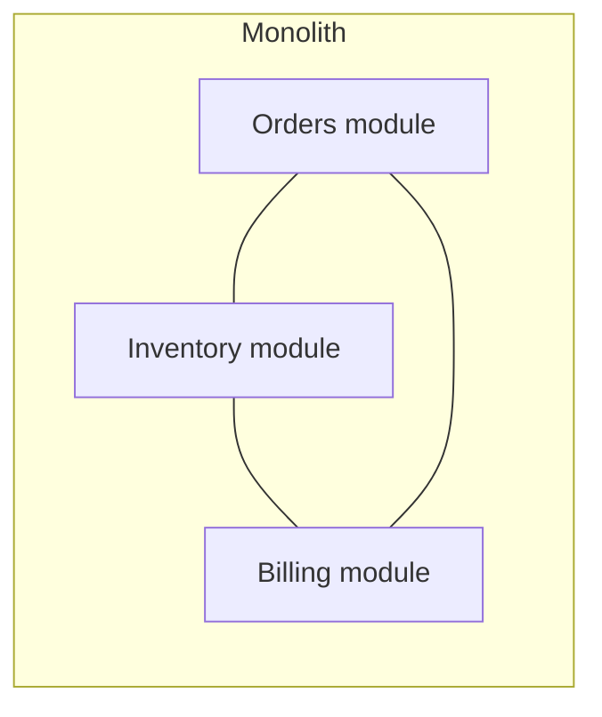
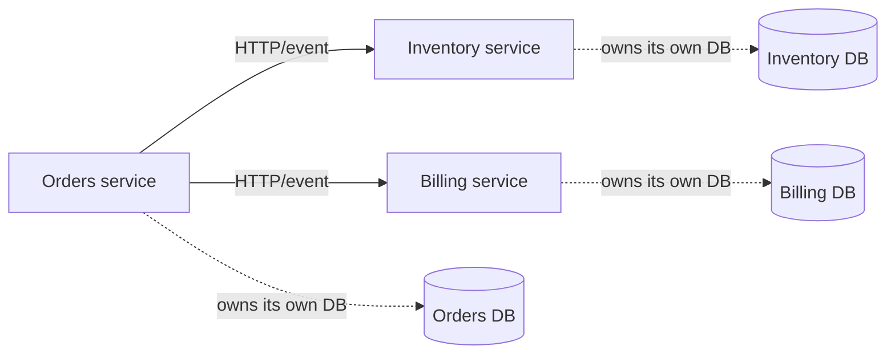

## Intuition

"Should we split this into microservices" is usually asked as if the answer
is a maturity level — as if a system that hasn't split yet just hasn't
gotten there. It isn't. A monolith and a set of services solve different
problems, and the question worth asking is narrower: **what, specifically,
is a single deployable unit currently preventing you from doing, and does
splitting actually remove that specific obstacle** — not "are we big enough
for this yet."

The idea that survives contact with a real org: **decomposition trades a
compile-time problem for a runtime one.** In a monolith, a change that
crosses module boundaries is caught by the type checker and the test
suite before it ships, and a bug in one module can take down the whole
process. Across services, a change that crosses a service boundary is
caught by an integration failure in production unless you've built the
contract-testing discipline to catch it earlier — but a bug in one service
degrades that service, not every service. You're choosing which failure
mode you'd rather operate.

## Mechanics

**What a boundary actually needs to be, for the split to pay off:** an
independent data store, an independent deployment pipeline, and a team
that owns it end to end. A "service" that shares a database with two
others, deploys in lockstep with them, or is maintained by whoever's
free that sprint has paid the operational cost of a service split
(network calls, serialization, a second thing to deploy and monitor)
without getting the actual benefit (independent scaling, independent
failure, independent release cadence) — this is the "distributed
monolith" failure mode, and it's the most common outcome of decomposition
done for its own sake.

**Finding the seam.** The boundary that holds up under change is a
business-capability boundary, not a technical-layer one — "orders,"
"inventory," "billing," each owning its own data and exposing an API,
rather than a "database service," "business logic service," "API service"
split that just moves a network hop between every layer that used to be a
function call. Domain-Driven Design's *bounded context* is the formal name
for this: a boundary drawn around a part of the domain with its own
consistent model and vocabulary, chosen so that most changes land inside
one context rather than crossing several.

The second diagram isn't automatically better than the first — it's the
same three modules, now paying for a network call and a data-consistency
story (usually eventual, via the events the
[message-brokers](/cs-fundamentals/5-systems/message-brokers/) page covers)
on every cross-boundary interaction that used to be a function call inside
one transaction.

**Data ownership is the actual hard part.** Splitting code is
straightforward; splitting a shared database is where most decompositions
stall, because "orders" and "inventory" sharing a `products` table means
neither service can change that table's schema without coordinating with
the other — which means they aren't actually independently deployable yet,
regardless of how the code is organized. A decomposition that splits
services but leaves the database shared has decomposed the org chart, not
the system.

## Cost & limits

**What a network call costs that a function call didn't.** A well-tuned
in-process call is nanoseconds to low microseconds. The equivalent call
across a service boundary — HTTP, JSON serialization, TLS handshake
(amortized by keep-alive), a hop through a load balancer — is typically
1–5ms same-region, more with retries or a slow downstream. A request
handler that made 3 in-process calls and now makes 3 service calls has
added single-digit milliseconds of latency at best; one that fans out to
15 downstream services per request (a common outcome of over-decomposing
a single logical operation) has added tens of milliseconds and, more
importantly, has made its p99 the p99 of the *slowest* of those 15 calls,
not the sum of averages — a single flaky dependency now sets the ceiling
for a request that touches it at all.

**Operational cost, per service.** Each service is its own deploy
pipeline, its own on-call rotation surface, its own set of dashboards and
alerts, its own dependency-upgrade cadence. Ballpark: a team maintaining
15 microservices is maintaining roughly 15x the CI/CD configuration, 15x
the base infrastructure (even at minimal per-service footprint), and a
service-mesh or API-gateway layer to route between them that a monolith
never needed at all — this is the fixed cost independent of how much
traffic any given service handles, and it's why decomposition below a
certain team size is a net loss on maintenance burden alone.

**Consistency cost.** A monolith's single database gives ACID transactions
across "orders" and "inventory" for free — decrement stock and create the
order in one commit, or neither happens. Split those into services with
separate databases and that transaction becomes a saga or a two-phase
process across a network, needing compensating actions for partial
failure (the order was created but the stock decrement failed — now what
undoes the order). This is not a detail to solve later; it changes what
"correct" means for the operation, from atomic to eventually consistent,
and that has to be a decision the business logic can tolerate, not an
implementation detail.

## When NOT to use it

- **Team size below the boundary count.** A boundary needs a team to
  actually own it — on-call, deploys, schema changes. Five engineers
  splitting into twelve services means everyone is on-call for services
  they didn't write and context-switches between codebases constantly;
  Conway's Law runs in reverse here too; the org has to be shaped like the
  system you want, not the other way around. A rough industry heuristic —
  one team fully owning one to a handful of services, not the reverse — is
  a sanity check, not a law.
- **No clear data-ownership boundary yet.** If you can't say which service
  owns the `products` table without a meeting, the boundary isn't real yet
  and splitting the code ahead of the data just creates a distributed
  monolith — same coupling, worse latency, harder debugging.
- **Traffic and scaling needs are roughly uniform across the system.**
  Independent scaling is one of decomposition's real benefits — but it's
  only a benefit if different parts of the system actually need to scale
  differently. An app where every part gets roughly proportional load
  gains nothing from scaling components independently and pays the full
  operational cost anyway.
- **The team hasn't built distributed-systems operational muscle yet** —
  distributed tracing, contract testing across service boundaries,
  runbooks for partial failure. Splitting before that muscle exists trades
  a bug class you know how to debug (a stack trace) for one you don't yet
  (a partial failure three network hops away with no single trace tying
  it together) — the "when NOT to use it" answer here is often "not yet,"
  not "never," and the muscle can be built deliberately before the split
  rather than discovered during an incident after it.

## Real-world usage

Shopify's engineering team has written publicly about deliberately keeping
their core commerce platform a "modular monolith" — internal module
boundaries enforced by tooling, without the network-hop cost of service
calls — specifically because most of their scaling problems were solved by
better sharding and caching within the monolith, not by decomposition; they
extract a service only when a specific capability (like Flash Sale
handling) has a genuinely different scaling profile from the rest of the
platform. Amazon's well-known move to services in the 2000s is frequently
cited as the canonical case *for* decomposition, but the detail usually
dropped is that it was driven by needing hundreds of independent teams to
ship independently at Amazon's org scale — the architectural change followed
an organizational scale problem that most companies citing it as
precedent do not actually have yet.

## Failure modes

**Symptom: a single user-facing request times out, and tracing it takes an
afternoon because it touched nine services and the trace ID wasn't
propagated through all of them.** Cause: decomposition happened without
distributed tracing infrastructure in place first — each service logs
locally, and there's no single ID correlating a request across the chain.
Fix: propagate a trace ID (W3C Trace Context or similar) through every
service call and adopt a tracing backend (Jaeger, Honeycomb, Datadog APM)
before further splitting. Detect the underlying problem earlier by
requiring tracing as a prerequisite for a new service, not a follow-up.

**Symptom: a schema change in one service breaks three others in
production, despite each team believing their service was independently
deployable.** Cause: the services share a database, or one service reaches
directly into another's table instead of going through its API — the
"distributed monolith" pattern, where the deployment topology says
"services" but the data coupling says "monolith." Fix: give each service
exclusive ownership of its own data store and require all cross-service
access to go through its API, even if that API is slower than the direct
query was. Detect it earlier by auditing for any query that crosses a
service's supposed data boundary — a query against another service's
schema from outside that service's codebase is the tell.

**Symptom: an operation that used to be a single atomic transaction now
sometimes leaves the system in a half-completed state — an order exists
with no corresponding inventory decrement.** Cause: the operation was
split across services without a compensating-action design for partial
failure — the saga pattern was needed and wasn't built. Fix: implement
explicit compensating actions (cancel the order if the inventory step
fails) or move to an event-driven design where each step is independently
retryable and idempotent. Detect it earlier by writing the failure-mode
test first — "what does the system look like if step 2 of 3 fails" — before
the split ships, not after the first incident.

## Practice problems

**1. A ten-person team runs a monolith that's slow to deploy (40-minute
CI) and hard to onboard into (one repo, unclear ownership).** Is service
decomposition the right fix? — Probably not as the first move: a 40-minute
CI and unclear ownership are solvable inside a monolith (parallelized test
suites, enforced internal module boundaries with an architecture linter,
clearer CODEOWNERS) at a fraction of the operational cost decomposition
adds. Decomposition is the right fix for "different parts need to scale or
deploy independently," not for "our one repo has bad internal
organization" — the latter is a modularity problem, not a topology one.

**2. Two services, `orders` and `payments`, both read and write to a
shared `transactions` table, deployed independently.** Diagnose the
architecture problem and propose the fix. — This is a distributed
monolith: the services are topologically separate but not actually
independent, since a schema change to `transactions` requires
coordinating both deployments regardless of the separate pipelines. Fix:
assign the table to one service as sole owner (likely `payments`), and
have `orders` access transaction data through `payments`'s API instead of
the shared table directly — accepting the added latency and consistency
cost in exchange for actual independence.

## Interview answers

**"When would you *not* split a monolith into microservices?"** When the
team is smaller than the number of boundaries the domain would produce,
when data ownership between the candidate services isn't cleanly
separable yet, or when the parts of the system don't actually have
different scaling or release-cadence needs — decomposition's benefits are
specific (independent scaling, independent deploys, fault isolation per
component) and if none of them apply to your actual bottleneck, the
network-call latency and operational multiplication are pure cost. The
caveat that signals production experience: having actually operated a
distributed monolith — services in name, shared database in practice — and
knowing that's a worse position than either a clean monolith or a clean
set of services, because it has the deployment complexity of one and the
data coupling of the other.
