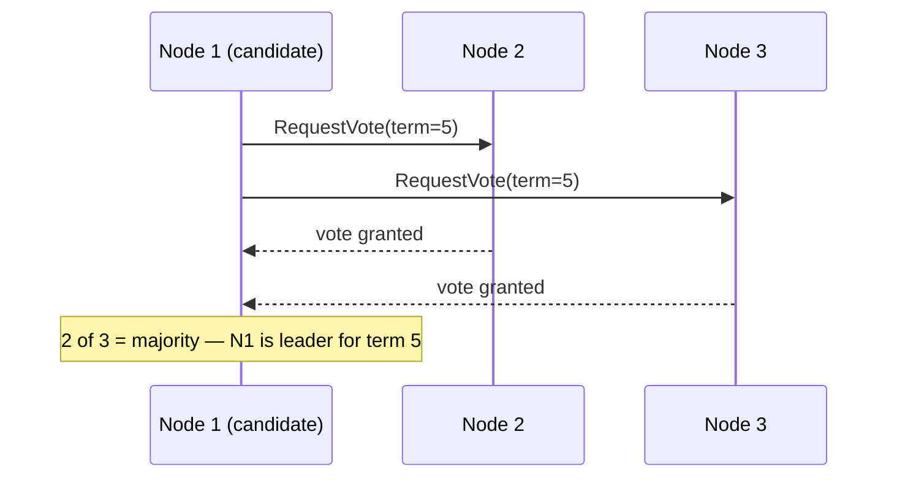

## Intuition

A cluster of nodes needs to agree on one thing — who the leader is, whether a
write committed, what the current value of a counter is — despite messages
that can be delayed, dropped, or arrive out of order. That's consensus. The
single fact every consensus protocol is built around, and the fact that makes
the problem hard rather than merely fiddly, is this:

**a node that is slow to respond is indistinguishable from a node that has
crashed.** From any other node's point of view, both look identical: silence.
There is no message a healthy-but-slow node can send to prove it isn't dead,
because a dead node can't send anything and a slow node's proof-of-life
message is itself subject to the same delay that made it look dead in the
first place.

This isn't an engineering limitation waiting on better tooling — it's a
consequence of [distributed
systems](/cs-fundamentals/5-systems/distributed-systems/) running over an
asynchronous network with no upper bound on message delay. If you can't tell
"slow" from "dead," you cannot design a protocol that requires knowing the
difference. Every consensus protocol's rules — and specifically the quorum
rule below — exist to make correctness hold *even though this distinction is
permanently unavailable*.

## Mechanics

### Deriving the quorum rule

Say a cluster has `N` nodes and wants to agree on a value — commit a write,
elect a leader. If a decision requires unanimous agreement, one slow node
(indistinguishable from a dead one) halts the entire cluster forever, because
the cluster can never be sure that node won't eventually reply. Unanimity is
therefore not survivable — reject it.

So decisions require *some subset* of nodes, not all of them. How large does
that subset need to be? Suppose two different values could each be decided
by two *disjoint* subsets, neither overlapping the other. Then the cluster
could split — one subset reachable in a partition decides value A, another
partition-side subset decides value B, and now two different values are both
"decided," which is exactly the safety property consensus exists to prevent.

The only way to guarantee two decision-subsets always overlap in at least one
node is to require each to contain **more than half** the nodes:

```text
Two subsets of size > N/2 out of N nodes MUST share at least one node.
(If they didn't, their sizes would sum to more than N — impossible.)
```

That's the quorum rule — a majority — and it isn't a convention or a
round-number default, it's the smallest subset size for which two decisions
can never be made independently without overlapping in a node that would
have seen both. The overlap node is what prevents the split: it can't
honestly agree to two different values, so at most one of the two subsets'
decisions is actually valid.

The direct consequence: **a cluster of `N` nodes tolerates `⌊(N-1)/2⌋`
failures** and stays available, because it can still assemble a majority from
the survivors. A 3-node cluster tolerates 1 failure; a 5-node cluster
tolerates 2. Going from 3 to 5 nodes doesn't double the fault tolerance for
free — it costs one more node's worth of acknowledgment on every write,
which is the coordination-cost tradeoff named in
[Scalability](/cs-fundamentals/5-systems/scalability/).

### Leader election, and why it re-derives the same rule

A **leader** is one node designated to sequence writes, so the cluster
doesn't need full consensus on every single operation — only on who the
leader is, and occasionally on replacing them. Electing a leader has exactly
the same problem as any other decision: nodes must agree on one winner
despite not being able to tell a slow candidate from a dead one, so leader
election uses the same majority-quorum rule. A candidate becomes leader only
after a majority of nodes vote for it in a given term.



**A term number is what prevents two leaders believing they're both in
charge.** If the leader goes silent — slow or dead, unknowable which —
followers time out and start a new election with a higher term. If the old
leader was merely partitioned, not dead, it comes back believing it's still
leader; every message it sends carries its old, now-stale term number, and
every other node rejects it in favor of the higher term it has already seen.
This is Raft's mechanism specifically, and it's the direct, structural answer
to "what happens when the old leader isn't dead, just unreachable" — the
cluster doesn't need to know which one is true, because the term number makes
the answer irrelevant to correctness.

### What a consensus protocol actually gives you

Raft and Paxos are separate protocols solving the same problem — Raft was
designed from scratch as a more understandable alternative to Paxos, not a
descendant of it, and both guarantee: **at most one value is chosen per decision, and once chosen, it
survives any minority of failures.** They do not guarantee availability
during a majority-side failure — if more than half the nodes are down or
partitioned away, the cluster correctly refuses to make progress rather than
risk two answers, which is CAP's C-over-A choice made concrete, exactly as
[Databases](/cs-fundamentals/5-systems/databases/) frames it. Implementing
Raft or Paxos from scratch isn't the point of this page — knowing what the
guarantee actually covers, and its cost in acknowledgment latency, is.

### Distributed locks: coordination without full consensus

A distributed lock ("only one process may hold this at a time, across
machines") is a narrower problem than general consensus, but it inherits the
same indistinguishability issue in a specific, dangerous way.

The common shortcut — `SET lock_key value EX 30 NX` in Redis, a lock that
expires after 30 seconds — is **not a lock**, in the sense that matters: it
does not guarantee mutual exclusion. Here's why, concretely:

```text
1. Process A acquires the lock (TTL 30s), begins a long operation.
2. A hits a GC pause / a slow disk write / a network stall for 35s.
3. The lock expires while A is still "holding" it and still working.
4. Process B acquires the lock — B now believes it has exclusive access.
5. A resumes, still believing it holds the lock, and finishes its write.
6. Both A and B have now acted as if they held exclusive access.
```

The TTL exists to prevent a crashed holder from locking everyone out forever
— a real and necessary property. But the TTL cannot distinguish "the holder
crashed" from "the holder is merely slow," which is the same
indistinguishability from the top of this page, now applied to a single
process instead of a whole node. **Any fixed timeout is a guess about how
long the holder might pause, and any guess can be wrong** — a GC pause, a
disk stall, or a scheduler preemption can all exceed it, and none of them
mean the holder actually released the resource it was protecting.

```ts
// This "acquires" a lock but does not guarantee exclusivity.
async function withRedisLock(key: string, fn: () => Promise<void>) {
  const token = crypto.randomUUID();
  const acquired = await redis.set(key, token, 'NX', 'EX', 30);
  if (!acquired) throw new Error('locked');
  try {
    await fn(); // if this takes > 30s, exclusivity is already gone
  } finally {
    await redis.eval(releaseIfOwnerScript, [key], [token]);
  }
}
```

The fix is not a cleverer TTL — no TTL value closes this gap, because the
gap is structural, not tunable. Real mutual exclusion needs a **fencing
token**: a monotonically increasing number issued with each lock grant, which
the *protected resource itself* checks and rejects if it's stale.

```ts
// The database enforces exclusivity — the lock service only advises it.
async function writeWithFencingToken(token: number, data: unknown) {
  const result = await db.query(
    `UPDATE resource SET data = $1, fence_token = $2
     WHERE id = $3 AND fence_token < $2`,
    [data, token, resourceId],
  );
  if (result.rowCount === 0) throw new Error('stale token — lost the lock');
}
```

If A's write from the scenario above arrives after B already wrote with a
higher token, A's write is rejected by the `fence_token < $2` check — not
because A knew it lost the lock (it didn't), but because the resource itself
refuses stale writers regardless of what any process believes about lock
ownership. This is the general principle: **a timeout-based lock is only
safe when the thing it protects can independently reject stale writers** —
the lock coordinates, it doesn't enforce, and conflating the two is exactly
the mistake a cache-with-a-TTL invites.

## Complexity

The number worth deriving is **what a majority costs in latency**, since it's
what every write pays:

- A write to a Raft/Paxos cluster commits once a majority has acknowledged it
  — the leader counts its own durable write, so in a 5-node cluster it needs
  only 2 of its 4 followers to ack, not all 4. Commit latency is therefore
  bounded by the **quorum-th fastest acknowledgment**: the second-fastest
  follower response, in this case, not the median and not the slowest. A
  5-node cluster with two slow followers still commits at the speed of the
  other two, because the slow pair is simply never on the critical path.
- Fault tolerance and latency trade directly against cluster size: `N` nodes
  tolerate `⌊(N-1)/2⌋` failures, and every write waits on `⌈(N+1)/2⌉` acks.
  Going from 3 to 5 nodes buys one more tolerated failure at the cost of one
  more required acknowledgment per write — which is why production consensus
  clusters cluster tightly around 3 or 5, rarely more; the marginal fault
  tolerance stops being worth the marginal latency past that.
- A fencing token adds one comparison and one extra column to every write the
  protected resource accepts — negligible per-operation cost, in exchange for
  closing a correctness gap that has no other affordable fix.

## When NOT to use it

- **A single process, or a single database, already serializes the
  operation.** If one Postgres instance can hold the actual lock (`SELECT ...
  FOR UPDATE`, or a unique constraint), that's real mutual exclusion with no
  distributed-consensus machinery needed — don't reach for Raft-backed
  coordination to protect something one row-level lock already protects.
- **The coordinated operation can tolerate being done twice.** If retrying an
  idempotent operation is cheap, a lock is solving a problem that doesn't
  cost anything to leave unsolved — see [Distributed
  Systems](/cs-fundamentals/5-systems/distributed-systems/) on idempotency as
  the cheaper alternative to coordination.
- **You're about to implement Raft or Paxos yourself for a production
  system.** Use an existing, battle-tested implementation (etcd, ZooKeeper,
  or a cloud provider's managed equivalent) — the protocols are notoriously
  easy to get subtly wrong in the edge cases (leader changes during a
  partial commit, log compaction) that only show up under real failure
  conditions, not in a demo.

## Real-world usage

etcd (Raft) backs Kubernetes' entire cluster state — every pod, service, and
config object is a value etcd's consensus layer agrees on, which is why a
Kubernetes control plane needs an odd-numbered etcd cluster and degrades
predictably as members are lost. ZooKeeper (using Zab, its own
atomic-broadcast protocol, not Paxos or Raft) and Consul provide the same
leader-election and coordination primitives for
Kafka, HBase, and countless service-discovery setups. These are named here as
what to reach for, not compared feature-by-feature — the point is knowing
what a consensus-backed coordination service guarantees that a plain cache
cannot.

## Failure modes

**Symptom: two nodes both believe they're the leader, and both are accepting
writes.** A split-brain — usually caused by a consensus implementation that
skipped the term/epoch check on leader messages, or a manually-built
"leader election" that used a timeout-based lock (see below) instead of a
real quorum protocol. The fix is using an actual consensus library rather
than approximating one, because the approximation is exactly where this bug
lives.

**Symptom: a distributed lock was held by two processes at once, and neither
process's logs show an error.** The TTL-expiry race described above. Neither
process did anything wrong from its own point of view — that's what makes it
dangerous. The fix is a fencing token checked by the protected resource, not
a longer TTL, which only shrinks the window rather than closing it.

**Symptom: a consensus cluster stopped accepting writes after losing two
nodes out of five.** This is the majority rule working as designed, not a
bug — two failures out of five leaves three survivors, and if a third is
partitioned away rather than crashed, the survivors correctly refuse to
proceed without a majority they can actually reach. The failure mode is
mistaking this for an outage to page on immediately, rather than recognizing
it as the fault-tolerance boundary the cluster size was chosen for.

**Symptom: leader elections happen constantly, and throughput craters even
though no node has actually crashed.** Network flakiness or an
overly-aggressive election timeout is causing the cluster to treat merely
slow heartbeats as leader failure. Since a slow leader and a dead leader are
provably indistinguishable, tuning the timeout is a genuine tradeoff, not a
bug to eliminate — too short causes needless churn, too long delays real
failover; the fix is measuring actual heartbeat latency in production and
setting the timeout with margin above its tail, not a default left
untouched.

## Practice problems

**1. A 7-node Raft cluster loses 3 nodes to a partition, leaving 4
reachable. Can the cluster still accept writes? What if it had lost 4,
leaving 3?**

<details>
<summary>Solution</summary>

With 4 of 7 reachable: yes — 4 is a majority of 7 (`> 7/2 = 3.5`), so the
remaining nodes can still form a quorum and commit writes. With 3 of 7
reachable: no — 3 is not a majority of 7, so the surviving side correctly
refuses to accept writes, even though 3 nodes are healthy and could easily
agree among themselves. This is deliberate: allowing a minority to keep
writing is exactly what would let a partition produce two independently
"committed" histories, which is the split-brain problem the quorum rule was
derived to prevent.
</details>

**2. Why does `SETNX key value EX 30` on Redis not provide correct mutual
exclusion, and what's the minimum change that fixes it?**

<details>
<summary>Solution</summary>

The TTL can expire while the current holder is still actively working
(paused by GC, a slow disk, or a network stall) but not actually finished —
and since a paused holder is indistinguishable from a crashed one, no TTL
value can be chosen that's always long enough without also being
unacceptably long for the crash-recovery case it exists to serve. The
minimum fix isn't a different TTL — it's adding a fencing token: the lock
grant returns a monotonically increasing number, and the *protected
resource* (not the lock) rejects any write carrying a token lower than the
highest one it has already seen. That moves the actual correctness guarantee
off the lock (which can't provide it) and onto the resource (which can).
</details>

## Interview answers

**"Why does consensus require a majority, not just 'more than one' node?"**

> Because a slow node and a dead node look identical from the outside — there's
> no message a healthy-but-delayed node can send to prove it isn't down,
> since that message is subject to the same delay. That means the cluster
> can never wait for unanimity, because one silent node would halt it
> forever without anyone being able to tell if that's ever going to resolve.
> Once you accept decisions need to happen with only a subset of nodes, that
> subset has to be more than half, or two decisions could be made by
> non-overlapping subsets and split the cluster's view of the truth — a
> majority is the smallest size where that's provably impossible.

**"Is a Redis lock with a TTL good enough for mutual exclusion?"**

> Not on its own — the TTL protects against a crashed holder locking
> everyone out forever, which is real and necessary, but it can also expire
> under a live holder that's just paused, and there's no way to set the TTL
> that closes that gap without also being too conservative for the crash
> case. If the resource being protected can enforce a fencing token itself,
> the lock becomes advisory and the resource becomes the actual source of
> truth for exclusivity — that's the fix. If it can't, the TTL lock is a
> best-effort throttle, not a correctness guarantee, and I'd say so
> explicitly rather than let it be treated as one.

**The caveat worth voicing:** I wouldn't implement Raft or Paxos from
scratch for a production system, and I'd be skeptical of anyone who
recommends it lightly — the protocols are simple to state and famously easy
to get subtly wrong in the failure cases that only show up under real
network partitions. Knowing what etcd or ZooKeeper actually guarantees, and
using one of them, beats a homegrown approximation every time.
