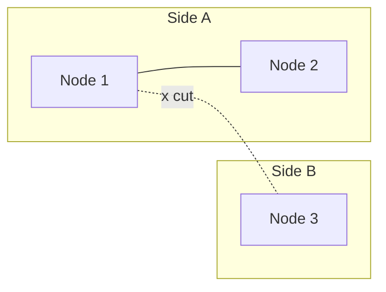

## Intuition

A distributed system is any system where a machine has to find out what
another machine did over a network that can lose messages, delay them, or cut
out entirely — and cannot tell those three apart from the outside. That last
clause is the entire subject. A single-process program never faces it: a
function call either returns or the process is dead, and you know which.

The famous [fallacies of distributed
computing](https://en.wikipedia.org/wiki/Fallacies_of_distributed_computing)
are really one fallacy repeated eight ways: *the network behaves like local
memory*. It doesn't — latency is not zero, bandwidth is not infinite, the
network is not reliable, and topology changes under you. Every distributed
systems technique on this site is a response to one of those facts refusing
to go away.

The concrete version: you call another service, and after some time with no
response, you have to decide what happened. Three things are indistinguishable
from where you're standing:

1. The request never arrived.
2. The request arrived, was processed, and the response was lost.
3. The request is still being processed.

A local function call can never produce case 2 — it either ran or it didn't,
never both-and-you-can't-tell. A remote call can, and the entire discipline
of building distributed systems is designing so that not knowing which of the
three happened doesn't corrupt anything.

## Mechanics

### The partition is not a hypothetical

A network partition means some machines can't reach others, temporarily or
not. It happens more than intuition suggests — a bad deploy, a router
misconfiguration, a saturated link, a cloud provider's cross-AZ network
having a bad five minutes. When it happens, [Databases](/cs-fundamentals/5-systems/databases/)'s
CAP framing stops being theoretical: a node on the wrong side of the partition
has to answer a request *right now*, with no way to reach the rest of the
cluster to check if its view is current.



Node 3 gets a write. It can accept it and diverge from Side A (choosing
**availability**), or refuse until the partition heals (choosing
**consistency**). There is no third option that gets both — that's the
theorem, not a design failure. What the theorem does *not* tell you is which
choice is right; that depends entirely on what the write means, which is why
[the system design process](/cs-fundamentals/5-systems/system-design-process/)
makes this a per-operation decision, not a system-wide label.

### At-most-once, at-least-once, exactly-once

Given that a response can be lost, every remote call has to pick a delivery
guarantee, and the honest options are two, not three:

- **At-most-once** — send once, don't retry. Simple, but a lost response
  means the effect never happens and nobody knows.
- **At-least-once** — retry until acknowledged. Simple, but a lost
  *response* (not the request) causes the same effect to run twice.
- **"Exactly-once"** — marketed by some messaging systems, achieved in
  practice by at-least-once delivery plus an **idempotent** receiver, never
  by the network layer alone. There is no way to make the network itself
  exactly-once when messages can be delayed and retried; the guarantee has to
  live at the application layer.

```ts
// Idempotency key makes at-least-once delivery safe to retry.
async function chargeCard(idempotencyKey: string, amount: number) {
  const existing = await db.charges.findByKey(idempotencyKey);
  if (existing) return existing; // already ran — return the prior result

  return db.transaction(async (tx) => {
    const charge = await paymentGateway.charge(amount, idempotencyKey);
    await tx.charges.insert({ key: idempotencyKey, ...charge });
    return charge;
  });
}
```

The idempotency key is what turns "retry blindly" into a safe default. Most
production incidents attributed to "the network is flaky" are actually
missing idempotency keys on a retried call.

### Timeouts don't mean failure

A timeout means *no answer arrived in time* — it says nothing about whether
the remote side finished the work. Treating a timeout as "it didn't happen"
is how double-charges and duplicate emails get built into a system on
purpose. The correct response to a timeout on a non-idempotent call is to
check the outcome before retrying, not to assume either answer.

### Logical clocks: ordering without a shared clock

Wall clocks on different machines disagree, sometimes by seconds. When you
need to know "did A happen before B," you can't trust timestamps across
machines — you need a **logical clock**. A Lamport clock is the minimal
version: each node keeps a counter, increments it on every event, and
attaches it to every message; the receiver sets its own counter to
`max(local, received) + 1`. It gives a total order that respects causality
(if A caused B, A's clock value is smaller) without needing synchronized
wall-clock time anywhere.

## Complexity

The "derive it" discipline here is about honestly stating what a call can
and can't guarantee, not a Big-O bound:

- A synchronous call across a network adds real, non-zero latency — usually
  0.5–100 ms depending on whether it's same-datacenter or cross-region — and
  that latency is a tail, not a constant, so the number to design around is
  p99, not the average.
- Retrying with no backoff turns one slow dependency into a self-inflicted
  DDoS: N clients retrying immediately on a 1-second timeout multiply load on
  an already-struggling service by N. Exponential backoff with jitter is not
  an optimization, it's what keeps a partial outage from becoming a total
  one.
- A system with M services, each with 99.9% availability, calling each other
  serially has combined availability of `0.999^M` — five sequential calls at
  99.9% each is 99.5% overall, an order of magnitude worse than any single
  hop. This is the arithmetic that justifies caching and async processing
  over long synchronous call chains, and it only gets worse as M grows.

## When NOT to use it

- **A single process can do the whole job.** If one machine's memory and CPU
  cover the actual load, distributing the work only adds the failure modes
  on this page for no benefit. Distribute when you must — for scale beyond
  one machine, or for availability across a failure domain — not by default.
- **Strong consistency is genuinely required and the system can afford to be
  unavailable during a partition.** Don't reach for eventual consistency and
  a cleverness layer to paper over a case where refusing the write is the
  correct, simple answer.
- **The team can't operate what it's building.** Distributed systems fail in
  ways that require runbooks, tracing, and on-call familiarity with the exact
  failure modes below. A system nobody can debug at 3am is a liability
  regardless of how sound the design is on paper.

## Real-world usage

Every service-to-service call in a microservice architecture is a
distributed-systems problem, whether or not anyone frames it that way — the
HTTP client library's retry policy, the idempotency key on a payment
endpoint, the circuit breaker around a flaky downstream call. Message brokers
(see [Message Brokers](/cs-fundamentals/5-systems/message-brokers/)) exist
specifically to convert synchronous distributed calls, with their
availability multiplication problem, into asynchronous ones that degrade more
gracefully.

## Failure modes

**Symptom: a payment is charged twice, and the logs show the client got a
timeout on the first attempt.** The classic timeout-retry bug: the first
charge succeeded, the response was lost, the client retried without an
idempotency key, and the second charge ran independently. Fix: idempotency
keys on every retried, side-effecting call — not just payments.

**Symptom: a downstream service's brief slowdown takes down every service
that calls it, twenty minutes later, with no obvious connection in the
logs.** Retry storms. A slow dependency causes callers to retry, which adds
load to the already-slow dependency, which makes it slower, which causes more
retries — cascading failure. Exponential backoff with jitter, a circuit
breaker that stops calling a dependency that's clearly down, and bulkheads
that cap how many resources one dependency can consume are the standard
defenses.

**Symptom: two replicas of the "same" record disagree, and neither log shows
an error.** A partition happened, both sides accepted writes (an
availability-favoring choice), and nobody reconciled them on healing. This is
not a bug in the individual nodes — it's the direct, expected consequence of
choosing AP for that operation. The fix is a defined reconciliation strategy
(last-write-wins, a CRDT, or a manual merge queue), decided *before* the
partition, not during the incident.

**Symptom: a request "succeeded" according to the client, but the downstream
system shows nothing happened.** A message was accepted by a broker or
gateway and then lost before being processed — acknowledged too early.
Acknowledge only after the effect is durable, not after it's merely received.

## Practice problems

**1. A client calls `POST /orders` and the connection drops before a
response arrives. The order may or may not have been created. Design the
retry so the client can safely resend.**

<details>
<summary>Solution</summary>

The client generates an idempotency key (a UUID) before the first attempt and
sends it on every retry of that logical operation. The server checks for an
existing order with that key before creating a new one — same pattern as the
`chargeCard` example above. This converts "I don't know if it ran" into "it's
safe to ask again," which is the only correct response to an ambiguous
timeout; guessing either way (assume it ran, or assume it didn't) is wrong
some fraction of the time by construction.
</details>

**2. Service A calls B calls C, all synchronously, each individually at
99.9% availability. What's the availability of a request that touches all
three, and what's one architectural change that improves it without touching
any service's own reliability?**

<details>
<summary>Solution</summary>

`0.999^3 ≈ 99.7%` — worse than any single service. Breaking the synchronous
chain — having A call B and C in parallel instead of serially where the logic
allows it, or making C's work asynchronous via a queue so A and B don't wait
on it — removes hops from the *serial* chain without changing any service's
individual reliability. Parallel calls bound the total latency by the
slowest one instead of the sum, and removing a hop from the serial chain
removes its `0.999` factor from the product entirely.
</details>

## Interview answers

**"What is a distributed system, really?"**

> Any system where one node has to learn what another node did through a
> network that can lose, delay, or duplicate messages — and where you can't
> tell those cases apart from the caller's side. Everything else — CAP,
> idempotency, retries, logical clocks — is a consequence of designing around
> that one fact.

**"How do you handle a timeout on a payment call?"**

> I don't retry blindly, because the timeout doesn't tell me whether the
> charge went through. I query the payment's status by idempotency key first;
> if it's unknown, I retry with the same key so a duplicate attempt is a
> no-op server-side rather than a second charge.

**The caveat worth voicing:** most distributed-systems bugs I've actually
debugged weren't exotic consensus failures — they were a missing idempotency
key or a retry with no backoff. The theory (CAP, logical clocks) explains why
the system *can* misbehave; the incidents are almost always the boring
version of that.
