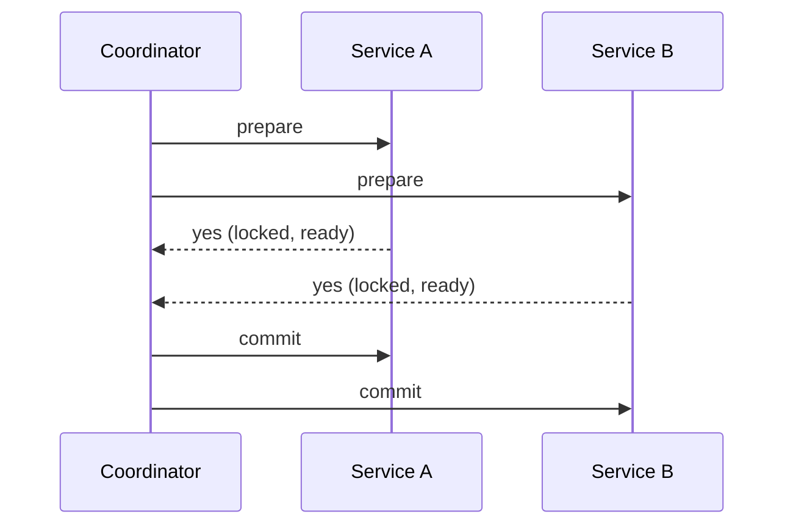
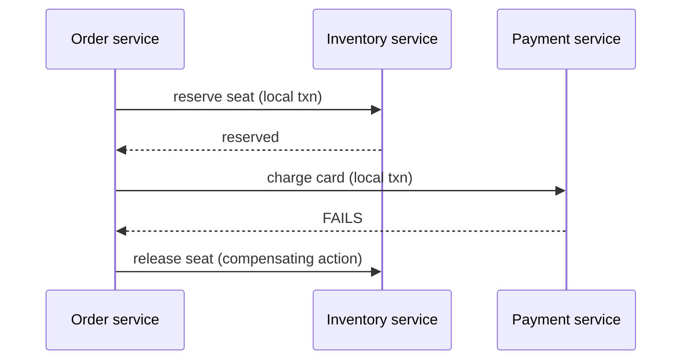

## Intuition

A transaction inside one database gives you something specific: all the
writes happen, or none do, and nobody else sees a half-finished state in
between. That guarantee comes from a lock manager and a write-ahead log that
one process controls end to end — the database can hold every relevant lock
because it's the only party involved.

A transaction spanning two services — "reserve the seat, then charge the
card, and both must succeed or both must fail" — has no such single owner.
Each service has its own database, its own lock manager, and no shared lock
covering both. The moment a transaction crosses a service boundary, the
question stops being "how do I make this atomic" and becomes "atomic is no
longer available — what am I willing to accept instead, and what do I do
when it partially fails."

There are exactly two honest answers, and they cost different things:

1. **Two-phase commit (2PC)** — get a real, if fragile, atomicity guarantee
   back, at the cost of blocking every participant on a coordinator that
   might itself fail.
2. **The saga pattern** — give up atomicity and isolation entirely, do each
   step independently, and define a **compensating action** to undo each
   step if a later one fails.

Most systems that reach for "distributed transactions" actually want a saga,
because 2PC's failure mode — the whole system frozen waiting on a coordinator
that's gone — is worse in practice than the eventual-consistency window a
saga accepts. But a saga is not a transaction with a different implementation;
it's a fundamentally weaker guarantee, and treating it as a drop-in
replacement is where this goes wrong.

## Mechanics

### Two-phase commit: real atomicity, real cost



Phase one: the coordinator asks every participant to prepare — lock the
relevant rows, write the change to a durable log, but don't apply it yet, and
report ready or not. Phase two: only if *everyone* says ready does the
coordinator tell everyone to commit; if anyone says no, everyone rolls back.

This genuinely restores atomicity — no participant commits unless all of them
can. The cost is what happens if the coordinator crashes between phase one
and phase two: every participant is sitting there holding locks, unable to
commit or roll back on its own, because it doesn't know what the coordinator
decided. Those locks block other transactions until the coordinator recovers
or a human intervenes. 2PC turns a network partition into a system-wide
freeze, which is exactly the availability cost [network partitions
force](/cs-fundamentals/5-systems/distributed-systems/) — 2PC is the CP
choice, made explicit and structural.

### The saga: independent local transactions, chained by events



Each step is a normal local transaction, committed independently, with no
lock held across services. If a later step fails, the saga runs
**compensating actions** — the inverse of each already-committed step, in
reverse order — instead of a rollback. This is the trade: no blocking, no
cross-service locks, but also no isolation. Another request can observe the
seat as reserved *and later see it released*, which never happens inside a
real transaction.

```ts
async function bookAndPay(orderId: string) {
  const steps: Array<() => Promise<void>> = [];
  try {
    await inventory.reserve(orderId);
    steps.push(() => inventory.release(orderId));

    await payment.charge(orderId);
    steps.push(() => payment.refund(orderId));
  } catch (err) {
    for (const compensate of steps.reverse()) {
      await compensate(); // must be idempotent — see Failure modes
    }
    throw err;
  }

  // Booking and payment are durable at this point, so nothing past
  // this line is allowed to trigger their compensation. The one
  // irreversible step goes through a separate, idempotent, retried
  // path instead of the saga's own try/catch — see below.
  await outbox.enqueue('sendConfirmation', { orderId });
}
```

### The action you cannot compensate

`inventory.release` undoes a reservation cleanly. `payment.refund` is weaker
than that — it's a *business* compensation, not a true inverse: it restores
the required invariant (the customer isn't out the money) but it doesn't
erase the fact that a charge and a refund both happened, it's itself an
external effect that can complete asynchronously or fail, and it leaves a
visible financial trail the original charge never had. `notification.sendConfirmation`
is weaker still — it has no compensation at all, and that's the case the
saga pattern's popular explanations tend to skip.

**An email that has been sent cannot be unsent.** There is no compensating
action for "the customer already read the confirmation." The same is true of
any external, observable, physical-world effect: a text message, a package
that has left the warehouse, a webhook fired to a third party who acted on
it, cash dispensed from an ATM. These are not edge cases — they are the
category of action a saga's compensation model fundamentally cannot cover,
because compensation only works when the effect is entirely inside systems
you control and can still mutate.

What to do instead, in order of preference:

1. **Order the saga so irreversible steps happen last, and take them out of
   the saga's own compensation path.** `bookAndPay` above does this — the
   confirmation is enqueued only once the booking and charge are durable, and
   it's delivered by a separate idempotent worker, not the saga's try/catch,
   so a delivery failure or an ambiguous timeout on the send retries the send
   instead of compensating a booking and payment that already succeeded.
2. **If an irreversible step must happen before something that can still
   fail, accept the inconsistency explicitly and handle it operationally** —
   a follow-up "sorry, that didn't work" message is a real, shippable answer
   for a failure that's rare and low-stakes, but it's a business decision,
   not an engineering one, and it has to be made by someone who owns that
   tradeoff.
3. **Never treat "send a compensating apology" as equivalent to a rollback.**
   It resolves the business problem; it does not restore the system to the
   pre-transaction state, and code that assumes it does will eventually be
   surprised by an audit or a support ticket asking why the customer has two
   contradictory emails.

## Complexity

The dimension worth deriving here is **what each approach costs under
failure**, since both "work" under the happy path:

- **2PC's cost is a blocking window with no bound.** If the coordinator
  fails after phase one, participants hold locks until it recovers — this
  could be seconds or, in the worst observed cases, hours, and during that
  window the locked rows are unavailable to everyone else. This is why 2PC
  is rare across service boundaries in practice and more common only within
  a single, tightly-controlled cluster (some databases use it internally
  for distributed writes across their own nodes, where they control
  coordinator recovery tightly).
- **A saga's cost is an inconsistency window with no inherent upper bound** —
  only an operational target you set and enforce (a completion SLO of, say,
  a few seconds), not a guarantee the pattern gives you for free. Meeting
  that target requires durable saga state, retries with backoff, and a
  reconciliation path for a saga that's still incomplete once the target is
  blown. That's the trade against 2PC: visible, recoverable inconsistency
  you have to engineer for, instead of invisible, unbounded blocking.
- **Saga steps must be idempotent, and that's not free** — each step needs
  either a natural idempotency check (an id-based upsert) or an explicit
  idempotency key (see [Distributed
  Systems](/cs-fundamentals/5-systems/distributed-systems/)), because a
  saga's own recovery logic will retry steps after a crash, and a
  non-idempotent step retried twice is a second, real charge — the exact bug
  the pattern exists to avoid.

## When NOT to use it

- **The operation fits inside one database.** If order and inventory share a
  schema, a local ACID transaction is strictly better than either pattern on
  this page — no blocking risk, real isolation, no compensating-action design
  needed. Distributed transactions are a response to a boundary that already
  exists, not a default worth introducing by splitting a schema that didn't
  need splitting.
- **The steps can't be made idempotent and can't be reordered to put the
  irreversible one last.** If an external, irreversible action has to happen
  in the middle of a saga and cannot be deferred, the pattern doesn't fit —
  that operation needs either a synchronous, manually-approved step, or a
  redesign of the flow, not a saga papered over the gap.
- **The business genuinely cannot tolerate the inconsistency window.** A
  banking ledger transfer between two systems that must never show a
  transient half-completed state to any reader is a case where the saga's
  visible-in-between-state trade is unacceptable, and the answer is redesign
  around a single system of record, not a saga anyway with a "we'll add
  more coordination."

## Real-world usage

E-commerce checkout — reserve inventory, charge payment, schedule shipping —
is the canonical saga, because each step naturally lives in a different
service with its own database, and each has a natural compensation
(release, refund, cancel) except the final notification step, which is why
checkout flows universally send the confirmation last. 2PC shows up inside
distributed databases (CockroachDB, Spanner) coordinating writes across their
own internal shards, where the "coordinator" is part of the same trusted
system rather than a separate service — a materially different risk profile
than 2PC across organizationally separate services.

## Failure modes

**Symptom: a customer is charged twice for one order.** A saga step
(`payment.charge`) wasn't idempotent, and the orchestrator retried it after a
timeout whose outcome was actually a success — see [Distributed
Systems](/cs-fundamentals/5-systems/distributed-systems/) on why a timeout
never tells you whether the call landed. Fix: every saga step keyed by an
idempotency key tied to the saga instance, checked before executing.

**Symptom: a customer gets a "your order is confirmed" email, then a "sorry,
that failed" email four seconds later.** The confirmation step ran before a
later step that could still fail — exactly the ordering mistake called out
above. Reorder the saga so irreversible steps are last, or, if that's not
possible, treat the double-message as a known, accepted cost and say so in
the design rather than discovering it in production.

**Symptom: a distributed system built on 2PC has been unresponsive for ten
minutes and nobody can say why.** The coordinator crashed mid-commit and
every participant is holding locks waiting for a decision that will never
come without intervention. This is 2PC's defining failure mode, not a bug —
it's the direct cost of the blocking guarantee, and the mitigation is either
a coordinator with its own failover (adding more infrastructure to fix
infrastructure) or abandoning 2PC across this boundary for a saga.

**Symptom: two compensating actions ran for the same failed saga, and
inventory was released twice — once too many, going negative.** The
compensation logic itself wasn't idempotent, or the saga's failure-detection
fired twice for one failure. Compensations need the same idempotency
discipline as the forward steps; "it's just undoing something" doesn't make
it safe to run more than once.

## Practice problems

**1. A saga for hotel booking does: reserve room → charge card → send
confirmation SMS → notify the hotel's PMS system. The PMS notification fails.
What's wrong with the saga's step order, and what's the fix?**

<details>
<summary>Solution</summary>

The SMS is sent before a step that can still fail, so a failure at the PMS
step forces a choice between two bad options: leave the customer with a
confirmation SMS for a booking that's about to be compensated away
(inconsistent, and irreversible — the SMS can't be unsent), or don't
compensate the earlier steps and leave the PMS out of sync instead (silently
broken downstream integration). The fix is reordering: PMS notification
before the SMS, since PMS state can plausibly be corrected by a retry or a
manual fix, while the SMS genuinely cannot be undone. The general rule: order
steps so the irreversible one is always last.
</details>

**2. Two customers try to book the last seat in a saga-based flow. Both
`reserve` calls succeed against slightly stale replica reads, and both
payments are charged. What guarantee did the saga fail to provide, and how do
you actually prevent this?**

<details>
<summary>Solution</summary>

Isolation — a saga gives you none, so a genuine race between two forward
paths isn't caught by the saga pattern at all. The `reserve` step itself
needs to be a real, isolated operation with a uniqueness constraint or
optimistic-locking check inside the inventory service's own database (`UPDATE
seats SET status = 'reserved' WHERE id = ? AND status = 'available'`,
checking affected-row count) — that's a local ACID guarantee, not a
distributed one. The saga can only coordinate steps that are already
individually correct; it cannot manufacture correctness a step doesn't have
on its own.
</details>

## Interview answers

**"How would you implement a distributed transaction across two services?"**

> I'd first ask whether it needs to be distributed at all — if the two
> pieces of data can live in one database, that's a normal ACID transaction
> and this whole problem disappears. If it genuinely spans services, I'd
> reach for a saga over two-phase commit almost every time, because 2PC's
> failure mode is an indefinite block on a dead coordinator, and a saga's
> failure mode is a bounded, visible inconsistency window I can design
> around.

**"What about the step you can't undo — like sending an email?"**

> That's the part sagas don't solve, and pretending otherwise is how you
> ship a bug. An email or an SMS is genuinely irreversible, so the saga has
> to be ordered with that step last, after everything reversible has already
> succeeded. If it can't go last, the honest options are a manual approval
> gate before it, or accepting the rare inconsistent-message case as a
> product decision — not more distributed-transaction machinery, because no
> amount of that undoes a message someone already read.

**The caveat worth voicing:** the hard part of a saga is almost never the
happy path — it's making every compensating action idempotent, because the
orchestrator retrying a compensation after its own crash is exactly the
scenario the pattern exists to survive, and it's the first thing that gets
skipped under deadline pressure.
