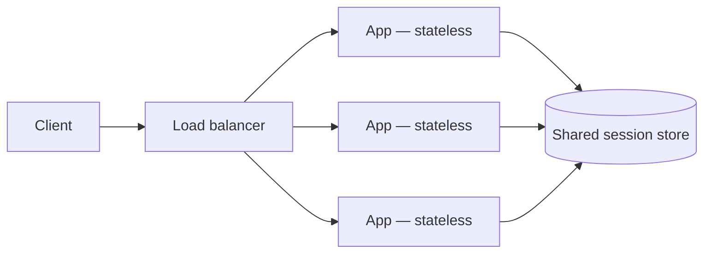

## Intuition

Scaling has exactly two directions, and the choice between them is forced by
one question: **can the work be split across machines that don't need to talk
to each other much?**

- **Vertical scaling** — a bigger machine. More CPU, more RAM, a faster disk.
  No code changes, no coordination problem, and it has a hard ceiling: the
  largest instance a cloud provider sells, today somewhere around a few TB of
  RAM and a few hundred cores. It is also a single point of failure by
  construction — one machine, one outage.
- **Horizontal scaling** — more machines, each doing a slice of the work.
  No hard ceiling on capacity, but it introduces a problem vertical scaling
  never has: **the machines now have to agree on shared state**, and that
  agreement is the entire cost of the strategy. Every horizontal-scaling
  technique below is a way of minimizing how much agreement is needed.

The instinct to reach for horizontal scaling first is usually premature.
Vertical scaling is simpler, cheaper at moderate load, and has none of the
consistency problems in [Distributed
Systems](/cs-fundamentals/5-systems/distributed-systems/). The right order is
vertical until it visibly won't be enough, then horizontal — and knowing
where "won't be enough" is requires the arithmetic from [Capacity
estimation](/cs-fundamentals/14-production/capacity-estimation/), not a guess.

## Mechanics

### Statelessness is what makes horizontal scaling cheap

An app server that keeps no session state in its own process — every request
carries what it needs, or looks up state in a shared store — can be
duplicated freely behind a load balancer. Any instance can handle any
request, so scaling out is "start another process," and losing one instance
loses nothing but its in-flight requests.



The moment a server holds state the load balancer doesn't know about — an
in-memory session, a WebSocket connection, a local file upload buffer — that
server stops being interchangeable, and you need **sticky sessions** (routing
a client back to the same instance) or **session externalization** (moving the
state to Redis or the database instead). Sticky sessions are the cheaper fix
and the worse one long-term: they reintroduce a single point of failure per
user, just distributed.

### Load balancing: the strategies and what they cost

| Strategy | How | Cost |
|---|---|---|
| Round robin | Requests rotate through instances in order | Ignores instance load — a slow instance keeps getting traffic |
| Least connections | Route to the instance with fewest in-flight requests | Needs the balancer to track connection state |
| Consistent hashing | Route by a hash of a key (user ID, session ID) | Enables stickiness and cache locality without a lookup table |

Consistent hashing matters beyond load balancers — it's the same idea behind
sharding below, and the property that makes it worth the complexity is what
happens when a node is added or removed: only `~1/N` of keys remap, instead
of nearly all of them under a naive `hash(key) % N`.

```ts
// Naive modulo hashing: adding one node remaps almost everything.
const nodeNaive = hash(key) % nodeCount;

// Consistent hashing: nodes and keys sit on the same ring; a key
// maps to the next node clockwise. Adding a node only steals keys
// from its immediate neighbor on the ring.
const nodeConsistent = ring.nextNode(hash(key));
```

### Sharding: splitting the database, not just the app

App servers are usually stateless and trivially horizontal. The database
underneath them is where horizontal scaling gets expensive, because the data
has to live somewhere specific, and a query that needs data from two shards
now needs two round trips and an application-level join.

Picking a **shard key** is the whole game:

- **User ID** — even distribution if users behave similarly, but a query
  spanning many users (an admin report, a leaderboard) now fans out to every
  shard.
- **Geography** — keeps a user's queries local to one shard and satisfies
  data-residency requirements, but creates hot shards where users
  concentrate (one region gets 80% of traffic).
- **Time (e.g., by month)** — great for time-series workloads and easy to
  archive old shards, but all *current* writes land on one shard — the exact
  opposite of the load-spreading sharding was meant to provide.

There is no shard key without a downside; picking one means picking which
query pattern you're willing to make expensive.

### Read replicas vs. sharding

These solve different problems and get conflated constantly. A **read
replica** copies the whole dataset and only adds read capacity — every
replica still holds everything, so it does nothing for write throughput or
storage size. **Sharding** splits the dataset itself, adding both write and
storage capacity, at the cost of cross-shard queries. A read-heavy system
(the URL shortener from [the system design
process](/cs-fundamentals/5-systems/system-design-process/)) needs replicas
long before it needs shards.

## Complexity

The bound worth deriving here is **coordination cost as a function of node
count**, because it's what makes "just add more nodes" stop paying off.

- **Read replicas scale close to linearly** for read throughput, because
  replicas don't coordinate with each other — each independently serves
  reads from its own copy. 10 replicas ≈ 10x read capacity, roughly, until
  replication lag itself becomes the bottleneck.
- **Sharding scales writes and storage linearly for single-shard queries**,
  but a query touching all N shards costs at least N round trips — so a
  system with heavy cross-shard access can get *slower* as shards are added,
  not faster. This is the sharding equivalent of Amdahl's law: the fraction
  of work that can't be parallelized (the cross-shard part) caps the speedup
  no matter how many shards exist.
- **A shared coordination service (leader election, distributed locks — see
  [Consensus and
  Coordination](/cs-fundamentals/5-systems/consensus-and-coordination/))
  gets more expensive per operation as node count grows**, because most
  consensus protocols need a majority of nodes to acknowledge before
  proceeding. A 3-node cluster needs 2 acks; a 7-node cluster needs 4 — more
  nodes means more latency per coordinated write, in exchange for tolerating
  more failures. This is why nobody runs 51-node consensus clusters: past a
  point, adding nodes for fault tolerance costs more in per-write latency
  than it buys in availability.

## When NOT to use it

- **Vertical scaling still has headroom.** If a bigger instance solves the
  problem today, take it — it's one config change against a rewrite of your
  data access layer to be shard-aware. Horizontal scaling is a one-way door:
  once queries assume data can be anywhere, un-sharding is a migration, not
  a rollback.
- **The workload is bursty, not sustained.** Auto-scaling a stateless app
  tier handles spikes without a standing fleet sized for peak; sharding a
  database for a load that's high for one hour a day is solving the wrong
  problem — a queue to smooth the burst (see [Message
  Brokers](/cs-fundamentals/5-systems/message-brokers/)) is usually cheaper.
- **Cross-shard queries are the common case, not the exception.** If most
  queries need to touch most of the data, sharding turns every one of them
  into a scatter-gather, and you've traded one bottleneck for a slower,
  harder-to-debug one.

## Real-world usage

Stateless app tiers behind a load balancer with externalized sessions (Redis)
are the default shape of nearly every web backend at scale. Read replicas are
standard on managed Postgres/MySQL offerings specifically because the
read-heavy case is so common. Sharding by design shows up in systems built
for it from day one — a multi-tenant SaaS sharding by tenant ID, a
time-series database sharding by time range — because retrofitting a shard
key onto an existing single-node schema is one of the more painful migrations
in this list.

## Failure modes

**Symptom: 90% of requests hit one instance while the others sit idle.** A
hot key or hot shard under consistent hashing, or a load balancer strategy
(round robin) that ignores actual instance load. Check the distribution of
the shard/hash key first — a celebrity user ID or a popular tenant can
concentrate load no algorithm fixes on its own; sometimes the fix is
splitting that one hot key across multiple logical shards.

**Symptom: a report that used to take 200ms now takes 8 seconds after
sharding shipped.** A query that used to be a single-table scan is now a
scatter-gather across every shard, with the applicaton doing the merge. This
is the direct cost named in Complexity above — it should have been priced in
before sharding, not discovered after.

**Symptom: a user's session randomly logs them out mid-flow.** Sticky
sessions plus an instance restart or scale-down event — the instance holding
their in-memory session is gone, and nothing else has it. Move session state
to a shared store; it's slower per-request by a Redis round trip and removes
this entire failure class.

**Symptom: after adding a shard, cross-shard writes that used to be
consistent are now occasionally out of sync.** A write that used to be one
local transaction on one node is now a write to two shards with no shared
transaction — this is exactly what [Distributed
Transactions](/cs-fundamentals/5-systems/distributed-transactions/) covers,
and it's the single most common surprise when sharding crosses a boundary
that used to be inside one database.

## Practice problems

**1. A leaderboard service does 50,000 reads/sec and 500 writes/sec. Should
it shard the database?**

<details>
<summary>Solution</summary>

Almost certainly not by default — 500 writes/sec is well within a single
well-tuned instance's write capacity, and the 100:1 read:write ratio is a
read-replica problem, not a sharding one. Add replicas behind the read path,
keep writes on a single primary, and only revisit sharding if storage size or
write rate crosses a number you can point to (this is the estimation
discipline from [the system design
process](/cs-fundamentals/5-systems/system-design-process/)). A leaderboard
also has a global-ranking query that spans all users — exactly the query
pattern sharding makes expensive — which is a second reason to avoid it here.
</details>

**2. You shard a multi-tenant system by `tenant_id`. Six months later, one
tenant is 40% of total traffic. What broke, and what's the fix that doesn't
require re-sharding everyone?**

<details>
<summary>Solution</summary>

A hot shard — that tenant's shard is doing 40% of the work while others sit
comparatively idle, and consistent hashing doesn't fix uneven *key* size,
only uneven key *count*. The standard fix is giving that one tenant its own
dedicated shard (or splitting it across several by a secondary key, like
`tenant_id + user_id`), rather than re-deriving the hash ring for every
tenant. This is why shard keys are chosen with an eye toward "what happens
when one key gets big," not just "what distributes evenly on day one."
</details>

## Interview answers

**"How would you scale this database?"**

> First I'd check whether it's a read problem or a write/storage problem —
> those have completely different fixes. Read-heavy gets solved with
> replicas and caching, which don't touch the schema. Write or storage
> volume outgrowing one instance is what actually justifies sharding, and
> even then I'd want to know the query patterns first, because a shard key
> that makes writes fast can make the common read slow if it forces
> cross-shard fan-out.

**"What's the tradeoff with sharding?"**

> You trade a single coordinated dataset for independent scalability, and the
> price is every cross-shard operation — a query, and especially a
> transaction — becomes distributed with all the problems that come with
> that. I wouldn't shard until the numbers show a single instance is
> actually the bottleneck, because un-sharding later is much harder than
> sharding late.

**The caveat worth voicing:** the failure mode I've seen most often isn't
picking the wrong shard key — it's sharding before there's a number that
justifies it, driven by "this will need to scale eventually" rather than a
measured bottleneck. The eventual need is usually real; the timing is
usually premature.
