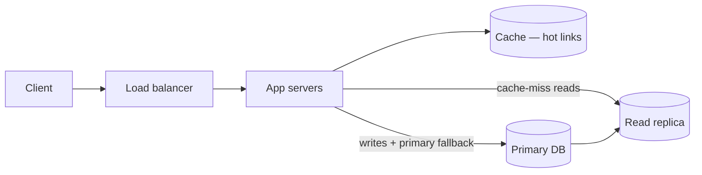

## Intuition

Ask most people to design a system and they draw boxes: a load balancer, some
app servers, a database, maybe a cache. The diagram is not wrong, but it is not
a design either — it is a sketch of the shape every system has. What separates
a design from a drawing is the arithmetic underneath it: how many requests
actually hit this, what each one costs, where that number stops fitting on one
machine, and what breaks first when it does not.

The process that produces those numbers is always the same four moves, in this
order, because each one constrains the next:

1. **Turn the vague ask into numbers.** "Design a URL shortener" has no answer
   until you know reads-per-second, writes-per-second, and how long a link has
   to live. Nobody hands you these — you propose them and state the source.
2. **Turn the numbers into a shape.** Storage size, read:write ratio, and
   latency budget decide whether you need a cache, a queue, one database or
   three, and where the bottleneck will be *before you build anything*.
3. **Pick the consistency and availability trade for each piece**, not for the
   system as a whole — see [Databases](/cs-fundamentals/5-systems/databases/)
   on why CAP is a per-operation choice, not a system-wide label.
4. **Say what breaks, and how you'd notice.** A design with no failure mode
   named is a design nobody has stress-tested, even on paper.

Skipping straight to step 2 — architecture by pattern-matching to "systems like
this one" — is how you get a design that is confidently wrong: over-engineered
for a load that never arrives, or fine at the load discussed and dead at ten
times it.

## Mechanics

### Step 1 — clarify, then estimate

Every design starts with questions the prompt didn't answer, because the
prompt is deliberately underspecified — that's the test. For a URL shortener:

- How many new links per day? How many clicks per link, and over what window?
- Do custom aliases matter? Do links expire? Does click analytics matter, or
  just the redirect?
- Read-heavy or write-heavy — a shortener is almost always read-heavy by two
  or three orders of magnitude, and that ratio decides the whole shape.

Then estimate, showing the arithmetic — this is exactly the discipline in
[Capacity estimation](/cs-fundamentals/14-production/capacity-estimation/),
applied here rather than re-derived:

```text
Assume: 100M new links/month, 100:1 read:write ratio.

Writes/sec = 100,000,000 / (30 * 86,400) ≈ 39/s
Reads/sec  = 39 * 100 ≈ 3,900/s

Storage, 5 years, 200 bytes/record:
100M * 12 * 5 * 200 bytes ≈ 1.2 TB

Key space, base62, 7 chars:
62^7 ≈ 3.5 * 10^12 — enough for centuries at this write rate.
```

Three numbers now constrain everything downstream: ~4k reads/sec fits behind a
cache easily; 1.2 TB fits on a single well-indexed Postgres instance with room
to grow; the key space means collision handling is a formality, not a design
problem.

### Step 2 — shape follows the numbers, not the reverse

With the estimate in hand, the shape is close to forced:



The cache exists because 3,900 reads/sec against a normal access pattern is
heavily skewed — a small fraction of links get most of the clicks — which is
exactly the case [Caching](/cs-fundamentals/5-systems/caching/) makes for
cache-aside with a TTL. The replica exists because reads outnumber writes
100:1, so read traffic, not write traffic, is what needs headroom.

Notice what's *not* here: no queue, no sharding, no multi-region. At this
scale none of them earn their complexity — see [When NOT to use
it](#when-not-to-use-it). A design that reaches for a message queue before the
numbers demand one is optimizing for an interview aesthetic, not for the
system in front of it.

### Step 3 — name the consistency trade per operation

Not every write in a system needs the same guarantee, and pretending otherwise
is a common tell of an unfinished design.

| Operation | Trade | Why |
|---|---|---|
| Create short link | Strong consistency on the write | A duplicate key is a correctness bug, not a staleness one |
| Redirect (read) | Eventually consistent, cache-first | A few seconds of staleness after creation is invisible to the user who just made the link |
| Click count | Eventually consistent, async increment | Losing or double-counting one click under a partition is cheap; blocking the redirect to count it is not |

This is [Databases](/cs-fundamentals/5-systems/databases/)'s CAP discussion
applied rather than re-derived — the redirect path chooses availability, the
write path chooses consistency, and both are true of the same system at once.

Choosing "cache-first" for the redirect still leaves one question
unanswered: what does a brand-new link do on its very first read, before
replication has caught up? Two honest answers — write-through the cache (and
the replica) synchronously on create so the first read never misses, or fall
back to the primary on a cache miss for a short window after creation and
accept the extra primary load that implies. Leaving this unstated is how "the
redirect is eventually consistent" quietly becomes "new links 404 for a few
seconds," which is a bug, not a design choice, unless someone explicitly
signed off on it.

### Step 4 — say what breaks

A design is incomplete without naming its own failure modes:

- **Cache down** → every read falls through to the DB. At 3,900 reads/sec that
  is survivable on one primary plus replica; state the number that makes it
  not survivable, so a reviewer can check your claim.
- **Primary DB down** → writes fail; reads continue from the replica if it's
  promotable or the app tolerates read-only mode. State which one you chose
  and why — this is the CAP choice made concrete.
- **A single AZ goes down** → if everything is in one AZ, the whole system is
  down. Naming this is often the entire point of the "what would you improve"
  follow-up question.

## Complexity

There's no Big-O here — the thing being "derived, not asserted" is the
back-of-the-envelope math, not an algorithmic bound. The discipline is
identical to the algorithmic pages: don't write down a number you can't show
the arithmetic for. "It'll probably need a cache" is an assertion; "3,900
reads/sec against a Zipfian access pattern is a cache-aside candidate, and
here's the hit-rate math" is a derivation.

The concrete numbers — RU/s, dollars per GB, connection pool sizing — belong
in [Capacity estimation](/cs-fundamentals/14-production/capacity-estimation/);
this page's job is knowing when in the process to reach for them.

## When NOT to use it

- **The prompt already has a known-good architecture.** "Design a key-value
  store" at 10 requests/sec doesn't need a load balancer, a cache, or a
  replica — one process on one machine handles it, and adding infrastructure
  is the wrong answer, not the safe one.
- **The numbers are unknowable and you're pretending otherwise.** For a
  genuinely novel product, stating a range and designing for the low end with
  an explicit note on what changes at 10x is more honest than inventing a
  precise-looking number that has no basis.
- **The interview or the real ask is about one component, not the system.**
  "How would you index this table" doesn't need a load balancer in the
  answer. Matching the process to the actual scope of the question is part of
  the skill.

## Real-world usage

This is the process behind a request-for-comments document at most companies
above a certain size: a numbers section before the architecture section,
because the architecture section is unreviewable without it. It's also
explicitly what system-design interviews at large tech companies are scoring —
not whether the candidate recalls the "right" architecture for a URL
shortener, but whether they derive the shape from stated numbers and can
defend the trade-offs when pushed.

## Failure modes

**Symptom: the design has a queue, a cache, three databases, and nobody can
say what load justifies any of them.** Pattern-matched architecture — copying
the shape of a system built for a different scale. The fix is going back to
step 1: what's the actual number, and does this piece survive without it?

**Symptom: every follow-up question ("what if this server dies?") requires a
five-minute redesign.** Step 4 was skipped. Naming failure modes up front
means the follow-ups are "yes, and here's what I'd add," not a scramble.

**Symptom: the estimate and the architecture disagree** — e.g., a design
claims strong consistency everywhere but the estimate showed a 100:1
read-heavy load that a synchronous multi-region write can't serve at
reasonable latency. This is the most common tell of a memorized answer rather
than a derived one: the two halves were never actually connected.

## Practice problems

**1. Design a rate limiter for an API gateway serving 50,000 requests/sec,
limiting each API key to 100 requests/minute.**

<details>
<summary>Solution sketch</summary>

Estimate first: 50,000 req/sec across an unknown number of keys — ask, or
assume ~10,000 active keys. That's ~5 req/sec/key on average, which is
~300 requests/minute — already *above* the 100/minute cap on average, not
comfortably under it. Either the traffic is far less evenly spread than a
flat average suggests (a smaller set of heavy keys, most others near-idle),
or the assumed key count is too low — worth stating explicitly rather than
letting the arithmetic quietly not add up. Either way the limiter has to
correctly reject sustained over-limit traffic, not just smooth out bursts.

Shape: a fixed-window counter per key in Redis, incremented and given a TTL
atomically in one round trip (`redis.eval` running `INCR` then `EXPIRE` only
on the first increment, or Redis's own `SET ... EX ... NX` combined with
`INCR`) so a crash between two separate commands can never leave a counter
with no expiry. A true sliding window (timestamped entries in a sorted set,
trimmed on each check) removes the fixed-window's edge-of-window burst
allowance at the cost of more memory per key — worth it if the 100/minute
cap has to be exact, not just approximately enforced. At 50,000 req/sec,
Redis's single-threaded command execution handles either comfortably — each
check is O(1) (fixed window) or O(log n) (sorted-set window) and
sub-millisecond.

Consistency trade: the counter can be slightly wrong under a network blip
between gateway and Redis — that's acceptable, since the cost of
under-limiting by a few requests is far lower than the cost of adding
synchronous coordination to every request.

Failure mode: Redis down → fail open (allow all) or fail closed (reject all)
is a decision to state explicitly, not default into. Fail open protects
availability at the cost of the limit; fail closed does the reverse.
</details>

**2. A design claims "we'll shard the database" as its answer to scale. What
question exposes whether that's justified?**

<details>
<summary>Solution</summary>

"What's the data volume and write rate today, and what row or storage size
makes a single well-tuned instance fail?" Sharding is a response to a specific
number crossing a specific threshold (storage exceeding what one instance
holds, or write throughput exceeding what one primary can absorb) — not a
default answer to "scale." If the estimate showed 1.2 TB and 40 writes/sec,
sharding is solving a problem the numbers don't show yet, at the cost of
cross-shard queries and rebalancing complexity that now has to be justified
against nothing.
</details>

## Interview answers

**"Walk me through how you'd approach this."** The answer that signals
process over memorized architecture:

> First I'd pin down the numbers — traffic, read:write ratio, data size, and
> latency requirements — because the shape of the system falls out of those,
> not the other way round. Then I'd sketch the components the numbers
> actually justify, state the consistency trade per operation rather than for
> the system as a whole, and finish by naming what breaks and how I'd detect
> it. If I catch myself adding a component before I can point to the number
> that requires it, that's a sign I'm pattern-matching instead of designing.

**"How do you know when you're done?"**

> When every box in the diagram traces back to a number, and every
> consistency choice traces back to what that specific operation can afford
> to get wrong. If a reviewer asks "why a queue here?" and the honest answer
> is "systems like this usually have one," that's not done yet.

**The caveat worth voicing:** estimates are frequently wrong by an order of
magnitude, and that's fine — the point isn't precision, it's making the
assumption checkable. A design built on a stated, wrong number is fixable in
one conversation; a design built on an unstated one requires re-deriving the
whole thing to find out what was assumed.
